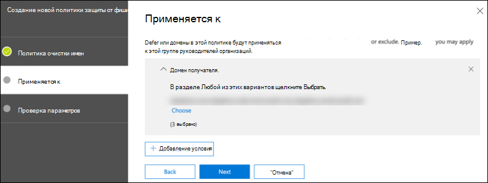

# Настройка столбов Microsoft 365 Defender для пробной лаборатории или пилотной среды

[!INCLUDE [Microsoft 365 Defender rebranding](../includes/microsoft-defender.md)]

**Область применения:**
- Microsoft 365 Defender

Создание пробной лаборатории или пилотной среды Microsoft 365 Defender и ее развертывание — это трех этапный процесс:

| [Этап 1. Подготовка](prepare-m365d-eval.md) | [Этап 2. Настройка](setup-m365deval.md) | Этап 3. Подключение |  [Вернуться к экспериментальной книге воспроизведения](m365d-pilot.md) |
|--|--|--|--|
|| |*Вы здесь!* | |

Вы в настоящее время на этапе конфигурации.

Подготовка является ключом к успешному развертыванию. В этой статье вы будете ориентироваться на точки, которые необходимо учитывать при подготовке к развертыванию Microsoft Defender для конечной точки.

## Столбы Защитника Microsoft 365
Microsoft 365 Defender состоит из четырех столпов. Хотя один из столбов уже может обеспечить безопасность вашей сетевой организации, включение четырех столбов Microsoft 365 Defender даст вашей организации наибольшее значение.

В этом разделе вы сможете настроить:
-   Microsoft Defender для Office 365
-   Microsoft Defender для удостоверений 
-   Microsoft Cloud App Security
-   Microsoft Defender для конечной точки

## Настройка Microsoft Defender для Office 365

>[!NOTE]
>Пропустить этот шаг, если вы уже включили Defender для Office 365. 

Существует модуль PowerShell под названием *Office 365 Advanced Threat Protection Recommended Configuration Analyzer (ORCA),* который помогает определить некоторые из этих параметров. При запуске в качестве администратора в клиенте get-ORCAReport поможет сгенерировать оценку параметров защиты от нежелательной почты, защиты от фишинга и других параметров гигиены сообщений. Этот модуль можно скачать из https://www.powershellgallery.com/packages/ORCA/ . 

1. Перейдите к политике управления безопасностью Центра & Office [365.](https://protection.office.com/homepage)  >    >  

   
 
2. Нажмите **кнопку "Анти-фишинг",** **выберите Создать** и заполнить имя и описание политики. Нажмите кнопку **Далее**.

   

   > [!NOTE]
   > Изменение политики расширенных антифишинга в Microsoft Defender для Office 365. Измените **расширенный порог фишинга** на **2 - Aggressive.**

3. Нажмите **кнопку Добавить** выпадаемое меню условия и выберите домен (s) в качестве домена получателя. Нажмите кнопку **Далее**.

   
 
4. Просмотрите параметры. Нажмите **кнопку Создать эту политику,** чтобы подтвердить. 

   
 
5. Выберите **безопасные вложения** и выберите параметр Включить ATP для **SharePoint, OneDrive и Microsoft Teams.**

   

6. Щелкните значок +, чтобы создать новую политику безопасного вложения, применить ее в качестве домена получателя к доменам. Нажмите кнопку **Сохранить**.

   
 
7. Далее выберите политику **безопасных ссылок,** а затем нажмите значок карандаша, чтобы изменить политику по умолчанию.

8. Убедитесь, что не **отслеживайте,** когда пользователи щелкают параметр безопасных ссылок, а остальные параметры выбраны. Подробные [сведения см. в параметрах](/microsoft-365/security/office-365-security/recommended-settings-for-eop-and-office365) Безопасные ссылки. Нажмите кнопку **Сохранить**. 

   

9. Далее выберите **политику борьбы с вредоносными** программами, выберите значение по умолчанию и выберите значок карандаша.

10. Щелкните **Параметры** и выберите **Да и используйте текст** уведомления по умолчанию, чтобы включить ответ обнаружения **вредоносных программ.** Включив фильтр **типов общих вложений.** Нажмите кнопку **Сохранить**.

    
  
11. Перейдите к журналу поиска журнала аудита безопасности Office [365 &](https://protection.office.com/homepage)Центра аудита соответствия требованиям и  >    >   включив аудит.

    

12. Интеграция Microsoft Defender для Office 365 с Microsoft Defender для конечной точки. Перейдите в центр управления & Office [365](https://protection.office.com/homepage)и выберите Microsoft Defender для параметров конечной точки в правом верхнем углу  >    >   экрана.  В диалоговом окне Защитник для конечной точки включите **подключение к Microsoft Defender для конечной точки.**

    

## Настройка Microsoft Defender для удостоверений

>[!NOTE]
>Пропустить этот шаг, если вы уже включили Microsoft Defender для identity

1. Перейдите в Центр безопасности [Microsoft 365](https://security.microsoft.com/info) > **выберите** дополнительные ресурсы Microsoft Defender для  >  **удостоверения.**

   

2. Нажмите **кнопку Создать,** чтобы запустить мастер Microsoft Defender для удостоверений. 

   

3. Выберите Предоставление имени пользователя и пароля для подключения **к лесу Active Directory.**  

   

4. Введите учетные данные Active Directory на месте. Это может быть любая учетная запись пользователя, которая имеет доступ к active Directory.

   

5. Далее выберите **настройка датчика загрузки** и передача файла на контроллер домена.

   

6. Выполните установку датчика идентификации Microsoft Defender для идентификации и начните следовать за мастером.

   
 
7. Нажмите **кнопку Далее** в типе развертывания датчика.

   
 
8. Скопируйте ключ доступа, так как необходимо ввести его далее в мастере.

   
 
9. Скопируйте ключ доступа в мастер и нажмите кнопку **Установить**. 

   

10. Поздравляем, вы успешно настроили Microsoft Defender для identity на контроллере домена.

    
 
11. В разделе [Защитник Майкрософт для](https://go.microsoft.com/fwlink/?linkid=2040449) параметров удостоверений выберите **Microsoft Defender для конечной точки **, а затем включив переключить. Нажмите кнопку **Сохранить**. 

    

## Настройка безопасности облачных приложений Майкрософт

> [!NOTE]
> Пропустить этот шаг, если вы уже включили microsoft Cloud App Security. 

1. Перейдите в [Центр безопасности Microsoft 365](https://security.microsoft.com/info)  >  **Дополнительные ресурсы** Microsoft Cloud App  >  **Security**.

   

2. На информационном запросе для интеграции Microsoft Defender для удостоверений выберите **Включить Microsoft Defender для интеграции данных удостоверений.**
  
   

   > [!NOTE]
   > Если вы не видите эту подсказку, это может означать, что интеграция данных Microsoft Defender для удостоверений уже включена. Однако, если вы не уверены, обратитесь к ИТ-администратору, чтобы подтвердить это. 

3. Перейдите **к параметрам,** включите переключить кнопку **Microsoft Defender для** интеграции удостоверений, а затем нажмите **кнопку Сохранить**. 

   
   
   > [!NOTE]
   > Для новых экземпляров Microsoft Defender для удостоверений эта интеграция автоматически включена. Подтвердите, что интеграция Microsoft Defender для удостоверений включена, прежде чем приступить к следующему шагу.
 
4. В настройках обнаружения облака выберите Microsoft Defender для интеграции **конечных** точек, а затем в этом параметре включить интеграцию. Нажмите кнопку **Сохранить**.

   

5. В параметрах обнаружения облака выберите обогащение **пользователей,** а затем включить интеграцию с Azure Active Directory.

   

## Настройка Microsoft Defender для конечной точки

>[!NOTE]
>Пропустить этот шаг, если вы уже включили Microsoft Defender для конечной точки.

1. Перейдите в [Центр безопасности Microsoft 365](https://security.microsoft.com/info)  >  **Дополнительные ресурсы** Microsoft Defender Security  >  **Center**. Нажмите кнопку **Open** (Открыть).

   
 
2. Следуйте мастеру Microsoft Defender для конечных точек. Нажмите кнопку **Далее**. 

   

3. Выбор зависит от предпочтительного расположения хранилища данных, политики хранения данных, размера организации и выбора функций предварительного просмотра.

   
   
   > [!NOTE]
   > Вы не можете изменить некоторые параметры, например расположение хранилища данных. 

   Нажмите кнопку **Далее**. 

4. Нажмите **кнопку Продолжить,** и она будет поддерживать защитника Microsoft для клиента конечной точки.

   

5. На борту конечных точек с помощью групповых политик, microsoft Endpoint Manager или запуска локального сценария в Microsoft Defender для конечной точки. Для простоты в этом руководстве используется локальный сценарий.

6. Нажмите **кнопку Скачать** пакет и скопируйте сценарий в конечной точке (ы).

   

7. На конечной точке запустите сценарий в качестве администратора и выберите Y. 

   

8. Поздравляем, вы вошел в первую конечную точку.

   

9. Скопируйте тест обнаружения в мастере Microsoft Defender для конечных точек.

   

10. Скопируйте скрипт PowerShell в командную команду и запустите его. 

    

11. Выберите **Начните использовать Microsoft Defender для конечной точки** из мастера.

    
 
12. Посетите [Центр безопасности Защитника Майкрософт.](https://securitycenter.windows.com/) Перейдите **в параметры** и выберите **расширенные функции.** 

    

13. Включи интеграцию с **Microsoft Defender для удостоверений.**  

    

14. Включи интеграцию с **Office 365 Threat Intelligence.**

    

15. Включение интеграции с **microsoft Cloud App Security**.

    

16. Прокрутите вниз **и нажмите кнопку Сохранить параметры,** чтобы подтвердить новые интеграции.

    

## Запуск службы Microsoft 365 Defender

>[!NOTE]
>Начиная с 1 июня 2020 г. Корпорация Майкрософт автоматически включает функции Microsoft 365 Defender для всех подходящих клиентов. Подробнее см. в статье [Microsoft Tech Community о праве на лицензию.](https://techcommunity.microsoft.com/t5/security-privacy-and-compliance/microsoft-threat-protection-will-automatically-turn-on-for/ba-p/1345426) 

Перейдите в Центр безопасности [Microsoft 365](https://security.microsoft.com/homepage). Перейдите **к параметрам** и выберите **Защитник Microsoft 365.**

  

Дополнительные рекомендации см. в обзоре [Turn on Microsoft 365 Defender.](m365d-enable.md) 

Поздравляем! Вы только что создали пробную лабораторию Или пилотную среду Microsoft 365 Defender! Теперь вы можете ознакомиться с пользовательским интерфейсом Microsoft 365 Defender! Узнайте, что можно узнать из следующего интерактивного руководства Microsoft 365 Defender и узнайте, как использовать каждую панель мониторинга для выполнения задач ежедневной работы с безопасностью.

[Ознакомьтесь с интерактивным руководством](https://aka.ms/MTP-Interactive-Guide)

Далее можно смоделировать атаку и увидеть, как возможности кросс-продукта обнаруживают, создают оповещения и автоматически реагируют на без файловую атаку на конечной точке.

## Следующий шаг

- [Создание тестового оповещения](generate-test-alert.md) — запустите имитацию атаки в пробной лаборатории Microsoft 365 Defender.