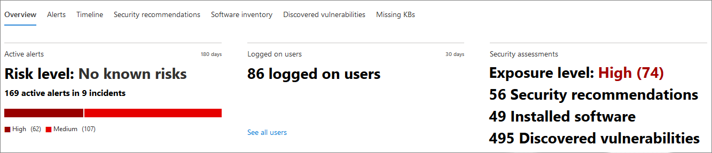

# Страница профиля устройстваDevice profile page

[!INCLUDE [Microsoft 365 Defender rebranding](../includes/microsoft-defender.md)]

Портал Microsoft 365 безопасности предоставляет страницы профилей устройств, чтобы можно было быстро оценить состояние и состояние устройств в сети.The Microsoft 365 security portal provides you with device profile pages, so you can quickly assess the health and status of devices on your network.

> [!IMPORTANT]
> Страница профиля устройства может отображаться несколько иначе в зависимости от того, зарегистрировано ли устройство в Microsoft Defender for Endpoint, Microsoft Defender for Identity или в обеих.The device profile page may appear slightly different, depending on whether the device is enrolled in Microsoft Defender for Endpoint, Microsoft Defender for Identity, or both.

Если устройство зарегистрировали в Microsoft Defender для конечной точки, вы также можете использовать страницу профиля устройства для выполнения некоторых общих задач безопасности.If the device is enrolled in Microsoft Defender for Endpoint, you can also use the device profile page to perform some common security tasks.

## Навигация по странице профиля устройстваNavigating the device profile page

Страница профиля разбита на несколько широких разделов.The profile page is broken up into several broad sections.

На боковой панели (1) перечислены основные сведения об устройстве.The sidebar (1) lists basic details about the device.

Основная область контента (2) содержит вкладки, которые можно перенабежка, чтобы просмотреть различные виды информации об устройстве.The main content area (2) contains tabs that you can toggle through to view different kinds of information about the device.

Если устройство зарегистрировали в Microsoft Defender для конечной точки, вы также увидите список ответных действий (3).If the device is enrolled in Microsoft Defender for Endpoint, you will also see a list of response actions (3). Действия реагирования позволяют выполнять общие задачи, связанные с безопасностью.Response actions allow you to perform common security-related tasks.

## Боковая панельSidebar

Рядом с основной областью контента страницы профиля устройства является боковая панель.Beside the main content area of the device profile page is the sidebar.

На боковой панели перечислены полное имя и уровень экспозиции устройства.The sidebar lists the device's full name and exposure level. В нем также содержится ряд важных базовых сведений в небольших подсекциях, которые можно торгуть открытыми или закрытыми, например:It also provides some important basic information in small subsections which can be toggled open or closed, such as:

* **Теги** — любой защитник Майкрософт для конечной точки, защитник Майкрософт для удостоверений или пользовательские теги, связанные с устройством.**Tags** - Any Microsoft Defender for Endpoint, Microsoft Defender for Identity, or custom tags associated with the device. Теги из Microsoft Defender для identity не редактируемы.Tags from Microsoft Defender for Identity are not editable.
* **Сведения о безопасности** . Открытые инциденты и активные оповещения.**Security info** - Open incidents and active alerts. Устройства, зарегистрированные в Microsoft Defender для конечной точки, также будут отображать уровень экспозиции и уровень риска.Devices enrolled in Microsoft Defender for Endpoint will also display exposure level and risk level.

> [!TIP]
> Уровень экспозиции зависит от того, насколько устройство соответствует рекомендациям по безопасности, а уровень риска рассчитывается на основе ряда факторов, включая типы и серьезность активных оповещений.Exposure level relates to how much the device is complying with security recommendations, while risk level is calculated based on a number of factors, including the types and severity of active alerts.

* **Сведения об** устройстве — домен, ОС, период времени, когда устройство было впервые замечено, IP-адреса, ресурсы.**Device details** - Domain, OS, timestamp for when the device was first seen, IP addresses, resources. Устройства, зарегистрированные в Microsoft Defender для конечной точки, также отображают состояние здоровья.Devices enrolled in Microsoft Defender for Endpoint also display health state. Устройства, зарегистрированные в Microsoft Defender for Identity, будут отображать имя пользователя и время создания устройства.Devices enrolled in Microsoft Defender for Identity will display SAM name and a timestamp for when the device was first created.
* **Сетевое действие** — в первый раз и последний раз устройство было замечено в сети.**Network activity** - Timestamps for the first time and last time the device was seen on the network.
* **Данные каталога** (только для устройств, зарегистрированных в *Microsoft Defender for Identity)*— флаги [UAC,](/windows/security/identity-protection/user-account-control/user-account-control-overview) [spNs](/windows/win32/ad/service-principal-names)и членство в группах.**Directory data** (*only for devices enrolled in Microsoft Defender for Identity*) - [UAC](/windows/security/identity-protection/user-account-control/user-account-control-overview) flags, [SPNs](/windows/win32/ad/service-principal-names), and group memberships.

## Действия реагированияResponse actions

Действия реагирования предоставляют быстрый способ защиты от угроз и анализа.Response actions offer a quick way to defend against and analyze threats.

> [!IMPORTANT]
> * [Действия реагирования](/windows/security/threat-protection/microsoft-defender-atp/respond-machine-alerts) доступны только в том случае, если устройство зарегистрировали в Microsoft Defender для конечной точки.[Response actions](/windows/security/threat-protection/microsoft-defender-atp/respond-machine-alerts) are only available if the device is enrolled in Microsoft Defender for Endpoint.
> * Устройства, зарегистрированные в Microsoft Defender для конечной точки, могут отображать различные числа ответных действий в зависимости от оси устройства и номера версии.Devices that are enrolled in Microsoft Defender for Endpoint may display different numbers of response actions, based on the device's OS and version number.

Действия, доступные на странице профиля устройства, включают:Actions available on the device profile page include:

* **Управление тегами** . Обновляет пользовательские теги, примененные к этому устройству.**Manage tags** - Updates custom tags you have applied to this device.
* **Изолировать устройство** — изолирует устройство от сети организации, сохраняя его подключенным к Microsoft Defender для конечной точки.**Isolate device** - Isolates the device from your organization's network while keeping it connected to Microsoft Defender for Endpoint. Вы можете разрешить Outlook, Teams и Skype для бизнеса, пока устройство изолировано, в целях связи.You can choose to allow Outlook, Teams, and Skype for Business to run while the device is isolated, for communication purposes.
* **Центр действий** — просмотр состояния отправленных действий.**Action center** - View the status of submitted actions. Доступно только в том случае, если уже выбрано другое действие.Only available if another action has already been selected.
* **Ограничение выполнения приложения** — предотвращает запуск приложений, не подписанных Корпорацией Майкрософт.**Restrict app execution** - Prevents applications that are not signed by Microsoft from running.
* **Запуск антивирусной проверки** — обновления антивирусная программа определений и немедленно выполняется антивирусное сканирование.**Run antivirus scan** - Updates Windows Defender Antivirus definitions and immediately runs an antivirus scan. Выберите между быстрым сканированием или полным сканированием.Choose between Quick scan or Full scan.
* **Сбор пакета исследований** — сбор сведений об устройстве.**Collect investigation package** - Gathers information about the device. По завершению расследования его можно скачать.When the investigation is completed, you can download it.
* **Инициировать сеанс живого ответа** — загружает удаленную оболочку на устройство для углубленного [расследования безопасности.](/microsoft-365/security/defender-endpoint/live-response)**Initiate Live Response Session** - Loads a remote shell on the device for [in-depth security investigations](/microsoft-365/security/defender-endpoint/live-response).
* **Инициировать автоматическое** расследование — [автоматически расследует и устраняет угрозы.](../office-365-security/office-365-air.md)**Initiate automated investigation** - Automatically [investigates and remediates threats](../office-365-security/office-365-air.md). Хотя с этой страницы можно запускать автоматические  расследования вручную, некоторые политики оповещения запускают автоматические расследования самостоятельно.Although you can manually trigger automated investigations to run from this page, [certain alert policies](../../compliance/alert-policies.md?view=o365-worldwide#default-alert-policies) trigger automatic investigations on their own.
* **Центр действий** — отображает сведения о любых действиях реагирования, которые в настоящее время запущены.**Action center** - Displays information about any response actions that are currently running.

## Раздел "Вкладки"Tabs section

Вкладки профилей устройств позволяют с помощью обзора сведений о безопасности устройства и таблиц, содержащих список оповещений.The device profile tabs allow you to toggle through an overview of security details about the device, and tables containing a list of alerts.

Устройства, зарегистрированные в Microsoft Defender для конечной точки, также будут отображать вкладки с временной шкалой, списком рекомендаций по безопасности, инвентаризацией программного обеспечения, списком обнаруженных уязвимостей и отсутствующих ЦБ (обновления безопасности).Devices enrolled in Microsoft Defender for Endpoint will also display tabs that feature a timeline, a list of security recommendations, a software inventory, a list of discovered vulnerabilities, and missing KBs (security updates).

### Вкладка ОбзорOverview tab

Вкладка по умолчанию **— Обзор**.The default tab is **Overview**. Он позволяет быстро и быстро взглянуть на наиболее важные аспекты безопасности устройства.It provides a quick look at the most important security fact about the device.

Здесь вы можете получить быстрый обзор активных оповещений устройства и любых в настоящее время зарегистрированных на пользователях.Here, you can get a quick look at the device's active alerts, and any currently logged on users.

Если устройство зарегистрировано в Microsoft Defender для конечной точки, вы также увидите уровень риска устройства и все доступные данные о оценках безопасности.If the device is enrolled in Microsoft Defender for Endpoint, you will also see the device's risk level and any available data on security assessments. Оценки безопасности описывают уровень экспозиции устройства, предоставляют рекомендации по безопасности, а также перечисляют затрагиваемую программу и обнаруженные уязвимости.The security assessments describe the device's exposure level, provide security recommendations, and list affected software and discovered vulnerabilities.

### Вкладка ОповещенийAlerts tab

Вкладка **Alerts** содержит список оповещений, поднятых на устройстве, как из Microsoft Defender для удостоверений, так и от Microsoft Defender для конечной точки.The **Alerts** tab contains a list of alerts that have been raised on the device, from both Microsoft Defender for Identity and Microsoft Defender for Endpoint.

Можно настроить количество отображаемых элементов, а также количество столбцов для каждого элемента.You can customize the number of items displayed, as well as which columns are displayed for each item. По умолчанию необходимо перечислить тридцать элементов на страницу.The default behavior is to list thirty items per page.

Столбцы на этой вкладке содержат сведения о серьезности угрозы, которая вызвала оповещение, а также о состоянии, состоянии расследования и о том, кому было назначено предупреждение.The columns in this tab include information on the severity of the threat that triggered the alert, as well as status, investigation state, and who the alert has been assigned to.

Столбец *затронутых сущностей* относится к устройству (объекту), профиль которого вы в настоящее время просматриваете, а также к любым другим устройствам в вашей сети, которые затронуты.The *impacted entities* column refers to the device (entity) whose profile you are currently viewing, plus any other devices in your network that are affected.

Выбор элемента из этого списка откроет вылет, содержащий дополнительные сведения о выбранном оповещении.Selecting an item from this list will open a flyout containing even more information about the selected alert.

Этот список можно отфильтровать по строгости, статусу или по назначенной оповещению.This list can be filtered by severity, status, or who the alert has been assigned to.

### Вкладка TimelineTimeline tab

Вкладка **Timeline** включает интерактивную хронологическую диаграмму всех событий, поднятых на устройстве.The **Timeline** tab includes an interactive, chronological chart of all events raised on the device. Перемещая выделенную область диаграммы влево или вправо, можно просматривать события в разные периоды времени.By moving the highlighted area of the chart left or right, you can view events over different periods of time. Вы также можете выбрать настраиваемый диапазон дат из выпадаемого меню между интерактивной диаграммой и списком событий.You can also choose a custom range of dates from the dropdown menu in between the interactive chart and the list of events.

Ниже диаграммы приведен список событий для выбранного диапазона дат.Below the chart is a list of events for the selected range of dates.

Количество отображаемых элементов и столбцы в списке могут быть настроены.The number of items displayed and the columns on the list can both be customized. Столбцы по умолчанию перечисляют время события, активный пользователь, тип действия, сущности (процессы) и дополнительные сведения о событии.The default columns list the event time, active user, action type, entities (processes), and additional information about the event.

Выбор элемента из этого списка откроет вылет, отображающий график сущностями событий, показывающий родительские и детские процессы, участвующие в событии.Selecting an item from this list will open a flyout displaying an Event entities graph, showing the parent and child processes involved in the event.

Список можно отфильтровать по определенному типу события; например, события реестра или события smart Screen.The list can be filtered by the specific kind of event; for example, Registry events or Smart Screen Events.

Список также можно экспортировать в CSV-файл для скачивания.The list can also be exported to a CSV file, for download. Несмотря на то, что файл не ограничен количеством событий, максимальный диапазон времени, который можно экспортировать, — семь дней.Although the file is not limited by number of events, the maximum time range you can choose to export is seven days.

### Вкладка рекомендации по безопасностиSecurity recommendations tab

В **вкладке Рекомендации по безопасности** перечислены действия, которые можно принять для защиты устройства.The **Security recommendations** tab lists actions you can take to protect the device. Выбор элемента в этом списке откроет вылет, где можно получить инструкции по применении рекомендации.Selecting an item on this list will open a flyout where you can get instructions on how to apply the recommendation.

Как и в предыдущих вкладок, можно настроить количество элементов, отображаемых на странице, а также те столбцы, которые видны.As with the previous tabs, the number of items displayed per page, as well as which columns are visible, can be customized.

Представление по умолчанию включает столбцы, в которых подробно рассматриваются недостатки безопасности, связанная угроза, связанный компонент или программное обеспечение, затронутые угрозой, и другие.The default view includes columns that detail the security weaknesses addressed, the associated threat, the related component or software affected by the threat, and more. Элементы можно фильтровать по статусу рекомендации.Items can be filtered by the recommendation's status.

### Перечень программного обеспеченияSoftware inventory

Вкладка **инвентаризации программного** обеспечения содержит списки программного обеспечения, установленного на устройстве.The **Software inventory** tab lists software installed on the device.

Представление по умолчанию отображает поставщика программного обеспечения, установленный номер версии, количество известных недостатков программного обеспечения, сведения об угрозах, код продукта и теги.The default view displays the software vendor, installed version number, number of known software weaknesses, threat insights, product code, and tags. Количество отображаемых элементов и столбцов может быть настроено.The number of items displayed and which columns are displayed can both be customized.

Выбор элемента из этого списка открывает вылет, содержащий дополнительные сведения о выбранном программном обеспечении, а также путь и время последнего открытия программного обеспечения.Selecting an item from this list opens a flyout containing more details about the selected software, as well as the path and timestamp for the last time the software was found.

Этот список можно отфильтровать по коду продукта.This list can be filtered by product code.

### Вкладка Обнаруженные уязвимостиDiscovered vulnerabilities tab

На **вкладке "Обнаруженные уязвимости"** перечислены все распространенные уязвимости и эксплойты (CVEs), которые могут повлиять на устройство.The **Discovered vulnerabilities** tab lists any Common Vulnerabilities and Exploits (CVEs) that may affect the device.

В представлении по умолчанию перечислены серьезность CVE, общей оценки уязвимости (CVS), программного обеспечения, связанного с CVE, когда CVE был опубликован, когда CVE был последним обновлением, и угрозы, связанные с CVE.The default view lists the severity of the CVE, the Common Vulnerability Score (CVS), the software related to the CVE, when the CVE was published, when the CVE was last updated, and threats associated with the CVE.

Как и в предыдущих вкладок, можно настроить количество отображаемых элементов и видимых столбцов.As with the previous tabs, the number of items displayed and which columns are visible can be customized.

Выбор элемента из этого списка откроет вылет, описывающий CVE.Selecting an item from this list will open a flyout that describes the CVE.

### Отсутствующие KBsMissing KBs

На **вкладке Missing KBs** перечислены все обновления Майкрософт, которые еще не были применены к устройству.The **Missing KBs** tab lists any Microsoft Updates that have yet to be applied to the device. Речь идет о статьях [Базы](https://support.microsoft.com/help/242450/how-to-query-the-microsoft-knowledge-base-by-using-keywords-and-query) знаний, в которых описываются эти обновления; например, [KB4551762](https://support.microsoft.com/help/4551762/windows-10-update-kb4551762).The "KBs" in question are [Knowledge Base articles](https://support.microsoft.com/help/242450/how-to-query-the-microsoft-knowledge-base-by-using-keywords-and-query) which describe these updates; for example, [KB4551762](https://support.microsoft.com/help/4551762/windows-10-update-kb4551762).

В представлении по умолчанию перечислены бюллетень, содержащий обновления, версию ОС, затронутые продукты, адрес резюме, номер КБ и теги.The default view lists the bulletin containing the updates, OS version, products affected, CVEs addressed, the KB number, and tags.

Количество элементов, отображаемых на странице и отображаемых столбцов, можно настроить.The number of items displayed per page and which columns are displayed can be customized.

При выборе элемента откроется флайер, ссылающийся на обновление.Selecting an item will open a flyout that links to the update.

## Статьи по темеRelated topics

* [Microsoft 365 Обзор defenderMicrosoft 365 Defender overview](microsoft-365-defender.md)
* [Включение Microsoft 365 DefenderTurn on Microsoft 365 Defender](m365d-enable.md)
* [Исследование сущностями на устройствах с помощью живого ответаInvestigate entities on devices, using live response](../defender-endpoint/live-response.md)
* [Автоматическое расследование и ответ (AIR) в Office 365Automated investigation and response (AIR) in Office 365](../office-365-security/office-365-air.md)
