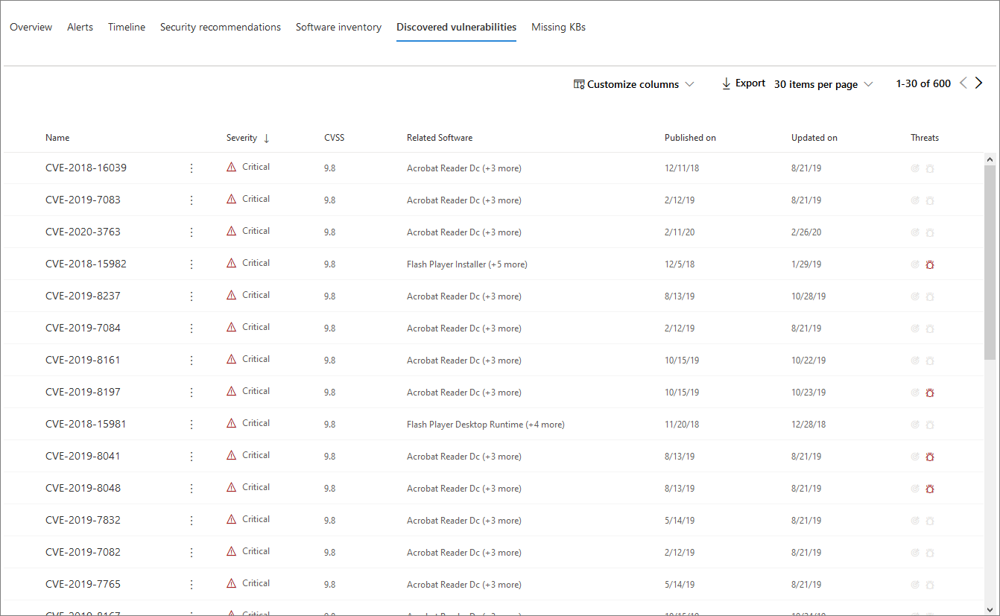

# Страница профиля устройства

[!INCLUDE [Microsoft 365 Defender rebranding](../includes/microsoft-defender.md)]

Портал безопасности Microsoft 365 предоставляет страницы профилей устройств, чтобы быстро оценить состояние и состояние устройств в сети.

> [!IMPORTANT]
> Страница профиля устройства может отображаться несколько иначе в зависимости от того, зарегистрировано ли устройство в Microsoft Defender for Endpoint, Microsoft Defender for Identity или в обеих.

Если устройство зарегистрировали в Microsoft Defender для конечной точки, вы также можете использовать страницу профиля устройства для выполнения некоторых общих задач безопасности.

## Навигация по странице профиля устройства

Страница профиля разбита на несколько широких разделов.

На боковой панели (1) перечислены основные сведения об устройстве.

Основная область контента (2) содержит вкладки, которые можно перенабежка, чтобы просмотреть различные виды информации об устройстве.

Если устройство зарегистрировали в Microsoft Defender для конечной точки, вы также увидите список ответных действий (3). Действия реагирования позволяют выполнять общие задачи, связанные с безопасностью.

## Боковая панель

Рядом с основной областью контента страницы профиля устройства является боковая панель.

На боковой панели перечислены полное имя и уровень экспозиции устройства. В нем также содержится ряд важных базовых сведений в небольших подсекциях, которые можно торгуть открытыми или закрытыми, например:

* **Теги** — любой защитник Майкрософт для конечной точки, защитник Майкрософт для удостоверений или пользовательские теги, связанные с устройством. Теги из Microsoft Defender для identity не редактируемы.
* **Сведения о безопасности** . Открытые инциденты и активные оповещения. Устройства, зарегистрированные в Microsoft Defender для конечной точки, также будут отображать уровень экспозиции и уровень риска.

> [!TIP]
> Уровень экспозиции зависит от того, насколько устройство соответствует рекомендациям по безопасности, а уровень риска рассчитывается на основе ряда факторов, включая типы и серьезность активных оповещений.

* **Сведения об** устройстве — домен, ОС, период времени, когда устройство было впервые замечено, IP-адреса, ресурсы. Устройства, зарегистрированные в Microsoft Defender для конечной точки, также отображают состояние здоровья. Устройства, зарегистрированные в Microsoft Defender for Identity, будут отображать имя пользователя и время создания устройства.
* **Сетевое действие** — в первый раз и последний раз устройство было замечено в сети.
* **Данные каталога** (только для устройств, зарегистрированных в *Microsoft Defender for Identity)*— флаги [UAC,](/windows/security/identity-protection/user-account-control/user-account-control-overview) [spNs](/windows/win32/ad/service-principal-names)и членство в группах.

## Действия реагирования

Действия реагирования предоставляют быстрый способ защиты от угроз и анализа.

> [!IMPORTANT]
> * [Действия реагирования](/windows/security/threat-protection/microsoft-defender-atp/respond-machine-alerts) доступны только в том случае, если устройство зарегистрировали в Microsoft Defender для конечной точки.
> * Устройства, зарегистрированные в Microsoft Defender для конечной точки, могут отображать различные числа ответных действий в зависимости от оси устройства и номера версии.

Действия, доступные на странице профиля устройства, включают:

* **Управление тегами** . Обновляет пользовательские теги, примененные к этому устройству.
* **Изолировать устройство** — изолирует устройство от сети организации, сохраняя его подключенным к Microsoft Defender для конечной точки. Вы можете разрешить запуск Outlook, Teams и Skype для бизнеса, пока устройство изолировано, в целях связи.
* **Центр действий** — просмотр состояния отправленных действий. Доступно только в том случае, если уже выбрано другое действие.
* **Ограничение выполнения приложения** — предотвращает запуск приложений, не подписанных Корпорацией Майкрософт.
* **Запуск антивирусного сканирования** — Защитник Windows определения антивируса и немедленно выполняет антивирусное сканирование. Выберите между быстрым сканированием или полным сканированием.
* **Сбор пакета исследований** — сбор сведений об устройстве. По завершению расследования его можно скачать.
* **Инициировать сеанс живого ответа** — загружает удаленную оболочку на устройство для углубленного [расследования безопасности.](/microsoft-365/security/defender-endpoint/live-response)
* **Инициировать автоматическое** расследование — [автоматически расследует и устраняет угрозы.](../office-365-security/office-365-air.md) Хотя с этой страницы можно запускать автоматические  расследования вручную, некоторые политики оповещения запускают автоматические расследования самостоятельно.
* **Центр действий** — отображает сведения о любых действиях реагирования, которые в настоящее время запущены.

## Раздел "Вкладки"

Вкладки профилей устройств позволяют с помощью обзора сведений о безопасности устройства и таблиц, содержащих список оповещений.

Устройства, зарегистрированные в Microsoft Defender для конечной точки, также будут отображать вкладки с временной шкалой, списком рекомендаций по безопасности, инвентаризацией программного обеспечения, списком обнаруженных уязвимостей и отсутствующих ЦБ (обновления безопасности).

### Вкладка Обзор

Вкладка по умолчанию **— Обзор**. Он позволяет быстро и быстро взглянуть на наиболее важные аспекты безопасности устройства.

Здесь вы можете получить быстрый обзор активных оповещений устройства и любых в настоящее время зарегистрированных на пользователях.

Если устройство зарегистрировано в Microsoft Defender для конечной точки, вы также увидите уровень риска устройства и все доступные данные о оценках безопасности. Оценки безопасности описывают уровень экспозиции устройства, предоставляют рекомендации по безопасности, а также перечисляют затрагиваемую программу и обнаруженные уязвимости.

### Вкладка Оповещений

Вкладка **Alerts** содержит список оповещений, поднятых на устройстве, как из Microsoft Defender для удостоверений, так и от Microsoft Defender для конечной точки.

Можно настроить количество отображаемых элементов, а также количество столбцов для каждого элемента. По умолчанию необходимо перечислить тридцать элементов на страницу.

Столбцы на этой вкладке содержат сведения о серьезности угрозы, которая вызвала оповещение, а также о состоянии, состоянии расследования и о том, кому было назначено предупреждение.

Столбец *затронутых сущностей* относится к устройству (объекту), профиль которого вы в настоящее время просматриваете, а также к любым другим устройствам в вашей сети, которые затронуты.

Выбор элемента из этого списка откроет вылет, содержащий дополнительные сведения о выбранном оповещении.

Этот список можно отфильтровать по строгости, статусу или по назначенной оповещению.

### Вкладка Timeline

Вкладка **Timeline** включает интерактивную хронологическую диаграмму всех событий, поднятых на устройстве. Перемещая выделенную область диаграммы влево или вправо, можно просматривать события в разные периоды времени. Вы также можете выбрать настраиваемый диапазон дат из выпадаемого меню между интерактивной диаграммой и списком событий.

Ниже диаграммы приведен список событий для выбранного диапазона дат.

Количество отображаемых элементов и столбцы в списке могут быть настроены. Столбцы по умолчанию перечисляют время события, активный пользователь, тип действия, сущности (процессы) и дополнительные сведения о событии.

Выбор элемента из этого списка откроет вылет, отображающий график сущностями событий, показывающий родительские и детские процессы, участвующие в событии.

Список можно отфильтровать по определенному типу события; например, события реестра или события smart Screen.

Список также можно экспортировать в CSV-файл для скачивания. Несмотря на то, что файл не ограничен количеством событий, максимальный диапазон времени, который можно экспортировать, — семь дней.

### Вкладка рекомендации по безопасности

В **вкладке Рекомендации по безопасности** перечислены действия, которые можно принять для защиты устройства. Выбор элемента в этом списке откроет вылет, где можно получить инструкции по применении рекомендации.

Как и в предыдущих вкладок, можно настроить количество элементов, отображаемых на странице, а также те столбцы, которые видны.

Представление по умолчанию включает столбцы, в которых подробно рассматриваются недостатки безопасности, связанная угроза, связанный компонент или программное обеспечение, затронутые угрозой, и другие. Элементы можно фильтровать по статусу рекомендации.

### Перечень программного обеспечения

Вкладка **инвентаризации программного** обеспечения содержит списки программного обеспечения, установленного на устройстве.

Представление по умолчанию отображает поставщика программного обеспечения, установленный номер версии, количество известных недостатков программного обеспечения, сведения об угрозах, код продукта и теги. Количество отображаемых элементов и столбцов может быть настроено.

Выбор элемента из этого списка открывает вылет, содержащий дополнительные сведения о выбранном программном обеспечении, а также путь и время последнего открытия программного обеспечения.

Этот список можно отфильтровать по коду продукта.

### Вкладка Обнаруженные уязвимости

На **вкладке "Обнаруженные уязвимости"** перечислены все распространенные уязвимости и эксплойты (CVEs), которые могут повлиять на устройство.

В представлении по умолчанию перечислены серьезность CVE, общей оценки уязвимости (CVS), программного обеспечения, связанного с CVE, когда CVE был опубликован, когда CVE был последним обновлением, и угрозы, связанные с CVE.

Как и в предыдущих вкладок, можно настроить количество отображаемых элементов и видимых столбцов.

Выбор элемента из этого списка откроет вылет, описывающий CVE.

### Отсутствующие KBs

На **вкладке Missing KBs** перечислены все обновления Майкрософт, которые еще не были применены к устройству. Речь идет о статьях [Базы](https://support.microsoft.com/help/242450/how-to-query-the-microsoft-knowledge-base-by-using-keywords-and-query) знаний, в которых описываются эти обновления; например, [KB4551762](https://support.microsoft.com/help/4551762/windows-10-update-kb4551762).

В представлении по умолчанию перечислены бюллетень, содержащий обновления, версию ОС, затронутые продукты, адрес резюме, номер КБ и теги.

Количество элементов, отображаемых на странице и отображаемых столбцов, можно настроить.

При выборе элемента откроется флайер, ссылающийся на обновление.

## Статьи по теме

* [Обзор Защитника Microsoft 365](microsoft-365-defender.md)
* [Включив защитник Microsoft 365](m365d-enable.md)
* [Исследование сущностями на устройствах с помощью живого ответа](../defender-endpoint/live-response.md)
* [Автоматическое расследование и ответ (AIR) в Office 365](../office-365-security/office-365-air.md)
