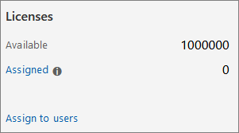

# Включить среду оценки конечных точек Microsoft DefenderEnable Microsoft Defender for Endpoint evaluation environment

В этой статье вы сможете с помощью производственных устройств принять меры по настройке среды оценки для Microsoft Defender для конечной точки.This article will guide you through the steps on setting up the evaluation environment for Microsoft Defender for Endpoint using production devices. 

>[!TIP]
>Microsoft Defender для endpoint также поставляется с лабораторией оценки в продукте, где можно добавить предварительно настроенные устройства и запустить моделирование для оценки возможностей платформы.Microsoft Defender for Endpoint also comes with an in-product evaluation lab where you can add pre-configured devices and run simulations to evaluate the capabilities of the platform. В лаборатории имеется упрощенная настройка, которая поможет быстро продемонстрировать значение Microsoft Defender для enpdoint, включая рекомендации по многим функциям, таким как расширенный анализ охоты и аналитика угроз.The lab comes with a simplified set-up experience that can help quickly demonstrate the value of Microsoft Defender for Enpdoint including guidance for many features like advanced hunting and threat analytics. Дополнительные сведения см. в [дополнительных сведениях о возможностях Оценки.](/defender-endpoint/evaluation-lab.md)For more information, see [Evaluate capabilities](/defender-endpoint/evaluation-lab.md).   Основное отличие руководства, представленного в этой статье, от лаборатории оценки состоит в том, что среда оценки использует производственные устройства, в то время как лаборатория оценки использует непроизводимые устройства.The main difference between the guidance provided in this article and the evaluation lab is the evaluation environment uses production devices whereas the evaluation lab uses non-production devices. 

Чтобы включить оценку для Microsoft Defender для конечной точки, используйте следующие действия.Use the following steps to enable the evaluation for Microsoft Defender for Endpoint.

- [Шаг 1. Проверка состояния лицензииStep 1. Check license state](#step-1-check-license-state)
- [Шаг 2. Конечные точки на бортуStep 2. Onboard endpoints](#step-2-onboard-endpoints-using-any-of-the-supported-management-tools)

## Этап 1.Step 1. Проверка состояния лицензииCheck license state

Сначала необходимо проверить состояние лицензии, чтобы убедиться, что оно было правильно заложено.You'll first need to check the license state to verify that it was properly provisioned. Это можно сделать через центр администрирования или через **портал Microsoft Azure.**You can do this through the admin center or through the **Microsoft Azure portal**.

1. Чтобы просмотреть лицензии, перейдите на портал **Microsoft Azure и** перейдите в раздел лицензии Microsoft Azure [портала](https://portal.azure.com/#blade/Microsoft_AAD_IAM/LicensesMenuBlade/Products).To view your licenses, go to the **Microsoft Azure portal** and navigate to the [Microsoft Azure portal license section](https://portal.azure.com/#blade/Microsoft_AAD_IAM/LicensesMenuBlade/Products).

   

1. Поочередно в центре администрирования перейдите к **подпискам на**  >  **биллинг.**Alternately, in the admin center, navigate to **Billing** > **Subscriptions**.

    На экране вы увидите все предварительные лицензии и их текущее **состояние.**On the screen, you'll see all the provisioned licenses and their current **Status**.

    

## Этап 2.Step 2. Конечные точки на борту с использованием любого из поддерживаемых средств управленияOnboard endpoints using any of the supported management tools

После проверки правильного состояния лицензии можно запустить бортовые устройства в службу.After verifying that the license state has been provisioned properly, you can start onboarding devices to the service. 

Для оценки Microsoft Defender для конечной точки рекомендуется выбрать несколько Windows 10 для проведения оценки.For the purpose of evaluating Microsoft Defender for Endpoint, we recommend choosing a couple of Windows 10 devices to conduct the evaluation on. 

В [разделе Развертывание](../defender-endpoint/deployment-strategy.md) Plan описаны общие действия, которые необходимо предпринять для развертывания Defender для конечной точки.The [Plan deployment](../defender-endpoint/deployment-strategy.md) topic outlines the general steps you need to take to deploy Defender for Endpoint.  

Просмотрите это видео, чтобы получить краткий обзор процесса работы с бортовой частью и узнать о доступных средствах и методах.Watch this video for a quick overview of the onboarding process and learn about the available tools and methods.

> [!VIDEO https://www.microsoft.com/videoplayer/embed/RE4bGqr]

### Параметры onboarding toolOnboarding tool options

В следующей таблице перечислены доступные средства, основанные на конечной точке, которую необходимо использовать на борту.The following table lists the available tools based on the endpoint that you need to onboard.

Конечная точкаEndpoint | Параметры инструментаTool options
:---|:---
**Windows****Windows** | [Локальный скрипт (до 10 устройств),](../defender-endpoint/configure-endpoints-script.md)групповой политики [,](../defender-endpoint/configure-endpoints-gp.md) [Microsoft Endpoint Manager/](../defender-endpoint/configure-endpoints-mdm.md)Диспетчер мобильных устройств , [Microsoft Endpoint Configuration Manager](../defender-endpoint/configure-endpoints-sccm.md), [сценарии VDI](../defender-endpoint/configure-endpoints-vdi.md), [интеграция](../defender-endpoint/configure-server-endpoints.md#integration-with-azure-defender) с Azure Defender[Local script (up to 10 devices)](../defender-endpoint/configure-endpoints-script.md),  [Group Policy](../defender-endpoint/configure-endpoints-gp.md),  [Microsoft Endpoint Manager/ Mobile Device Manager](../defender-endpoint/configure-endpoints-mdm.md),  [Microsoft Endpoint Configuration Manager](../defender-endpoint/configure-endpoints-sccm.md),  [VDI scripts](../defender-endpoint/configure-endpoints-vdi.md),  [Integration with Azure Defender](../defender-endpoint/configure-server-endpoints.md#integration-with-azure-defender)
**macOS****macOS** | [Локальные сценарии](../defender-endpoint/mac-install-manually.md) [, Microsoft Endpoint Manager](../defender-endpoint/mac-install-with-intune.md), [JAMF Pro](../defender-endpoint/mac-install-with-jamf.md), управление [мобильными устройствами](../defender-endpoint/mac-install-with-other-mdm.md)[Local scripts](../defender-endpoint/mac-install-manually.md),  [Microsoft Endpoint Manager](../defender-endpoint/mac-install-with-intune.md),  [JAMF Pro](../defender-endpoint/mac-install-with-jamf.md),  [Mobile Device Management](../defender-endpoint/mac-install-with-other-mdm.md)
**Linux Server****Linux Server** | [Локальный](../defender-endpoint/linux-install-manually.md)  [сценарий](../defender-endpoint/linux-install-with-puppet.md), Кукольный ,  [Ansible](../defender-endpoint/linux-install-with-ansible.md)[Local script](../defender-endpoint/linux-install-manually.md),  [Puppet](../defender-endpoint/linux-install-with-puppet.md),  [Ansible](../defender-endpoint/linux-install-with-ansible.md)
**iOS****iOS** | [На основе приложенияApp-based](../defender-endpoint/ios-install.md)
**Android****Android** | [Microsoft Endpoint ManagerMicrosoft Endpoint Manager](../defender-endpoint/android-intune.md)

## Следующее действиеNext step
[Настройка пилотного проекта для Microsoft Defender для конечной точкиSetup the pilot for Microsoft Defender for Endpoint](eval-defender-endpoint-pilot.md)
 
Возвращение к обзору [оценки Microsoft Defender для конечной точки](eval-defender-endpoint-overview.md)Return to the overview for [Evaluate Microsoft Defender for Endpoint](eval-defender-endpoint-overview.md)

Возвращайся к обзору [для оценки и пилотных Microsoft 365 Defender](eval-overview.md)Return to the overview for [Evaluate and pilot Microsoft 365 Defender](eval-overview.md)