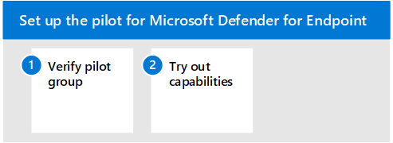

# Пилотный microsoft Defender для конечной точки

Эта статья поможет вам в процессе запуска пилотного проекта для Microsoft Defender для конечной точки. 

Чтобы настроить пилотный пилот для Microsoft Defender для конечной точки, используйте следующие действия. 

- Этап 1. Проверка пилотной группы
- Этап 2. Опробуйте возможности

При пилотном октайке Microsoft Defender для конечной точки вы можете выбрать для службы несколько устройств, прежде чем в нее войдет вся организация.  

Затем можно попробовать доступные возможности, такие как запуск имитации атак и просмотр вредоносных действий Defender для конечной точки и позволяет эффективно отвечать на них. 

## Этап 1. Проверка пилотной группы
После завершения действий по встраивке, описанным в разделе [Оценка](eval-defender-endpoint-enable-eval.md) включить, устройства должны быть в списке инвентаризации устройств примерно через час. 

Когда вы видите свои бортовых устройств, вы можете приступить к о попробовать возможности. 

## Этап 2. Опробуйте возможности
Теперь, когда вы завершили работу над некоторыми устройствами и убедились, что они сообщают службе, ознакомьтесь с продуктом, окутав возможности, доступные прямо из окна.

Во время пилотного проекта можно легко начать с проверки некоторых функций, чтобы увидеть продукт в действии без сложных действий по настройке.

Начнем с проверки панелей мониторинга.

### Просмотр инвентаризации устройств
Инвентаризация устройств — это список конечных точек, сетевых устройств и устройств IoT в сети. Он не только предоставляет вам представление устройств в сети, но и предоставляет подробные сведения о них, такие как домен, уровень риска, платформа ОС и другие сведения для легкой идентификации устройств, наиболее опасных.

### Просмотр панели мониторинга угрозы и управление уязвимостями 
Угрозы и управление уязвимостями помогает сосредоточиться на слабых сторонах, которые представляют наиболее неотложный и самый высокий риск для организации. На панели мониторинга получите высокоуровневый обзор оценки экспозиции организации, microsoft Secure Score for Devices, распределение экспозиции устройств, рекомендации по безопасности, программное обеспечение с высоким уровнем уязвимости, действия по исправлению и топовые данные об устройстве. 

### Запуск моделирования
Microsoft Defender для конечной точки поставляется со сценариями атак ["Do It Yourself",](https://securitycenter.windows.com/tutorials) которые можно запустить на пилотных устройствах.  Каждый документ содержит требования к ОС и приложениям, а также подробные инструкции, которые относятся к сценарию атаки. Эти скрипты безопасны, документированы и просты в использовании. Эти сценарии будут отражать возможности Defender для конечных точек и ходить по опыту исследования.

Для запуска любого из предоставленных симуляций необходимо по крайней мере [одно бортовом устройстве.](../defender-endpoint/onboard-configure.md)

1. В   >  **справке & руководства**, выберите, какой из доступных сценариев атак вы хотите имитировать:

   - **Сценарий 1. Отбрасыватель** документа — имитирует доставку социально разработанного документа-приманки. В документе запускается специально созданный backdoor, который дает злоумышленникам контроль.

   - **Сценарий 2. Сценарий PowerShell** в без файловой атаке — имитирует без файловую атаку, которая опирается на PowerShell, демонстрацию уменьшения поверхности атаки и обнаружение вредоносных действий памяти на устройстве.

   - **Сценарий 3.** Автоматизированная реакция на инциденты — запускает автоматическое расследование, которое автоматически охотится за артефактами нарушений и устраняет их для масштабирования емкости реагирования на инциденты.

2. Скачайте и прочитайте соответствующий документ по погонам, предоставленный в выбранном сценарии.

3. Скачайте файл моделирования или скопируйте сценарий моделирования, перенавигав для **справки**&  >  **руководства.** Вы можете скачать файл или скрипт на тестовом устройстве, но это не является обязательным.

4. Запустите файл или сценарий моделирования на тестовом устройстве, как поручено в документе по поручению.

> [!NOTE]
> Файлы или сценарии моделирования имитируют действия атаки, но на самом деле являются доброкачественными и не наносят вреда тестовом устройству.

## Дальнейшие действия
[Оценка Microsoft Cloud App Security](eval-defender-mcas-overview.md)

Возвращение к обзору [оценки Microsoft Defender для конечной точки](eval-defender-endpoint-overview.md)

Возвращайся к обзору [для оценки и пилотных Microsoft 365 Defender](eval-overview.md)