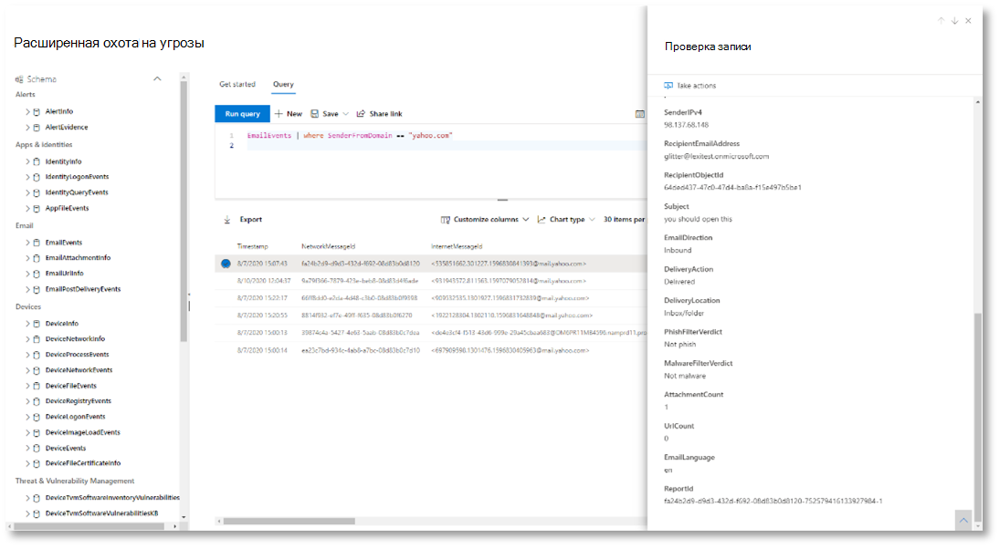
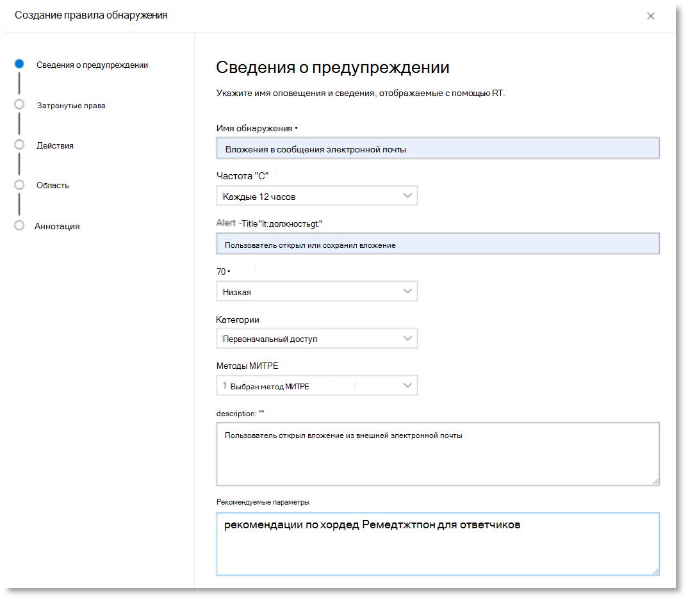
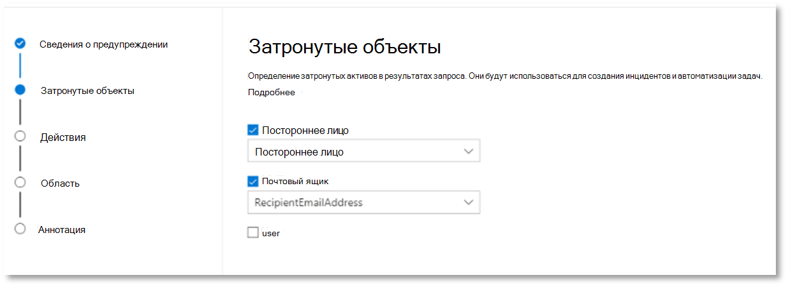
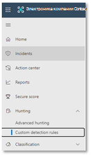
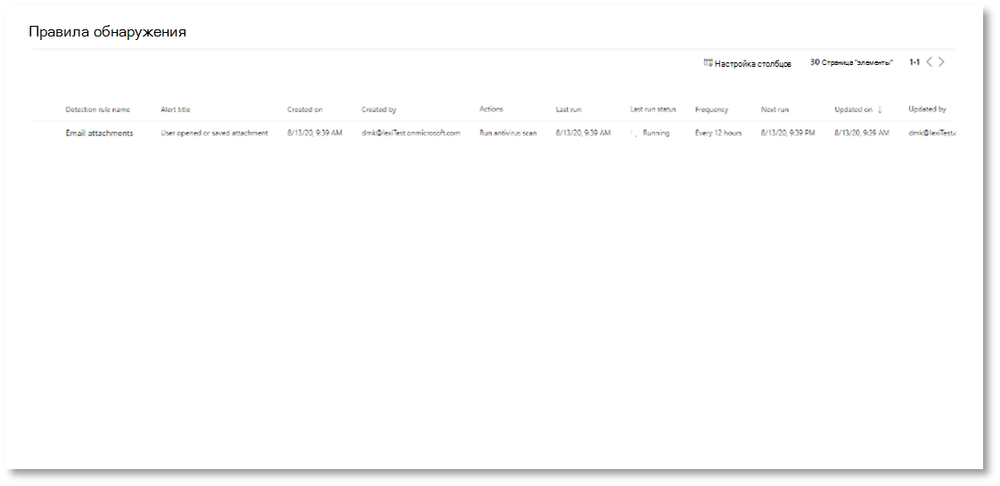
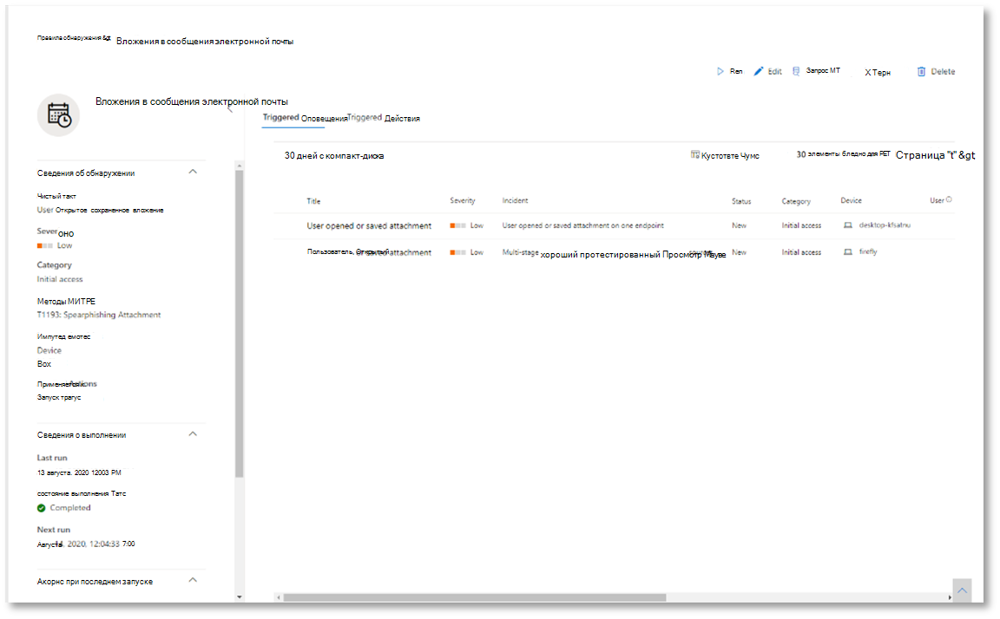

# <a name="try-microsoft-365-defender-incident-response-capabilities-in-a-pilot-environment"></a><span data-ttu-id="88f93-104">Попробуйте Microsoft 365 Defender возможности реагирования на инциденты в пилотной среде</span><span class="sxs-lookup"><span data-stu-id="88f93-104">Try Microsoft 365 Defender incident response capabilities in a pilot environment</span></span>

<span data-ttu-id="88f93-105">**Область применения:**</span><span class="sxs-lookup"><span data-stu-id="88f93-105">**Applies to:**</span></span>
- <span data-ttu-id="88f93-106">Microsoft 365 Defender</span><span class="sxs-lookup"><span data-stu-id="88f93-106">Microsoft 365 Defender</span></span>

<span data-ttu-id="88f93-107">Эта статья является [этапом 2](eval-defender-investigate-respond.md) из 2 в процессе выполнения расследования и реагирования на инцидент в Microsoft 365 Defender с помощью пилотной среды.</span><span class="sxs-lookup"><span data-stu-id="88f93-107">This article is [Step 2 of 2](eval-defender-investigate-respond.md) in the process of performing an investigation and response of an incident in Microsoft 365 Defender using a pilot environment.</span></span> <span data-ttu-id="88f93-108">Дополнительные сведения об этом процессе см. в статье [обзор.](eval-defender-investigate-respond.md)</span><span class="sxs-lookup"><span data-stu-id="88f93-108">For more information about this process, see the [overview](eval-defender-investigate-respond.md) article.</span></span>

<span data-ttu-id="88f93-109">После выполнения ответа [на](eval-defender-investigate-respond-simulate-attack.md)инциденты для имитации атаки ниже Microsoft 365 Defender возможности для изучения:</span><span class="sxs-lookup"><span data-stu-id="88f93-109">Once you have performed an [incident response for a simulated attack](eval-defender-investigate-respond-simulate-attack.md), here are some Microsoft 365 Defender capabilities to explore:</span></span>

|<span data-ttu-id="88f93-110">Возможность</span><span class="sxs-lookup"><span data-stu-id="88f93-110">Capability</span></span> |<span data-ttu-id="88f93-111">Описание</span><span class="sxs-lookup"><span data-stu-id="88f93-111">Description</span></span> |
|:-------|:-----|
| [<span data-ttu-id="88f93-112">Управление приоритетом инцидентов</span><span class="sxs-lookup"><span data-stu-id="88f93-112">Prioritize incidents</span></span>](#prioritize-incidents) | <span data-ttu-id="88f93-113">Используйте фильтрацию и сортировку очереди инцидентов, чтобы определить, какие инциденты необходимо решить далее.</span><span class="sxs-lookup"><span data-stu-id="88f93-113">Use filtering and sorting of the incidents queue to determine which incidents to address next.</span></span> |
| [<span data-ttu-id="88f93-114">Управление инцидентами</span><span class="sxs-lookup"><span data-stu-id="88f93-114">Manage incidents</span></span>](#manage-incidents) | <span data-ttu-id="88f93-115">Измените свойства инцидентов, чтобы обеспечить правильное назначение, добавить теги и комментарии, а также устранить инцидент.</span><span class="sxs-lookup"><span data-stu-id="88f93-115">Modify incident properties to ensure correct assignment, add tags and comments, and to resolve an incident.</span></span> |
| [<span data-ttu-id="88f93-116">Автоматизированный анализ угроз и реагирование на них</span><span class="sxs-lookup"><span data-stu-id="88f93-116">Automated investigation and response</span></span>](#examine-automated-investigation-and-response-with-the-action-center) | <span data-ttu-id="88f93-117">Возможности автоматического расследования и реагирования (AIR), которые могут помочь вашей группе операций безопасности эффективнее и эффективнее решать угрозы.</span><span class="sxs-lookup"><span data-stu-id="88f93-117">Automated investigation and response (AIR) capabilities that can help your security operations team address threats more efficiently and effectively.</span></span> <span data-ttu-id="88f93-118">Центр действий — это "единое стекло" для выполнения задач по устранению инцидентов и предупреждений, таких как одобрение ожидающих действий по исправлению.</span><span class="sxs-lookup"><span data-stu-id="88f93-118">The Action center is a "single pane of glass" experience for incident and alert tasks such as approving pending remediation actions.</span></span> |
| [<span data-ttu-id="88f93-119">Расширенная охота</span><span class="sxs-lookup"><span data-stu-id="88f93-119">Advanced hunting</span></span>](#advanced-hunting) | <span data-ttu-id="88f93-120">Средство для поиска угроз на основе запросов, которое позволяет активно проверять события в сети и находить индикаторы и объекты угрозы.</span><span class="sxs-lookup"><span data-stu-id="88f93-120">A query-based threat-hunting tool that lets you proactively inspect events in your network and locate threat indicators and entities.</span></span> <span data-ttu-id="88f93-121">Вы также используете расширенные охоты во время расследования и устранения инцидента.</span><span class="sxs-lookup"><span data-stu-id="88f93-121">You also use advanced hunting during the investigation and remediation of an incident.</span></span> |
||||

## <a name="prioritize-incidents"></a><span data-ttu-id="88f93-122">Управление приоритетом инцидентов</span><span class="sxs-lookup"><span data-stu-id="88f93-122">Prioritize incidents</span></span>

<span data-ttu-id="88f93-123">Вы получаете очередь инцидента из & оповещения **> инцидентов** при быстром запуске портала Microsoft 365 Defender [(security.microsoft.com).](https://security.microsoft.com)</span><span class="sxs-lookup"><span data-stu-id="88f93-123">You get to the incident queue from **Incidents & alerts > Incidents** on the quick launch of the Microsoft 365 Defender portal ([security.microsoft.com](https://security.microsoft.com)).</span></span> <span data-ttu-id="88f93-124">Ниже приведен пример.</span><span class="sxs-lookup"><span data-stu-id="88f93-124">Here's an example.</span></span>

:::image type="content" source="../../media/incidents-queue/incidents-ss-incidents.png" alt-text="Пример очереди инцидента":::

<span data-ttu-id="88f93-126">В **разделе Последние инциденты** и оповещения показан график количества полученных предупреждений и инцидентов, созданных за последние 24 часа.</span><span class="sxs-lookup"><span data-stu-id="88f93-126">The **Most recent incidents and alerts** section shows a graph of the number of alerts received and incidents created in the last 24 hours.</span></span>

<span data-ttu-id="88f93-127">Чтобы изучить список инцидентов и уставить приоритеты их важности для назначения и расследования, вы можете:</span><span class="sxs-lookup"><span data-stu-id="88f93-127">To examine the list of incidents and prioritize their importance for assignment and investigation, you can:</span></span> 

- <span data-ttu-id="88f93-128">Настройка настраиваемых столбцов (выберите **столбцы Выберите),** чтобы вы могли увидеть различные характеристики инцидента или сущностей.</span><span class="sxs-lookup"><span data-stu-id="88f93-128">Configure customizable columns (select **Choose columns**) to give you visibility into different characteristics of the incident or the impacted entities.</span></span> <span data-ttu-id="88f93-129">Это поможет вам принять обоснованные решения о приоритете инцидентов для анализа.</span><span class="sxs-lookup"><span data-stu-id="88f93-129">This helps you make an informed decision regarding the prioritization of incidents for analysis.</span></span>

- <span data-ttu-id="88f93-130">Используйте фильтрацию, чтобы сосредоточиться на определенном сценарии или угрозе.</span><span class="sxs-lookup"><span data-stu-id="88f93-130">Use filtering to focus on a specific scenario or threat.</span></span> <span data-ttu-id="88f93-131">Применение фильтров в очереди инцидентов поможет определить, какие инциденты требуют немедленного внимания.</span><span class="sxs-lookup"><span data-stu-id="88f93-131">Applying filters on the incident queue can help determine which incidents require immediate attention.</span></span> 

<span data-ttu-id="88f93-132">Из очереди инцидентов по умолчанию выберите **Фильтры,** чтобы увидеть области **Фильтры,** из которой можно указать определенный набор инцидентов.</span><span class="sxs-lookup"><span data-stu-id="88f93-132">From the default incident queue, select **Filters** to see a **Filters** pane, from which you can specify a specific set of incidents.</span></span> <span data-ttu-id="88f93-133">Пример:</span><span class="sxs-lookup"><span data-stu-id="88f93-133">Here is an example.</span></span>

:::image type="content" source="../../media/incidents-queue/incidents-ss-incidents-filters.png" alt-text="Пример области фильтров для очереди инцидента":::

<span data-ttu-id="88f93-135">Дополнительные сведения см. в [дополнительных сведениях о приоритетах инцидентов.](incident-queue.md)</span><span class="sxs-lookup"><span data-stu-id="88f93-135">For more information, see [Prioritize incidents](incident-queue.md).</span></span>

## <a name="manage-incidents"></a><span data-ttu-id="88f93-136">Управление инцидентами</span><span class="sxs-lookup"><span data-stu-id="88f93-136">Manage incidents</span></span>

<span data-ttu-id="88f93-137">Вы можете управлять инцидентами из области **Управление** инцидентами для инцидента.</span><span class="sxs-lookup"><span data-stu-id="88f93-137">You can manage incidents from the **Manage incident** pane for an incident.</span></span> <span data-ttu-id="88f93-138">Ниже приведен пример.</span><span class="sxs-lookup"><span data-stu-id="88f93-138">Here's an example.</span></span>

:::image type="content" source="../../media/incidents-queue/incidents-ss-incidents-manage.png" alt-text="Пример области управления инцидентом инцидента":::

<span data-ttu-id="88f93-140">Эту области можно отобразить в ссылке **Управление инцидентами** по ссылке:</span><span class="sxs-lookup"><span data-stu-id="88f93-140">You can display this pane from the **Manage incident** link on the:</span></span>

- <span data-ttu-id="88f93-141">Области свойств инцидента в очереди инцидента.</span><span class="sxs-lookup"><span data-stu-id="88f93-141">Properties pane of an incident in the incident queue.</span></span>
- <span data-ttu-id="88f93-142">**Сводная** страница инцидента.</span><span class="sxs-lookup"><span data-stu-id="88f93-142">**Summary** page of an incident.</span></span>

<span data-ttu-id="88f93-143">Вот способы, которыми можно управлять своими инцидентами:</span><span class="sxs-lookup"><span data-stu-id="88f93-143">Here are the ways you can manage your incidents:</span></span>

- <span data-ttu-id="88f93-144">Изменение имени инцидента</span><span class="sxs-lookup"><span data-stu-id="88f93-144">Edit the incident name</span></span>

  <span data-ttu-id="88f93-145">Измените имя, назначенное по принципу utomatically, в зависимости от ваших методов работы группы безопасности.</span><span class="sxs-lookup"><span data-stu-id="88f93-145">Change the utomatically assigned name based on your security team best practices.</span></span>
  
- <span data-ttu-id="88f93-146">Добавление тегов инцидента</span><span class="sxs-lookup"><span data-stu-id="88f93-146">Add incident tags</span></span>

  <span data-ttu-id="88f93-147">Добавьте теги, которые группа безопасности использует для классификации инцидентов, которые можно отфильтровать позже.</span><span class="sxs-lookup"><span data-stu-id="88f93-147">Add tags that your security team uses to classify incidents, which can be later filtered.</span></span>
  
- <span data-ttu-id="88f93-148">Назначьте инцидент самому себе</span><span class="sxs-lookup"><span data-stu-id="88f93-148">Assign the incident to yourself</span></span>

  <span data-ttu-id="88f93-149">Назначьте его имени учетной записи пользователя, которое можно отфильтровать позже.</span><span class="sxs-lookup"><span data-stu-id="88f93-149">Assign it to your user account name, which can be later filtered.</span></span>
  
- <span data-ttu-id="88f93-150">Устранение инцидента</span><span class="sxs-lookup"><span data-stu-id="88f93-150">Resolve an incident</span></span>

  <span data-ttu-id="88f93-151">Закрой инцидент после его устранения.</span><span class="sxs-lookup"><span data-stu-id="88f93-151">Close the incident after it has been remediated.</span></span>
  
- <span data-ttu-id="88f93-152">Настройка классификации и определения</span><span class="sxs-lookup"><span data-stu-id="88f93-152">Set its classification and determination</span></span>

  <span data-ttu-id="88f93-153">Классифицировать и выбрать тип угрозы при разрешении инцидента.</span><span class="sxs-lookup"><span data-stu-id="88f93-153">Classify and select the threat type when you resolve an incident.</span></span>
  
- <span data-ttu-id="88f93-154">Добавление примечаний</span><span class="sxs-lookup"><span data-stu-id="88f93-154">Add comments</span></span>

  <span data-ttu-id="88f93-155">Используйте комментарии для выполнения, заметки или другие сведения, основанные на лучших практиках группы безопасности.</span><span class="sxs-lookup"><span data-stu-id="88f93-155">Use comments for progress, notes, or other information based on your security team best practices.</span></span> <span data-ttu-id="88f93-156">Полная история комментариев доступна в разделе **Комментарии** и история на странице сведений об инциденте.</span><span class="sxs-lookup"><span data-stu-id="88f93-156">The full comment history is available from the **Comments and history** option in the details page of an incident.</span></span>

<span data-ttu-id="88f93-157">Дополнительные сведения см. в [руб. Управление инцидентами.](manage-incidents.md)</span><span class="sxs-lookup"><span data-stu-id="88f93-157">For more information, see [Manage incidents](manage-incidents.md).</span></span>

## <a name="examine-automated-investigation-and-response-with-the-action-center"></a><span data-ttu-id="88f93-158">Изучение автоматизированных исследований и ответов в Центре действий</span><span class="sxs-lookup"><span data-stu-id="88f93-158">Examine automated investigation and response with the Action center</span></span>

<span data-ttu-id="88f93-159">В зависимости от того, как настраиваются возможности автоматического расследования и реагирования для вашей организации, действия по исправлению будут приниматься автоматически или только после утверждения вашей командой операций безопасности.</span><span class="sxs-lookup"><span data-stu-id="88f93-159">Depending on how automated investigation and response capabilities are configured for your organization, remediation actions are taken automatically or only upon approval by your security operations team.</span></span> <span data-ttu-id="88f93-160">Все действия, отложенные или завершенные, перечислены в Центре [действий,](m365d-action-center.md)в котором перечислены ожидающих и завершенных действий по исправлению для устройств, сообщения электронной почты & совместной работы и удостоверения в одном расположении.</span><span class="sxs-lookup"><span data-stu-id="88f93-160">All actions, whether pending or completed, are listed in the [Action center](m365d-action-center.md), which lists pending and completed remediation actions for your devices, email & collaboration content, and identities in one location.</span></span>

<span data-ttu-id="88f93-161">Ниже приведен пример.</span><span class="sxs-lookup"><span data-stu-id="88f93-161">Here's an example.</span></span>

:::image type="content" source="../../media/m3d-action-center-unified.png" alt-text="Единый центр действий в Microsoft 365 Defender":::

<span data-ttu-id="88f93-163">В центре действий можно выбрать ожидающих действий, а затем утвердить или отклонить их в области вылетов.</span><span class="sxs-lookup"><span data-stu-id="88f93-163">From the Action center, you can select pending actions and then approve or reject them in the flyout pane.</span></span> <span data-ttu-id="88f93-164">Ниже приведен пример.</span><span class="sxs-lookup"><span data-stu-id="88f93-164">Here's an example.</span></span>

:::image type="content" source="../../media/air-actioncenter-itemselected.png" alt-text="Утверждение или отклонение действия":::

<span data-ttu-id="88f93-166">Утвердить (или отклонить) ожидающих действий как можно скорее, чтобы ваши автоматизированные расследования могли своевременно продолжиться и завершиться.</span><span class="sxs-lookup"><span data-stu-id="88f93-166">Approve (or reject) pending actions as soon as possible so that your automated investigations can proceed and complete in a timely manner.</span></span>

<span data-ttu-id="88f93-167">Дополнительные сведения см. в [центре автоматического расследования и ответа](m365d-autoir.md) и [действий.](m365d-action-center.md)</span><span class="sxs-lookup"><span data-stu-id="88f93-167">For more information, see [Automated investigation and response](m365d-autoir.md) and [Action center](m365d-action-center.md).</span></span>

## <a name="advanced-hunting"></a><span data-ttu-id="88f93-168">Расширенная охота</span><span class="sxs-lookup"><span data-stu-id="88f93-168">Advanced hunting</span></span>

> [!NOTE]
> <span data-ttu-id="88f93-169">Перед тем как просмотреть передовую имитацию охоты, просмотрите следующее видео, чтобы понять расширенные концепции охоты, узнайте, где его можно найти на портале, и узнайте, как это может помочь вам в операциях по обеспечению безопасности.</span><span class="sxs-lookup"><span data-stu-id="88f93-169">Before we walk you through the advanced hunting simulation, watch the following video to understand advanced hunting concepts, see where you can find it in the portal, and know how it can help you in your security operations.</span></span>

<br>

> [!VIDEO https://www.microsoft.com/videoplayer/embed/RE4Bp7O]


<span data-ttu-id="88f93-170">Если необязательный симулятор атаки [PowerShell](eval-defender-investigate-respond-simulate-attack.md#simulate-an-attack-with-an-isolated-domain-controller-and-client-device-optional) без файлов был настоящей атакой, которая уже достигла стадии доступа к учетным данным, можно использовать расширенный поиск в любой момент расследования для активного поиска событий и записей в сети, используя то, что вы уже знаете из созданных оповещений и затронутых сущностями.</span><span class="sxs-lookup"><span data-stu-id="88f93-170">If the [optional fileless PowerShell attack simulation](eval-defender-investigate-respond-simulate-attack.md#simulate-an-attack-with-an-isolated-domain-controller-and-client-device-optional) were a real attack that had already reached the credential access stage, you can use advanced hunting at any point in the investigation to proactively search through events and records in the network using what you already know from the generated alerts and affected entities.</span></span> <span data-ttu-id="88f93-171">Например, за последние 30 дней можно запрашивать любые подключения к внешнему IP-адресу.</span><span class="sxs-lookup"><span data-stu-id="88f93-171">For instance, you can query for any connections to the external IP address in the past 30 days.</span></span>

### <a name="hunting-environment-requirements"></a><span data-ttu-id="88f93-172">Требования среды охоты</span><span class="sxs-lookup"><span data-stu-id="88f93-172">Hunting environment requirements</span></span>

<span data-ttu-id="88f93-173">Для этого моделирования требуется один внутренний почтовый ящик и устройство.</span><span class="sxs-lookup"><span data-stu-id="88f93-173">There's a single internal mailbox and device required for this simulation.</span></span> <span data-ttu-id="88f93-174">Для отправки тестового сообщения также потребуется внешняя учетная запись электронной почты.</span><span class="sxs-lookup"><span data-stu-id="88f93-174">You'll also need an external email account to send the test message.</span></span>

1. <span data-ttu-id="88f93-175">Убедитесь, что клиент включил [Microsoft 365 Defender.](m365d-enable.md#confirm-that-the-service-is-on)</span><span class="sxs-lookup"><span data-stu-id="88f93-175">Verify that your tenant has [enabled Microsoft 365 Defender](m365d-enable.md#confirm-that-the-service-is-on).</span></span>
2. <span data-ttu-id="88f93-176">Определите целевой почтовый ящик, который будет использоваться для получения электронной почты.</span><span class="sxs-lookup"><span data-stu-id="88f93-176">Identify a target mailbox to be used for receiving email.</span></span>

   - <span data-ttu-id="88f93-177">Этот почтовый ящик должен контролироваться Защитником Майкрософт для Office 365</span><span class="sxs-lookup"><span data-stu-id="88f93-177">This mailbox must be monitored by Microsoft Defender for Office 365</span></span>

   - <span data-ttu-id="88f93-178">Устройство из требования 3 должно получить доступ к этому почтовому ящику</span><span class="sxs-lookup"><span data-stu-id="88f93-178">The device from requirement 3 needs to access this mailbox</span></span>

3. <span data-ttu-id="88f93-179">Настройка тестового устройства:</span><span class="sxs-lookup"><span data-stu-id="88f93-179">Configure a test device:</span></span>

    <span data-ttu-id="88f93-180">a.</span><span class="sxs-lookup"><span data-stu-id="88f93-180">a.</span></span> <span data-ttu-id="88f93-181">Убедитесь, что вы используете Windows 10 версии 1903 или более поздней версии.</span><span class="sxs-lookup"><span data-stu-id="88f93-181">Make sure you are using Windows 10 version 1903 or later version.</span></span>

    <span data-ttu-id="88f93-182">b.</span><span class="sxs-lookup"><span data-stu-id="88f93-182">b.</span></span> <span data-ttu-id="88f93-183">Присоединитесь к тестовом устройству в тестовом домене.</span><span class="sxs-lookup"><span data-stu-id="88f93-183">Join the test device to the test domain.</span></span>

    <span data-ttu-id="88f93-184">c.</span><span class="sxs-lookup"><span data-stu-id="88f93-184">c.</span></span> <span data-ttu-id="88f93-185">[Включи антивирусная программа](/windows/security/threat-protection/windows-defender-antivirus/configure-windows-defender-antivirus-features).</span><span class="sxs-lookup"><span data-stu-id="88f93-185">[Turn on Windows Defender Antivirus](/windows/security/threat-protection/windows-defender-antivirus/configure-windows-defender-antivirus-features).</span></span> <span data-ttu-id="88f93-186">Если у вас возникли проблемы с включением антивирусная программа , см. эту тему [устранения неполадок.](/windows/security/threat-protection/microsoft-defender-atp/troubleshoot-onboarding#ensure-that-windows-defender-antivirus-is-not-disabled-by-a-policy)</span><span class="sxs-lookup"><span data-stu-id="88f93-186">If you are having trouble enabling Windows Defender Antivirus, see [this troubleshooting topic](/windows/security/threat-protection/microsoft-defender-atp/troubleshoot-onboarding#ensure-that-windows-defender-antivirus-is-not-disabled-by-a-policy).</span></span>

    <span data-ttu-id="88f93-187">г.</span><span class="sxs-lookup"><span data-stu-id="88f93-187">d.</span></span> <span data-ttu-id="88f93-188">[На борту в Microsoft Defender для конечной точки](/windows/security/threat-protection/microsoft-defender-atp/configure-endpoints).</span><span class="sxs-lookup"><span data-stu-id="88f93-188">[Onboard to Microsoft Defender for Endpoint](/windows/security/threat-protection/microsoft-defender-atp/configure-endpoints).</span></span>

### <a name="run-the-simulation"></a><span data-ttu-id="88f93-189">Запуск моделирования</span><span class="sxs-lookup"><span data-stu-id="88f93-189">Run the simulation</span></span>

1. <span data-ttu-id="88f93-190">Из внешней учетной записи электронной почты отправьте сообщение электронной почты в почтовый ящик, который определен на шаге 2 раздела требования к среде охоты.</span><span class="sxs-lookup"><span data-stu-id="88f93-190">From an external email account, send an email to the mailbox identified in step 2 of the hunting environment requirements section.</span></span> <span data-ttu-id="88f93-191">Включайте вложение, которое будет разрешено через любые существующие политики фильтра электронной почты.</span><span class="sxs-lookup"><span data-stu-id="88f93-191">Include an attachment that will be allowed through any existing email filter policies.</span></span> <span data-ttu-id="88f93-192">Этот файл не должен быть вредоносным или исполняемым.</span><span class="sxs-lookup"><span data-stu-id="88f93-192">This file does not need to be malicious or an executable.</span></span> <span data-ttu-id="88f93-193">Предлагаемые типы файлов <i>.pdf, </i> <i>.exe</i> (если разрешено) или тип Office, например файл Word.</span><span class="sxs-lookup"><span data-stu-id="88f93-193">Suggested file types are <i>.pdf</i>, <i>.exe</i> (if allowed), or an Office document type such as a Word file.</span></span>

2. <span data-ttu-id="88f93-194">Откройте отправленную электронную почту с устройства, настроенного в соответствии с шагом 3 раздела требований к среде охоты.</span><span class="sxs-lookup"><span data-stu-id="88f93-194">Open the sent email from the device configured as defined in step 3 of the hunting environment requirements section.</span></span> <span data-ttu-id="88f93-195">Откройте вложение или сохраните файл на устройстве.</span><span class="sxs-lookup"><span data-stu-id="88f93-195">Either open the attachment or save the file to the device.</span></span>

#### <a name="go-hunting"></a><span data-ttu-id="88f93-196">Перейти на охоту</span><span class="sxs-lookup"><span data-stu-id="88f93-196">Go hunting</span></span>

1. <span data-ttu-id="88f93-197">Откройте портал [Microsoft 365 Defender .](https://security.microsoft.com/)</span><span class="sxs-lookup"><span data-stu-id="88f93-197">Open the [Microsoft 365 Defender portal](https://security.microsoft.com/).</span></span>

2. <span data-ttu-id="88f93-198">Из области навигации выберите **охоту > advanced hunting**.</span><span class="sxs-lookup"><span data-stu-id="88f93-198">From the navigation pane, select **Hunting > Advanced hunting**.</span></span>

3. <span data-ttu-id="88f93-199">Создайте запрос, который начинается с сбора событий электронной почты.</span><span class="sxs-lookup"><span data-stu-id="88f93-199">Build a query that starts by gathering email events.</span></span>

   1. <span data-ttu-id="88f93-200">Выберите **запрос > New**.</span><span class="sxs-lookup"><span data-stu-id="88f93-200">Select **Query > New**.</span></span>

   1. <span data-ttu-id="88f93-201">В **группах электронной** почты в **статье Advanced hunting** дважды щелкните **EmailEvents**.</span><span class="sxs-lookup"><span data-stu-id="88f93-201">In the **Email** groups under **Advanced hunting**, double-click **EmailEvents**.</span></span> <span data-ttu-id="88f93-202">Это следует увидеть в окне запроса.</span><span class="sxs-lookup"><span data-stu-id="88f93-202">You should see this in the query window.</span></span>

      ```console
      EmailEvents
      ```

   1. <span data-ttu-id="88f93-203">Измените время выполнения запроса до последних 24 часов.</span><span class="sxs-lookup"><span data-stu-id="88f93-203">Change the time frame of the query to the last 24 hours.</span></span> <span data-ttu-id="88f93-204">Если предположить, что отправленное вами сообщение электронной почты при прогона вышеуказанного моделирования было в течение последних 24 часов, в противном случае измените сроки по мере необходимости.</span><span class="sxs-lookup"><span data-stu-id="88f93-204">Assuming the email you sent when you ran the simulation above was in the past 24 hours, otherwise change the time frame as needed.</span></span>

   1. <span data-ttu-id="88f93-205">Выберите **запрос Run**.</span><span class="sxs-lookup"><span data-stu-id="88f93-205">Select **Run query**.</span></span> <span data-ttu-id="88f93-206">Результаты могут отличаться в зависимости от пилотной среды.</span><span class="sxs-lookup"><span data-stu-id="88f93-206">You may have differing results depending on your pilot environment.</span></span>

      > [!NOTE]
      > <span data-ttu-id="88f93-207">Следующий шаг для фильтрации параметров для ограничения возврата данных.</span><span class="sxs-lookup"><span data-stu-id="88f93-207">See the next step for filtering options to limit data return.</span></span>

      

        > [!NOTE]
        > <span data-ttu-id="88f93-209">Расширенный поиск отображает результаты запроса в качестве табулярных данных.</span><span class="sxs-lookup"><span data-stu-id="88f93-209">Advanced hunting displays query results as tabular data.</span></span> <span data-ttu-id="88f93-210">Вы также можете выбрать для просмотра данных в других типах форматов, таких как диаграммы.</span><span class="sxs-lookup"><span data-stu-id="88f93-210">You can also opt to view the data in other format types such as charts.</span></span>

   1. <span data-ttu-id="88f93-211">Посмотрите на результаты и узнайте, можно ли определить открытую электронную почту.</span><span class="sxs-lookup"><span data-stu-id="88f93-211">Look at the results and see if you can identify the email you opened.</span></span> <span data-ttu-id="88f93-212">Это может занять до двух часов для сообщения, чтобы появиться в продвинутой охоте.</span><span class="sxs-lookup"><span data-stu-id="88f93-212">It may take up to two hours for the message to show up in advanced hunting.</span></span> <span data-ttu-id="88f93-213">Чтобы сузить результаты,  можно добавить условие, в котором находится запрос, чтобы искать только сообщения электронной почты с "yahoo.com" в качестве senderMailFromDomain.</span><span class="sxs-lookup"><span data-stu-id="88f93-213">To narrow down the results, you can add the **where** condition to your query to only look for emails that have "yahoo.com" as their SenderMailFromDomain.</span></span> <span data-ttu-id="88f93-214">Пример:</span><span class="sxs-lookup"><span data-stu-id="88f93-214">Here is an example.</span></span>

      ```console
      EmailEvents
      | where SenderMailFromDomain == "yahoo.com"
      ```

   1. <span data-ttu-id="88f93-215">Щелкните строки из запроса, чтобы проверить запись.</span><span class="sxs-lookup"><span data-stu-id="88f93-215">Click the resulting rows from the query so you can inspect the record.</span></span>

      

4. <span data-ttu-id="88f93-217">Теперь, когда вы убедились, что вы можете увидеть электронную почту, добавьте фильтр для вложений.</span><span class="sxs-lookup"><span data-stu-id="88f93-217">Now that you have verified that you can see the email, add a filter for the attachments.</span></span> <span data-ttu-id="88f93-218">Сосредоточься на всех сообщениях электронной почты с вложениями в среде.</span><span class="sxs-lookup"><span data-stu-id="88f93-218">Focus on all emails with attachments in the environment.</span></span> <span data-ttu-id="88f93-219">Для этого моделирования сфокусируемся на входящие сообщения электронной почты, а не те, которые отправляются из среды.</span><span class="sxs-lookup"><span data-stu-id="88f93-219">For this simulation, focus on inbound emails, not those that are being sent out from your environment.</span></span> <span data-ttu-id="88f93-220">Удалите добавленные фильтры, чтобы найти сообщение и добавить "| где **AttachmentCount > 0** и **emailDirection**  ==  **"Inbound""**</span><span class="sxs-lookup"><span data-stu-id="88f93-220">Remove any filters you have added to locate your message and add "| where **AttachmentCount > 0** and **EmailDirection** == **"Inbound""**</span></span>

   <span data-ttu-id="88f93-221">Следующий запрос покажет результат с более коротким списком, чем первоначальный запрос для всех событий электронной почты:</span><span class="sxs-lookup"><span data-stu-id="88f93-221">The following query will show you the result with a shorter list than your initial query for all email events:</span></span>

   ```console
   EmailEvents
   | where AttachmentCount > 0 and EmailDirection == "Inbound"
   ```

5. <span data-ttu-id="88f93-222">Далее включите сведения о вложении (например: имя файла, хеши) в набор результатов.</span><span class="sxs-lookup"><span data-stu-id="88f93-222">Next, include the information about the attachment (such as: file name, hashes) to your result set.</span></span> <span data-ttu-id="88f93-223">Для этого присоединитесь к таблице **EmailAttachmentInfo.**</span><span class="sxs-lookup"><span data-stu-id="88f93-223">To do so, join the **EmailAttachmentInfo** table.</span></span> <span data-ttu-id="88f93-224">Общие поля, которые необходимо использовать для присоединения, в данном случае **— NetworkMessageId и** **RecipientObjectId.**</span><span class="sxs-lookup"><span data-stu-id="88f93-224">The common fields to use for joining, in this case are **NetworkMessageId** and **RecipientObjectId**.</span></span>

   <span data-ttu-id="88f93-225">В следующем запросе также содержится дополнительная строка "| **Переименование проекта в EmailTimestamp=Timestamp** поможет определить время, связанное с электронной почтой, а также с периодами времени, связанными с действиями файла, которые будут добавлены на следующем шаге.</span><span class="sxs-lookup"><span data-stu-id="88f93-225">The following query also includes an additional line "| **project-rename EmailTimestamp=Timestamp**" that'll help identify which timestamp was related to the email versus timestamps related to file actions that you'll add in the next step.</span></span>

   ```console
   EmailEvents
   | where AttachmentCount > 0 and EmailDirection == "Inbound"
   | project-rename EmailTimestamp=Timestamp
   | join EmailAttachmentInfo on NetworkMessageId, RecipientObjectId
   ```

6. <span data-ttu-id="88f93-226">Далее используйте значение **SHA256** из таблицы **EmailAttachmentInfo,** чтобы найти для этого хаша **действия DeviceFileEvents** (действия файлов, которые произошли на конечной точке).</span><span class="sxs-lookup"><span data-stu-id="88f93-226">Next, use the **SHA256** value from the **EmailAttachmentInfo** table to find **DeviceFileEvents** (file actions that happened on the endpoint) for that hash.</span></span> <span data-ttu-id="88f93-227">Общим полем здесь будет hash SHA256 для вложения.</span><span class="sxs-lookup"><span data-stu-id="88f93-227">The common field here will be the SHA256 hash for the attachment.</span></span>

   <span data-ttu-id="88f93-228">В итоговой таблице теперь содержатся сведения из конечной точки (Microsoft Defender для конечной точки), такие как имя устройства, какое действие было сделано (в данном случае фильтруется только для того, чтобы включить события FileCreated) и где был сохранен файл.</span><span class="sxs-lookup"><span data-stu-id="88f93-228">The resulting table now includes details from the endpoint (Microsoft Defender for Endpoint) such as device name, what action was done (in this case, filtered to only include FileCreated events), and where the file was stored.</span></span> <span data-ttu-id="88f93-229">Также будет включено имя учетной записи, связанной с процессом.</span><span class="sxs-lookup"><span data-stu-id="88f93-229">The account name associated with the process will also be included.</span></span>

   ```console
   EmailEvents
   | where AttachmentCount > 0 and EmailDirection == "Inbound"
   | project-rename EmailTimestamp=Timestamp
   | join EmailAttachmentInfo on NetworkMessageId, RecipientObjectId
   | join DeviceFileEvents on SHA256
   | where ActionType == "FileCreated"
   ```

   <span data-ttu-id="88f93-230">Теперь создан запрос, который определит все входящие сообщения электронной почты, в которых пользователь открыл или сохранил вложение.</span><span class="sxs-lookup"><span data-stu-id="88f93-230">You've now created a query that'll identify all inbound emails where the user opened or saved the attachment.</span></span> <span data-ttu-id="88f93-231">Вы также можете уточнить этот запрос для фильтрации определенных доменов отправитель, размеров файлов, типов файлов и так далее.</span><span class="sxs-lookup"><span data-stu-id="88f93-231">You can also refine this query to filter for specific sender domains, file sizes, file types, and so on.</span></span>

7. <span data-ttu-id="88f93-232">Функции — это особый тип присоединяться, который позволит вам извлекть больше данных TI о файле, как его распространенность, сведения о подписавщике и эмитенте и т.д. Чтобы получить дополнительные сведения о файле, используйте **функцию FileProfile()** для обогащения:</span><span class="sxs-lookup"><span data-stu-id="88f93-232">Functions are a special kind of join, which let you pull more TI data about a file like its prevalence, signer and issuer info, etc. To get more details on the file, use the **FileProfile()** function enrichment:</span></span>

    ```console
    EmailEvents
    | where AttachmentCount > 0 and EmailDirection == "Inbound"
    | project-rename EmailTimestamp=Timestamp
    | join EmailAttachmentInfo on NetworkMessageId, RecipientObjectId
    | join DeviceFileEvents on SHA256
    | where ActionType == "FileCreated"
    | distinct SHA1
    | invoke FileProfile()
    ```

#### <a name="create-a-detection"></a><span data-ttu-id="88f93-233">Создание обнаружения</span><span class="sxs-lookup"><span data-stu-id="88f93-233">Create a detection</span></span>

<span data-ttu-id="88f93-234">После создания запроса, который определяет сведения, которые  вы хотите получить оповещены о том, что они произойдут в будущем, можно создать настраиваемую обнаружение из запроса.</span><span class="sxs-lookup"><span data-stu-id="88f93-234">Once you have created a query that identifies information that you'd like to **get alerted** about if they happen in the future, you can create a custom detection from the query.</span></span>

<span data-ttu-id="88f93-235">Настраиваемые обнаружения будут запускать запрос в соответствии с установленными частотами, а результаты запросов будут создавать оповещения о безопасности на основе влияния ресурсов, которые вы выбираете.</span><span class="sxs-lookup"><span data-stu-id="88f93-235">Custom detections will run the query according to the frequency you set, and the results of the queries will create security alerts, based on the impacted assets you choose.</span></span> <span data-ttu-id="88f93-236">Эти оповещений будут коррелироваться с инцидентами и могут быть триагирована как любое другое оповещение о безопасности, созданные одним из продуктов.</span><span class="sxs-lookup"><span data-stu-id="88f93-236">Those alerts will be correlated to incidents and can be triaged as any other security alert generated by one of the products.</span></span>

1. <span data-ttu-id="88f93-237">На странице запроса удалите строки 7 и 8, которые были добавлены в шаге 7 инструкций по охоте Go и нажмите кнопку **Создать правило обнаружения**.</span><span class="sxs-lookup"><span data-stu-id="88f93-237">On the query page, remove lines 7 and 8 that were added in step 7 of the Go hunting instructions and click **Create detection rule**.</span></span>

   

   > [!NOTE]
   > <span data-ttu-id="88f93-239">Если вы нажмете правило **Создать** обнаружение и у вас есть ошибки синтаксиса в запросе, ваше правило обнаружения не будет сохранено.</span><span class="sxs-lookup"><span data-stu-id="88f93-239">If you click **Create detection rule** and you have syntax errors in your query, your detection rule won't be saved.</span></span> <span data-ttu-id="88f93-240">Дважды проверьте запрос, чтобы не было ошибок.</span><span class="sxs-lookup"><span data-stu-id="88f93-240">Double-check your query to ensure there's no errors.</span></span>

2. <span data-ttu-id="88f93-241">Заполните необходимые поля сведениями, которые позволят группе безопасности понять оповещение, почему оно было сгенерировано и какие действия вы ожидаете от них.</span><span class="sxs-lookup"><span data-stu-id="88f93-241">Fill in the required fields with the  information that will allow the security team to understand the alert, why it was generated, and what actions you expect them to take.</span></span>

   

   <span data-ttu-id="88f93-243">Убедитесь, что вы заполните поля с ясностью, чтобы помочь дать следующему пользователю информированное решение об этом предупреждении правила обнаружения</span><span class="sxs-lookup"><span data-stu-id="88f93-243">Ensure that you fill out the fields with clarity to help give the next user an informed decision about this detection rule alert</span></span>

3. <span data-ttu-id="88f93-244">Выберите, какие объекты оказывают влияние в этом оповещении.</span><span class="sxs-lookup"><span data-stu-id="88f93-244">Select what entities are impacted in this alert.</span></span> <span data-ttu-id="88f93-245">В этом случае выберите **устройство** и **почтовый ящик.**</span><span class="sxs-lookup"><span data-stu-id="88f93-245">In this case, select **Device** and **Mailbox**.</span></span>

   

4. <span data-ttu-id="88f93-247">Определите, какие действия должны происходить, если срабатывает оповещение.</span><span class="sxs-lookup"><span data-stu-id="88f93-247">Determine what actions should take place if the alert is triggered.</span></span> <span data-ttu-id="88f93-248">В этом случае запустите антивирусное сканирование, хотя можно выполнить другие действия.</span><span class="sxs-lookup"><span data-stu-id="88f93-248">In this case, run an antivirus scan, though other actions could be taken.</span></span>

   

5. <span data-ttu-id="88f93-250">Выберите область для правила оповещения.</span><span class="sxs-lookup"><span data-stu-id="88f93-250">Select the scope for the alert rule.</span></span> <span data-ttu-id="88f93-251">Так как этот запрос включает устройства, группы устройств релевантны в этом настраиваемом обнаружении в соответствии с контекстом Microsoft Defender для конечной точки.</span><span class="sxs-lookup"><span data-stu-id="88f93-251">Since this query involves devices, the device groups are relevant in this custom detection according to Microsoft Defender for Endpoint context.</span></span> <span data-ttu-id="88f93-252">При создании настраиваемой системы обнаружения, которая не включает устройства в качестве сущностями, область не применяется.</span><span class="sxs-lookup"><span data-stu-id="88f93-252">When creating a custom detection that does not include devices as impacted entities, scope does not apply.</span></span>

   

   <span data-ttu-id="88f93-254">Для этого пилотного проекта может потребоваться ограничить это правило подмножество устройств тестирования в производственной среде.</span><span class="sxs-lookup"><span data-stu-id="88f93-254">For this pilot, you might want to limit this rule to a subset of testing devices in your production environment.</span></span>

6. <span data-ttu-id="88f93-255">Нажмите кнопку **Создать**.</span><span class="sxs-lookup"><span data-stu-id="88f93-255">Select **Create**.</span></span> <span data-ttu-id="88f93-256">Затем выберите **настраиваемые правила обнаружения** из панели навигации.</span><span class="sxs-lookup"><span data-stu-id="88f93-256">Then, select **Custom detection rules** from the navigation panel.</span></span>

   

   

   <span data-ttu-id="88f93-259">На этой странице можно выбрать правило обнаружения, которое откроет страницу сведений.</span><span class="sxs-lookup"><span data-stu-id="88f93-259">From this page, you can select the detection rule, which will open a details page.</span></span>

   

<!--

### Advanced hunting walk-through exercises

To learn more about advanced hunting, the following webcasts will walk you through the capabilities of advanced hunting within Microsoft 365 Defender to create cross-pillar queries, pivot to entities, and create custom detections and remediation actions.

> [!NOTE]
> Be prepared with your own GitHub account to run the hunting queries in your pilot test lab environment.

|Title|Description|Download MP4|Watch on YouTube|CSL file to use|
|---|---|---|---|---|
|Episode 1: KQL fundamentals|We'll cover the basics of advanced hunting capabilities in Microsoft 365 Defender. Learn about available advanced hunting data and basic KQL syntax and operators.|[MP4](https://aka.ms/MTP15JUL20_MP4)|[YouTube](https://youtu.be/0D9TkGjeJwM)|[Episode 1: CSL file in Git](https://github.com/microsoft/Microsoft-threat-protection-Hunting-Queries/blob/master/Webcasts/TrackingTheAdversary/Episode%201%20-%20KQL%20Fundamentals.csl)|
|Episode 2: Joins|We'll continue learning about data in advanced hunting and how to join tables together. Learn about inner, outer, unique, and semi joins, and the nuances of the default Kusto innerunique join.|[MP4](https://aka.ms/MTP22JUL20_MP4)|[YouTube](https://youtu.be/LMrO6K5TWOU)|[Episode 2: CSL file in Git](https://github.com/microsoft/Microsoft-threat-protection-Hunting-Queries/blob/master/Webcasts/TrackingTheAdversary/Episode%202%20-%20Joins.csl)|
|Episode 3: Summarizing, pivoting, and visualizing data|Now that we're able to filter, manipulate, and join data, it's time to start summarizing, quantifying, pivoting, and visualizing. In this episode, we'll cover the summarize operator and some of the calculations you can perform while diving into additional tables in the advanced hunting schema. We turn our datasets into charts that can help improve analysis.|[MP4](https://aka.ms/MTP29JUL20_MP4)|[YouTube](https://youtu.be/UKnk9U1NH6Y)|[Episode 3: CSL file in Git](https://github.com/microsoft/Microsoft-threat-protection-Hunting-Queries/blob/master/Webcasts/TrackingTheAdversary/Episode%203%20-%20Summarizing%2C%20Pivoting%2C%20and%20Joining.csl)|
|Episode 4: Let's hunt! Applying KQL to incident tracking|Time to track some attacker activity! In this episode, we'll use our improved understanding of KQL and advanced hunting in Microsoft 365 Defender to track an attack. Learn some of the tips and tricks used in the field to track attacker activity, including the ABCs of cybersecurity and how to apply them to incident response.|[MP4](https://aka.ms/MTP5AUG20_MP4)|[YouTube](https://youtu.be/2EUxOc_LNd8)|[Episode 4: CSL file in Git](https://github.com/microsoft/Microsoft-threat-protection-Hunting-Queries/blob/master/Webcasts/TrackingTheAdversary/Episode%204%20-%20Lets%20Hunt.csl)|
|

--> 

### <a name="expert-training-on-advanced-hunting"></a><span data-ttu-id="88f93-261">Обучение экспертов по продвинутой охоте</span><span class="sxs-lookup"><span data-stu-id="88f93-261">Expert training on advanced hunting</span></span>

<span data-ttu-id="88f93-262">**Отслеживание злоумышленника —** это серия веб-трансляций для новых аналитиков безопасности и опытных охотников за угрозами.</span><span class="sxs-lookup"><span data-stu-id="88f93-262">**Tracking the adversary** is a webcast series for new security analysts and seasoned threat hunters.</span></span> <span data-ttu-id="88f93-263">Он поможет вам в создании собственных сложных запросов.</span><span class="sxs-lookup"><span data-stu-id="88f93-263">It guides you through the basics of advanced hunting all the way to creating your own sophisticated queries.</span></span> 

<span data-ttu-id="88f93-264">Дополнительные [занятия по более продвинутой охоте](advanced-hunting-expert-training.md) см. в сайте Get Expert Training.</span><span class="sxs-lookup"><span data-stu-id="88f93-264">See [Get expert training on advanced hunting](advanced-hunting-expert-training.md) to get started.</span></span>

### <a name="navigation-you-may-need"></a><span data-ttu-id="88f93-265">Навигация может потребоваться</span><span class="sxs-lookup"><span data-stu-id="88f93-265">Navigation you may need</span></span>

[<span data-ttu-id="88f93-266">Создание среды Microsoft 365 Defender оценки</span><span class="sxs-lookup"><span data-stu-id="88f93-266">Create the Microsoft 365 Defender Evaluation Environment</span></span>](eval-create-eval-environment.md)
