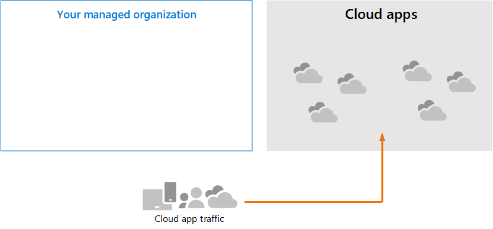

# Просмотрите требования к архитектуре и ключевые концепции для Microsoft Cloud App Security

**Область применения:**

- Microsoft 365 Defender

Эта статья [— шаг 1 из 3](eval-defender-mcas-overview.md) в процессе настройки среды оценки для Microsoft Cloud App Security вместе с Microsoft 365 Defender. Дополнительные сведения об этом процессе см. в статье [обзор.](eval-defender-identity-overview.md)

Перед включением Microsoft Cloud App Security убедитесь, что вы понимаете архитектуру и можете соответствовать требованиям. 

## Знакомство с архитектурой

Microsoft Cloud App Security является брокером безопасности облачного доступа (CASB). CasBs действует привратником для брокерского доступа в режиме реального времени между корпоративными пользователями и облачными ресурсами, которые они используют, где бы ваши пользователи ни находились и независимо от используемого ими устройства. Microsoft Cloud App Security интегрируется с возможностями безопасности Майкрософт, включая Microsoft 365 Defender. 

Без Cloud App Security облачные приложения, используемые вашей организацией, неувядаемы и незащищены, как показано на рисунке.

На этом рисунке:
- Использование облачных приложений организацией не защищено и не защищено. 
- Это использование не относится к средствам защиты, достигнутым в управляемой организации. 

#### Обнаружение облачных приложений

Первым шагом к управлению использованием облачных приложений является обнаружение облачных приложений, используемых вашей организацией. На следующей схеме показано, как облачные открытия работают с Cloud App Security.

На этом рисунке можно использовать два метода для мониторинга сетевого трафика и обнаружения облачных приложений, используемых вашей организацией.
- О. Обнаружение облачных приложений интегрируется с Microsoft Defender для конечной точки. Defender for Endpoint сообщает о облачных приложениях и службах, к которым можно получить доступ с ИТ-Windows 10 устройств. 
- B. Для покрытия на всех устройствах, подключенных к сети, Cloud App Security регистратор журнала устанавливается на брандмауэры и другие прокси для сбора данных с конечных точек. Эти данные отправляются в Cloud App Security для анализа.

#### Управление облачными приложениями

После обнаружения облачных приложений и анализа поведения, используемого организацией, можно приступить к управлению облачными приложениями, которые вы выбираете. 

В этой иллюстрации:
- Некоторые приложения являются санкционными для использования. Это простой способ начала управления приложениями.
- Вы можете включить большую видимость и управление, подключив приложения к соединителям приложений. Соединители приложений используют API поставщиков приложений.

#### Применение элементов управления сеансами к облачным приложениям

Microsoft Cloud App Security служит обратным прокси-сервером, обеспечивая прокси-доступ к санкционным облачным приложениям. Это позволяет Cloud App Security элементы управления сеансами, которые вы настраиваете. 

В этой иллюстрации:
- Доступ к санкционным облачным приложениям от пользователей и устройств в организации проходит через Cloud App Security.
- Этот прокси-доступ позволяет применять элементы управления сеансами.
- Облачные приложения, которые не были санкционными или явно несанкционными, не затронуты.

Элементы управления сеансами позволяют применять параметры к облачным приложениям, используемым вашей организацией. Например, если ваша организация использует Salesforce, можно настроить политику сеансов, которая позволяет только управляемым устройствам получать доступ к данным организации в Salesforce. Более простым примером может быть настройка политики для мониторинга трафика с неугомонные устройства, чтобы можно было проанализировать риск этого трафика, прежде чем применять более строгие политики.

#### Интеграция с Azure AD с управлением приложениями условного доступа

Возможно, в клиент Azure AD уже добавлены приложения SaaS для обеспечения многофакторной проверки подлинности и других политик условного доступа. Microsoft Cloud App Security интегрируется с Azure AD. Все, что вам нужно сделать, это настроить политику в Azure AD, чтобы использовать управление приложениями условного доступа в Cloud App Security. Этот маршрут сетевой трафик для этих управляемых приложений SaaS Cloud App Security как прокси, что позволяет Cloud App Security отслеживать этот трафик и применять элементы управления сеансами. 

В этой иллюстрации:
- Приложения SaaS интегрированы с клиентом Azure AD. Это позволяет Azure AD применять политики условного доступа, включая многофакторную проверку подлинности.
- Политика добавляется в Azure Active Directory для прямого трафика для приложений SaaS для Cloud App Security. Политика определяет, к как приложениям SaaS применять эту политику. Следовательно, после того, как Azure AD применяет все политики условного доступа, применимые к этим приложениям SaaS, Azure AD направляет (прокси) трафик сеанса через Cloud App Security.
- Cloud App Security отслеживает этот трафик и применяет все политики управления сеансами, настроенные администраторами. 

Возможно, вы обнаружили и санкционировали облачные приложения с Cloud App Security, которые не были добавлены в Azure AD. Вы можете воспользоваться преимуществами управления приложениями условного доступа, добавив эти облачные приложения в клиента Azure AD и область ваших правил условного доступа.

#### Защита организации от хакеров

Cloud App Security обеспечивает мощную защиту самостоятельно. Однако, в сочетании с другими возможностями Microsoft 365 Defender, Cloud App Security предоставляет данные в общие сигналы, которые вместе помогают остановить атаки.

Эту иллюстрацию стоит повторить из обзора в Microsoft 365 Defender и руководства по пилотной оценке. 

Фокусившись на правой стороне этой иллюстрации, Microsoft Cloud App Security замечает аномальное поведение, такое как невозможное путешествие, доступ к учетным данным и необычная загрузка, доля файлов или действия пересылания почты, и сообщает об этом группе безопасности. Следовательно, Cloud App Security позволяет предотвратить откаты от хакеров и эксфильтрации конфиденциальных данных. Microsoft 356 Defender сопоставляет сигналы из всех компонентов, чтобы предоставить полную версию атаки.

## Понимание ключевых понятий

В следующей таблице определены ключевые понятия, которые важны для понимания при оценке, настройке и развертывании Microsoft Cloud App Security.

|Понятие  |Описание |Дополнительная информация  |
|---------|---------|---------|
| Cloud App Security Панель мониторинга | Представляет обзор наиболее важных сведений о вашей организации и дает ссылки на более глубокое исследование.        | [Работа с панелью мониторинга ](/cloud-app-security/daily-activities-to-protect-your-cloud-environment)       |
| Элемент управления условным доступом приложений    | Обратная архитектура прокси, которая интегрируется с поставщиком удостоверений (IdP), чтобы предоставить политикам условного доступа Azure AD и выборочно применять элементы управления сеансами.        |  [Защита приложений с помощью Microsoft Cloud App Security управления приложениями условного доступа](/cloud-app-security/proxy-intro-aad)       |
|  Каталог облачных приложений   | Каталог облачных приложений предоставляет полную картину с каталогом Microsoft более 16 000 облачных приложений, которые ранжируются и засвечены на основе более чем 80 факторов риска.    |  [Работа с оценками рисков приложения](/cloud-app-security/risk-score)       |
| Панель мониторинга обнаружения облаков    | Cloud Discovery анализирует журналы трафика и предназначен для получения дополнительных данных об используемых облачных приложениях в организации, а также оповещения и уровней риска.     |  [Работа с обнаруженными приложениями   ](/cloud-app-security/discovered-apps)    |
|Подключенные приложения |Cloud App Security обеспечивает пусковую защиту подключенных приложений с помощью интеграции облака в облако, соединители API, а также средства управления доступом и сеансами в режиме реального времени с использованием элементов управления условным доступом к приложениям. |[Защита подключенных приложений](/cloud-app-security/protect-connected-apps) |
| | | |

## Проверка требований к архитектуре

### Обнаружение облачных приложений

Чтобы найти облачные приложения, используемые в среде, можно сделать одно или оба следующих:

- Быстро встать и работать с cloud Discovery, интегрируясь с Microsoft Defender для конечной точки. Эта нативная интеграция позволяет сразу же приступить к сбору данных по облачному трафику на Windows 10 устройствах, в сети и вне ее.
- Чтобы узнать все облачные приложения, доступ к которые доступны на всех устройствах, подключенных к сети, разместите Cloud App Security журнала на брандмауэрах и других прокси-экранах. Это собирает данные из конечных точек и отправляет их в Cloud App Security для анализа. Cloud App Security интегрируется с некоторыми сторонними прокси для еще большего потенциала.

Эти параметры включены в [шаг 2. Включить среду оценки.](eval-defender-mcas-enable-eval.md) 

### Применение политик условного доступа Azure AD к облачным приложениям

Управление приложениями условного доступа (возможность применения политик условного доступа к облачным приложениям) требует интеграции с Azure AD. Это не является требованием для начала работы с Cloud App Security. Это шаг, который мы рекомендуем вам попробовать на пилотном этапе — [шаг 3. Пилотные Microsoft Cloud App Security](eval-defender-mcas-pilot.md).

## Интеграция SIEM

Вы можете интегрировать Microsoft Cloud App Security с общим сервером SIEM или с Azure Sentinel, чтобы включить централизованный мониторинг оповещений и действий из подключенных приложений. 

Кроме того, Azure Sentinel включает соединитель Microsoft Cloud App Security, чтобы обеспечить более глубокую интеграцию с Azure Sentinel. Это позволяет не только получать видимость в облачных приложениях, но и получать сложные аналитические данные для выявления и борьбы с киберугрозами и контроля за перемещениями данных.

- [Интеграция общего решения SIEM](/cloud-app-security/siem)
- [Поток оповещений и журналов облачного обнаружения из MCAS в Azure Sentinel](/azure/sentinel/connect-cloud-app-security)

### Дальнейшие действия

Шаг 2 из 3. [Включить среду оценки для Microsoft Cloud App Security](eval-defender-mcas-enable-eval.md)

Возвращайся к обзору [для Оценки Microsoft Cloud App Security](eval-defender-mcas-overview.md)

Возвращайся к обзору [для оценки и пилотных Microsoft 365 Defender](eval-overview.md)