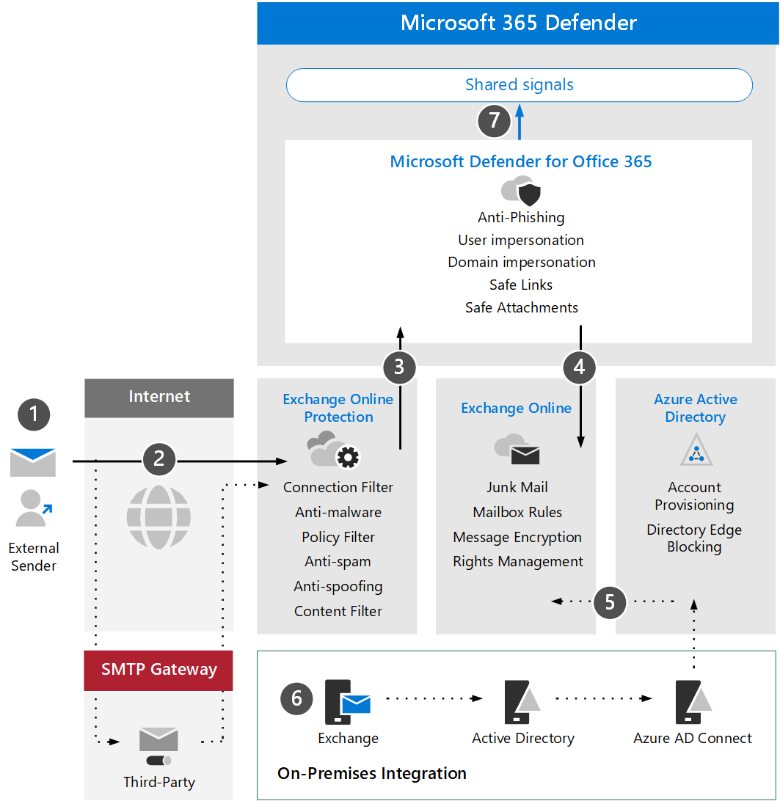

# Просмотрите Microsoft Defender для Office 365 архитектуры и ключевых концепций

**Область применения:**
- Microsoft 365 Defender

Эта статья — [шаг 1 из 3](eval-defender-office-365-overview.md) в процессе настройки среды оценки для Microsoft Defender для Office 365. Дополнительные сведения об этом процессе см. в статье [обзор.](eval-defender-office-365-overview.md)

Прежде чем включить defender для Office 365, убедитесь, что вы понимаете архитектуру и можете соответствовать требованиям. В этой статье описываются архитектура, ключевые концепции и необходимые условия, Exchange Online среды.

## Знакомство с архитектурой

На следующей схеме иллюстрируется базовая архитектура microsoft Defender для Office, которая может включать сторонний шлюз SMTP или локальной интеграции. Сценарии гибридного сосуществования (например, почтовые ящики производства являются локальной и сетевой) требуют более сложных конфигураций и не охватываются в этой статье или руководстве по оценке.

В следующей таблице описана эта иллюстрация.

|Вызов  |Описание  |
|---------|---------|
|1     | Хост-сервер для внешнего отправитель обычно выполняет общедоступный DNS-просмотр записи MX, которая обеспечивает целевой сервер для передачи сообщения.  Это направление может быть Exchange Online (EXO) непосредственно или шлюз SMTP, настроенный для ретрансляции с EXO.  |
|2     | Exchange Online Protection ведет переговоры и проверяет входящие подключения и проверяет заглавные главы и содержимое сообщений, чтобы определить, какие дополнительные политики, теги или обработка необходимы.  |
|3     | Exchange Online интегрируется с Microsoft Defender для Office 365, чтобы предложить более современные средства защиты от угроз, смягчения последствий и устранения последствий. |
|4      | Сообщение, которое не является вредоносным, заблокированным или карантиным, обрабатывается и доставляется получателю в EXO, где оцениваются и запускаются предпочтения пользователей, связанные с нежелательной почтой, правилами почтовых ящиков или другими настройками. |
|5      | Интеграция с локальной службой Active Directory может быть включена с помощью Azure AD Подключение для синхронизации и предоставления объектов и учетных записей с поддержкой почты для Azure Active Directory и Exchange Online. |
|6      | При интеграции локальной среды настоятельно рекомендуется использовать сервер Exchange для поддерживаемого управления и администрирования связанных с почтой атрибутов, параметров и конфигураций. |
|7      | Microsoft Defender для Office 365 передает сигналы Microsoft 365 Defender для расширенного обнаружения и ответа (XDR).|

Интеграция на локальной основе является обычной, но необязательной. Если среда является облачной, это руководство также будет работать для вас.

## Понимание ключевых понятий

В следующей таблице определены ключевые понятия, которые важны для понимания при оценке, настройке и развертывании MDO.

|Понятие  |Описание |Дополнительная информация  |
|---------|---------|---------|
|Exchange Online Protection      |    Exchange Online Protection (EOP) — это облачная служба фильтрации, которая помогает защитить организацию от нежелательной почты и вредоносных программ. EOP включен во все лицензии Microsoft 365, которые включают Exchange Online.     |   [Обзор Exchange Online Protection](../office-365-security/exchange-online-protection-overview.md)      |
|Защита от вредоносных программ     |    Организации с почтовыми ящиками в EXO автоматически защищены от вредоносных программ.     |  [Защита от вредоносных программ в EOP](../office-365-security/anti-malware-protection.md)       |
|Защита от нежелательной почты     |   Организации с почтовыми ящиками в EXO автоматически защищены от нежелательной почты и политик нежелательной почты.      |  [Защита от нежелательной почты в EOP](../office-365-security/anti-spam-protection.md)       |
|Защита от фишинга |  MDO предлагает более продвинутую защиту от фишинга, связанную с фишингом, китобойным промыслом, вымогателями и другими вредоносными действиями.   | [Дополнительная защита от фишинга в Microsoft Defender для Office 365](../office-365-security/anti-phishing-protection.md)   |
|Защита от спуфинга     |   EOP включает функции, которые помогут защитить организацию от поддельных (поддельных) отправителей.      |   [Защита от спуфинга в EOP](../office-365-security/anti-spoofing-protection.md)      |
|Безопасные вложения     |   Сейф Вложения обеспечивают дополнительный уровень защиты с помощью виртуальной среды для проверки и "детонации" вложений в сообщениях электронной почты перед их доставкой.      |   [Сейф Вложения в Microsoft Defender для Office 365](../office-365-security/safe-attachments.md)      |
|Сейф вложения для SharePoint, OneDrive и Microsoft Teams     |    Кроме того, Сейф вложения для SharePoint, OneDrive и Microsoft Teams предоставляет дополнительный уровень защиты файлов, которые были загружены в хранилища облачного хранения.     |  [Безопасные вложения для SharePoint, OneDrive и Microsoft Teams](../office-365-security/mdo-for-spo-odb-and-teams.md)       |
|Безопасные ссылки     | Сейф Ссылки — это функция, которая обеспечивает сканирование и переописывание URL-адресов в входящие сообщения электронной почты и предлагает проверку этих ссылок перед их доставкой или нажатием кнопки.        |   [Сейф Ссылки в Microsoft Defender для Office 365](../office-365-security/safe-links.md)      |
|    |         |         |

Дополнительные сведения о возможностях, включенных в Microsoft Defender для Office, см. в описании службы [Microsoft Defender для Office 365.](/office365/servicedescriptions/office-365-advanced-threat-protection-service-description)

## Проверка требований к архитектуре
Успешная оценка MDO или пилотное производство предполагает следующие предварительные требования:
- Все почтовые ящики получателей в настоящее время находятся в Exchange Online.
- Публичная запись MX решается непосредственно на EOP или на сторонний шлюз SMTP, который передает входящий внешний адрес электронной почты непосредственно в EOP.
- Основной домен электронной почты настроен как *авторитетный* в Exchange Online.
- Вы успешно развернули и *настроили блокирование* края на основе каталога (DBEB) по мере необходимости. Дополнительные сведения см. в статье [Использование пограничной блокировки на основе каталогов для отклонения сообщений, отправленных недопустимым получателям](/exchange/mail-flow-best-practices/use-directory-based-edge-blocking).

> [!IMPORTANT]
> Если эти требования не применимы или вы все еще находитесь в сценарии гибридного сосуществования, то для оценки Microsoft Defender для Office 365 может потребоваться более сложные или расширенные конфигурации, которые не полностью охвачены в этом руководстве.

## Интеграция SIEM

Вы можете интегрировать Microsoft Defender для Office 365 Azure Sentinel для более полного анализа событий безопасности в организации и создания книг для эффективного и быстрого реагирования. Дополнительные сведения см. [в Подключение из Microsoft Defender для Office 365.](/azure/sentinel/connect-office-365-advanced-threat-protection)

Microsoft Defender для Office 365 также может быть интегрирован в другие решения по управлению сведениями о безопасности и событиями (SIEM) с помощью API управления Office 365 [действий.](/office/office-365-management-api/office-365-management-activity-api-reference)

## Дальнейшие действия

Шаг 2 из 3. [Включить среду оценки Microsoft Defender для Office 365](eval-defender-office-365-enable-eval.md)

Вернись к обзору [для Оценки Microsoft Defender для Office 365](eval-defender-office-365-overview.md)

Возвращайся к обзору [для оценки и пилотных Microsoft 365 Defender](eval-overview.md) 

