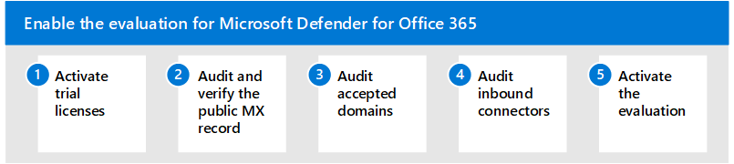

# Включить среду оценки

**Область применения:**
- Microsoft 365 Defender

Эта статья — [шаг 2 из 3](eval-defender-office-365-overview.md) в процессе настройки среды оценки для Microsoft Defender для Office 365. Дополнительные сведения об этом процессе см. в статье [обзор.](eval-defender-office-365-overview.md)

Используйте следующие действия, чтобы включить оценку для Microsoft Defender для Office 365.

- [Шаг 1. Активация пробных лицензий](#step-1-activate-trial-licenses)
- [Шаг 2. Аудит и проверка общедоступных записей MX](#step-2-audit-and-verify-the-public-mx-record)
- [Шаг 3. Аудит принятых доменов](#step-3-audit-accepted-domains)
- [Шаг 4. Входящие соединители аудита](#step-4-audit-inbound-connectors)
- [Шаг 5. Активация оценки](#step-5-activate-the-evaluation)

## Шаг 1. Активация пробных лицензий

Войдите в существующий microsoft Defender для Office 365 среды или портала администрирования клиентов.

1. Перейдите на портал администрирования.
2. Выберите службы покупки при быстром запуске.

:::image type=&quot;content&quot; source=&quot;../../media/mdo-eval/1_m365-purchase-services.png&quot; alt-text=&quot;Щелкните Службы покупки на области навигации Office 365.&quot;:::

3.  Прокрутите вниз в Add-On (или найдите &quot;Defender"), чтобы найти microsoft Defender для Office 365 планов.
4.  Щелкните Подробные сведения далее по плану, который необходимо оценить.

:::image type="content" source="../../media/mdo-eval/2_mdo-eval-license-details.png" alt-text="Нажмите кнопку &quot;Сведения&quot; далее.":::

5. Щелкните *бесплатную пробную ссылку Начните.*

:::image type="content" source="../../media/mdo-eval/3-m365-purchase-button.png" alt-text="Нажмите кнопку Начните бесплатную пробную пробную ссылку *hyperlink* на этой панели.":::

6. Подтвердите запрос и нажмите *кнопку Try now.*

:::image type="content" source="../../media/mdo-eval/4_mdo-trial-order.png" alt-text="Теперь нажмите кнопку Try now *button*.":::

## Шаг 2. Аудит и проверка общедоступных записей MX

Чтобы эффективно оценить microsoft Defender для Office 365, важно, чтобы входящие внешние сообщения электронной почты ретранслируются через экземпляр Exchange Online Protection (EOP), связанный с клиентом.

1. Войдите на портал администратора M365, Параметры и выберите домены.
2. Выберите проверенный домен электронной почты и нажмите кнопку Управление DNS.
3. Обратите внимание на запись MX, созданную и назначенную вашему клиенту EOP.
4. Обратитесь к внешней (публичной) DNS-зоне и проверьте основную запись MX, связанную с доменом электронной почты.
    - Если ваша публичная запись MX в настоящее время соответствует назначенного *EOP-адресу (например, tenant-com.mail.protection.outlook.com),* никаких дополнительных изменений маршрутов не требуется.
    - Если ваша публичная запись MX в настоящее время решается на сторонний или локальной шлюз SMTP, могут потребоваться дополнительные конфигурации маршрутов.
    - Если ваша публичная запись MX в настоящее время решается на локальное Exchange, вы все равно можете оказаться в гибридной модели, в которой некоторые почтовые ящики получателей еще не были перенесены в EXO.

## Шаг 3. Аудит принятых доменов

1. Войдите на портал администратора Exchange Online, выберите почтовые Flow и нажмите кнопку "Принятые домены".
2. Из списка принятых доменов, которые были добавлены и проверены в клиенте, обратите внимание на тип домена **для** основного домена электронной почты.
    - Если тип домена забит до ***"Авторитетный",*** предполагается, что все почтовые ящики получателей для вашей организации в настоящее время находятся в Exchange Online.
    - Если тип домена настроен на ***внутреннюю*** ретрансляцию, вы все равно можете находиться в гибридной модели, в которой некоторые почтовые ящики получателей по-прежнему находятся на месте.

## Шаг 4. Входящие соединители аудита

1. Войдите на портал администратора Exchange Online, выберите почтовые Flow и нажмите соединители.
2. Из списка настроенных соединитений обратите внимание на любые записи, которые находятся в партнерской организации и могут соотноситься с сторонним шлюзом SMTP. 
3. Из списка настроенных соединитений обратите внимание на  все записи, помеченные на сервере электронной почты вашей организации, которые могут указывать на то, что вы все еще находитесь в гибридном сценарии.

## Шаг 5. Активация оценки

Используйте инструкции, чтобы активировать microsoft Defender для Office 365 оценки с Microsoft 365 Defender портала.

1. Войдите в клиент с учетной записью, которая имеет доступ к Microsoft 365 Defender порталу.
2. Выберите, хотите ли вы сделать портал **Microsoft 365 Defender** интерфейсом по умолчанию для Microsoft Defender для Office 365 администрирования (рекомендуется).

:::image type="content" source="../../media/mdo-eval/1_mdo-eval-activate-eval.png" alt-text="Нажмите кнопку Включайте параметры, чтобы использовать централизованный и улучшенный Microsoft 365 Defender для администрирования.":::

3. В меню навигации выберите **Правила & в** статье Email & *collaboration*.

:::image type="content" source="../../media/mdo-eval/2_mdo-eval-activate-eval.png" alt-text="Вот изображение меню & электронной почты, указывав на правила политики &. Щелкните это!":::

4. На панели *мониторинга & правил нажмите* **кнопку Политики угрозы**.

:::image type="content" source="../../media/mdo-eval/3_mdo-eval-activate-eval.png" alt-text="Изображение панели мониторинга & правил политики и стрелки, указывав на политики угрозы. Нажмите кнопку далее!":::

5. Прокрутите вниз *до дополнительных политик* и выберите защитник **оценки для Office 365** плитки.

:::image type="content" source="../../media/mdo-eval/4_mdo-eval-activate-eval.png" alt-text="Плитка Eval Defender для Office 365, которая говорит, что это 30-дневная пробная версия по всем векторам совместной & электронной почты. Щелкните.":::

6. Теперь выберите, будут ли внешние маршруты электронной почты Exchange Online напрямую или на сторонний шлюз или службу, и нажмите кнопку Далее.

:::image type="content" source="../../media/mdo-eval/5_mdo-eval-activate-eval.png" alt-text="Defender for Office 365 оценит отправку почты в Exchange Online почтовые ящики. Укажете сведения о маршруте рассылки почты в настоящее время, включая имя исходящие соединители, которые маршрутизовываю вашу почту. Если вы используете Exchange Online Protection (EOP), у вас не будет соединителю. Выберите один из них, в который я использую поставщика 3rd-party или локального поставщика, или я использую только EOP.":::

7. Если используется сторонний шлюз, выберите имя поставщика из отката вместе с входящий соединителей, связанных с этим решением. После перечисления ответов нажмите кнопку Далее.

:::image type="content" source="../../media/mdo-eval/6-mdo-eval-activate-eval-settings.png" alt-text="В этом диалоговом окте вы выбираете службу поставщика 3rd-party, используемую организацией, или выберите *Other*. В следующем диалоговом окне выберите входящий соединитель. Затем нажмите кнопку Далее.":::

8. Просмотрите параметры и нажмите **кнопку Создать оценку.**

|  |  |
|---------|---------|
|  :::image type="content" source="../../media/mdo-eval/7-mdo-eval-activate-review.png" alt-text="В этой области есть отсев для просмотра параметров. Он также имеет щелкаемую ссылку на изменение типа маршрутивки, если это необходимо. Когда вы будете готовы, нажмите кнопку большая голубая кнопка Создание оценки.":::   |   :::image type="content" source="../../media/mdo-eval/8-mdo-eval-activate-complete.png" alt-text="И теперь настройка завершена. На синей кнопке на этой странице написано &quot;Перейти к оценке&quot;.":::      |

## Дальнейшие действия

Шаг 3 из 3. Настройка пилотного проекта для Microsoft Defender для Office 365

Вернись к обзору [для Оценки Microsoft Defender для Office 365](eval-defender-office-365-overview.md)

Возвращайся к обзору [для оценки и пилотных Microsoft 365 Defender](eval-overview.md)