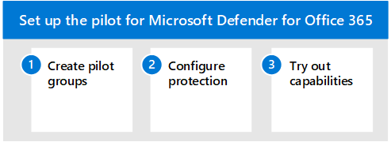

# Пилотный microsoft Defender для Office 365
**Область применения:**
- Microsoft 365 Defender

Эта статья — [шаг 3 из 3](eval-defender-office-365-overview.md) в процессе настройки среды оценки для Microsoft Defender для Office 365. Дополнительные сведения об этом процессе см. в статье [обзор.](eval-defender-office-365-overview.md)

Чтобы настроить пилотный пилот для Microsoft Defender для Office 365, используйте следующие действия.

- [Шаг 1. Создание пилотных групп](#step-1-create-pilot-groups)
- [Шаг 2. Настройка защиты](#step-2-configure-protection)
- [Шаг 3. Ознакомьтесь с возможностями моделирования, мониторинга и метрик](#step-3-try-out-capabilities--get-familiar-with-simulation-monitoring-and-metrics)

При оценке microsoft Defender для Office 365 вы можете пилотных конкретных пользователей, прежде чем включите и примените политики для всей организации. Создание групп рассылки поможет управлять процессами развертывания. Например, создайте группы, такие как *Defender для пользователей Office 365 - Стандартная* защита, Defender для Office 365 Пользователей *-* Строгая защита, Defender для Office 365 *Пользователей -* Настраиваемая защита или Defender для Office 365 Пользователей *-* Исключения .

Возможно, не ясно, почему термины "Standard" и "Strict" являются терминами, используемыми для этого, но это станет понятно при изучении дополнительных предустанавок defender для Office 365 безопасности. Именующие группы "настраиваемые" и "исключения" говорят сами за себя,  и хотя большинство пользователей должны подпадать под стандартные и строгие, настраиваемые группы и группы исключений будут собирать ценные для вас данные об управлении рисками.

## Шаг 1. Создание пилотных групп

Группы рассылки можно создавать и определять непосредственно в Exchange Online или синхронизировать из локального Active Directory.

1. Logon Exchange Центр администрирования (EAC) с помощью учетной записи, которая была предоставлена роль администратора получателя или делегирована разрешения на управление группой.
2. Из меню навигации расширь *получателей* и выберите *Группы.*

:::image type="content" source="../../media/mdo-eval/1_mdo-eval-pilot.png" alt-text="Exchange центра администрирования в меню навигации (быстрый запуск) со стрелкой, указываемой на Группы. Щелкните Группы.":::

3. На панели мониторинга Групп выберите "Добавить группу".

:::image type="content" source="../../media/mdo-eval/2_mdo-eval-pilot-add-group.png" alt-text="Добавление групп на панели Groups.":::

4. Для группового типа выберите *Распределение и* нажмите кнопку Далее.

:::image type="content" source="../../media/mdo-eval/3-mdo-eval-pilot-group-type.png" alt-text="Выберите тип группы рассылки здесь.":::

5. Дайте группе имя и описание, а затем нажмите кнопку Далее.

:::image type="content" source="../../media/mdo-eval/4_mdo-eval-pilot-set-up-basics.png" alt-text="Имя и описание группы.":::

## Шаг 2. Настройка защиты

Некоторые возможности в Defender для Office 365 настраиваются и включаются по умолчанию, но для операций безопасности может потребоваться повысить уровень защиты от по умолчанию.

Некоторые возможности еще *не* настроены. У вас есть три варианта настройки защиты:

- **Назначать** заранее заранее задатки политики безопасности автоматически [—](../office-365-security/preset-security-policies.md) политики безопасности предустановки предоставляются в качестве метода, чтобы быстро назначить единый уровень защиты во всех возможностях. Вы можете выбрать **_стандартный_*_ или _*_строгий_**. Хороший подход заключается в том, чтобы начать с заранее настроив политики по мере того, как вы узнаете больше о возможностях и собственной уникальной среде угроз. Преимущество здесь заключается в том, что вы защищаете группы пользователей как можно быстрее, с возможностью настройки защиты после этого. (Рекомендуется этот метод.)
- **Настройка базовой** защиты вручную . Если вы предпочитаете самостоятельно настраивать среду, вы можете быстро достичь базового уровня защиты, следуя указаниям в [Protect against threats.](../office-365-security/protect-against-threats.md)  С помощью этого подхода вы узнаете больше о настраиваемых параметрах. И, конечно, вы можете отладить политики позже.
- **Настройка *настраиваемых* политик защиты** — в рамках оценки можно также создавать и назначать настраиваемые политики защиты. Прежде чем приступить к настройке политик, важно понять приоритет, в котором применяются и применяются эти политики защиты. Для определения политик безопасности для Сейф ссылок и Сейф вложений потребуется создать некоторые политики, даже если будет применена предустановка.

> [!IMPORTANT]
> **Если вам нужно** настроить настраиваемые политики защиты, необходимо изучить  значения,  которые составляют стандартные и строгие определения безопасности здесь: Рекомендуемые параметры *[для EOP](../office-365-security/recommended-settings-for-eop-and-office365.md)* и Microsoft Defender для Office 365 безопасности . По умолчанию также перечислены значения по умолчанию, как видно перед любой конфигурацией. Храните таблицу, на которой отклоняется настраиваемая сборка.

### Назначение предустановленных политик безопасности

Рекомендуется начать с рекомендуемых  базовых политик при оценке MDO, а затем уточнить их по мере необходимости в течение периода оценки.

Вы можете быстро включить рекомендуемые политики защиты Office 365 EOP и Defender и назначить их определенным пилотным пользователям или определенным группам в рамках оценки. Предустановленные политики предлагают базовый **стандартный** шаблон защиты или более агрессивный шаблон **строгой** защиты, который можно самостоятельно или комбинировать.

Ниже данная статья посвящена политикам безопасности предустановки в [EOP и Microsoft Defender для](../office-365-security/preset-security-policies.md) Office 365 с измеримые действия.

1. Войдите в Microsoft 365 клиента. Используйте учетную запись с доступом к порталу Microsoft 365 Defender, добавленной к роли управления организацией в Office 365 или роли администратора безопасности в Microsoft 365.
2. В меню навигации выберите *Правила & правила* электронной почты & совместной работы.

:::image type="content" source="../../media/mdo-eval/5_mdo-eval-pilot-policies.png" alt-text="В статье Email & совместной работы на панели навигации щелкните Политики & правила.":::

3. На панели & правил политики нажмите *кнопку Политики угрозы*.

:::image type="content" source="../../media/mdo-eval/6-mdo-eval-pilot-threat-policies.png" alt-text="a":::

4. С портала Microsoft 365 Defender развяжите управление угрозами из меню навигации и выберите Политику из подмену.
5. На панели мониторинга политики щелкните *предустановленные политики безопасности.*

:::image type="content" source="../../media/mdo-eval/7-mdo-eval-pilot-template-policies.png" alt-text="Щелкните плитку предустановленных политик безопасности.":::

6. Нажмите *кнопку Изменить,* чтобы настроить и назначить политику Standard and/or Strict. :::image type="content" source="../../media/mdo-eval/8-mdo-eval-pilot-preset.png" alt-text="На панели предустановленных политик безопасности нажмите кнопку Изменить.":::
7. Добавьте условия для применения базовых ***защиты EOP** _ для определенных пилотных пользователей или групп пользователей, если это необходимо, и выберите _Next* для продолжения.
    - Например, условие Defender для Office 365 для пилотных оценок может применяться, если получатели являются членами определенной группы Defender *для Office 365 Standard Protection,* а затем управляются путем простого добавления учетных записей в группу или удаления учетной записи. 
 :::image type="content" source="../../media/mdo-eval/9-mdo-eval-pilot-eop-protections.png" alt-text="Добавьте условия, необходимые для применения уровня безопасности EOP в пилотной группе.":::

8. Добавьте условия для применения базовых ***MDO** _ защиты для определенных пилотных пользователей или групп пользователей, если это необходимо. Щелкните _Next* для продолжения.
    - Например, условие Defender для Office 365 для пилотных оценок может применяться,  если получатели являются членами определенной группы *Defender для Office 365 Standard Protection,* а затем управляются путем простого добавления и удаления учетных записей через группу.
  :::image type="content" source="../../media/mdo-eval/10-mdo-eval-pilot-mdo-protections.png" alt-text="Добавьте условия, необходимые для применения defender для Office 365 уровня безопасности в пилотной группе.":::

9. Просмотрите и подтвердите свои изменения при назначении заранее задающих политик безопасности.
10. Политики предварительной защиты можно управлять (повторно настраивать, применять, отключать и т. д.), возвращаясь на портал Microsoft 365 Defender > Политики & правила > политики угроз > и щелкнув плитку политик безопасности *preset.*

### Настройка настраиваемых политик защиты

Заранее определенные шаблоны политик *Standard* или *Strict* Defender для Office 365 дают пилотным пользователям рекомендуемую базовую защиту. Однако в рамках оценки можно также создать и назначить настраиваемые политики защиты.

Важно помнить *о* приоритете, которое эти политики защиты принимают при применении и применении, как порядок и приоритет защиты электронной почты, [- Office 365](../office-365-security/how-policies-and-protections-are-combined.md) поясняется.

В приведенной ниже таблице приведены ссылки и дополнительные рекомендации по настройке и назначению настраиваемых политик защиты:

|Политика   |Описание  |Справочные материалы  |
|:---------:|---------|---------|
|Фильтрация подключений     |    Определите хорошие или плохие исходные серверы электронной почты по ИХ IP-адресам.     |     [Настройка политики фильтра подключения по умолчанию в EOP](../office-365-security/configure-the-connection-filter-policy.md)    |
|Функции защиты от вредоносных программ    |    Защитите пользователей от вредоносных программ электронной почты, в том числе о том, какие действия необходимо принять и кого уведомить об обнаружении вредоносных программ.     |    [Настройка политик по борьбе с вредоносными программами в EOP](../office-365-security/configure-anti-malware-policies.md)     |
|Anti-Spoofing     |  Защита пользователей от попыток подмены с помощью сведений о подмене и подмены сведений.   |     [Настройка подмены сведений в Defender для Office 365](../office-365-security/learn-about-spoof-intelligence.md)    |
|Anti-Spam     |    Защита пользователей от нежелательной почты, включая действия, которые необходимо принять в случае обнаружения нежелательной почты.     |    [Настройка политик по борьбе со спамом в Defender для Office 365](../office-365-security/configure-your-spam-filter-policies.md)     |
|Anti-Phishing     |   Защита пользователей от фишинговых атак и настройка советов по безопасности подозрительных сообщений      |     [Настройка политик защиты от фишинга в Microsoft Defender для Office 365](../office-365-security/configure-mdo-anti-phishing-policies.md)    |
|Безопасные вложения     |    Защита пользователей от вредоносного контента в вложениях и файлах электронной почты в SharePoint, OneDrive и Teams.     |    [Настройка политик безопасного вложения в Defender для Office 365](../office-365-security/set-up-safe-attachments-policies.md)     |
|Безопасные ссылки     |     Защита пользователей от открытия и обмена вредоносными ссылками в сообщениях электронной почты или Office настольных приложениях.    |    [Настройка политик безопасных ссылок в Defender для Office 365](../office-365-security/set-up-safe-links-policies.md)     |

## Шаг 3. Ознакомьтесь с возможностями моделирования, мониторинга и метрик

Теперь, когда пилот настроен и настроен, полезно ознакомиться с средствами моделирования отчетов, мониторинга и атак, уникальными для Microsoft Defender для Microsoft 365.

|Возможность  |Описание  |Дополнительная информация  |
|---------|---------|---------|
|Обозреватель угроз     | Обозреватель угроз — это мощное средство в режиме реального времени, помогая группам по операциям безопасности расследовать угрозы и реагировать на них, а также отображать сведения о подозрительных вредоносных программах и фишинге в электронной почте и файлах в Office 365, а также другие угрозы и риски для вашей организации.        | [Представления в Обозревателе угроз и обнаружения в режиме реального времени ](../office-365-security/threat-explorer-views.md)       | 
|Эмулятор атак     | Вы можете использовать обучение имитации атак на портале Microsoft Defender 365 для запуска реалистичных сценариев атак в организации, которые помогут вам определить и найти уязвимых пользователей до того, как реальная атака ударит по вашей среде.        |  [Симулятор атак в Microsoft Defender для Office 365](../office-365-security/attack-simulator.md)       |
|Панель мониторинга отчетов     | В левом меню навигации щелкните Отчеты и расширите заголовки & электронной почты. Отчеты о совместной работе & электронной почты о выявлении тенденций безопасности, некоторые из которых позволят вам принять меры (с помощью кнопок, таких как "Перейти к представлениям"), и другие, которые будут показывать тенденции, такие как сводка состояния mailflow, топ вредоносных программ, обнаружения Spoof, скомпрометированная пользователей, задержка почты, ссылки Сейф и Сейф вложения отчетов. Эти показатели создаются автоматически.  |    [Просмотр отчетов](../office-365-security/view-email-security-reports.md)     |

## Дальнейшие действия

[Microsoft Defender для конечной точки](eval-defender-endpoint-overview.md)

Вернись к обзору [для Оценки Microsoft Defender для Office 365](eval-defender-office-365-overview.md)

Возвращайся к обзору [для оценки и пилотных Microsoft 365 Defender](eval-overview.md)