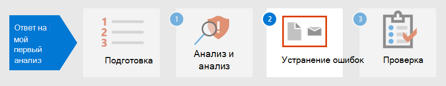

# Этап 1.Step 1. Анализ и анализ первого инцидентаTriage and analyze your first incident

[!INCLUDE [Microsoft 365 Defender rebranding](../includes/microsoft-defender.md)]

**Область применения:****Applies to:**
- Microsoft 365 DefenderMicrosoft 365 Defender

Потратив некоторое время на создание, реализацию и поддержание мер безопасности в соответствии со стандартами организации, вы можете настроить решения безопасности, которые помогут быстро определить риски и угрозы безопасности.As you spend some time establishing, implementing, and maintaining security measures according to the organization’s standards, you can set up security solutions to help you quickly identify security risks and threats. Microsoft 365 Defender позволяет обнаруживать, выявлять и расследовать инциденты с помощью единой области из стекла, где можно найти информацию, необходимую для принятия вовремя решений.Microsoft 365 Defender allows you to detect, triage, and investigate incidents through its single-pane-of-glass experience where you can find the information you need to make timely decisions. 

После обнаружения инцидента с безопасностью Microsoft 365 Defender представляет сведения, необходимые для определения или определения приоритетов инцидента или инцидентов над другими.Once a security incident is detected, Microsoft 365 Defender presents details you will need to triage or prioritize an incident or incidents over others. После определения приоритетов аналитики могут сосредоточиться на расследовании случаев, назначенных им.After determining prioritization, analysts can then focus their energy on investigating cases assigned to them.

## Обнаружение Microsoft 365 DefenderDetection by Microsoft 365 Defender

Microsoft 365 Defender получает оповещения и события из нескольких платформ безопасности Майкрософт в качестве источников обнаружения, чтобы создать целостную картину и контекст вредоносных действий.Microsoft 365 Defender receives alerts and events from multiple Microsoft security platforms as detection sources to create a holistic picture and context of malicious activity. Это возможные источники обнаружения:These are the possible detection sources:

- [Microsoft Defender для конечной](../defender-endpoint/microsoft-defender-endpoint.md) точки — это обнаружение и нейтрализация атак на конечные точки (EDR), использующее антивирус Microsoft Defender, а также облачную передовую защиту от угроз с помощью microsoft Security Graph.[Microsoft Defender for Endpoint](../defender-endpoint/microsoft-defender-endpoint.md) is an endpoint detection and response solution (EDR) that uses Microsoft Defender antivirus as well as cloud-enabled advanced threat protection using Microsoft Security Graph. Defender for Endpoint — это единая платформа для профилактической защиты, обнаружения нарушений, автоматического расследования и реагирования.Defender for Endpoint is a unified platform for preventative protection, post-breach detection, automated investigation, and response. Он защищает конечные точки от киберугроз, обнаруживает расширенные атаки и нарушения данных, автоматизирует инциденты с безопасностью и улучшает осанку безопасности.It protects endpoints from cyberthreats, detects advanced attacks and data breaches, automates security incidents, and improves security posture. 
- [Microsoft Defender for Identity](https://docs.microsoft.com/defender-for-identity/what-is) — это облачное решение безопасности, использующее внутренние сигналы Active Directory Domain Services (AD DS) для выявления, обнаружения и расследования расширенных угроз, скомпрометированных удостоверений и вредоносных действий инсайдеров, направленных на организацию.[Microsoft Defender for Identity](https://docs.microsoft.com/defender-for-identity/what-is) is a cloud-based security solution that uses your on-premises Active Directory Domain Services (AD DS) signals to identify, detect, and investigate advanced threats, compromised identities, and malicious insider actions directed at your organization. 
- [Microsoft Cloud App Security](https://docs.microsoft.com/cloud-app-security/) в качестве привратника для брокерского доступа в режиме реального времени между корпоративными пользователями и облачными ресурсами, которые они используют, где бы ваши пользователи ни находились и независимо от используемого ими устройства.[Microsoft Cloud App Security](https://docs.microsoft.com/cloud-app-security/) acts as a gatekeeper to broker access in real time between your enterprise users and the cloud resources they use, wherever your users are located and regardless of the device they are using. 
- [Microsoft Defender для Office 365](../office-365-security/overview.md) вашей организации от вредоносных угроз в сообщениях электронной почты, ссылках (URL-адресах) и средствах совместной работы.[Microsoft Defender for Office 365](../office-365-security/overview.md) safeguards your organization against malicious threats in email messages, links (URLs), and collaboration tools. 
- [Центр безопасности Azure](https://docs.microsoft.com/azure/security-center/security-center-introduction) — это единая система управления безопасностью инфраструктуры, которая укрепляет положение в области безопасности центров обработки данных и обеспечивает расширенные возможности защиты от угроз в гибридных рабочих нагрузках в облаке, а также на локальной основе.[Azure Security Center](https://docs.microsoft.com/azure/security-center/security-center-introduction) is a unified infrastructure security management system that strengthens the security posture of your data centers and provides advanced threat protection across your hybrid workloads in the cloud as well as on premises. 

В Microsoft 365 Defender [инциденты](incidents-overview.md) выявляются путем сопоставления оповещений из этих различных источников обнаружения.In Microsoft 365 Defender, [incidents](incidents-overview.md) are identified by correlating alerts from these different detection sources. Вместо того, чтобы тратить ресурсы, совмещающие или различая несколько оповещений в соответствующих инцидентах, вы можете начать с очереди инцидента в Microsoft 365 Defender сразу.Instead of spending resources stringing together or distinguishing multiple alerts into their respective incidents, you can start with the incident queue in Microsoft 365 Defender right away. Это позволяет эффективно порядок проверки инцидентов в конечных точках, удостоверениях, электронной почте и приложениях, а также уменьшить ущерб от атаки.This allows you to triage incidents in an efficient manner across endpoints, identities, email, and applications, and reduce the damage from an attack.

## Проверка инцидентовTriage your incidents

Реагирование на Microsoft 365 Defender начинается после того, как вы обнажайте список инцидентов с помощью рекомендуемого метода приоритетов вашей организации.Incident response in Microsoft 365 Defender starts once you triage the list of incidents using your organization’s recommended method of prioritization. Определение уровня важности или срочности для инцидентов, которые затем определяют порядок, в котором они будут расследоваться.To triage means to assign a level of importance or urgency to incidents, which then determines the order in which they will be investigated. 

Полезный пример руководства по определению приоритета инцидента в Microsoft 365 Defender можно суммировать по формуле: *Severity + Impact = Priority*.A useful sample guide for determining which incident to prioritize in Microsoft 365 Defender can be summarized by the formula: *Severity + Impact = Priority*. 

- **Серьезность** — это уровень, назначенный Microsoft 365 Defender и его интегрированные компоненты безопасности.**Severity** is the level designated by Microsoft 365 Defender and its integrated security components. 
- **Влияние** определяется организацией и обычно включает, но не ограничивается пороговое число пострадавших пользователей, устройств, служб, затронутых (или их сочетание) и даже типа оповещения.**Impact** is determined by the organization and generally includes, but not limited to, a threshold number of impacted users, devices, services affected (or a combination thereof), and even alert type. 

Затем аналитики инициируют исследования на основе критериев **приоритета,** установленных организацией.Analysts then initiate investigations based on the **Priority** criteria set by the organization.

Приоритеты инцидентов могут отличаться в зависимости от организации.Incident prioritization might vary depending on the organization. NIST рекомендует также учитывать функциональное и информационное влияние инцидента и возможность восстановления.NIST recommends also considering the functional and informational impact of the incident, and recoverability.  

Ниже приводится только один подход к триаджу:The following is just one approach to triage: 

1. Перейдите на [страницу инцидентов,](incidents-overview.md) чтобы инициировать триадж.Go to the [incidents](incidents-overview.md) page to initiate triage. Здесь вы можете увидеть список инцидентов, затрагивающих организацию.Here you can see a list of incidents affecting your organization. По умолчанию они расположены от самого последнего до самого старого инцидента.By default, they are arranged from the most recent to the oldest incident. Здесь также можно увидеть различные столбцы для каждого инцидента, показывающие их серьезность, категорию, количество активных оповещений и сущностями с влиянием.From here, you can also see different columns for each incident showing their severity, category, number of active alerts, and impacted entities, among others. Вы можете настроить набор столбцов и сортировать очереди инцидентов по некоторым этим столбцам, выбрав имя столбца.You can customize the set of columns and sort the incident queue by some these columns by selecting the column name. Вы также можете фильтровать очередь инцидента в соответствии с вашими потребностями.You can also filter the incident queue according to your needs. Полный список доступных фильтров см. в списке [Prioritize incidents.](incident-queue.md#available-filters)For a full list of available filters, see [Prioritize incidents](incident-queue.md#available-filters).
  
   :::image type="content" source="../../media/first-incident-analyze/first-incident-analyze-queue.png" alt-text="Пример очереди инцидента"::: 

    Один из примеров того, как можно выполнить триадж для этого набора инцидентов, — это уделяние приоритетов инцидентам, которые затронули больше пользователей и устройств.One example of how you might perform triage for this set of incidents is to prioritize incidents that affected more users and devices. В этом примере можно приоритизировать номер инцидента 6769, так как он затрагивает наибольшее число сущностями: 7 устройств, 6 пользователей и 2 почтовых ящика.In this example, you might prioritize incident ID 6769 because it affected the largest number of entities: 7 devices, 6 users, and 2 mailboxes. Кроме того, по всей видимости, в инциденте содержатся оповещения от Microsoft Defender for Identity, которые указывают на предупреждение на основе удостоверений и возможную кражу учетных данных.Furthermore, the incident appears to contain alerts from Microsoft Defender for Identity which indicate an identity-based alert and possible credential theft.

   :::image type="content" source="../../media/first-incident-analyze/first-incident-analyze-high-impact.png" alt-text="Пример инцидента с высокими последствиями":::
 
2. Выберите круг рядом с именем инцидента, чтобы просмотреть сведения.Select the circle next to the incident name to review the details. На правой стороне появится боковая часть, которая содержит дополнительные сведения, которые помогут вам в дальнейшем.A side pane will appear on the right side, which contains additional information that can assist your triage further. 
 
   :::image type="content" source="../../media/first-incident-analyze/first-incident-analyze-incident-flyout.png" alt-text="Пример области стороне инцидента"::: 

   Например, если посмотреть, какую тактику [MITRE ATT&CK,](https://attack.mitre.org/) используемую злоумышленником в зависимости от категорий инцидента, можно приоритизировать этот инцидент, так как злоумышленник использовал украденные учетные данные, установил команду и управление, выполнил поощрительные перемещения и отобрал некоторые данные.For example, by looking at which [MITRE ATT&CK](https://attack.mitre.org/) tactics the attacker used based on the incident’s categories, you might prioritize this incident because the attacker used stolen credentials, established command and control, performed lateral movement, and exfiltrated some data. Это позволяет предположить, что злоумышленник уже проник в сеть и, возможно, украл конфиденциальную информацию.This suggests the attacker has already gone deep into the network and possibly stolen confidential information.

   Кроме того, если ваша организация реализовала рамки Zero Trust, доступ к учетным данным будет рассматриваться как важное нарушение безопасности, необходимое для приоритизации.Additionally, if your organization has implemented the Zero Trust framework, you would consider credential access as an important security violation worth prioritizing.
 
   Прокручивая боковую часть области, вы увидите определенные объекты, которые влияют на них, такие как пользователи, устройства и почтовые ящики.Scrolling down the side pane, you will see the specific impacted entities such as users, devices, and mailboxes. Вы можете проверить уровень экспозиции каждого устройства и владельцев затронутых почтовых ящиков.You can check the exposure level of each device and the owners of affected mailboxes.

   :::image type="content" source="../../media/first-incident-analyze/first-incident-analyze-incident-flyout-details.png" alt-text="Пример сведений о стороне инцидента"::: 
 
3. Далее по боковой области можно найти связанные оповещения.Further down the side pane, you can find the associated alerts. Microsoft 365 Defender уже выполнил корреляцию этих оповещений в один инцидент, сэкономив время и ресурсы, которые лучше потратить на исправление атаки.Microsoft 365 Defender has already performed the correlation of said alerts into a single incident, saving you time and resources better spent remediating the attack. Оповещения являются подозрительными и, следовательно, могут быть вредоносными системные события, которые указывают на наличие злоумышленника в сети.Alerts are suspicious and therefore possibly malicious system events that suggest the presence of an attacker on a network. 

   В этом примере было установлено, что 87 отдельных оповещений являются частью одного инцидента безопасности.In this example, 87 individual alerts were determined to be part of one security incident. Вы можете просмотреть все оповещения, чтобы получить быстрое представление о том, как была совершена атака.You can view all the alerts to get a quick view of how the attack played out.

   :::image type="content" source="../../media/first-incident-analyze/first-incident-analyze-incident-flyout-alerts.png" alt-text="Пример оповещений в области стороне инцидента"::: 
 
## Анализ первого инцидентаAnalyze your first incident

Не менее важно понимать контекст, окружающий оповещения.Understanding the context surrounding alerts is equally important. Часто оповещение — это не одно независимое событие.Often an alert is not a single independent event. Существует цепочка созданных процессов, команд и действий, которые могли не иметь место одновременно.There is a chain of processes created, commands, and actions that might not have occurred at the same time. Поэтому аналитик должен искать первое и последнее действия подозрительного объекта в временной шкале устройств, чтобы понять контекст оповещений.Therefore, an analyst must look for the first and last activities of the suspicious entity in device timelines to understand the context of the alerts.

Существует несколько способов чтения и анализа данных с помощью Microsoft 365 Defender, но конечная цель аналитиков — как можно быстрее реагировать на инциденты.There are multiple ways to read and analyze data using Microsoft 365 Defender but the end goal for analysts is to respond to incidents as quickly as possible. Хотя Microsoft 365 Defender может значительно сократить время на исправление [(MTTR)](https://www.microsoft.com/security/blog/2020/05/04/lessons-learned-microsoft-soc-part-3c/) с помощью ведущей в отрасли функции автоматического восстановления, всегда есть случаи, которые требуют ручного анализа.While Microsoft 365 Defender can significantly reduce [Mean Time to Remediate (MTTR)](https://www.microsoft.com/security/blog/2020/05/04/lessons-learned-microsoft-soc-part-3c/) through the industry-leading Auto-Remediation feature, there are always cases that require manual analysis. 

Пример:Here's an example:

1. После того как будет определено приоритетное значение, аналитик начинает углубленный анализ, выбрав имя инцидента.Once triage priority has been determined, an analyst begins an in-depth analysis by selecting the incident name. На этой странице приводится **сводка** об инцидентах, в которой данные отображаются на вкладке для оказания помощи в анализе.This page brings up the **Incident Summary** where data is displayed in tabs to assist with the analysis. В **вкладке Alerts** отображается тип оповещений.Under the **Alerts** tab the type of alerts are displayed. Аналитики могут щелкнуть каждое оповещение для сверки в соответствующий источник обнаружения.Analysts can click on each alert to drill down into the respective detection source. 

    :::image type="content" source="../../media/first-incident-analyze/first-incident-analyze-summary-tab.png" alt-text="Пример вкладки Сводка инцидента"::: 
 
    Краткое руководство о том, какой домен охватывает каждый источник обнаружения, просмотрите раздел [Detect](#detection-by-microsoft-365-defender) в этой статье.For a quick guide about which domain each detection source covers, review the [Detect](#detection-by-microsoft-365-defender) section of this article.

2.  На **вкладке Alerts** аналитик может сделать поворот к источнику обнаружения, чтобы провести более углубленное исследование и анализ.From the **Alerts** tab, an analyst can pivot to the detection source to conduct a more in-depth investigation and analysis. Например, выбор обнаружения вредоносных программ с помощью Microsoft Cloud App Security, так как источник обнаружения принимает аналитика на соответствующую страницу оповещения.For example, selecting Malware Detection with Microsoft Cloud App Security as the detection source takes the analyst to its corresponding alert page.
  
    :::image type="content" source="../../media/first-incident-analyze/first-incident-analyze-select-alert.png" alt-text="Пример выбора оповещений об инциденте"::: 
  
    :::image type="content" source="../../media/first-incident-analyze/first-incident-analyze-link-to-mcas.png" alt-text="Пример соответствующей страницы в Microsoft Cloud App Security"::: 
  
3.  Чтобы изучить наш пример далее, прокрутите в нижней части страницы, чтобы просмотреть **затронутые пользователи.**To investigate our example further, scrolling to the bottom of the page to view the **Users affected**. Чтобы увидеть действия и контекст, связанные с обнаружением вредоносных программ, выберите страницу пользователя Аннет Хилл.To see the activity and context surrounding the malware detection, select Annette Hill’s user page . 
  
    :::image type="content" source="../../media/first-incident-analyze/first-incident-analyze-user-page.png" alt-text="Пример страницы пользователя":::
  
4.  На странице пользователя находится хронологический список событий, начиная с рискованных входов из оповещений *IP-адресов сети TOR.*On the user page is a chronological list of events starting with a *Risky Sign-in from a TOR network IP Address* alert. В то время как подозрительность действий зависит от характера ведения бизнеса организации, в большинстве случаев использование маршрутизатора лука (TOR), сети, которая позволяет пользователям анонимно просматривать веб-страницы, в корпоративной среде может считаться крайне маловероятным и ненужным для регулярных операций в Интернете.While the suspiciousness of an activity depends on the nature of how an organization conducts its business, in most cases the use of The Onion Router (TOR), a network that allows users to browse the web anonymously, in an enterprise environment might be considered highly unlikely and unnecessary for regular online operations.
  
    :::image type="content" source="../../media/first-incident-analyze/first-incident-analyze-user-event-list.png" alt-text="Пример хронологического списка событий для пользователя":::
  
5.  Для получения дополнительных сведений о действии можно выбрать каждое оповещение.Each alert can be selected to obtain more information on the activity. Например, выбор действия из **оповещений IP-адреса Tor** приводит вас к собственной странице оповещения.For example, selecting **Activity from a Tor IP Address** alert leads you to that alert’s own page. Аннет является администратором Office 365, что означает, что у нее повышенные привилегии, а инцидент с источником мог привести к доступу к конфиденциальной информации.Annette is an Administrator of Office 365, which means she has elevated privileges and the source incident might have led to access to confidential information. 
  
    :::image type="content" source="../../media/first-incident-analyze/first-incident-analyze-mcas-alert.png" alt-text="Пример сведений о оповещениях для Microsoft Cloud App Security"::: 
 
6.  Выбрав другие оповещений, аналитик может получить полную картину атаки.By selecting other alerts, an analyst can get a complete picture of the attack.

## Следующий шагNext step

Узнайте, как [устранять инциденты.](first-incident-remediate.md)Learn how to [remediate incidents](first-incident-remediate.md).

## См. такжеSee also

- [Обзор инцидентовIncidents overview](incidents-overview.md)
- [Анализ инцидентовAnalyze incidents](investigate-incidents.md)
- [Управление инцидентамиManage incidents](manage-incidents.md)
