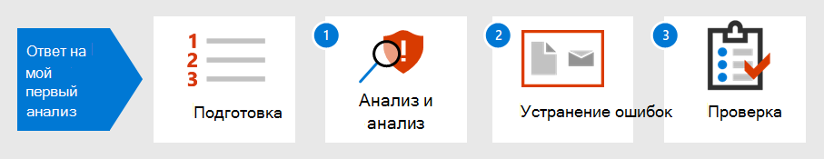

# Введение в ответ на первый инцидентIntroduction to responding to your first incident

[!INCLUDE [Microsoft 365 Defender rebranding](../includes/microsoft-defender.md)]

**Область применения:****Applies to:**
- Microsoft 365 DefenderMicrosoft 365 Defender

Стратегия реагирования на инциденты организации определяет ее способность бороться с все более разрушительными инцидентами безопасности и киберпреступностью.An organization's incident response strategy determines its ability to deal with increasingly disruptive security incidents and cybercrime. Несмотря на важное значение профилактических мер, способность быстро действовать для сдерживания, искоренения и восстановления после обнаруженных инцидентов может свести к минимуму ущерб и потери бизнеса.While taking preventative measures is important, the ability to act quickly to contain, eradicate, and recover from detected incidents can minimize damage and business losses.

В этом погонах по реагированию на инциденты показано, как вы, в составе группы операций безопасности, можете выполнять большинство ключевых действий по реагированию на инциденты в Microsoft 365 Defender.This incident response walkthrough shows how you, as part of a security operations team, can perform most of the key incident response steps within Microsoft 365 Defender. Эти этапы описаны ниже.Here are the steps:

- Подготовка позы безопасностиPreparation of your security posture
- Для каждого инцидента:For each incident:
  - Шаг 1. Триадж и анализStep 1: Triage and analysis
  - Шаг 2. Исправление (сдерживание, ликвидация и восстановление)Step 2: Remediation (containment, eradication, and recovery)
  - Шаг 3. Проверка после инцидентаStep 3: Post-incident review

Инцидент с безопасностью определяется Национальным институтом стандартов и технологий (NIST) как "событие, которое фактически или потенциально ставит под угрозу конфиденциальность, целостность или доступность информационной системы; или сведения, которые система обрабатывает, хранит или передает; или это представляет собой нарушение или неминуемую угрозу нарушения политик безопасности, процедур безопасности или политик приемлемого использования".A security incident is defined by National Institute of Standards and Technology (NIST) as "an occurrence that actually or potentially jeopardizes the confidentiality, integrity, or availability of an information system; or the information the system processes, stores, or transmits; or that constitutes a violation or imminent threat of violation of security policies, security procedures, or acceptable use policies."

Инциденты в Microsoft 365 Defender являются логическими отправной точкой для анализа и реагирования на инциденты.Incidents in Microsoft 365 Defender are the logical starting points for analysis and incident response. Анализ и исправление инцидентов обычно составляет большинство задач группы операций безопасности.Analyzing and remediating incidents typically makes up most of a security operations team's tasks.

## Следующий шагNext step

Убедитесь, что ваша организация и Microsoft 365 готовы [к обработке инцидентов.](first-incident-prepare.md)Make sure your organization and Microsoft 365 tenant is [prepared for incident handling](first-incident-prepare.md).

## См. такжеSee also

- [Обзор инцидентовIncidents overview](incidents-overview.md)
- [Анализ инцидентовAnalyze incidents](investigate-incidents.md)
- [Управление инцидентамиManage incidents](manage-incidents.md)
