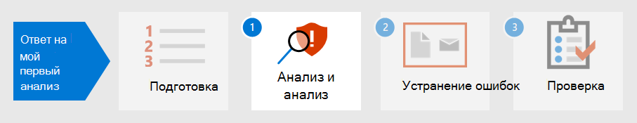

# Подготовка позиции безопасности к первому инцидентуPrepare your security posture for your first incident

[!INCLUDE [Microsoft 365 Defender rebranding](../includes/microsoft-defender.md)]

**Область применения:****Applies to:**
- Microsoft 365 DefenderMicrosoft 365 Defender

Подготовка к обработке инцидентов включает создание достаточной защиты сети организации от различных типов инцидентов безопасности.Preparing for incident handling involves setting up sufficient protection of an organization's network from different kinds of security incidents. Чтобы снизить риск инцидентов с безопасностью, Национальный институт стандартов и технологий (NIST) рекомендует несколько методов безопасности, включая оценку рисков, ужесточить безопасность хостов, безопасно настраивать сети и предотвращать вредоносные программы.To reduce the risk of security incidents, National Institute of Standards and Technology (NIST) recommends several security practices including risk assessments, hardening host security, configuring networks securely, and preventing malware. 

Microsoft 365 Defender может помочь в решении нескольких аспектов предотвращения инцидентов:Microsoft 365 Defender can help address several aspects of incident prevention: 

- Реализация [нулевой структуры доверия](/security/zero-trust/)Implementing a [Zero Trust](/security/zero-trust/) framework
- Определение позиции безопасности, назначив оценку с [помощью Microsoft Secure Score](microsoft-secure-score.md)Determining your security posture by assigning a score with [Microsoft Secure Score](microsoft-secure-score.md)
- Предотвращение угроз с помощью оценок уязвимости в [управлении угрозами и уязвимостью](../defender-endpoint/next-gen-threat-and-vuln-mgt.md)Preventing threats through vulnerability assessments in [Threat and Vulnerability Management](../defender-endpoint/next-gen-threat-and-vuln-mgt.md)
- Понимание последних угроз безопасности, чтобы вы могли подготовиться к нимUnderstanding the latest security threats so you can prepare for them

## Этап 1.Step 1. Реализация нулевого доверияImplement Zero Trust

[Zero Trust](/security/zero-trust/) — это интегрированная философия безопасности и целостная стратегия, учитывая сложный характер любой современной среды, включая рабочую силу мобильных устройств и пользователей, устройства, приложения и данные, где бы они ни находились.[Zero Trust](/security/zero-trust/) is an integrated security philosophy and end-to-end strategy that considers the complex nature of any modern environment, including the mobile workforce and the users, devices, applications and data, wherever they may be located. Предоставляя единую стеклянную области для согласованного управления всеми обнаружениями, Microsoft 365 Defender может упростить для вашей группы  операций безопасности реализацию руководящих принципов Zero Trust.By providing a single pane of glass to manage all detections in a consistent way, Microsoft 365 Defender can make it easier for your security operations team to implement the [guiding principles](/security/zero-trust/#guiding-principles-of-zero-trust) of Zero Trust. 

Компоненты Microsoft 365 Defender могут отображать нарушения правил, которые были реализованы для создания политик условного доступа для Zero Trust путем интеграции данных из Microsoft Defender для конечной точки (MDE) или других поставщиков мобильной безопасности в качестве источника информации для политик соответствия требованиям устройств и реализации политик условного доступа на основе устройств.Components of Microsoft 365 Defender can display violations of rules that have been implemented to establish Conditional Access policies for Zero Trust by integrating data from Microsoft Defender for Endpoint (MDE) or other mobile security vendors as an information source for device compliance policies and implementation of device-based Conditional Access policies. 

Риск устройства напрямую влияет на то, какие ресурсы будут доступны пользователю этого устройства.Device risk directly influences what resources will be accessible by the user of that device. Отказ в доступе к ресурсам на основе определенных критериев является основной темой Zero Trust и Microsoft 365 Defender предоставляет сведения, необходимые для определения критериев уровня доверия.The denial of access to resources based on certain criteria is the main theme of Zero Trust and Microsoft 365 Defender provides information needed to determine the trust level criteria. Например, Microsoft 365 Defender может предоставлять уровень версии программного обеспечения устройства через страницу Управления угрозами и уязвимостью, а политики условного доступа ограничивают устройства с устаревшими или уязвимыми версиями.For example, Microsoft 365 Defender can provide the software version level of a device through the Threat and Vulnerability Management page while Conditional Access policies restrict devices that have outdated or vulnerable versions.

Автоматизация является важной частью реализации и поддержания среды нулевого доверия, а также сокращения количества оповещений, которые потенциально могут привести к событиям реагирования на инциденты.Automation is a crucial part of implementing and maintaining a Zero Trust environment while also reducing the number of alerts that would potentially lead to incident response (IR) events. Компоненты Microsoft 365 Defender можно автоматизировать, такие  как действия по исправлению (известные как расследования инцидента в центре безопасности Microsoft 365), действия уведомления и даже создание билетов поддержки, таких как [ServiceNow](https://microsoft.service-now.com/sp/).Components of Microsoft 365 Defender can be automated such as [remediation actions](m365d-autoir.md) (known as investigations for an incident in the Microsoft 365 security center), notification actions, and even the creation of support tickets such as in [ServiceNow](https://microsoft.service-now.com/sp/).

## Шаг 2.Step 2. Определение позиции безопасности организацииDetermine your organization’s security posture

Далее организации могут использовать microsoft [Secure Score](microsoft-secure-score.md) в Microsoft 365 Defender, чтобы определить текущую позицию безопасности и рассмотреть рекомендации по ее улучшению.Next, organizations can use the [Microsoft Secure Score](microsoft-secure-score.md) in Microsoft 365 Defender to determine your current security posture and consider recommendations on how to improve it. Чем выше оценка, тем больше рекомендаций по безопасности и действий по улучшению было принято организацией.The higher the score is, the more security recommendations and improvement actions have been taken by the organization. Рекомендации по безопасной оценке можно использовать для различных продуктов и позволяют организациям повышать свои оценки еще выше.Secure Score recommendations can be taken across different products and allow organizations to raise their scores even higher. 

:::image type="content" source="../../media/first-incident-prepare/first-incident-secure-score.png" alt-text="Пример показателей безопасности Майкрософт в центре безопасности Майкрософт":::
 
## Этап 3.Step 3. Оценка уязвимости организацииAssess your organization’s vulnerability exposure

Предотвращение инцидентов может помочь оптимизировать усилия по обеспечению безопасности, чтобы сосредоточиться на критически важных и важных инцидентах безопасности.Preventing incidents can help streamline security operations efforts to focus on on-going critical and important security incidents. Уязвимости программного обеспечения часто являются предотвратимой точкой входа для атак, которые могут привести к краже данных, потере данных или нарушению бизнес-операций.Software vulnerabilities are often a preventable entry point for attacks that can lead to data theft, data loss, or disruption of business operations. Если не происходит никаких атак, операции безопасности должны стремиться к достижению и поддержанию приемлемого уровня уязвимости [в](../defender-endpoint/tvm-exposure-score.md) своей организации.If no attacks are on-going, security operations must strive to achieve and maintain an acceptable level of [vulnerability exposure](../defender-endpoint/tvm-exposure-score.md) in their organization.

Чтобы проверить ход исправления программного  обеспечения, посетите страницу Управления угрозами и уязвимостью в Defender for Endpoint, к которой можно получить доступ из Microsoft 365 Defender через вкладку **More resources.**To check your software patching progress, visit the [Threat and Vulnerability Management](../defender-endpoint/next-gen-threat-and-vuln-mgt.md) page in Defender for Endpoint, which you can access from Microsoft 365 Defender through the **More resources** tab.

:::image type="content" source="../../media/first-incident-prepare/first-incident-vulnerability.png" alt-text="Пример страницы &quot;Угроза и уязвимость&quot; в центре безопасности Майкрософт"::: 
 
## 4. Понимание возникающих угроз4. Understand emerging threats

Используйте [аналитику угроз](threat-analytics.md) в центре Microsoft 365 безопасности, чтобы быть в курсе текущего ландшафта угроз безопасности.Use [threat analytics](threat-analytics.md) in the Microsoft 365 security center to keep up-to-date with the current security threat landscape. Специалисты по безопасности Майкрософт создают отчеты, в них подробно описываются последние киберугрозы, чтобы вы могли понять, как они могут повлиять на Microsoft 365 подписку, устройства и пользователей.Expert Microsoft security researchers create reports that describe the latest cyber-threats in detail so you can understand how they might affect your Microsoft 365 subscription, devices, and users. Эти отчеты могут включать:These reports can include:

- Активные субъекты угроз и их кампанииActive threat actors and their campaigns
- Популярные и новые методы атакиPopular and new attack techniques
- Критические уязвимостиCritical vulnerabilities
- Общие поверхности атакиCommon attack surfaces
- Распространенные вредоносные программыPrevalent malware

Аналитика угроз также рассматривает конфигурацию и оповещений, чтобы определить, насколько вы рискуете и есть ли активные оповещения, применимые к отчету.Threat analytics also looks at your configuration and alerts to determine how at-risk you are and if there are active alerts applicable to a report.

Вы можете реализовать рекомендации появляющейся угрозы, чтобы укрепить осанку безопасности и свести к минимуму область поверхности атаки.You can implement the recommendations of an emerging threat to strengthen your security posture and minimize your attack surface area.

Уделайте время в расписании, чтобы регулярно проверять раздел [Threat Analytics](threat-analytics.md) центра Microsoft 365 безопасности.Make time in your schedule to regularly check the [Threat Analytics](threat-analytics.md) section of the Microsoft 365 security center.

## Следующий этапNext step

Узнайте, как анализировать и анализировать [инциденты.](first-incident-analyze.md)Learn how to [triage and analyze incidents](first-incident-analyze.md).

## См. такжеSee also

- [Обзор инцидентовIncidents overview](incidents-overview.md)
- [Исследование инцидентовInvestigate incidents](investigate-incidents.md)
- [Управление инцидентамиManage incidents](manage-incidents.md)
