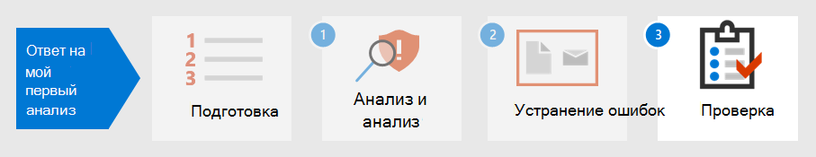

# Шаг 2.Step 2. Исправление первого инцидентаRemediate your first incident

[!INCLUDE [Microsoft 365 Defender rebranding](../includes/microsoft-defender.md)]

**Область применения:****Applies to:**
- Microsoft 365 DefenderMicrosoft 365 Defender

Microsoft 365 Defender не только предоставляет возможности обнаружения и анализа, но и обеспечивает сдерживание и ликвидацию вредоносных программ.Microsoft 365 Defender not only provides detection and analysis capabilities but also provides containment and eradication of malware. Сдерживание включает шаги по снижению воздействия атаки, а ликвидация обеспечивает удаление всех следов действий злоумышленников из сети.Containment includes steps to reduce the impact of the attack while eradication ensures all traces of attacker activity are removed from the network.  Microsoft 365 Defender предлагает несколько действий по исправлению, которые можно настроить на автоматическое исправление в зависимости от операционной системы и типа атаки. Microsoft 365 Defender offers several remediation actions which can be configured to [auto-remediate](m365d-autoir.md) depending on your operating system and the attack type.

Microsoft 365 Defender предлагает несколько действий по исправлению, которые аналитики могут инициировать вручную.Microsoft 365 Defender offers several remediation actions that analysts can manually initiate. Действия разделены на две категории: Действия на устройствах и Действия в файлах.Actions are separated into two categories, Actions on devices and Actions on files. Некоторые действия можно использовать для немедленной остановки угрозы, а другие действия помогают в дальнейшем судебно-медицинском анализе.Some actions can be used to immediately stop the threat while other actions assist in further forensic analysis.

## Действия на устройствахActions on devices

- **Изолировать** устройство . Эта активность немедленно блокирует весь сетевой трафик (интернет и внутренний), чтобы свести к минимуму распространение вредоносных программ и позволить аналитикам продолжить анализ без возможности злоумышленника продолжить атаку.**Isolate the device** - This activity immediately blocks all network traffic (internet and internal) to minimize the spread of malware and allow analysts to continue analysis without a malicious actor being able to continue an attack. Разрешено только подключение к облаку службы Microsoft Defender для удостоверений, чтобы Microsoft Defender for Identity продолжила следить за устройством.The only connection allowed is to the Microsoft Defender for Identity service cloud so Microsoft Defender for Identity can continue to monitor the device. 
- **Ограничение выполнения** приложения . Чтобы ограничить запуск приложения, применяется политика целостности кода, которая позволяет запускать файлы только в том случае, если они подписаны сертификатом, выданным Корпорацией Майкрософт.**Restrict app execution** - To restrict an application from running, a code integrity policy is applied that only allows files to run if they are signed by a Microsoft-issued certificate. Этот метод ограничения может помочь злоумышленнику контролировать скомпрометированную устройства и выполнять дальнейшие вредоносные действия.This method of restriction can help prevent an attacker from controlling compromised devices and performing further malicious activities.
- **Запуск антивирусного** сканирования — антивирусная программа в Microsoft Defender может работать вместе с другими антивирусными решениями, независимо от того, является ли антивирус Defender активным антивирусным решением или нет.**Run Antivirus scan** - A Microsoft Defender Antivirus scan can run alongside other antivirus solutions, whether Defender Antivirus is the active antivirus solution or not. Если основным решением защиты конечной точки является другой антивирусный продукт, можно запустить антивирус Defender в пассивном режиме.If another antivirus vendor product is the primary endpoint protection solution, you can run Defender Antivirus in Passive mode.
- **Инициировать автоматическое** расследование . Вы можете начать новое общее автоматическое расследование на устройстве.**Initiate automated investigation** - You can start a new general purpose automated investigation on the device. В ходе расследования любое другое оповещение, сгенерированное с устройства, будет добавлено в текущее автоматическое расследование до завершения этого расследования.While an investigation is running, any other alert generated from the device will be added to an ongoing automated investigation until that investigation is completed. Кроме того, если такая же угроза видна на других устройствах, эти устройства добавляются в исследование.In addition, if the same threat is seen on other devices, those devices are added to the investigation.
- **Инициировать** живой ответ . Live response — это возможность мгновенного доступа к устройству с помощью удаленного подключения к оболочке.**Initiate live response** - Live response is a capability that gives you instantaneous access to a device by using a remote shell connection. Это дает возможность выполнять углубленные следственные действия и принимать срочные меры реагирования для оперативного сдерживания выявленных угроз в режиме реального времени.This gives you the ability to do in-depth investigative work and take immediate response actions to promptly contain identified threats in real time. Live response предназначен для повышения эффективности расследований, позволяя собирать судебно-медицинские данные, запускать сценарии, отправлять подозрительные объекты для анализа, устранения угроз и активной охоты на возникающие угрозы.Live response is designed to enhance investigations by enabling you to collect forensic data, run scripts, send suspicious entities for analysis, remediate threats, and proactively hunt for emerging threats.
- **Сбор пакета расследований** . В рамках расследования или процесса реагирования можно собрать пакет исследований с устройства.**Collect investigation package** - As part of the investigation or response process, you can collect an investigation package from a device. Собирая пакет исследований, вы можете определить текущее состояние устройства и дополнительно понять инструменты и методы, используемые злоумышленником.By collecting the investigation package, you can identify the current state of the device and further understand the tools and techniques used by the attacker. 
- **Обратитесь к** эксперту по угрозам (доступно как в действиях на устройствах, так и в файлах) - Вы можете проконсультироваться с экспертом по угрозам Майкрософт, чтобы получить дополнительные сведения о потенциально скомпрометированных устройствах или устройствах, которые уже скомпрометированы.**Consult a threat expert** (available in both Actions on devices and files) - You can consult a Microsoft threat expert for more insights regarding potentially compromised devices or devices that are already compromised. Эксперты по угрозам Майкрософт могут быть вовлечены непосредственно из Центр безопасности в Microsoft Defender для быстрого и точного ответа.Microsoft threat experts can be engaged directly from within the Microsoft Defender Security Center for a timely and accurate response. 

## Действия в файлахActions on files

- **Стоп-файл** и файл карантина . Это действие включает остановку запущенных процессов, карантиновую обработку файлов и удаление сохраняющихся данных, например любых ключей реестра.**Stop and quarantine file** - This action includes stopping running processes, quarantining files, and deleting persistent data, such as any registry keys. Это действие действует на устройствах Windows 10 версии 1703 или более поздней версии, где файл был замечен в течение последних 30 дней.This action takes effect on devices with Windows 10, version 1703 or later, where the file was observed in the last 30 days. 
- **Добавление индикаторов для** блокировки или допуска файла . Предотвращение дальнейшего распространения атаки в организации, запретив потенциально вредоносные файлы или подозрительные вредоносные программы.**Add indicators to block or allow file** - Prevent further propagation of an attack in your organization by banning potentially malicious files or suspected malware. Эта операция предотвратит чтение, написание или выполнение файла на устройствах в организации.This operation will prevent the file from being read, written, or executed on devices in your organization.
- **Скачивание или** сбор файла — это действие позволяет аналитикам скачивать файл в защищенном .zip архивном файле для дальнейшего анализа организацией.**Download or collect file** – This action allows analysts to download a file in a password protected .zip archive file for further analysis by the organization.
- **Глубокий анализ** . Это действие выполняет файл в безопасной, полностью оборудованной облачной среде.**Deep analysis** – This action executes a file in a secure, fully instrumented cloud environment. Результаты глубокого анализа показывают действия файла, наблюдаемое поведение и связанные артефакты, такие как отброшенные файлы, изменения реестра и связь с IP-адресами.Deep analysis results show the file's activities, observed behaviors, and associated artifacts, such as dropped files, registry modifications, and communication with IP addresses. 

Продолжая пример в [detect, triage и analyse incidents,](first-incident-analyze.md#analyze-your-first-incident)аналитик может исправление этого инцидента с помощью этих действий:Continuing the example in [Detect, triage, and analyze incidents](first-incident-analyze.md#analyze-your-first-incident), an analyst can remediate this incident with these actions:

1. Немедленно сброс пароля учетной записи пользователяImmediately reset the user account password
2. Изолировать устройство в Microsoft 365 Defender до завершения глубокого анализаIsolate the device in Microsoft 365 Defender until deep analysis is complete
3. Убедитесь, что вредоносный файл был карантин из SharePointEnsure the malicious file was quarantined from SharePoint
4. Проверьте, какие конечные точки были затронуты вредоносными программамиCheck which endpoints were affected by malware
5. Восстановление системRebuild systems
6. Проверьте, есть ли аналогичные Microsoft Cloud App Security оповещения для других пользователейCheck for similar Microsoft Cloud App Security alerts for other users
7. Создание пользовательского индикатора в Microsoft Defender для конечной точки для блокировки IP-адреса TorCreate a custom indicator in Microsoft Defender for Endpoint to block a Tor IP address
8. Создайте действие управления в Microsoft Cloud App Security для этого типа оповещений, таких как те, которые показаны на следующем изображении:Create a governance action in Microsoft Cloud App Security for this type of alert such as those shown in the following image:

   :::image type="content" source="../../media/first-incident-remediate/first-incident-mcas-governance.png" alt-text="Пример действий управления на Microsoft Cloud App Security портале"::: 
 
Большинство действий по исправлению можно применять и отслеживать в Microsoft 365 Defender.Most of the remediation actions can be applied and tracked in Microsoft 365 Defender. 

## Использование playbooksUsing Playbooks

Кроме того, автоматизированное исправление можно создать с помощью книг воспроизведения.In addition, automated remediation can be created using playbooks. В настоящее время в Microsoft есть шаблоны playbook в [GitHub,](https://github.com/microsoft/Microsoft-Cloud-App-Security/tree/master/Playbooks) которые предоставляют книги для следующих сценариев:Currently, Microsoft has [Playbook templates on GitHub](https://github.com/microsoft/Microsoft-Cloud-App-Security/tree/master/Playbooks) that provide playbooks for the following scenarios:

- Удаление деликатного общего доступа к файлам после запроса проверки пользователяRemove sensitive file sharing after requesting user validation
- Автоматические оповещения о нечастойной странеAuto-triage infrequent country alerts
- Запрос на действие диспетчера перед отключением учетной записиRequest for manager action before disabling an account
- Отключение вредоносных правил почтовых ящиковDisable malicious inbox rules

В playbooks Power Automate для создания пользовательских потоков автоматизации роботизированных процессов для автоматизации определенных действий после запуска определенных критериев.Playbooks use Power Automate to create custom robotic process automation flows to automate certain activities once specific criteria have been triggered. Организации могут создавать книги воспроизведения либо из существующих шаблонов, либо с нуля.Organizations can create playbooks either from existing templates or from scratch. 

Ниже приведен пример.Here's an example.
 
:::image type="content" source="../../media/first-incident-remediate/first-incident-power-automate.png" alt-text="Пример пользовательского потока автоматизации Power Automate роботизированных процессов"::: 
 
Во время проверки после  инцидента также можно создавать книги для создания действий по исправлению последствий инцидентов для более быстрых действий по исправлению.Playbooks can also be created during [post-incident review](first-incident-post.md) to create remediation actions from incidents for faster remediation actions. 

## Следующий этапNext step

Узнайте, [как выполнить проверку инцидента после инцидента.](first-incident-post.md)Learn how to [perform a post-incident review of an incident](first-incident-post.md).

## См. такжеSee also

- [Обзор инцидентовIncidents overview](incidents-overview.md)
- [Исследование инцидентовInvestigate incidents](investigate-incidents.md)
- [Управление инцидентамиManage incidents](manage-incidents.md)
