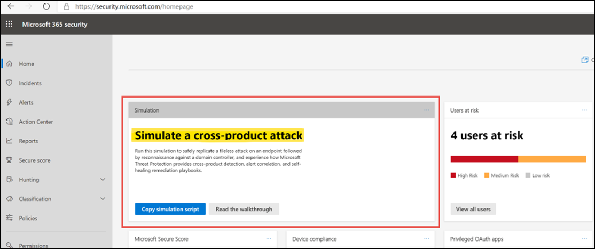

# Создание тестового оповещений в Microsoft 365 лаборатории оценки Defender  

[!INCLUDE [Microsoft 365 Defender rebranding](../includes/microsoft-defender.md)]

**Область применения:**
- Microsoft 365 Defender

Теперь, когда вы завершили установку и конфигурацию лаборатории Microsoft 365 Defender, можно запустить имитацию атаки угрозы, чтобы испытать обнаружение, корреляцию оповещений и возможности самовосстановления интегрированного решения безопасности.  

1. Войдите в систему https://security.microsoft.com
2. На домашней странице и посмотрите плитку под названием **Simulation**.  Просмотрите руководство по погонам для действий по созданию тестового инцидента в Microsoft 365 Defender.
   

## Дальнейшие действия

Просмотрите центр [Microsoft 365](../../solutions/index.yml) решений и архитектуры, чтобы понять, как создать правильное решение и архитектуру для вашей организации.