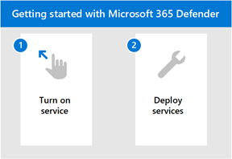

# Начало работы с Microsoft 365 для DefenderGet started with Microsoft 365 for Defender

[!INCLUDE [Microsoft 365 Defender rebranding](../includes/microsoft-defender.md)]

**Область применения:****Applies to:**
- Microsoft 365 DefenderMicrosoft 365 Defender

[!INCLUDE [Prerelease](../includes/prerelease.md)]

Microsoft 365 Defender — это единая система мониторинга и управления безопасностью на предприятии.Microsoft 365 Defender is a unified experience where you can monitor and manage security across your enterprise. С помощью интегрированных оповещений между удостоверениями, конечными точками, данными, приложениями, электронной почтой и средствами совместной работы в центре обработки и реагирования на угрозы.With the integrated alerts across identities, endpoints, data, apps, email, and collaboration tools - investigating and responding to threats now happen in a central location. 

Являетесь ли вы новыми в наборе продуктов безопасности Майкрософт или знакомы с отдельными процессами, этот раздел поможет вам в простых шагах, которые необходимо предпринять, чтобы начать работу с Microsoft 365 Defender.Whether you're new to the Microsoft suite of security products or familiar with individual workflows, this topic will guide you in the simple steps you need to take to get started with Microsoft 365 Defender.

В общем, для начала необходимо предпринять следующие действия:In general, you'll need to take the following steps to get started:

- **[Шаг 1. Включив защитник Microsoft 365](m365d-enable.md)****[Step 1: Turn on Microsoft 365 Defender](m365d-enable.md)**  
    Сначала необходимо включить службу, убедившись, что у вас есть права лицензии на место и роли назначены, чтобы вы могли получить доступ к порталу.You'll first need to turn on the service by making sure you have the right license in place and roles are assigned so that you can access the portal. 

    Затем вы перейдите через несколько простых параметров, а затем вы можете подтвердить, что служба находится на.You'll then go through some simple settings and then you can confirm that the service is on.

- **[Шаг 2. Развертывание поддерживаемых служб](deploy-supported-services.md)****[Step 2: Deploy supported services](deploy-supported-services.md)**  
    После выполнения начальных действий необходимо развернуть поддерживаемые службы, которые приходят с Microsoft 365 Defender.After completing the initial steps, you'll need to deploy the supported services that come with Microsoft 365 Defender. Развертывание служб эффективно повышает видимость сигналов из активов по всей сети.Deploying services effectively increases your visibility in the signals from assets across your network.

## Ключевые возможностиKey capabilities
Включение защитника Microsoft 365 и развертывание служб даст вам доступ к следующим ключевым возможностям:Turning on Microsoft 365 Defender and deploying services will give you access to the following key capabilities:

| ВозможностьCapability | ОписаниеDescription |
| ------ | ------ |
| Microsoft Defender для конечной точкиMicrosoft Defender for Endpoint | Набор защиты конечных точек, построенный вокруг мощных поведенческих датчиков, облачной аналитики и аналитики угрозEndpoint protection suite built around powerful behavioral sensors, cloud analytics, and threat intelligence |
|Microsoft Defender для Office 365Microsoft Defender for Office 365 | Расширенные средства защиты приложений и данных в Office 365, включая электронную почту и другие средства совместной работыAdvanced protection for your apps and data in Office 365, including email and other collaboration tools |
| Microsoft Defender для удостоверенийMicrosoft Defender for Identity | Защита от расширенных угроз, скомпрометанных удостоверений и вредоносных инсайдеров с помощью коррелирующих сигналов Active DirectoryDefend against advanced threats, compromised identities, and malicious insiders using correlated Active Directory signals |
| Microsoft Cloud App SecurityMicrosoft Cloud App Security | Определение и борьба с киберугрозами в облачных службах Майкрософт и сторонних поставщиковIdentify and combat cyberthreats across your Microsoft and third-party cloud services |

