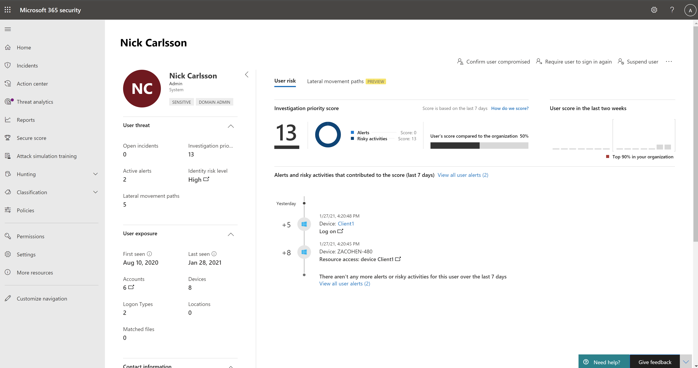

# Исследование пользователей в Центре безопасности Microsoft 365

[!INCLUDE [Microsoft 365 Defender rebranding](../includes/microsoft-defender.md)]

[!INCLUDE [Prerelease](../includes/prerelease.md)]

**Область применения:**

- Microsoft 365 Defender

В ходе расследования может быть установлено, что пользователь был скомпрометирован.

Страница пользователя Центра безопасности Microsoft 365 объединяет сведения из Microsoft Defender для конечной точки, Microsoft Defender для удостоверений и Microsoft Cloud App Security (в зависимости от лицензий). Эта страница является идеальным начальным местом для расследования пользователей и потенциальных инцидентов.

На этой странице показаны сведения, относяные к риску безопасности пользователя. Это включает оценку, которая помогает оценить риск, недавние события и оповещения, которые способствовали общему риску пользователя и другие.

Вы можете получить доступ к этой странице из нескольких областей центра безопасности Microsoft 365. Вы можете получить доступ к этой странице из определенного инцидента на вкладке **Пользователи.** Некоторые оповещения могут включать пользователей в качестве определенного затронутного актива. Вы также можете искать пользователей.  

Узнайте больше о том, как исследовать пользователей и потенциальные риски в этом руководстве по безопасности [облачных приложений.](/cloud-app-security/tutorial-ueba#:~:text=To%20identify%20who%20your%20riskiest,user%20page%20to%20investigate%20them)

## См. также

- [Обзор инцидентов](incidents-overview.md)
- [Управление приоритетом инцидентов](incident-queue.md)
- [Управление инцидентами](manage-incidents.md)