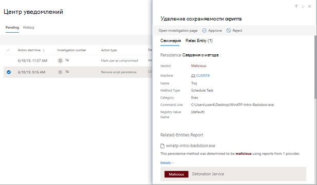

# Просмотр и управление действиями в центре действийView and manage actions in the Action center

[!INCLUDE [Microsoft 365 Defender rebranding](../includes/microsoft-defender.md)]

**Область применения:****Applies to:**
- Microsoft 365 DefenderMicrosoft 365 Defender

Функции защиты от угроз в Microsoft 365 Defender могут привести к определенным действиям по исправлению.Threat protection features in Microsoft 365 Defender can result in certain remediation actions. Ниже приводятся примеры:Here are some examples:

- [Автоматические расследования могут](m365d-autoir.md) привести к действиям по исправлению, которые принимаются автоматически или ожидают вашего утверждения.[Automated investigations](m365d-autoir.md) can result in remediation actions that are taken automatically or await your approval.
- Антивирусные, антивирусные и другие функции защиты от угроз могут привести к действиям по исправлению, например блокировке файла, URL-адреса или процесса или отправке артефакта на карантин.Antivirus, antimalware, and other threat protection features can result in remediation actions, such as blocking a file, URL, or process, or sending an artifact to quarantine.
- Ваша группа операций безопасности может принимать действия по  исправлению в ручном режиме, например во время предварительной охоты или при расследовании оповещений [или](investigate-alerts.md) [инцидентов.](investigate-incidents.md)Your security operations team can take remediation actions manually, such as during [advanced hunting](advanced-hunting-overview.md) or while investigating [alerts](investigate-alerts.md) or [incidents](investigate-incidents.md).

> [!NOTE]
> Чтобы утвердить или отклонить действия по исправлению, необходимы [соответствующие разрешения](m365d-action-center.md#required-permissions-for-action-center-tasks).You must have [appropriate permissions](m365d-action-center.md#required-permissions-for-action-center-tasks) to approve or reject remediation actions. Дополнительные сведения см. в [дополнительных сведениях.](m365d-configure-auto-investigation-response.md#prerequisites-for-automated-investigation-and-response-in-microsoft-365-defender)For more information, see the [prerequisites](m365d-configure-auto-investigation-response.md#prerequisites-for-automated-investigation-and-response-in-microsoft-365-defender).

## Просмотр ожидающих действий в центре действийReview pending actions in the Action center

Необходимо как можно скорее утвердить (или отклонить) ожидающие выполнения действия, чтобы автоматизированный анализ угроз мог продолжить работу и своевременно завершить ее.It's important to approve (or reject) pending actions as soon as possible so that your automated investigations can proceed and complete in a timely manner. 

1. Перейдите на страницу [https://security.microsoft.com](https://security.microsoft.com) и войдите.Go to [https://security.microsoft.com](https://security.microsoft.com) and sign in. 

2. В панели навигации щелкните **Центр уведомлений**.In the navigation pane, choose **Action center**. 

3. В центре уведомлений на вкладке **Ожидание** выберите элемент в списке.In the Action Center, on the **Pending** tab, select an item in the list. Откроется его поле для вылетов.Its flyout pane opens. Ниже приведен пример.Here's an example.

   

4. Просмотрите сведения в области вылетов и примите один из следующих действий:Review the information in the flyout pane, and then take one of the following steps:
   - Выберите **страницу Open investigation,** чтобы просмотреть дополнительные сведения о расследовании.Select **Open investigation page** to view more details about the investigation.
   - Выберите **Утверждение,** чтобы инициировать ожидающих действий.Select **Approve** to initiate a pending action.
   - Выберите **Отклонение,** чтобы предотвратить ожидающих действий.Select **Reject** to prevent a pending action from being taken.
   - Выберите **go hunt,** чтобы перейти в [расширенный поиск.](advanced-hunting-overview.md)Select **Go hunt** to go into [Advanced hunting](advanced-hunting-overview.md). 

## Отмена завершенных действийUndo completed actions

Если установлено, что устройство или файл не представляют угрозы, можно отменить принятые действия по исправлению, независимо от того, были ли эти действия приняты автоматически или вручную.If you’ve determined that a device or a file is not a threat, you can undo remediation actions that were taken, whether those actions were taken automatically or manually. В центре действий на **вкладке История** можно отменить любое из следующих действий:In the Action center, on the **History** tab, you can undo any of the following actions:  

| Источник действийAction source | Поддерживаемые действияSupported Actions |
|:---|:---|
| - Автоматическое расследование- Automated investigation  - Антивирус Microsoft Defender- Microsoft Defender Antivirus  - Действия ручного ответа- Manual response actions | - Изолировать устройство- Isolate device  - Ограничение выполнения кода- Restrict code execution  - Карантин файла- Quarantine a file  - Удаление ключа реестра- Remove a registry key  - Остановка службы- Stop a service  - Отключить драйвер- Disable a driver  - Удаление запланированной задачи- Remove a scheduled task |

### Отмена одного действия по исправлениюUndo one remediation action

1. Перейдите в центр действий [https://security.microsoft.com/action-center](https://security.microsoft.com/action-center) () и войдите.Go to the Action center ([https://security.microsoft.com/action-center](https://security.microsoft.com/action-center)) and sign in.

2. На **вкладке История** выберите действие, которое необходимо отменить.On the **History** tab, select an action that you want to undo.

3. В области справа от экрана выберите **Отмена**.In the pane on the right side of the screen, select **Undo**.

### Отмена нескольких действий по исправлениюUndo multiple remediation actions

1. Перейдите в центр действий https://security.microsoft.com/action-center) (и войдите.Go to the Action center (https://security.microsoft.com/action-center) and sign in.

2. На **вкладке История** выберите действия, которые необходимо отменить.On the **History** tab, select the actions that you want to undo. Убедитесь, что выберите элементы с одинаковым типом действия.Make sure to select items that have the same Action type. Открывается поле для вылетов.A flyout pane opens.

3. В области вылетов выберите **Отмена**.In the flyout pane, select **Undo**.

### Удаление файла из карантина на нескольких устройствахTo remove a file from quarantine across multiple devices 

1. Перейдите в центр действий [https://security.microsoft.com/action-center](https://security.microsoft.com/action-center) () и войдите.Go to the Action center ([https://security.microsoft.com/action-center](https://security.microsoft.com/action-center)) and sign in.

2. На **вкладке История** выберите файл с типом действия карантиного файла. On the **History** tab, select a file that has a **Quarantine file** Action type.

3. В области справа от экрана выберите **Применить** к X дополнительные экземпляры этого файла, а затем **отменить**.In the pane on the right side of the screen, select **Apply to X more instances of this file**, and then select **Undo**.

## Дальнейшие действияNext steps

- [Просмотр сведений и результатов автоматического исследованияView the details and results of an automated investigation](m365d-autoir-results.md)
- [Адрес false positives or false negatives)Address false positives or false negatives)](m365d-autoir-report-false-positives-negatives.md)
