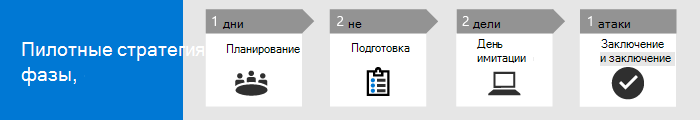

# Запуск пилотного проекта Microsoft 365 DefenderRun your pilot Microsoft 365 Defender project 

[!INCLUDE [Microsoft 365 Defender rebranding](../includes/microsoft-defender.md)]

**Область применения:****Applies to:**
- Microsoft 365 DefenderMicrosoft 365 Defender

Это руководство поможет вам запустить пилотный проект, предоставив указатели, чтобы убедиться, что у вас есть хорошо структурированный план, направляя вас с помощью функции имитации атаки, и, наконец, заключение пилота с ключом take-aways для вас, чтобы размышлять и документировать результаты.This guide helps you run a pilot project by providing pointers to ensure you have a well-structured plan, guiding you through using the attack simulation feature, and finally concluding the pilot with key take-aways for you to reflect on and document results.

Запуск пилотного проекта поможет эффективно определить преимущества принятия Microsoft 365 Defender.Running a pilot helps you effectively determine the benefit of adoptiing Microsoft 365 Defender. Прежде чем включить Microsoft 365 Defender в производственную среду и начать использовать кейсы, лучше спланировать определение задач, которые необходимо выполнить для пилотного проекта, и установить критерии успешности.Before enabling Microsoft 365 Defender in your production environment and starting your use cases, it's best to plan to determine the tasks to accomplish for your pilot project and set the success criteria. 

## Использование этой экспериментальной книги воспроизведенияHow to use this pilot playbook

В этом руководстве представлен обзор инструкций по пошаговой работы с Защитником Microsoft 365 и инструкций по настройкам пилотного проекта.This guide provides an overview of Microsoft 365 Defender and step-by-step instructions on how to set up your pilot project. 

Microsoft 365 Defender — это единый пакет защиты предприятия до и после нарушения, который в основном координирует защиту, обнаружение, предотвращение, расследование и ответные действия между конечными точками, удостоверениями, электронной почтой и приложениями для обеспечения комплексной защиты от сложных атак.Microsoft 365 Defender is a unified pre- and post-breach enterprise defense suite that natively coordinates protection, detection, prevention, investigation, and response across endpoints, identities, email, and applications to provide integrated protection against sophisticated attacks. Это делается путем объединения и оркестровки следующих возможностей в единое решение безопасности:It does so by combining and orchestrating the following capabilities into a single security solution:
  - Защитник Microsoft для конечной точки (конечные точки)Microsoft Defender for Endpoint (endpoints)
  - Microsoft Defender для Office 365 (электронная почта)Microsoft Defender for Office 365 (email) 
  - Защитник Microsoft для удостоверений (удостоверение)Microsoft Defender for Identity (identity) 
  - Microsoft Cloud App Security (apps)Microsoft Cloud App Security (apps)

С интегрированным решением Microsoft 365 Defender специалисты по безопасности могут сшить сигналы угрозы, которые получают Microsoft Defender для конечной точки, Microsoft Defender для Office 365, Microsoft Defender for Identity и Microsoft Cloud App Security, а также определить всю область и влияние угрозы, как она попала в среду, на что она влияет и как она в настоящее время влияет на организацию.With the integrated Microsoft 365 Defender solution, security professionals can stitch together the threat signals that Microsoft Defender for Endpoint, Microsoft Defender for Office 365, Microsoft Defender for Identity, and Microsoft Cloud App Security receive, and determine the full scope and impact of the threat, how it entered the environment, what it's affected, and how it's currently impacting the organization. Microsoft 365 Defender принимает автоматические меры для предотвращения или остановки атаки и самостоятельного заживления затронутых почтовых ящиков, конечных точек и удостоверений пользователей.Microsoft 365 Defender takes automatic action to prevent or stop the attack and self-heal affected mailboxes, endpoints, and user identities. Подробные сведения см. [в обзоре Защитника Microsoft 365.](microsoft-365-defender.md)See the [Microsoft 365 Defender overview](microsoft-365-defender.md) for details.

Следующая временная шкала выборки зависит от написания нужных ресурсов в вашей среде.The following sample timeline varies depending on having the right resources in your environment. Некоторым обнаружениям и рабочего процессам может потребоваться больше времени на обучение, чем другим.Some detections and workflows might need more learning time than the others.

>[!IMPORTANT]
>Чтобы получить оптимальные результаты, выполните пилотные инструкции как можно ближе.For optimum results, follow the pilot instructions as closely as possible.

### Пилотные этапы воспроизведенияPilot playbook phases 

Пилот microsoft 365 Defender работает четыре этапа:There are four phases in running a Microsoft 365 Defender pilot:

|ЭтапPhase | ОписаниеDescription | 
|:-------|:-----|
| [ПланированиеPlanning](m365d-pilot-plan.md)  ~ 1 день~ 1 day| Узнайте, что необходимо учитывать перед запуском пилотного проекта Microsoft 365 Defender:Learn what you need to consider before running your Microsoft 365 Defender pilot project:   - Область- Scope   - Использование случаев- Use cases  - Требования- Requirements  - План тестирования- Test plan   - Критерии успешности- Success criteria   - Система показателей- Scorecard 
| [ПодготовкаPreparation](m365d-evaluation.md)  ~2 дня~2 days|  Чтобы настроить пилотную среду Microsoft 365 Defender, необходимо получить доступ к Центру безопасности Microsoft 365.Access Microsoft 365 Security Center to set up your Microsoft 365 Defender pilot  environment. Вы будете руководствоваться:You'll be guided to:  - Определите заинтересованных лиц и обратитесь за входом для пилота- Identify stakeholders and seek sign-off for your pilot   - Соображения среды- Environment considerations  - Доступ- Access  - Установка Azure Active Directory- Azure Active Directory setup   - Порядок конфигурации- Configuration order   - Зарегистриройся на microsoft 365 E5 Trial- Sign up for Microsoft 365 E5 Trial   - Настройка домена- Configure domain  - Назначение лицензий Microsoft 365 E5- Assign Microsoft 365 E5 licenses   - Завершите мастер установки на портале- Complete the setup wizard in the portal|
| [Имитация атакиAttack simulation](m365d-pilot-simulate.md)  ~2 дня~2 days| Чтобы смоделировать атаку, вы будете руководствоваться:To simulate an attack, you'll be guided to:  - Проверка требований к тестовой среде- Verify the test environment requirements  - Запуск моделирования-  Run the simulation  - Расследование инцидента- Investigate an incident  - разрешить инцидент- resolve the incident 
| [Закрытие и сводкаClosing and summary](m365d-pilot-close.md)  ~ 1 день~ 1 day| По завершении процесса вы будете руководствоваться:When you've reached the end of the process, you'll be guided to:  - Перейдите через конечный вывод- Go through your final output - Презентуйте результаты заинтересованным лицам- Present your output to your stakeholders  - Предоставление обратной связи- Provide feedback  - Предпринять следующие действия- Take next steps 

## Следующий шагNext step
|[Этап планированияPlanning phase](m365d-pilot-plan.md) | Планирование пилотного проекта Microsoft 365 DefenderPlan your Microsoft 365 Defender pilot project 
|:-------|:-----|
