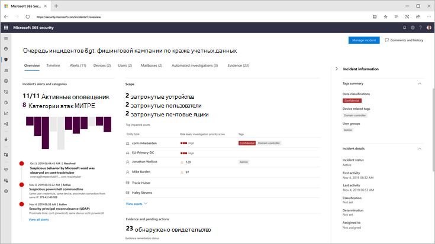
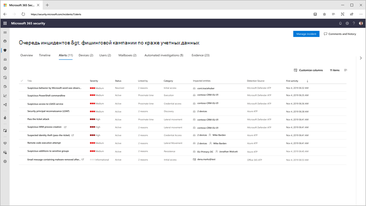
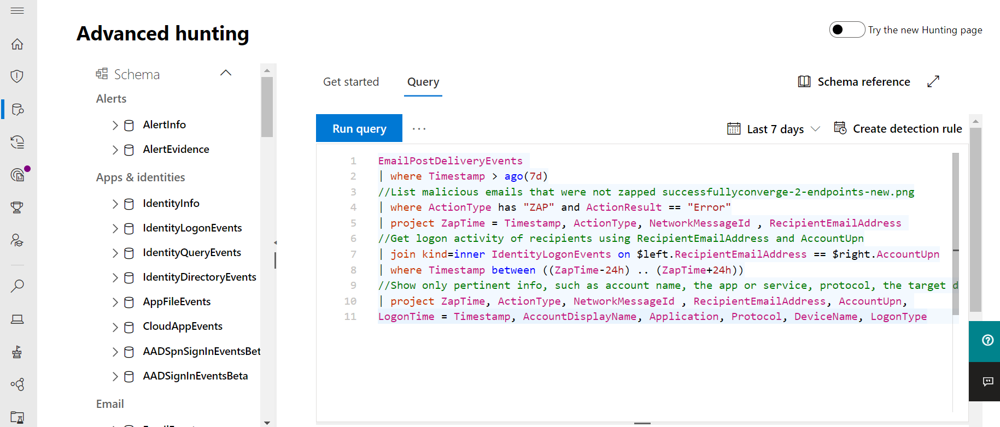

# Microsoft 365 DefenderMicrosoft 365 Defender

[!INCLUDE [Microsoft 365 Defender rebranding](../includes/microsoft-defender.md)]

**Область применения:****Applies to:**
- Microsoft 365 DefenderMicrosoft 365 Defender

> Хотите попробовать Microsoft 365 Defender?Want to experience Microsoft 365 Defender? Вы можете [оценить его в лабораторной среде](m365d-evaluation.md?ocid=cx-docs-MTPtriallab) или [запустить пилотный проект в производственной среде](m365d-pilot.md?ocid=cx-evalpilot).You can [evaluate it in a lab environment](m365d-evaluation.md?ocid=cx-docs-MTPtriallab) or [run your pilot project in production](m365d-pilot.md?ocid=cx-evalpilot).
>

Microsoft 365 Defender — это единый пакет защиты предприятия до и после взлома, который встроенным образом координирует обнаружение, предотвращение, расследование и реагирование между конечными точками, удостоверениями, электронной почтой и приложениями для обеспечения интегрированной защиты от комплексных атак.Microsoft 365 Defender is a unified pre- and post-breach enterprise defense suite that natively coordinates detection, prevention, investigation, and response across endpoints, identities, email, and applications to provide integrated protection against sophisticated attacks.

С интегрированным решением Microsoft 365 Defender специалисты по безопасности могут сшить вместе сигналы угрозы, получаемые каждым из этих продуктов, и определить полный охват и влияние угрозы; как он вошел в среду, на что она влияет, и как она в настоящее время влияет на организацию.With the integrated Microsoft 365 Defender solution, security professionals can stitch together the threat signals that each of these products receive and determine the full scope and impact of the threat; how it entered the environment, what it's affected, and how it's currently impacting the organization. Microsoft 365 Defender принимает автоматические меры для предотвращения или остановки атаки и самостоятельного заживления затронутых почтовых ящиков, конечных точек и удостоверений пользователей.Microsoft 365 Defender takes automatic action to prevent or stop the attack and self-heal affected mailboxes, endpoints, and user identities.  

<h2>Службы Microsoft 365 Defender
Microsoft 365 Defender services
</h2>
<table><tr><td>
<b><a href="https://docs.microsoft.com/windows/security/threat-protection/microsoft-defender-atp/microsoft-defender-advanced-threat-protection"><b>Microsoft Defender для конечной точки</b>

<b><a href="https://docs.microsoft.com/windows/security/threat-protection/microsoft-defender-atp/microsoft-defender-advanced-threat-protection"><b>Microsoft Defender for Endpoint</b>
</a></td>
<td>
<b><a href="https://docs.microsoft.com/office365/securitycompliance/office-365-atp"><b>Microsoft Defender для Office 365</b>

<b><a href="https://docs.microsoft.com/office365/securitycompliance/office-365-atp"><b>Microsoft Defender for Office 365</b>
</a></td>
<td>
<b><a href="/azure-advanced-threat-protection/"><b>Защитник Майкрософт для удостоверения</b></a>

<b><a href="/azure-advanced-threat-protection/"><b>Microsoft Defender for Identity</b></a>
</td>
<td>
<b><a href="/cloud-app-security/"><b>Безопасность облачных приложений Майкрософт</b></a>

<b><a href="/cloud-app-security/"><b>Microsoft Cloud App Security</b></a>
</td>
</tr>
</table>
 

## Интерактивное руководство Microsoft 365 DefenderMicrosoft 365 Defender interactive guide

В этом интерактивном руководстве вы узнаете, как защитить свою организацию с помощью Microsoft 365 Defender.In this interactive guide, you'll learn how to protect your organization with Microsoft 365 Defender. Вы увидите, как Microsoft 365 Defender может помочь вам обнаруживать риски безопасности, расследовать атаки в организации и автоматически предотвращать вредные действия.You'll see how Microsoft 365 Defender can help you detect security risks, investigate attacks to your organization, and prevent harmful activities automatically.

[Ознакомьтесь с интерактивным руководствомCheck out the interactive guide](https://aka.ms/M365Defender-InteractiveGuide)

С набором приложений Microsoft 365 Defender защищены:Microsoft 365 Defender suite protects: 
- **Конечные** точки с Microsoft Defender для конечной точки — Microsoft Defender для конечной точки — это единая конечная платформа для профилактической защиты, обнаружения после нарушения, автоматического расследования и ответа.**Endpoints with Microsoft Defender for Endpoint** - Microsoft Defender for Endpoint is a unified endpoint platform for preventative protection, post-breach detection, automated investigation, and response. 
- Электронная почта и совместная работа с **Microsoft Defender для Office 365** — Defender for Office 365 защищает организацию от вредоносных угроз, создаваемых электронными сообщениями, ссылками (URL-адресами) и средствами совместной работы.**Email and collaboration with Microsoft Defender for Office 365** - Defender for Office 365 safeguards your organization against malicious threats posed by email messages, links (URLs) and collaboration tools. 
- Удостоверения с помощью Microsoft Defender для удостоверений и **Azure AD Identity Protection** — Microsoft Defender for Identity использует сигналы Active Directory для идентификации, обнаружения и расследования расширенных угроз, скомпрометированных удостоверений и вредоносных действий инсайдеров, направленных в вашу организацию.**Identities with Microsoft Defender for Identity and Azure AD Identity Protection** - Microsoft Defender for Identity uses Active Directory signals to identify, detect, and investigate advanced threats, compromised identities, and malicious insider actions directed at your organization. 
- Приложения с **безопасностью облачных** приложений Microsoft Cloud App — это комплексное решение cross-SaaS, которое позволяет получить глубокую видимость, усилить управление данными и повысить защиту от угроз в облачных приложениях.**Applications with Microsoft Cloud App security** - Microsoft Cloud App security is a comprehensive cross-SaaS solution bringing deep visibility, strong data controls, and enhanced threat protection to your cloud apps. 

>[!VIDEO https://www.microsoft.com/en-us/videoplayer/embed/RE4Bzww] 

Уникальный меж продуктовый слой Microsoft 365 Defender дополняет отдельные компоненты пакета:Microsoft 365 Defender's unique cross-product layer augments the individual suite components to:
- Помощь в защите от атак и координации защитных ответов в наборе с помощью обмена сигналами и автоматизированных действийHelp protect against attacks and coordinate defensive responses across the suite through signal sharing and automated actions
- Повествуем полную версию об атаке на группы безопасности, в том что касается оповещений, поведения и контекста продуктов, присоединив данные о оповещениях, подозрительных событиях и влияниях активов на "инциденты"Narrate the full story of the attack across product alerts, behaviors, and context for security teams by joining data on alerts, suspicious events and impacted assets to 'incidents'
- Автоматизация ответа на компромисс путем запуска самовосстановления для влияемого актива с помощью автоматической рекультивацииAutomate response to compromise by triggering self-healing for impacted assets through automated remediation
- Включить группы безопасности для выполнения подробной и эффективной охоты на угрозы через конечные точки и данные OfficeEnable security teams to perform detailed and effective threat hunting across endpoint and Office data

  
Инцидент с перекрестным продуктом (Обзор)Cross-product incident (Overview)

 
Все связанные оповещений в продуктах набора соотносятся с одним инцидентом (представление оповещений)All related alerts across the suite products correlated together into a single incident (alerts view)

 
Охота на основе запросов в верхней части необработанных данных электронной почты и конечных точекQuery-based hunting on top of email and endpoint raw data

Кросс-продукт Microsoft 365 Defender включает следующие функции:Microsoft 365 Defender cross-product features include: 
-  Однотекугольное единое стекло продукта — центральный просмотр всей информации для обнаружения, влияния активов, автоматизированных действий и связанных с ними доказательств в одной очереди и одной области [в security.microsoft.com](https://security.microsoft.com).**Cross-product single pane of glass** - Central view all information for detections, impacted assets, automated actions taken, and related evidence in a single queue and a single pane in [security.microsoft.com](https://security.microsoft.com). 
- **Комбинированные** очереди инцидентов . Чтобы помочь специалистам по безопасности сосредоточиться на том, что имеет решающее значение, обеспечивая полную область атаки, влияние активов и автоматизированных действий по исправлению сгруппировать и всплыть своевременно.**Combined incidents queue** - To help security professionals focus on what is critical by ensuring the full attack scope, impacted assets and automated remediation actions are grouped together and surfaced in a timely manner. 
- **Автоматическая реакция на угрозы** — сведения о критических угрозах в режиме реального времени делятся между продуктами Microsoft 365 Defender, чтобы остановить продвижение атаки.**Automatic response to threats** - Critical threat information is shared in real time between the Microsoft 365 Defender products to help stop the progression of an attack. Например, если вредоносный файл обнаружен на конечной точке, защищенной Защитником Майкрософт для конечной точки, он будет инструктировать Defender for Office 365 сканировать и удалять файл из всех сообщений электронной почты.For example, if a malicious file is detected on an endpoint protected by Microsoft Defender for Endpoint, it will instruct Defender for Office 365 to scan and remove the file from all e-mail messages. Файл будет заблокирован на виду всем пакетом безопасности Microsoft 365.The file will be blocked on sight by the entire Microsoft 365 security suite.
- Самовосстановления для скомпрометированных **устройств,** удостоверений пользователей и почтовых ящиков — Microsoft 365 Defender использует автоматические действия и книги с питанием от ИИ для восстановления пострадавших активов в безопасном состоянии.**Self-healing for compromised devices, user identities, and mailboxes** - Microsoft 365 Defender uses AI-powered automatic actions and playbooks to remediate impacted assets back to a secure state. Microsoft 365 Defender использует возможности автоматического восстановления продуктов пакета, чтобы обеспечить автоматическое исправление всех связанных с инцидентом активов, где это возможно.Microsoft 365 Defender leverages automatic remediation capabilities of the suite products to ensure all impacted assets related to an incident are automatically remediated where possible.
- **Межпродукционная** охота на угрозы . Группы безопасности могут использовать свои уникальные организационные знания для охоты на признаки компромисса, создавая собственные настраиваемые запросы на необработанные данные, собранные различными средствами защиты.**Cross-product threat hunting** - Security teams can leverage their unique organizational knowledge to hunt for signs of compromise by creating their own custom queries over the raw data collected by the various protection products. Microsoft 365 Defender предоставляет доступ на основе запросов к 30 дням исторических необработанных сигналов и данных оповещения по конечным точкам и данным Microsoft Defender для Office 365.Microsoft 365 Defender provides query-based access to 30 days of historic raw signals and alert data across endpoint and Microsoft Defender for Office 365 data. 

## Начало работыGet started
Требования к лицензированию Microsoft 365 Defender должны быть выполнены, прежде чем вы сможете включить службу в центре безопасности Microsoft 365 в [security.microsoft.com](https://security.microsoft.com).Microsoft 365 Defender licensing requirements must be met before you can enable the service in the Microsoft 365 security center at [security.microsoft.com](https://security.microsoft.com). Дополнительные сведения читайте в публикации "Ъ".For more information, read:
- [Требования к лицензированиюLicensing requirements](prerequisites.md#licensing-requirements)
- [Включение Microsoft 365 DefenderTurn on Microsoft 365 Defender](m365d-enable.md)

## См. такжеSee also
- [Развертывание возможностей защиты от угроз в Microsoft 365 E5Deploy threat protection capabilities across Microsoft 365 E5](https://docs.microsoft.com/microsoft-365/solutions/deploy-threat-protection)
