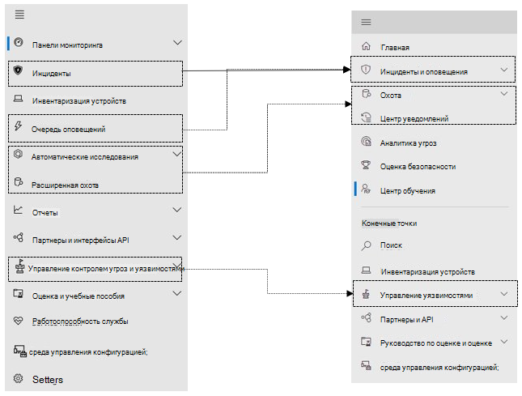

# Microsoft Defender для конечной точки в центре Microsoft 365 безопасности

[!INCLUDE [Microsoft 365 Defender rebranding](../includes/microsoft-defender.md)]

**Область применения:**

- [Microsoft 365 Defender](microsoft-365-defender.md)
- [Microsoft Defender для конечной точки](https://go.microsoft.com/fwlink/p/?linkid=2154037)
- [Microsoft Defender для Office 365](/microsoft-365/security/office-365-security/defender-for-office-365)

## Быстрая ссылка

На изображении и в таблице ниже перечислены изменения в навигации между Центр безопасности в Microsoft Defender и центром Microsoft 365 безопасности.

> [!div class="mx-imgBorder"]
> 

| Центр безопасности в Microsoft Defender | Центр безопасности Microsoft 365 |
|---------|---------|
| Панели мониторинга <ul><li>Операции, связанные с обеспечением безопасности</li><li>Аналитика угроз</li></ul>  |Главная <ul><li>Аналитика угроз</li></ul>   |
| Инциденты | Оповещений & инцидентов |
| Инвентаризация устройств | Инвентаризация устройств |
| Очередь оповещений | Оповещений & инцидентов |
| Автоматические исследования | Центр уведомлений |
| Расширенная охота | Охота |
| Отчеты | Отчеты |
| Партнеры & API | Партнеры & API |
| Управление & уязвимостей | Управление уязвимостями |
| Оценка и учебные пособия | Учебные & по оценке |
| среда управления конфигурацией; | среда управления конфигурацией; |
| Settings | Settings | 

Центр безопасности Microsoft 365 объединяет [возможности](overview-security-center.md) безопасности, которые защищают, обнаруживают, исследуют и реагируют на угрозы электронной почты, совместной работы, удостоверений и [https://security.microsoft.com](https://security.microsoft.com) устройств. Этот центр безопасности объединяет функциональные возможности существующих порталов безопасности Майкрософт, в том числе Центр безопасности в Microsoft Defender и центра Office 365 безопасности & соответствия требованиям.

Если вы знакомы с Центр безопасности в Microsoft Defender, в этой статье описаны некоторые изменения и улучшения в центре Microsoft 365 безопасности. Однако необходимо помнить о некоторых новых и обновленных элементах.

Исторически сложилось, [что Центр безопасности в Microsoft Defender](/windows/security/threat-protection/microsoft-defender-atp/portal-overview) является домом для Microsoft Defender для конечной точки. Enterprise группы безопасности использовали его для мониторинга и реагирования на оповещения о потенциальной постоянной активности угроз или нарушениях данных. Чтобы уменьшить число порталов, центр Microsoft 365 безопасности будет домом для мониторинга и управления безопасностью в вашей microsoft identities, data, devices, apps и infrastructure.

Microsoft Defender для конечной точки в центре Microsoft 365 безопасности поддерживает предоставление доступа к управляемым поставщикам служб безопасности [(MSSPs)](/windows/security/threat-protection/microsoft-defender-atp/grant-mssp-access) таким же образом, как и доступ к центру безопасности [Microsoft Defender.](mssp-access.md)

> [!IMPORTANT]
> То, что вы видите в центре Microsoft 365 безопасности, зависит от текущих подписок. Например, если у вас нет лицензии для Microsoft Defender для Office 365, то раздел & совместной работы не будет показан.

>[!Note]
>Новый единый портал не доступен для:
>- Сша облако сообщества для государственных организаций (GCC)
>- Высокая облако сообщества для государственных организаций (GCC high)
>- Министерство обороны США
>- Все государственные учреждения США с коммерческими лицензиями

Взгляните на улучшенный центр Microsoft 365 безопасности: [https://security.microsoft.com](https://security.microsoft.com) .

Дополнительные сведения о преимуществах: [Обзор центра безопасности Microsoft 365](overview-security-center.md)

## Что изменилось

В этой таблице можно быстро со ссылкой на изменения между Центр безопасности в Microsoft Defender и центром Microsoft 365 безопасности.

### Оповещений и действий

| Область | Описание изменения |
|---------|---------|
| [Оповещений & инцидентов](incidents-overview.md)  | В центре Microsoft 365 вы можете управлять инцидентами и оповещениями во всех конечных точках, электронной почте и удостоверениях. Мы сближались с опытом, чтобы легче находить связанные события. Дополнительные сведения см. в [обзоре инцидентов.](incidents-overview.md)   |
| [Охота](advanced-hunting-overview.md)  |  Изменение пользовательских правил обнаружения, созданных в Microsoft Defender для конечной точки, чтобы включить таблицы удостоверений и электронной почты, автоматически перемещает их в Microsoft 365 Defender. Соответствующие оповещения также будут отображаться в Microsoft 365 Defender. Дополнительные сведения об этих изменениях читайте в публикации ["Миграция пользовательских правил обнаружения".](advanced-hunting-migrate-from-mde.md#migrate-custom-detection-rules)   Таблица `DeviceAlertEvents` для продвинутой охоты недоступна в Microsoft 365 Defender. Чтобы запрашивать сведения об оповещении в Microsoft 365 Defender, можно использовать таблицы и таблицы для размещения дополнительных сведений из различных `AlertInfo` `AlertEvidence` источников. Создайте следующий запрос, связанный с устройством, [следуя запросам Write без DeviceAlertEvents.](advanced-hunting-migrate-from-mde.md#write-queries-without-devicealertevents)|
|[Центр уведомлений](m365d-action-center.md)    | Списки ожидающих и завершенных действий, принятых после автоматических расследований и действий по исправлению. Ранее центр действий в центре Центр безопасности в Microsoft Defender в списке ожидающих и завершенных действий по исправлению действий, принятых только на устройствах, в то время как автоматические расследования перечисляли оповещения и состояние. В центре безопасности Microsoft 365 центр действий объединяет действия по исправлению и расследования по электронной почте, устройствам и пользователям — все в одном расположении.  |
| [Аналитика угроз](threat-analytics.md) |  Перемещается в верхнюю часть панели навигации для упростить обнаружение и использование. Теперь включает сведения об угрозах как для конечных точек, так и для электронной почты и совместной работы.    |

### Конечные точки

| Область | Описание изменения |
|---------|---------|
|Поиск   |  Вместо того, чтобы быть в заголовке, в разделе Конечные точки перемещается панели поиска Microsoft Defender for Endpoint. Вы можете продолжать поиск устройств, файлов, пользователей, URL-адресов, IPs, уязвимостей, программного обеспечения и рекомендаций.  |
|[Панель мониторинга](/windows/security/threat-protection/microsoft-defender-atp/security-operations-dashboard)   |  Это панель мониторинга операций безопасности. Сведения о том, сколько активных оповещений было срабатывает, какие устройства находятся под угрозой, какие пользователи находятся в опасности, и уровень серьезности для оповещений, устройств и пользователей. Вы также можете узнать, есть ли у устройств проблемы с датчиками, общее состояние службы и как были обнаружены все неурегулированные оповещения. |
|Инвентаризация устройств | Никаких изменений. |
|[Управление уязвимостями](/windows/security/threat-protection/microsoft-defender-atp/next-gen-threat-and-vuln-mgt)    |    Имя было сокращено, чтобы поместиться в области навигации. Это то же самое, что в контроль угроз и уязвимостей, со всеми страницами внизу.     |
| Партнеры и API | Никаких изменений. |
| Оценки & руководства    |     Новые возможности тестирования и обучения.     |
| среда управления конфигурацией;   |  Никаких изменений.  |

> [!NOTE]
> **Автоматическое расследование и исправление** теперь являются частью инцидентов. События автоматического расследования и исправлений можно увидеть **на вкладке Incident > Investigation.**

> [!TIP]
> Поиск устройства делается из конечных точек > поиска.

### Доступ и отчеты

| Область | Описание изменения |
|---------|---------|
| Отчеты  | См. отчеты о конечных точках и &, включая защиту от угроз, здоровье и соответствие требованиям устройств, а также уязвимые устройства. |
| Здравоохранение  |  В настоящее время ссылки на страницу "Здоровье службы" в центре администрирования Microsoft 365 [службы.](https://admin.microsoft.com/) |
| Settings |  Управление настройками центра Microsoft 365, центра Microsoft 365, конечных точек, электронной почты &, удостоверений и обнаружения устройств.   |

## Microsoft 365 безопасности навигации и возможностей

Область навигации слева или панель быстрого запуска будет выглядеть по-прежнему. Однако в центре безопасности есть новые и обновленные элементы.

### Инциденты и оповещения

Объединяет управление инцидентами и оповещениями в электронной почте, устройствах и удостоверениях. Страница оповещений предоставляет полный контекст оповещения, объединяя сигналы атаки для создания подробной истории. Новый единый интерфейс теперь позволяет получить единое представление оповещений в рабочих нагрузках. Вы можете быстро рассмотреть, изучить и предпринять эффективные действия.

- [Дополнительные сведения об инцидентах](incidents-overview.md)
- [Узнайте больше об управлении оповещениями](investigate-alerts.md)

### Охота

Профилактический поиск угроз, вредоносных программ и вредоносных действий в конечных точках, почтовых ящиках Office 365 и других службах с помощью [запросов на расширенный поиск](advanced-hunting-overview.md). Эти мощные запросы можно использовать для поиска и анализа индикаторов и сущностями угроз как для известных, так и для потенциальных угроз.

[Настраиваемые правила](custom-detection-rules.md) обнаружения могут быть построены из расширенных запросов на охоту, чтобы помочь вам активно следить за событиями, которые могут свидетельствовать о нарушении и неправильной настройки устройств.

### Центр уведомлений

В центре уведомлений отображаются исследования, созданные средствами автоматического исследования и реагирования. Это автоматическое самовосстановление в Microsoft 365 Defender может помочь группам по обеспечению безопасности благодаря автоматическому реагированию на определенные события.

[Дополнительные информацию о центре действий](m365d-action-center.md).

### Аналитика угроз

Получите аналитику угроз от исследователей по безопасности Майкрософт Аналитика угроз помогает группам по обеспечению безопасности эффективнее выявлять возникающие угрозы. Что включено в аналитику угроз

- Обнаружения и меры, связанные с электронной почтой, в Microsoft Defender для Office 365. Это дополнение к данным конечной точки, уже доступным в Microsoft Defender для конечной точки.
- Просмотр инцидентов, связанных с угрозами.
- Улучшенные возможности для оперативного определения и использования информации о том, как действовать, в отчетах.

Вы можете получить доступ к аналитике угроз либо из верхней левой панели навигации в центре безопасности Microsoft 365, либо из выделенной карты мониторинга, которая отображает главные угрозы для организации.

Дополнительные данные о [отслеживании и реагировании](./threat-analytics.md)на возникающие угрозы с помощью аналитики угроз.

### Раздел Конечные точки

Просмотр и управление безопасностью конечных точек в организации. Если вы использовали Центр безопасности в Microsoft Defender, он будет выглядеть знакомым.

### Доступ и отчеты

Просмотр отчетов, изменение параметров и ролей пользователей.

### Подключения API SIEM

Если вы используете [API SIEM Defender для конечной](../defender-endpoint/enable-siem-integration.md)точки, вы можете продолжать это делать. В полезной нагрузке API добавлены новые ссылки, которые указывают на страницу оповещения или страницу инцидента на Microsoft 365 безопасности. Новые поля API включают LinkToMTP и IncidentLinkToMTP. Дополнительные сведения см. в перенаправлении учетных записей [из Microsoft Defender для конечной](./microsoft-365-security-mde-redirection.md)точки в центр Microsoft 365 безопасности.

### Оповещения электронной почты

Вы можете продолжить использование оповещений электронной почты для Defender для конечной точки. Мы добавили новые ссылки в сообщениях электронной почты, которые указывают на страницу оповещения или страницу инцидента в центре Microsoft 365 безопасности. Дополнительные сведения см. в перенаправлении учетных записей [из Microsoft Defender для конечной](./microsoft-365-security-mde-redirection.md)точки в центр Microsoft 365 безопасности.

### Поставщики управляемых служб безопасности (MSSP)

Вход для нескольких клиентов одновременно в одном сеансе просмотра в настоящее время не поддерживается на едином портале. Вы можете отказаться от автоматического перенаправления, возвращаясь к бывшему порталу [Microsoft Defender для конечных](microsoft-365-security-mde-redirection.md#can-i-go-back-to-using-the-former-portal)точек, чтобы сохранить эту функцию до решения проблемы.

## Статьи по теме

- [Центр безопасности Microsoft 365](overview-security-center.md)
- [Microsoft Defender для конечной точки в центре Microsoft 365 безопасности](microsoft-365-security-center-mde.md)
- [Перенаправление учетных записей из Microsoft Defender для конечной точки в центр Microsoft 365 безопасности](microsoft-365-security-mde-redirection.md)
