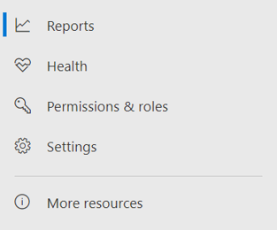

# Microsoft Defender для конечной точки в Microsoft 365 DefenderMicrosoft Defender for Endpoint in Microsoft 365 Defender

[!INCLUDE [Microsoft 365 Defender rebranding](../includes/microsoft-defender.md)]

**Область применения:****Applies to:**

- [Microsoft 365 DefenderMicrosoft 365 Defender](microsoft-365-defender.md)
- [Microsoft Defender для конечной точкиMicrosoft Defender for Endpoint](https://go.microsoft.com/fwlink/p/?linkid=2154037)

## Быстрая ссылкаQuick reference

На изображении и в таблице ниже перечислены изменения в навигации между Центр безопасности в Microsoft Defender и Microsoft 365 Defender.The image and the table below lists the changes in navigation between the Microsoft Defender Security Center and Microsoft 365 Defender.

> [!div class="mx-imgBorder"]
> 

| Центр безопасности в Microsoft DefenderMicrosoft Defender Security Center | Microsoft 365 DefenderMicrosoft 365 Defender |
|---------|---------|
| Панели мониторингаDashboards <ul><li>Операции, связанные с обеспечением безопасностиSecurity Operations</li><li>Аналитика угрозThreat Analytics</li></ul>  |ГлавнаяHome <ul><li>Аналитика угрозThreat analytics</li></ul>   |
| ИнцидентыIncidents | Оповещений & инцидентовIncidents & alerts |
| Инвентаризация устройствDevice inventory | Инвентаризация устройствDevice inventory |
| Очередь оповещенийAlerts queue | Оповещений & инцидентовIncidents & alerts |
| Автоматические исследованияAutomated investigations | Центр уведомленийAction center |
| Расширенная охотаAdvanced hunting | ОхотаHunting |
| ОтчетыReports | ОтчетыReports |
| Партнеры & APIPartners & APIs | Партнеры & APIPartners & APIs |
| Управление & уязвимостейThreat & Vulnerability Management | Управление уязвимостямиVulnerability management |
| Оценка и учебные пособияEvaluation and tutorials | Учебные & по оценкеEvaluation & tutorials |
| среда управления конфигурацией;Configuration management | среда управления конфигурацией;Configuration management |
| ПараметрыSettings | ПараметрыSettings | 

Улучшенный Microsoft 365 [Defender объединяет возможности безопасности,](overview-security-center.md) которые защищают, обнаруживают, исследуют и реагируют на угрозы электронной почты, совместной работы, удостоверений и [https://security.microsoft.com](https://security.microsoft.com) устройств.The improved [Microsoft 365 Defender](overview-security-center.md) at [https://security.microsoft.com](https://security.microsoft.com) combines security capabilities that protect, detect, investigate, and respond to email, collaboration, identity, and device threats. Это объединяет функциональные возможности существующих порталов безопасности Майкрософт, в том числе Центр безопасности в Microsoft Defender и центра Office 365 безопасности & соответствия требованиям.This  brings together functionality from existing Microsoft security portals, including Microsoft Defender Security Center and the Office 365 Security & Compliance center.

Если вы знакомы с Центр безопасности в Microsoft Defender, в этой статье описаны некоторые изменения и улучшения в Microsoft 365 Defender.If you're familiar with the Microsoft Defender Security Center, this article helps describe some of the changes and improvements in Microsoft 365 Defender. Однако необходимо помнить о некоторых новых и обновленных элементах.However there are some new and updated elements to be aware of.

Исторически сложилось, [что Центр безопасности в Microsoft Defender](/windows/security/threat-protection/microsoft-defender-atp/portal-overview) является домом для Microsoft Defender для конечной точки.Historically, the [Microsoft Defender Security Center](/windows/security/threat-protection/microsoft-defender-atp/portal-overview) has been the home for Microsoft Defender for Endpoint. Enterprise группы безопасности использовали его для мониторинга и реагирования на оповещения о потенциальной постоянной активности угроз или нарушениях данных.Enterprise security teams have used it to monitor and help responding to alerts of potential advanced persistent threat activity or data breaches. Чтобы уменьшить число порталов, Microsoft 365 Defender будет домом для мониторинга и управления безопасностью в ваших удостоверениях, данных, устройствах, приложениях и инфраструктуре Майкрософт.To help reduce the number of portals, Microsoft 365 Defender will be the home for monitoring and managing security across your Microsoft identities, data, devices, apps, and infrastructure.

Microsoft Defender для конечной точки в Microsoft 365 Defender поддерживает предоставление доступа к управляемым поставщикам служб безопасности [(MSSPs)](/windows/security/threat-protection/microsoft-defender-atp/grant-mssp-access) таким же образом, как и доступ к центру безопасности [Microsoft Defender.](mssp-access.md)Microsoft Defender for Endpoint in Microsoft 365 Defender supports [granting access to managed security service providers (MSSPs)](/windows/security/threat-protection/microsoft-defender-atp/grant-mssp-access) in the same way [access is granted in the Microsoft Defender security center](mssp-access.md).

> [!IMPORTANT]
> То, что вы видите в Microsoft 365 Defender, зависит от текущих подписок.What you see in Microsoft 365 Defender depends on your current subscriptions. Например, если у вас нет лицензии для Microsoft Defender для Office 365, то раздел & совместной работы не будет показан.For example, if you don't have a license for Microsoft Defender for Office 365, then the Email & Collaboration section will not be shown.

> [!Note]
> Microsoft 365 Defender не доступен для:Microsoft 365 Defender is not available for:
>- Сша облако сообщества для государственных организаций (GCC)US Government Community Cloud (GCC)
>- Высокая облако сообщества для государственных организаций (GCC high)US Government Community Cloud High (GCC High)
>- Министерство обороны СШАUS Department of Defense
>- Все государственные учреждения США с коммерческими лицензиямиAll US government institutions with commercial licenses

Взгляните на Microsoft 365 Defender: [https://security.microsoft.com](https://security.microsoft.com) .Take a look at Microsoft 365 Defender: [https://security.microsoft.com](https://security.microsoft.com).

Дополнительные сведения о преимуществах: [Обзор Microsoft 365 Defender](overview-security-center.md)Learn more about the benefits: [Overview of Microsoft 365 Defender](overview-security-center.md)

## Что изменилосьWhat's changed

Эта таблица является краткой ссылкой на изменения между Центр безопасности в Microsoft Defender и Microsoft 365 Defender.This table is a quick reference of the changes between the Microsoft Defender Security Center and Microsoft 365 Defender.

### Оповещений и действийAlerts and actions

| ОбластьArea | Описание измененияDescription of change |
|---------|---------|
| [Оповещений & инцидентовIncidents & alerts](incidents-overview.md)  | В Microsoft 365 Defender вы можете управлять инцидентами и оповещениями во всех конечных точках, электронной почте и удостоверениях.In Microsoft 365 Defender, you can manage incidents and alerts across all of your endpoints, email, and identities. Мы сближались с опытом, чтобы легче находить связанные события.We've converged the experience to help you find related events more easily. Дополнительные сведения см. в [обзоре инцидентов.](incidents-overview.md)For more information, see [Incidents Overview](incidents-overview.md).   |
| [ОхотаHunting](advanced-hunting-overview.md)  |  Изменение пользовательских правил обнаружения, созданных в Microsoft Defender для конечной точки, чтобы включить таблицы удостоверений и электронной почты, автоматически перемещает их в Microsoft 365 Defender.Modifying custom detection rules created in Microsoft Defender for Endpoint to include identity and email tables automatically moves them to Microsoft 365 Defender. Соответствующие оповещения также будут отображаться в Microsoft 365 Defender.Their corresponding alerts will also appear in Microsoft 365 Defender. Дополнительные сведения об этих изменениях читайте в публикации ["Миграция пользовательских правил обнаружения".](advanced-hunting-migrate-from-mde.md#migrate-custom-detection-rules)For more details about these changes, read [Migrate custom detection rules](advanced-hunting-migrate-from-mde.md#migrate-custom-detection-rules).   Таблица `DeviceAlertEvents` для продвинутой охоты недоступна в Microsoft 365 Defender.The `DeviceAlertEvents` table for advanced hunting isn't available in Microsoft 365 Defender. Чтобы запрашивать сведения об оповещении в Microsoft 365 Defender, можно использовать таблицы и таблицы для размещения дополнительных сведений из различных `AlertInfo` `AlertEvidence` источников.To query device-specific alert information in Microsoft 365 Defender, you can use the `AlertInfo` and `AlertEvidence` tables to accommodate even more information from a diverse set of sources. Создайте следующий запрос, связанный с устройством, [следуя запросам Write без DeviceAlertEvents.](advanced-hunting-migrate-from-mde.md#write-queries-without-devicealertevents)Craft your next device-related query by following [Write queries without DeviceAlertEvents](advanced-hunting-migrate-from-mde.md#write-queries-without-devicealertevents).|
|[Центр уведомленийAction center](m365d-action-center.md)    | Списки ожидающих и завершенных действий, принятых после автоматических расследований и действий по исправлению.Lists pending and completed actions that were taken following automated investigations and remediation actions. Ранее центр действий в центре Центр безопасности в Microsoft Defender в списке ожидающих и завершенных действий по исправлению действий, принятых только на устройствах, в то время как автоматические расследования перечисляли оповещения и состояние.Formerly, the Action center in the Microsoft Defender Security Center listed pending and completed actions for remediation actions taken on devices only, while Automated investigations listed alerts and status. В улучшенной Microsoft 365 Defender центр действий объединяет действия по исправлению и расследования по электронной почте, устройствам и пользователям — все в одном расположении.In the  improved Microsoft 365 Defender, the Action center brings together remediation actions and investigations across email, devices, and users—all in one location.  |
| [Аналитика угрозThreat analytics](threat-analytics.md) |  Перемещается в верхнюю часть панели навигации для упростить обнаружение и использование.Moved to the top of the navigation bar for easier discovery and use. Теперь включает сведения об угрозах как для конечных точек, так и для электронной почты и совместной работы.Now includes threat information for both endpoints and email and collaboration.    |

### Конечные точкиEndpoints

| ОбластьArea | Описание измененияDescription of change |
|---------|---------|
|ПоискSearch   |  Вместо того, чтобы быть в заголовке, в разделе Конечные точки перемещается панели поиска Microsoft Defender for Endpoint.Instead of being in the heading, Microsoft Defender for Endpoint search bar is moving under the Endpoints section. Вы можете продолжать поиск устройств, файлов, пользователей, URL-адресов, IPs, уязвимостей, программного обеспечения и рекомендаций.You can continue to search for devices, files, users, URLs, IPs, vulnerabilities, software, and recommendations.  |
|[Панель мониторингаDashboard](/windows/security/threat-protection/microsoft-defender-atp/security-operations-dashboard)   |  Это панель мониторинга операций безопасности.This is your security operations dashboard. Сведения о том, сколько активных оповещений было срабатывает, какие устройства находятся под угрозой, какие пользователи находятся в опасности, и уровень серьезности для оповещений, устройств и пользователей.See an overview of how many active alerts were triggered, which devices are at risk, which users are at risk, and severity level for alerts, devices, and users. Вы также можете узнать, есть ли у устройств проблемы с датчиками, общее состояние службы и как были обнаружены все неурегулированные оповещения.You can also see if any devices have sensor issues, your overall service health, and how any unresolved alerts were detected. |
|Инвентаризация устройствDevice inventory | Никаких изменений.No changes. |
|[Управление уязвимостямиVulnerability management](/windows/security/threat-protection/microsoft-defender-atp/next-gen-threat-and-vuln-mgt)    |    Имя было сокращено, чтобы поместиться в области навигации.Name was shortened to fit in the navigation pane. Это то же самое, что в контроль угроз и уязвимостей, со всеми страницами внизу.It's the same as the threat and vulnerability management section, with all the pages underneath.     |
| Партнеры и APIPartners and APIs | Никаких изменений.No changes. |
| Оценки & руководстваEvaluations & tutorials    |     Новые возможности тестирования и обучения.New testing and learning capabilities.     |
| среда управления конфигурацией;Configuration management   |  Никаких изменений.No changes.  |

> [!NOTE]
> **Автоматическое расследование и исправление** теперь являются частью инцидентов.**Automatic investigation and remediation** is now a part of  incidents. События автоматического расследования и исправлений можно увидеть **на вкладке Incident > Investigation.**You can see Automated  investigation and remediation events in the **Incident > Investigation** tab.

> [!TIP]
> Поиск устройства делается из конечных точек > поиска.Device search is done from Endpoints > Search.

### Доступ и отчетыAccess and reporting

| ОбластьArea | Описание измененияDescription of change |
|---------|---------|
| ОтчетыReports  | См. отчеты о конечных точках и &, включая защиту от угроз, здоровье и соответствие требованиям устройств, а также уязвимые устройства.See reports for endpoints and email & collaboration, including Threat protection, Device health and compliance, and Vulnerable devices. |
| ЗдравоохранениеHealth  |  В настоящее время ссылки на страницу "Здоровье службы" в центре администрирования Microsoft 365 [службы.](https://admin.microsoft.com/)Currently links out to the "Service health" page in the [Microsoft 365 admin center](https://admin.microsoft.com/). |
| ПараметрыSettings |  Управление настройками для Microsoft 365, конечных точек, электронной почты & совместной работы, удостоверений и обнаружения устройств.Manage your settings for Microsoft 365 Defender, Endpoints, Email & collaboration, Identities, and Device discovery.   |

## Microsoft 365 безопасности навигации и возможностейMicrosoft 365 security navigation and capabilities

Область навигации слева или панель быстрого запуска будет выглядеть по-прежнему.The left navigation, or quick launch bar, will look familiar. Однако в центре безопасности есть новые и обновленные элементы.However, there are some new and updated elements in this security center.

### Инциденты и оповещенияIncidents and alerts

Объединяет управление инцидентами и оповещениями в электронной почте, устройствах и удостоверениях.Brings together incident and alert management across your email, devices, and identities. Страница оповещений предоставляет полный контекст оповещения, объединяя сигналы атаки для создания подробной истории.The alert page provides full context to the alert by combining attack signals to construct a detailed story. Новый единый интерфейс теперь позволяет получить единое представление оповещений в рабочих нагрузках.A new, unified experience now brings together a consistent view of alerts across workloads. Вы можете быстро рассмотреть, изучить и предпринять эффективные действия.You can quickly triage, investigate, and take effective action.

- [Дополнительные сведения об инцидентахLearn more about incidents](incidents-overview.md)
- [Узнайте больше об управлении оповещениямиLearn more about managing alerts](investigate-alerts.md)

### ОхотаHunting

Профилактический поиск угроз, вредоносных программ и вредоносных действий в конечных точках, почтовых ящиках Office 365 и других службах с помощью [запросов на расширенный поиск](advanced-hunting-overview.md).Proactively search for threats, malware, and malicious activity across your endpoints, Office 365 mailboxes, and more by using [advanced hunting queries](advanced-hunting-overview.md). Эти мощные запросы можно использовать для поиска и анализа индикаторов и сущностями угроз как для известных, так и для потенциальных угроз.These powerful queries can be used to locate and review threat indicators and entities for both known and potential threats.

[Настраиваемые правила](custom-detection-rules.md) обнаружения могут быть построены из расширенных запросов на охоту, чтобы помочь вам активно следить за событиями, которые могут свидетельствовать о нарушении и неправильной настройки устройств.[Custom detection rules](custom-detection-rules.md) can be built from advanced hunting queries to help you proactively watch for events that might be indicative of breach activity and misconfigured devices.

### Центр уведомленийAction center

В центре уведомлений отображаются исследования, созданные средствами автоматического исследования и реагирования.Action center shows you the investigations created by automated investigation and response capabilities. Это автоматическое самовосстановление в Microsoft 365 Defender может помочь группам по обеспечению безопасности благодаря автоматическому реагированию на определенные события.This automated, self-healing in Microsoft 365 Defender can help security teams by automatically responding to specific events.

[Дополнительные информацию о центре действий](m365d-action-center.md).[Learn more about the Action center](m365d-action-center.md).

### Аналитика угрозThreat Analytics

Получите аналитику угроз от исследователей по безопасности МайкрософтGet threat intelligence from expert Microsoft security researchers. Аналитика угроз помогает группам по обеспечению безопасности эффективнее выявлять возникающие угрозы.Threat Analytics helps security teams be more efficient when facing emerging threats. Что включено в аналитику угрозThreat Analytics includes:

- Обнаружения и меры, связанные с электронной почтой, в Microsoft Defender для Office 365.Email-related detections and mitigations from Microsoft Defender for Office 365. Это дополнение к данным конечной точки, уже доступным в Microsoft Defender для конечной точки.This is in addition to the endpoint data already available from Microsoft Defender for Endpoint.
- Просмотр инцидентов, связанных с угрозами.Incidents view related to the threats.
- Улучшенные возможности для оперативного определения и использования информации о том, как действовать, в отчетах.Enhanced experience for quickly identifying and using actionable information in the reports.

Вы можете получить доступ к аналитике угроз либо из верхней левой панели навигации в Microsoft 365 Defender, либо из выделенной карты мониторинга, которая отображает главные угрозы для организации.You can access threat analytics either from the upper left navigation bar in Microsoft 365 Defender, or from a dedicated dashboard card that shows the top threats for your organization.

Дополнительные данные о [отслеживании и реагировании](./threat-analytics.md)на возникающие угрозы с помощью аналитики угроз.Learn more about how to [track and respond to emerging threats with threat analytics](./threat-analytics.md).

### Раздел Конечные точкиEndpoints section

Просмотр и управление безопасностью конечных точек в организации.View and manage the security of endpoints in your organization. Если вы использовали Центр безопасности в Microsoft Defender, он будет выглядеть знакомым.If you've used the Microsoft Defender Security Center, it will look familiar.

### Доступ и отчетыAccess and reports

Просмотр отчетов, изменение параметров и ролей пользователей.View reports, change your settings, and modify user roles.

### Подключения API SIEMSIEM API connections

Если вы используете [API SIEM Defender для конечной](../defender-endpoint/enable-siem-integration.md)точки, вы можете продолжать это делать.If you use the [Defender for Endpoint SIEM API](../defender-endpoint/enable-siem-integration.md), you can continue to do so. В полезной нагрузке API добавлены новые ссылки, которые указывают на страницу оповещения или страницу инцидента на Microsoft 365 безопасности.We’ve added new links on the API payload that point to the alert page or the incident page in the Microsoft 365 security portal. Новые поля API включают LinkToMTP и IncidentLinkToMTP.New API fields include LinkToMTP and IncidentLinkToMTP. Дополнительные сведения см. в [перенаправлении учетных записей из Microsoft Defender для конечной точки в Microsoft 365 Defender.](./microsoft-365-security-mde-redirection.md)For more information, see [Redirecting accounts from Microsoft Defender for Endpoint to Microsoft 365 Defender](./microsoft-365-security-mde-redirection.md).

### Оповещения электронной почтыEmail alerts

Вы можете продолжить использование оповещений электронной почты для Defender для конечной точки.You can continue to use email alerts for Defender for Endpoint. Мы добавили новые ссылки в сообщениях электронной почты, которые указывают на страницу оповещений или на страницу инцидента в Microsoft 365 Defender.We've added new links in the emails that point to the alert page or the incident page in Microsoft 365 Defender. Дополнительные сведения см. в [перенаправлении учетных записей из Microsoft Defender для конечной точки в Microsoft 365 Defender.](./microsoft-365-security-mde-redirection.md)For more information, see [Redirecting accounts from Microsoft Defender for Endpoint to Microsoft 365 Defender](./microsoft-365-security-mde-redirection.md).

### Поставщики управляемых служб безопасности (MSSP)Managed Security Service Providers (MSSP)

Вход для нескольких клиентов одновременно в одном сеансе просмотра в настоящее время не поддерживается на едином портале.Logging in to multiple tenants simultaneously in the same browsing session is currently not supported in the unified portal. Вы можете отказаться от автоматического перенаправления, возвращаясь к бывшему порталу [Microsoft Defender для конечных](microsoft-365-security-mde-redirection.md#can-i-go-back-to-using-the-former-portal)точек, чтобы сохранить эту функцию до решения проблемы.You can opt-out of the automatic redirection by [reverting to the former Microsoft Defender for Endpoint portal](microsoft-365-security-mde-redirection.md#can-i-go-back-to-using-the-former-portal), to maintain this functionality until the issue is resolved.

## Статьи по темеRelated information

- [Microsoft 365 DefenderMicrosoft 365 Defender](overview-security-center.md)
- [Microsoft Defender для конечной точки в Microsoft 365 DefenderMicrosoft Defender for Endpoint in Microsoft 365 Defender](microsoft-365-security-center-mde.md)
- [Перенаправление учетных записей из Microsoft Defender для конечной точки в Microsoft 365 DefenderRedirecting accounts from Microsoft Defender for Endpoint to Microsoft 365 Defender](microsoft-365-security-mde-redirection.md)
