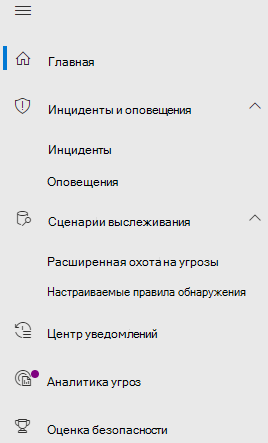

# Microsoft Defender для Office 365 в Microsoft 365 Defender

[!INCLUDE [Microsoft 365 Defender rebranding](../includes/microsoft-defender.md)]

**Область применения:**
- [Microsoft 365 Defender](microsoft-365-defender.md)
- [Microsoft Defender для Office 365](/microsoft-365/security/office-365-security/defender-for-office-365)

## Быстрая ссылка

В таблице ниже перечислены изменения в навигации между центром Office 365 безопасности & и Microsoft 365 Defender.

 

****

|[Office 365 Соответствие требованиям & безопасности](https://protection.office.com)|[Microsoft 365 Defender](https://security.microsoft.com)|[Центр соответствия требованиям Microsoft 365](https://compliance.microsoft.com/homepage)|[Центр администрирования Exchange](https://admin.exchange.microsoft.com/#/)|
|---|---|---|---|
|Оповещения|<ul><li>[Политики оповещения](https://security.microsoft.com/alertpolicies)</li><li>[Оповещений & инцидентов](https://security.microsoft.com/alerts)</li></ul>|[Страница Оповещений](https://compliance.microsoft.com/homepage)||
|Классификация||См. [Центр соответствия требованиям Microsoft 365](https://compliance.microsoft.com/homepage)||
|Защита от потери данных||См. [Центр соответствия требованиям Microsoft 365](https://compliance.microsoft.com/homepage)||
|Управление записями||См. [Центр соответствия требованиям Microsoft 365](https://compliance.microsoft.com/homepage)||
|Управление информацией||См. [Центр соответствия требованиям Microsoft 365](https://compliance.microsoft.com/homepage)||
|Управление угрозами|[Совместное & электронной почты](https://security.microsoft.com/homepage)|||
|Разрешения|[Разрешения & ролей](https://security.microsoft.com/emailandcollabpermissions)|См. [Центр соответствия требованиям Microsoft 365](https://compliance.microsoft.com/homepage)||
|Поток обработки почты|||См. [Exchange центр администрирования](https://admin.exchange.microsoft.com/#/)|
|Конфиденциальность данных||См. [Центр соответствия требованиям Microsoft 365](https://compliance.microsoft.com/homepage)||
|Поиск|[Audit](https://security.microsoft.com/auditlogsearch?viewid=Async%20Search)|Поиск (поиск контента)||
|Отчеты|[Отчет](https://security.microsoft.com/emailandcollabreport)|||
|Контроль качества обслуживания||См. [Центр соответствия требованиям Microsoft 365](https://compliance.microsoft.com/homepage)||
|Контроль||См. [Центр соответствия требованиям Microsoft 365](https://compliance.microsoft.com/homepage)||
|Обнаружение электронных данных||См. [Центр соответствия требованиям Microsoft 365](https://compliance.microsoft.com/homepage)||

[Microsoft 365 Defender](./overview-security-center.md) объединяет возможности безопасности из существующих порталов безопасности Майкрософт, включая центр Office 365 безопасности <https://security.microsoft.com> & соответствия требованиям. Усовершенствованный центр помогает группам безопасности более эффективно защитить организацию от угроз.

Если вы знакомы с порталом Office 365 безопасности и соответствия требованиям (protection.office.com), в этой статье описываются некоторые изменения и улучшения в Microsoft 365 Defender.

Дополнительные сведения о преимуществах: [Обзор Microsoft 365 Defender](overview-security-center.md)

Если вы ищете элементы, связанные с соответствием требованиям, посетите [Центр соответствия требованиям Microsoft 365](https://compliance.microsoft.com/homepage).

## Новые и улучшенные возможности

Область навигации слева или панель быстрого запуска будет выглядеть по-прежнему. Однако в центре безопасности есть новые и обновленные элементы.

С помощью единого Microsoft 365 Defender можно сшить вместе сигналы угрозы и определить всю область и влияние угрозы, а также то, как она в настоящее время влияет на организацию.

:::image type="content" source="../../media/M365-defender-converge-experience.png" alt-text="Изображение Microsoft 365 Defender сходного опыта":::

Defender for Office 365 защищает организацию от вредоносных угроз, создаваемых электронными сообщениями, ссылками (URL-адресами) и средствами совместной работы.

:::image type="content" source="../../media/Defender-for-O365.png" alt-text="Изображение Defender для Office 365":::

### Инциденты и оповещения

Объединяет управление инцидентами и оповещениями в электронной почте, устройствах и удостоверениях. Оповещения теперь доступны в узле "Исследование" и помогают получить более широкое представление об атаке. На странице оповещения приводится полный контекст оповещения благодаря объединению сигналов атаки для создания подробной статьи. Ранее оповещения относились конкретно к разным рабочим нагрузкам. Новый единый интерфейс теперь позволяет получить единое представление оповещений в рабочих нагрузках. Вы можете быстро рассмотреть, изучить и предпринять эффективные действия.

- [Дополнительные сведения об исследованиях](incidents-overview.md)
- [Узнайте больше об управлении оповещениями](/windows/security/threat-protection/microsoft-defender-atp/review-alerts)

### Охота

Профилактический поиск угроз, вредоносных программ и вредоносных действий в конечных точках, почтовых ящиках Office 365 и других службах с помощью [запросов на расширенный поиск](advanced-hunting-overview.md). Эти мощные запросы можно использовать для поиска и просмотра индикаторов угроз и сущностей как известных, так и потенциальных угроз.

[Настраиваемые правила](/windows/security/threat-protection/microsoft-defender-atp/custom-detection-rules) обнаружения могут быть построены из расширенных запросов на охоту, чтобы помочь вам активно следить за событиями, которые могут свидетельствовать о нарушении и неправильной настройки устройств.

Вот пример [для продвинутой охоты](advanced-hunting-example.md) в Microsoft Defender для Office 365.  

### Центр уведомлений

В центре уведомлений отображаются исследования, созданные средствами автоматического исследования и реагирования. Это автоматическое самовосстановление в Microsoft 365 Defender может помочь группам по обеспечению безопасности благодаря автоматическому реагированию на определенные события.

Дополнительные информацию о [центре действий](m365d-action-center.md).

#### Аналитика угроз

Получите аналитику угроз от исследователей по безопасности Майкрософт Аналитика угроз помогает группам по обеспечению безопасности эффективнее выявлять возникающие угрозы. Что включено в аналитику угроз

- Обнаружения и меры, связанные с электронной почтой, в Microsoft Defender для Office 365. Это дополнение к данным конечной точки, уже доступным в Microsoft Defender для конечной точки.
- Просмотр инцидентов, связанных с угрозами.
- Улучшенные возможности для оперативного определения и использования информации о том, как действовать, в отчетах.

Вы можете получить доступ к аналитике угроз либо из верхней левой панели навигации в Microsoft 365 Defender, либо из выделенной карты мониторинга, которая отображает главные угрозы для организации.

Дополнительные данные о [отслеживании и реагировании](./threat-analytics.md)на возникающие угрозы с помощью аналитики угроз.

### Совместная работа в электронной почте

Отслеживайте и исследуйте угрозы электронной почте пользователей, отслеживайте кампании и так далее. Если вы использовали Центр безопасности и соответствия требованиям Office 365, вы увидите много схожего.

:::image type="content" source="../../media/converge-3-email-and-collab-new.png" alt-text="Меню быстрого запуска для электронной почты & Collab (или MSDO) слева от Microsoft 365 Defender.":::

#### Страница сущности электронной почты 

Страница [сущности электронной почты](../office-365-security/mdo-email-entity-page.md) *объединяет сведения* электронной почты, которые были разбросаны по разным страницам или представлениям в прошлом. *Централизовано* изучение электронной почты на предмет угроз и тенденций. Предварительный просмотр сведений о верхнем колонтитуле и электронной почты доступны на той же странице электронной почты вместе с другие полезными сведениями, связанными с электронной почтой. Также на вкладке той же страницы.отображается статус отключения вложений для вредоносных файлов или URL-адресов. Страница сущности электронной почты позволяет администраторам и группа по обеспечению безопасности операций оперативно понять угрозу для электронной почты и ее статус, а затем также оперативно выбрать, как ее обработать.

### Доступ и отчеты

Просмотр отчетов, изменение параметров и ролей пользователей.

:::image type="content" source="../../media/converge-4-access-and-reporting-new.png" alt-text="Меню быстрого запуска для Microsoft 365 Defender разрешений и отчетов слева от центра безопасности.":::

> [!NOTE]
> DomainKeys Identified Mail (DKIM) гарантирует, что системы назначения электронной почты доверяют сообщениям, отправленным исходящие из настраиваемого домена.
> Для defender для Office 365 теперь можно  управлять и вращать клавиши DKIM с помощью Microsoft 365 Defender: или перейти к политике & правил политики <https://security.microsoft.com/threatpolicy>  \>  \> **DKIM**.
> 
> Дополнительные сведения см. в ссылке Использование DKIM для проверки исходящие сообщения электронной [почты, отправленной из настраиваемого домена.](/microsoft-365/security/office-365-security/use-dkim-to-validate-outbound-email)

## Что изменилось

Эта таблица представляет собой быструю ссылку на управление угрозами, в которой произошли изменения между центром **&** безопасности и **Microsoft 365 Defender порталом.** Чтобы узнать больше об этих областях, пройдите по ссылкам.

 

****

|Область|Описание изменения|
|---|---|
|[Исследование](../office-365-security/office-365-air.md#changes-are-coming-soon-in-your-microsoft-365-defender-portal)|Объединяет возможности AIR в [Defender для Office 365](/microsoft-365/security/office-365-security/defender-for-office-365) и [Defender для конечной точки](../defender-endpoint/automated-investigations.md). Благодаря описанным обновлениям и улучшениям группа по обеспечению безопасности операций сможет просматривать подробные сведения об автоматизированных исследованиях и действиях по исправлению в вашей электронной почте, содержимом для совместной работы, учетных записях пользователей и устройствах в одном месте.|
|[Очередь оповещений](../../compliance/alert-policies.md)|Поле **оповещений** об оповещении в центре Office безопасности и соответствия требованиям теперь включает ссылки на Microsoft 365 Defender. Нажмите на ссылку **Открытая** страница оповещения и Microsoft 365 Defender откроется. Чтобы получить доступ к странице **Просмотр оповещений**, щелкните любое оповещение Office 365 в списке оповещений.|
|[Обучение с имитацией атаки](../office-365-security/attack-simulation-training-insights.md)|Используйте учебные курсы с имитацией атак для запуска реалистичных сценариев атак в организации. Такие имитированные атаки позволяют обучить сотрудников перед тем, как организация столкнется с реальными атаками. Обучение с имитацией атак включает в себя дополнительные параметры, расширенные отчеты и улучшенные потоки обучения, которые упрощают доставку сценариев имитации атак и обучения и управление ими.|
|

В этих областях без изменений:

- [Обозреватель](../office-365-security/threat-explorer.md)
- [Политики и правила](../../compliance/alert-policies.md)
- [Кампания](../office-365-security/campaigns.md)
- [Сданные работы](../office-365-security/admin-submission.md).
- [Проверка](./m365d-action-center.md)
- [Трекер угроз](../office-365-security/threat-trackers.md)

Кроме того, ознакомьтесь с разделом **Дополнительные сведения** в нижней части этой статьи.

> [!IMPORTANT]
> Портал Microsoft 365 Defender <https://security.microsoft.com> () объединяет функции безопасности <https://securitycenter.windows.com> в и <https://protection.office.com> . Однако то, что вы увидите, зависит от вашей подписки. Если у вас есть только Microsoft Defender для Office 365 (план 1 или 2), например в качестве автономных подписок, вы не увидите функций безопасности для конечных точек, а клиенты Defender для Office (план 1) не увидят такие элементы, как Threat Analytics.

> [!TIP]
> Все Exchange Online Protection (EOP) будут включены в Microsoft 365 Defender, так как EOP является основным элементом Defender для Office 365.

## Microsoft 365 Defender Главная страница

На домашней странице портала всплыла важная сводная информация о состоянии безопасности Microsoft 365 среды.

С помощью **Интерактивного обзора** можно быстро найти конечную точку или страницы электронной почты и совместной работы. Обратите внимание, что то, что вы видите здесь, зависит от того, есть ли у вас лицензия на Defender для Office 365 и (или) Defender для конечной точки.

Кроме того, для сравнения приведена ссылка на **Центр безопасности и соответствия требованиям Office 365**. Последняя ссылка — на страницу **Новые возможности** с описанием последних обновлений.

## Статьи по теме

- [Перенаправление Центра безопасности и соответствия требованиям Office 365 в Microsoft 365 Defender](microsoft-365-security-mdo-redirection.md)
- [Центр уведомлений](./m365d-action-center.md)
- [Уведомления об электронной почте и совместной работе](../../compliance/alert-policies.md#default-alert-policies)
- [Правила настраиваемого обнаружения](/microsoft-365/security/defender-endpoint/custom-detection-rules)
- [Создание имитации фишинговых атак](../office-365-security/attack-simulation-training.md) и [создание полезных данных для обучения сотрудников](../office-365-security/attack-simulation-training-payloads.md)
