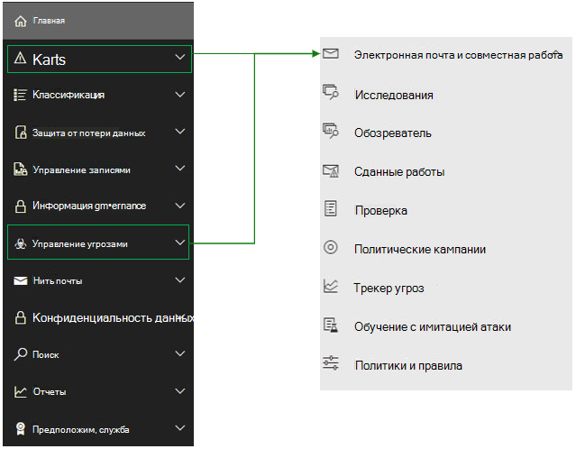

# <a name="microsoft-defender-for-office-365-in-microsoft-365-defender"></a><span data-ttu-id="42a7a-104">Защитник Майкрософт для Office 365 в Microsoft 365 Defender</span><span class="sxs-lookup"><span data-stu-id="42a7a-104">Microsoft Defender for Office 365 in Microsoft 365 Defender</span></span>

[!INCLUDE [Microsoft 365 Defender rebranding](../includes/microsoft-defender.md)]

<span data-ttu-id="42a7a-105">**Область применения:**</span><span class="sxs-lookup"><span data-stu-id="42a7a-105">**Applies to:**</span></span>
- [<span data-ttu-id="42a7a-106">Microsoft 365 Defender</span><span class="sxs-lookup"><span data-stu-id="42a7a-106">Microsoft 365 Defender</span></span>](microsoft-365-defender.md)
- [<span data-ttu-id="42a7a-107">Microsoft Defender для конечной точки</span><span class="sxs-lookup"><span data-stu-id="42a7a-107">Microsoft Defender for Endpoint</span></span>](https://go.microsoft.com/fwlink/p/?linkid=2154037)
- [<span data-ttu-id="42a7a-108">Microsoft Defender для Office 365</span><span class="sxs-lookup"><span data-stu-id="42a7a-108">Microsoft Defender for Office 365</span></span>](/microsoft-365/security/office-365-security/defender-for-office-365)

## <a name="quick-reference"></a><span data-ttu-id="42a7a-109">Быстрая ссылка</span><span class="sxs-lookup"><span data-stu-id="42a7a-109">Quick reference</span></span>

<span data-ttu-id="42a7a-110">На изображении и в таблице ниже перечислены изменения в навигации между центром Office 365 безопасности & и Microsoft 365 Defender.</span><span class="sxs-lookup"><span data-stu-id="42a7a-110">The image and the table below lists the changes in navigation between the Office 365 Security & Compliance Center and Microsoft 365 Defender.</span></span>

> [!div class="mx-imgBorder"]
> <span data-ttu-id="42a7a-111"></span><span class="sxs-lookup"><span data-stu-id="42a7a-111"></span></span>

<br>

****

|<span data-ttu-id="42a7a-112">Безопасность и соответствие требованиям Office 365</span><span class="sxs-lookup"><span data-stu-id="42a7a-112">Office 365 Security & Compliance</span></span>|<span data-ttu-id="42a7a-113">Microsoft 365 Defender</span><span class="sxs-lookup"><span data-stu-id="42a7a-113">Microsoft 365 Defender</span></span>|<span data-ttu-id="42a7a-114">Центр соответствия требованиям Microsoft 365</span><span class="sxs-lookup"><span data-stu-id="42a7a-114">Microsoft 365 compliance center</span></span>|<span data-ttu-id="42a7a-115">Центр администрирования Exchange</span><span class="sxs-lookup"><span data-stu-id="42a7a-115">Exchange admin center</span></span>|
|---|---|---|---|
|<span data-ttu-id="42a7a-116">Оповещения</span><span class="sxs-lookup"><span data-stu-id="42a7a-116">Alerts</span></span>|<span data-ttu-id="42a7a-117">Совместная работа в электронной почте</span><span class="sxs-lookup"><span data-stu-id="42a7a-117">Email & collaboration</span></span>|||
|<span data-ttu-id="42a7a-118">Классификация</span><span class="sxs-lookup"><span data-stu-id="42a7a-118">Classification</span></span>||<span data-ttu-id="42a7a-119">См. [Microsoft 365 центр соответствия требованиям](https://compliance.microsoft.com/homepage)</span><span class="sxs-lookup"><span data-stu-id="42a7a-119">See [Microsoft 365 compliance center](https://compliance.microsoft.com/homepage)</span></span>||
|<span data-ttu-id="42a7a-120">Защита от потери данных</span><span class="sxs-lookup"><span data-stu-id="42a7a-120">Data loss prevention</span></span>||<span data-ttu-id="42a7a-121">См. [Microsoft 365 центр соответствия требованиям](https://compliance.microsoft.com/homepage)</span><span class="sxs-lookup"><span data-stu-id="42a7a-121">See [Microsoft 365 compliance center](https://compliance.microsoft.com/homepage)</span></span>||
|<span data-ttu-id="42a7a-122">Управление записями</span><span class="sxs-lookup"><span data-stu-id="42a7a-122">Records management</span></span>||<span data-ttu-id="42a7a-123">См. [Microsoft 365 центр соответствия требованиям](https://compliance.microsoft.com/homepage)</span><span class="sxs-lookup"><span data-stu-id="42a7a-123">See [Microsoft 365 compliance center](https://compliance.microsoft.com/homepage)</span></span> ||
|<span data-ttu-id="42a7a-124">Управление информацией</span><span class="sxs-lookup"><span data-stu-id="42a7a-124">Information governance</span></span>||<span data-ttu-id="42a7a-125">См. [Microsoft 365 центр соответствия требованиям](https://compliance.microsoft.com/homepage)</span><span class="sxs-lookup"><span data-stu-id="42a7a-125">See [Microsoft 365 compliance center](https://compliance.microsoft.com/homepage)</span></span>||
|<span data-ttu-id="42a7a-126">Управление угрозами</span><span class="sxs-lookup"><span data-stu-id="42a7a-126">Threat management</span></span>|<span data-ttu-id="42a7a-127">Совместная работа в электронной почте</span><span class="sxs-lookup"><span data-stu-id="42a7a-127">Email & collaboration</span></span>|||
|<span data-ttu-id="42a7a-128">Поток обработки почты</span><span class="sxs-lookup"><span data-stu-id="42a7a-128">Mail flow</span></span>|||<span data-ttu-id="42a7a-129">См. [Exchange центр администрирования](https://admin.exchange.microsoft.com/#/)</span><span class="sxs-lookup"><span data-stu-id="42a7a-129">See [Exchange admin center](https://admin.exchange.microsoft.com/#/)</span></span>|
|<span data-ttu-id="42a7a-130">Конфиденциальность данных</span><span class="sxs-lookup"><span data-stu-id="42a7a-130">Data privacy</span></span>||<span data-ttu-id="42a7a-131">См. [Microsoft 365 центр соответствия требованиям](https://compliance.microsoft.com/homepage)</span><span class="sxs-lookup"><span data-stu-id="42a7a-131">See [Microsoft 365 compliance center](https://compliance.microsoft.com/homepage)</span></span>||
|<span data-ttu-id="42a7a-132">Поиск</span><span class="sxs-lookup"><span data-stu-id="42a7a-132">Search</span></span>|<span data-ttu-id="42a7a-133">Поиск</span><span class="sxs-lookup"><span data-stu-id="42a7a-133">Search</span></span>|||
|<span data-ttu-id="42a7a-134">Отчеты</span><span class="sxs-lookup"><span data-stu-id="42a7a-134">Reports</span></span>|<span data-ttu-id="42a7a-135">Отчет</span><span class="sxs-lookup"><span data-stu-id="42a7a-135">Report</span></span>|||
|<span data-ttu-id="42a7a-136">Контроль качества обслуживания</span><span class="sxs-lookup"><span data-stu-id="42a7a-136">Service assurance</span></span>|<span data-ttu-id="42a7a-137">Параметры</span><span class="sxs-lookup"><span data-stu-id="42a7a-137">Settings</span></span>|||
|

<span data-ttu-id="42a7a-138">[Microsoft 365 Defender](./overview-security-center.md) объединяет возможности безопасности из существующих порталов безопасности Майкрософт, в том числе Центр безопасности в Microsoft Defender и центра Office 365 безопасности <https://security.microsoft.com> & соответствия требованиям.</span><span class="sxs-lookup"><span data-stu-id="42a7a-138">[Microsoft 365 Defender](./overview-security-center.md) at <https://security.microsoft.com> combines security capabilities from existing Microsoft security portals, including Microsoft Defender Security Center and the Office 365 Security & Compliance Center.</span></span> <span data-ttu-id="42a7a-139">Усовершенствованный центр помогает группам безопасности более эффективно защитить организацию от угроз.</span><span class="sxs-lookup"><span data-stu-id="42a7a-139">This improved center helps security teams protect their organization from threats more effectively and efficiently.</span></span>

<span data-ttu-id="42a7a-140">Если вы знакомы с порталом Office 365 безопасности и соответствия требованиям (protection.office.com), в этой статье описываются некоторые изменения и улучшения в Microsoft 365 Defender.</span><span class="sxs-lookup"><span data-stu-id="42a7a-140">If you are familiar with the Office 365 Security and Compliance portal (protection.office.com), this article describes some of the changes and improvements in Microsoft 365 Defender.</span></span>

<span data-ttu-id="42a7a-141">Дополнительные сведения о преимуществах: [Обзор Microsoft 365 Defender](overview-security-center.md)</span><span class="sxs-lookup"><span data-stu-id="42a7a-141">Learn more about the benefits: [Overview of Microsoft 365 Defender](overview-security-center.md)</span></span>

<span data-ttu-id="42a7a-142">Если вы ищете элементы, связанные с соответствием требованиям, посетите [Центр соответствия требованиям Microsoft 365](https://compliance.microsoft.com/homepage).</span><span class="sxs-lookup"><span data-stu-id="42a7a-142">If you are looking for compliance-related items, visit the [Microsoft 365 compliance center](https://compliance.microsoft.com/homepage).</span></span>

## <a name="whats-changed"></a><span data-ttu-id="42a7a-143">Что изменилось</span><span class="sxs-lookup"><span data-stu-id="42a7a-143">What's changed</span></span>

<span data-ttu-id="42a7a-144">Эта таблица — краткий справочник по областям электронной почты и совместной работы, в которых произошли изменения между **Центром безопасности и соответствия требованиям** и порталом **Безопасности Microsoft 365**.</span><span class="sxs-lookup"><span data-stu-id="42a7a-144">This table is a quick reference of Email & Collaboration areas where change has occurred between the **Security & Compliance center** and the **Microsoft 365 Security** portal.</span></span> <span data-ttu-id="42a7a-145">Чтобы узнать больше об этих областях, пройдите по ссылкам.</span><span class="sxs-lookup"><span data-stu-id="42a7a-145">Click the links to read more about these areas.</span></span>

<br>

****

|<span data-ttu-id="42a7a-146">Область</span><span class="sxs-lookup"><span data-stu-id="42a7a-146">Area</span></span>|<span data-ttu-id="42a7a-147">Описание изменения</span><span class="sxs-lookup"><span data-stu-id="42a7a-147">Description of change</span></span>|
|---|---|
|[<span data-ttu-id="42a7a-148">Страница сущности электронной почты</span><span class="sxs-lookup"><span data-stu-id="42a7a-148">Email entity page</span></span>](../office-365-security/mdo-email-entity-page.md)|<span data-ttu-id="42a7a-149">На этой странице **унифицированы** сведения об электронной почте, которые ранее были разнесены по разным страницам или представлениям.</span><span class="sxs-lookup"><span data-stu-id="42a7a-149">This page **unifies** email information that had been scattered across different pages or views in the past.</span></span> <span data-ttu-id="42a7a-150">*Централизовано* изучение электронной почты на предмет угроз и тенденций.</span><span class="sxs-lookup"><span data-stu-id="42a7a-150">Investigating email for threats and trends is *centralized*.</span></span> <span data-ttu-id="42a7a-151">Предварительный просмотр сведений о верхнем колонтитуле и электронной почты доступны на той же странице электронной почты вместе с другие полезными сведениями, связанными с электронной почтой.</span><span class="sxs-lookup"><span data-stu-id="42a7a-151">Header information and email preview are accessible through the same email page, along with other useful email-related information.</span></span> <span data-ttu-id="42a7a-152">Также на вкладке той же страницы.отображается статус отключения вложений для вредоносных файлов или URL-адресов.</span><span class="sxs-lookup"><span data-stu-id="42a7a-152">Likewise, the detonation status for malicious file attachments or URLs can be found on a tab of the same page.</span></span> <span data-ttu-id="42a7a-153">Страница сущности электронной почты позволяет администраторам и группа по обеспечению безопасности операций оперативно понять угрозу для электронной почты и ее статус, а затем также оперативно выбрать, как ее обработать.</span><span class="sxs-lookup"><span data-stu-id="42a7a-153">The Email entity page empowers admins and security operations teams to understand an email threat and its status, fast, and then act quickly determine handling.</span></span>|
|[<span data-ttu-id="42a7a-154">Исследование</span><span class="sxs-lookup"><span data-stu-id="42a7a-154">Investigation</span></span>](../office-365-security/office-365-air.md#changes-are-coming-soon-in-your-security-center)|<span data-ttu-id="42a7a-155">Объединяет возможности AIR в [Defender для Office 365](/microsoft-365/security/office-365-security/defender-for-office-365) и [Defender для конечной точки](../defender-endpoint/automated-investigations.md).</span><span class="sxs-lookup"><span data-stu-id="42a7a-155">Brings together AIR capabilities in [Defender for Office 365](/microsoft-365/security/office-365-security/defender-for-office-365) and [Defender for Endpoint](../defender-endpoint/automated-investigations.md).</span></span> <span data-ttu-id="42a7a-156">Благодаря описанным обновлениям и улучшениям группа по обеспечению безопасности операций сможет просматривать подробные сведения об автоматизированных исследованиях и действиях по исправлению в вашей электронной почте, содержимом для совместной работы, учетных записях пользователей и устройствах в одном месте.</span><span class="sxs-lookup"><span data-stu-id="42a7a-156">With these updates and improvements, your security operations team will be able to view details about automated investigations and remediation actions across your email, collaboration content, user accounts, and devices, all in one place.</span></span>|
|[<span data-ttu-id="42a7a-157">Просмотр оповещений</span><span class="sxs-lookup"><span data-stu-id="42a7a-157">Alert view</span></span>](../../compliance/alert-policies.md)|<span data-ttu-id="42a7a-158">Поле **оповещений** об оповещении в центре Office безопасности и соответствия требованиям теперь включает ссылки на Microsoft 365 Defender.</span><span class="sxs-lookup"><span data-stu-id="42a7a-158">The **View alerts** flyout pane in the Office Security and Compliance center now includes links to Microsoft 365 Defender.</span></span> <span data-ttu-id="42a7a-159">Нажмите на ссылку **Открытая страница оповещения** и откройте Microsoft 365 Defender.</span><span class="sxs-lookup"><span data-stu-id="42a7a-159">Click on the **Open Alert Page** link and Microsoft 365 Defender opens.</span></span> <span data-ttu-id="42a7a-160">Чтобы получить доступ к странице **Просмотр оповещений**, щелкните любое оповещение Office 365 в списке оповещений.</span><span class="sxs-lookup"><span data-stu-id="42a7a-160">You can access the **View alerts** page by clicking on any Office 365 alert in the Alerts queue.</span></span>|
|[<span data-ttu-id="42a7a-161">Обучение с имитацией атаки</span><span class="sxs-lookup"><span data-stu-id="42a7a-161">Attack Simulation training</span></span>](../office-365-security/attack-simulation-training-insights.md)|<span data-ttu-id="42a7a-162">Используйте учебные курсы с имитацией атак для запуска реалистичных сценариев атак в организации.</span><span class="sxs-lookup"><span data-stu-id="42a7a-162">Use Attack Simulation training to run realistic attack scenarios in your organization.</span></span> <span data-ttu-id="42a7a-163">Такие имитированные атаки позволяют обучить сотрудников перед тем, как организация столкнется с реальными атаками.</span><span class="sxs-lookup"><span data-stu-id="42a7a-163">These simulated attacks can help train your workforce before a real attack impacts your organization.</span></span> <span data-ttu-id="42a7a-164">Обучение с имитацией атак включает в себя дополнительные параметры, расширенные отчеты и улучшенные потоки обучения, которые упрощают доставку сценариев имитации атак и обучения и управление ими.</span><span class="sxs-lookup"><span data-stu-id="42a7a-164">Attack simulation training includes, more options, enhanced reports, and improved training flows help make your attack simulation and training scenarios easier to deliver and manage.</span></span>|
|

<span data-ttu-id="42a7a-165">В этих областях без изменений:</span><span class="sxs-lookup"><span data-stu-id="42a7a-165">No changes to these areas:</span></span>

- [<span data-ttu-id="42a7a-166">Обозреватель</span><span class="sxs-lookup"><span data-stu-id="42a7a-166">Explorer</span></span>](../office-365-security/threat-explorer.md)
- [<span data-ttu-id="42a7a-167">Политики и правила</span><span class="sxs-lookup"><span data-stu-id="42a7a-167">Policies & Rules</span></span>](../../compliance/alert-policies.md)
- [<span data-ttu-id="42a7a-168">Кампания</span><span class="sxs-lookup"><span data-stu-id="42a7a-168">Campaign</span></span>](../office-365-security/campaigns.md)
- <span data-ttu-id="42a7a-169">[Сданные работы](../office-365-security/admin-submission.md).</span><span class="sxs-lookup"><span data-stu-id="42a7a-169">[Submissions](../office-365-security/admin-submission.md)</span></span>
- [<span data-ttu-id="42a7a-170">Проверка</span><span class="sxs-lookup"><span data-stu-id="42a7a-170">Review</span></span>](./m365d-action-center.md)
- [<span data-ttu-id="42a7a-171">Трекер угроз</span><span class="sxs-lookup"><span data-stu-id="42a7a-171">Threat Tracker</span></span>](../office-365-security/threat-trackers.md)

<span data-ttu-id="42a7a-172">Кроме того, ознакомьтесь с разделом **Дополнительные сведения** в нижней части этой статьи.</span><span class="sxs-lookup"><span data-stu-id="42a7a-172">Also, check the **Related Information** section at the bottom of this article.</span></span>

> [!IMPORTANT]
> <span data-ttu-id="42a7a-173">Портал Microsoft 365 безопасности () объединяет <https://security.microsoft.com> функции безопасности в <https://securitycenter.windows.com> и <https://protection.office.com> .</span><span class="sxs-lookup"><span data-stu-id="42a7a-173">The Microsoft 365 Security portal (<https://security.microsoft.com>) combines security features in <https://securitycenter.windows.com>, and <https://protection.office.com>.</span></span> <span data-ttu-id="42a7a-174">Однако то, что вы увидите, зависит от вашей подписки.</span><span class="sxs-lookup"><span data-stu-id="42a7a-174">However, what you see will depend on your subscription.</span></span> <span data-ttu-id="42a7a-175">Если у вас есть только Microsoft Defender для Office 365 (план 1 или 2), например в качестве автономных подписок, вы не увидите функций безопасности для конечных точек, а клиенты Defender для Office (план 1) не увидят такие элементы, как Threat Analytics.</span><span class="sxs-lookup"><span data-stu-id="42a7a-175">If you only have Microsoft Defender for Office 365 Plan 1 or 2, as standalone subscriptions, for example, you won't see capabilities around Security for Endpoints and Defender for Office Plan 1 customers won't see items such as Threat Analytics.</span></span>

> [!TIP]
> <span data-ttu-id="42a7a-176">Все Exchange Online Protection (EOP) будут включены в Microsoft 365 Defender, так как EOP является основным элементом Defender для Office 365.</span><span class="sxs-lookup"><span data-stu-id="42a7a-176">All Exchange Online Protection (EOP) functions will be included in Microsoft 365 Defender, as EOP is a core element of Defender for Office 365.</span></span>

## <a name="microsoft-365-defender-home-page"></a><span data-ttu-id="42a7a-177">Microsoft 365 Главная страница Defender</span><span class="sxs-lookup"><span data-stu-id="42a7a-177">Microsoft 365 Defender Home page</span></span>

<span data-ttu-id="42a7a-178">На домашней странице портала отображаются:</span><span class="sxs-lookup"><span data-stu-id="42a7a-178">The Home page of the portal surfaces:</span></span>

- <span data-ttu-id="42a7a-179">рейтинги оценки безопасности</span><span class="sxs-lookup"><span data-stu-id="42a7a-179">Secure Score ratings</span></span>
- <span data-ttu-id="42a7a-180">количество пользователей и устройств под угрозой</span><span class="sxs-lookup"><span data-stu-id="42a7a-180">the number of users and devices at risk</span></span>
- <span data-ttu-id="42a7a-181">очередь активных инцидентов</span><span class="sxs-lookup"><span data-stu-id="42a7a-181">active incident queue</span></span>
- <span data-ttu-id="42a7a-182">списки привилегированных приложений OAuth</span><span class="sxs-lookup"><span data-stu-id="42a7a-182">lists of privileged OAuth apps</span></span>
- <span data-ttu-id="42a7a-183">работоспособность устройств</span><span class="sxs-lookup"><span data-stu-id="42a7a-183">device health data</span></span>
- <span data-ttu-id="42a7a-184">твиты из веб-канала Twitter службы аналитики безопасности Майкрософт</span><span class="sxs-lookup"><span data-stu-id="42a7a-184">tweets from Microsoft’s security intelligence twitter feed</span></span>
- <span data-ttu-id="42a7a-185">и другие обобщенные сведения</span><span class="sxs-lookup"><span data-stu-id="42a7a-185">and more summary information</span></span>

<span data-ttu-id="42a7a-186">С помощью **Интерактивного обзора** можно быстро найти конечную точку или страницы электронной почты и совместной работы.</span><span class="sxs-lookup"><span data-stu-id="42a7a-186">Using the **Guided tour** you can take a quick tour of Endpoint or Email & collaboration pages.</span></span> <span data-ttu-id="42a7a-187">Обратите внимание, что то, что вы видите здесь, зависит от того, есть ли у вас лицензия на Defender для Office 365 и (или) Defender для конечной точки.</span><span class="sxs-lookup"><span data-stu-id="42a7a-187">Note that what you see here will depend on if you have license for Defender for Office 365 and/or Defender for Endpoint.</span></span>

<span data-ttu-id="42a7a-188">Кроме того, для сравнения приведена ссылка на **Центр безопасности и соответствия требованиям Office 365**.</span><span class="sxs-lookup"><span data-stu-id="42a7a-188">Also included is a link to the **Office 365 Security and Compliance center** for comparison.</span></span> <span data-ttu-id="42a7a-189">Последняя ссылка — на страницу **Новые возможности** с описанием последних обновлений.</span><span class="sxs-lookup"><span data-stu-id="42a7a-189">The last link is to the **What's New** page that describes recent updates.</span></span>

## <a name="improved-capabilities"></a><span data-ttu-id="42a7a-190">Улучшенные возможности</span><span class="sxs-lookup"><span data-stu-id="42a7a-190">Improved capabilities</span></span>

<span data-ttu-id="42a7a-191">Область навигации слева или панель быстрого запуска будет выглядеть по-прежнему.</span><span class="sxs-lookup"><span data-stu-id="42a7a-191">The left navigation, or quick launch bar, will look familiar.</span></span> <span data-ttu-id="42a7a-192">Однако в центре безопасности есть новые и обновленные элементы.</span><span class="sxs-lookup"><span data-stu-id="42a7a-192">However, there are some new and updated elements in this security center.</span></span>

### <a name="incidents-and-alerts"></a><span data-ttu-id="42a7a-193">Инциденты и оповещения</span><span class="sxs-lookup"><span data-stu-id="42a7a-193">Incidents and alerts</span></span>

<span data-ttu-id="42a7a-194">Объединяет управление инцидентами и оповещениями в электронной почте, устройствах и удостоверениях.</span><span class="sxs-lookup"><span data-stu-id="42a7a-194">Brings together incident and alert management across your email, devices, and identities.</span></span> <span data-ttu-id="42a7a-195">Оповещения теперь доступны в узле "Исследование" и помогают получить более широкое представление об атаке.</span><span class="sxs-lookup"><span data-stu-id="42a7a-195">Alerts are now available under the Investigation node, and help provide a broader view of an attack.</span></span> <span data-ttu-id="42a7a-196">На странице оповещения приводится полный контекст оповещения благодаря объединению сигналов атаки для создания подробной статьи.</span><span class="sxs-lookup"><span data-stu-id="42a7a-196">The alert page provides full context to the alert, by combining attack signals to construct a detailed story.</span></span> <span data-ttu-id="42a7a-197">Ранее оповещения относились конкретно к разным рабочим нагрузкам.</span><span class="sxs-lookup"><span data-stu-id="42a7a-197">Previously, alerts were specific to different workloads.</span></span> <span data-ttu-id="42a7a-198">Новый единый интерфейс теперь позволяет получить единое представление оповещений в рабочих нагрузках.</span><span class="sxs-lookup"><span data-stu-id="42a7a-198">A new, unified experience now brings together a consistent view of alerts across workloads.</span></span> <span data-ttu-id="42a7a-199">Вы можете быстро рассмотреть, изучить и предпринять эффективные действия.</span><span class="sxs-lookup"><span data-stu-id="42a7a-199">You can quickly triage, investigate, and take effective action.</span></span>

- [<span data-ttu-id="42a7a-200">Дополнительные сведения об исследованиях</span><span class="sxs-lookup"><span data-stu-id="42a7a-200">Learn more about Investigations</span></span>](incidents-overview.md)
- [<span data-ttu-id="42a7a-201">Узнайте больше об управлении оповещениями</span><span class="sxs-lookup"><span data-stu-id="42a7a-201">Learn more about managing alerts</span></span>](/windows/security/threat-protection/microsoft-defender-atp/review-alerts)


### <a name="hunting"></a><span data-ttu-id="42a7a-203">Охота</span><span class="sxs-lookup"><span data-stu-id="42a7a-203">Hunting</span></span>

<span data-ttu-id="42a7a-204">Профилактический поиск угроз, вредоносных программ и вредоносных действий в конечных точках, почтовых ящиках Office 365 и других службах с помощью [запросов на расширенный поиск](advanced-hunting-overview.md).</span><span class="sxs-lookup"><span data-stu-id="42a7a-204">Proactively search for threats, malware, and malicious activity across your endpoints, Office 365 mailboxes, and more by using [advanced hunting queries](advanced-hunting-overview.md).</span></span> <span data-ttu-id="42a7a-205">Эти мощные запросы можно использовать для поиска и просмотра индикаторов угроз и сущностей как известных, так и потенциальных угроз.</span><span class="sxs-lookup"><span data-stu-id="42a7a-205">These powerful queries can be used to  locate and review threat indicators and entities for both known and potential threats.</span></span>

<span data-ttu-id="42a7a-206">[Пользовательские правила обнаружения](/windows/security/threat-protection/microsoft-defender-atp/custom-detection-rules) могут быть построены на основе запросов на расширенную охоту, чтобы производить профилактический поиск событий, которые могут свидетельствовать о нарушении безопасности и неправильно настроенных устройствах.</span><span class="sxs-lookup"><span data-stu-id="42a7a-206">[Custom detection rules](/windows/security/threat-protection/microsoft-defender-atp/custom-detection-rules)  can be built from advanced hunting queries to help you proactively watch for events that might be indicative of breach activity and misconfigured devices.</span></span>

### <a name="action-center"></a><span data-ttu-id="42a7a-207">Центр уведомлений</span><span class="sxs-lookup"><span data-stu-id="42a7a-207">Action center</span></span>

<span data-ttu-id="42a7a-208">В центре уведомлений отображаются исследования, созданные средствами автоматического исследования и реагирования.</span><span class="sxs-lookup"><span data-stu-id="42a7a-208">Action center shows you the investigations created by automated investigation and response capabilities.</span></span> <span data-ttu-id="42a7a-209">Это автоматическое самовосстановление в Microsoft 365 Defender может помочь группам по обеспечению безопасности благодаря автоматическому реагированию на определенные события.</span><span class="sxs-lookup"><span data-stu-id="42a7a-209">This automated, self-healing in Microsoft 365 Defender can help security teams by automatically responding to specific events.</span></span>

[<span data-ttu-id="42a7a-210">Дополнительные информацию о центре действий</span><span class="sxs-lookup"><span data-stu-id="42a7a-210">Learn more about Action center</span></span>](m365d-action-center.md)

#### <a name="threat-analytics"></a><span data-ttu-id="42a7a-211">Аналитика угроз</span><span class="sxs-lookup"><span data-stu-id="42a7a-211">Threat Analytics</span></span>

<span data-ttu-id="42a7a-212">Получите аналитику угроз от исследователей по безопасности Майкрософт</span><span class="sxs-lookup"><span data-stu-id="42a7a-212">Get threat intelligence from expert Microsoft security researchers.</span></span> <span data-ttu-id="42a7a-213">Аналитика угроз помогает группам по обеспечению безопасности эффективнее выявлять возникающие угрозы.</span><span class="sxs-lookup"><span data-stu-id="42a7a-213">Threat Analytics helps security teams be more efficient when facing emerging threats.</span></span> <span data-ttu-id="42a7a-214">Что включено в аналитику угроз</span><span class="sxs-lookup"><span data-stu-id="42a7a-214">Threat Analytics includes:</span></span>

- <span data-ttu-id="42a7a-215">Обнаружения и меры, связанные с электронной почтой, в Microsoft Defender для Office 365.</span><span class="sxs-lookup"><span data-stu-id="42a7a-215">Email-related detections and mitigations from Microsoft Defender for Office 365.</span></span> <span data-ttu-id="42a7a-216">Это дополнение к данным конечной точки, уже доступным в Microsoft Defender для конечной точки.</span><span class="sxs-lookup"><span data-stu-id="42a7a-216">This is in addition to the endpoint data already available from Microsoft Defender for Endpoint.</span></span>
- <span data-ttu-id="42a7a-217">Просмотр инцидентов, связанных с угрозами.</span><span class="sxs-lookup"><span data-stu-id="42a7a-217">Incidents view related to the threats.</span></span>
- <span data-ttu-id="42a7a-218">Улучшенные возможности для оперативного определения и использования информации о том, как действовать, в отчетах.</span><span class="sxs-lookup"><span data-stu-id="42a7a-218">Enhanced experience for quickly identifying and using actionable information in the reports.</span></span>
<span data-ttu-id="42a7a-219">Вы можете получить доступ к аналитике угроз либо из верхней левой панели навигации в Microsoft 365 Defender, либо из выделенной карты мониторинга, которая отображает главные угрозы для организации.</span><span class="sxs-lookup"><span data-stu-id="42a7a-219">You can access Threat analytics either from the upper left navigation bar in Microsoft 365 Defender, or from a dedicated dashboard card that shows the top threats for your organization.</span></span>

<span data-ttu-id="42a7a-220">Подробнее о том, как [отслеживать возникающие угрозы и реагировать на них с помощью аналитики угроз](./threat-analytics.md)</span><span class="sxs-lookup"><span data-stu-id="42a7a-220">Learn more about how to [track and respond to emerging threats with threat analytics](./threat-analytics.md)</span></span>

### <a name="email--collaboration"></a><span data-ttu-id="42a7a-221">Совместная работа в электронной почте</span><span class="sxs-lookup"><span data-stu-id="42a7a-221">Email & collaboration</span></span>

<span data-ttu-id="42a7a-222">Отслеживайте и исследуйте угрозы электронной почте пользователей, отслеживайте кампании и так далее.</span><span class="sxs-lookup"><span data-stu-id="42a7a-222">Track and investigate threats to your users' email, track campaigns, and more.</span></span> <span data-ttu-id="42a7a-223">Если вы использовали Центр безопасности и соответствия требованиям Office 365, вы увидите много схожего.</span><span class="sxs-lookup"><span data-stu-id="42a7a-223">If you've used the Office 365 Security and Compliance center, this will be familiar.</span></span>

:::image type="content" source="../../media/converge-3-email-and-collab-new.png" alt-text="Меню быстрого запуска для электронной почты & Collab (или MSDO), на левой стороне Microsoft 365 Defender.":::

### <a name="access-and-reports"></a><span data-ttu-id="42a7a-225">Доступ и отчеты</span><span class="sxs-lookup"><span data-stu-id="42a7a-225">Access and Reports</span></span>

<span data-ttu-id="42a7a-226">Просмотр отчетов, изменение параметров и ролей пользователей.</span><span class="sxs-lookup"><span data-stu-id="42a7a-226">View reports, change your settings, and modify user roles.</span></span>

:::image type="content" source="../../media/converge-4-access-and-reporting-new.png" alt-text="Меню быстрого запуска для Microsoft 365 и отчетов Defender слева от центра безопасности.":::

> [!NOTE]
> <span data-ttu-id="42a7a-228">Для защитника для Office 365 пользователей теперь  можно управлять и вращать ключи идентифицированной почты DomainKeys (DKIM) с помощью Microsoft 365 Defender: или перейти к политике & правил политики <https://security.microsoft.com/threatpolicy>  \>  \> **DKIM**.</span><span class="sxs-lookup"><span data-stu-id="42a7a-228">For Defender for Office 365 users, you can now *manage and rotate* DomainKeys Identified Mail (DKIM) keys through Microsoft 365 Defender: <https://security.microsoft.com/threatpolicy>, or navigate to **Policy & rules** \> **Threat policies** \> **DKIM**.</span></span>

## <a name="advanced-hunting-example-for-microsoft-defender-for-office-365"></a><span data-ttu-id="42a7a-229">Пример расширенной охоты для Microsoft Defender для Office 365</span><span class="sxs-lookup"><span data-stu-id="42a7a-229">Advanced Hunting example for Microsoft Defender for Office 365</span></span>

<span data-ttu-id="42a7a-230">Хотите начать поиск угроз электронной почты с помощью расширенных методов поиска?</span><span class="sxs-lookup"><span data-stu-id="42a7a-230">Want to get started searching for email threats using advanced hunting?</span></span> <span data-ttu-id="42a7a-231">Выполните следующие действия.</span><span class="sxs-lookup"><span data-stu-id="42a7a-231">Try this:</span></span>

<span data-ttu-id="42a7a-232">В разделе [Начало работы](/microsoft-365/security/office-365-security/defender-for-office-365.md#getting-started) статьи [Microsoft Defender для Office 365](/microsoft-365/security/office-365-security/defender-for-office-365) предварительно логические блоки конфигурации выглядят следующим образом:</span><span class="sxs-lookup"><span data-stu-id="42a7a-232">The [Getting Started](/microsoft-365/security/office-365-security/defender-for-office-365.md#getting-started) section of the [Microsoft Defender for Office 365 article](/microsoft-365/security/office-365-security/defender-for-office-365) has logical early configuration chunks that look like this:</span></span>

1. <span data-ttu-id="42a7a-233">Настройте все с помощью "Anti" в имени.</span><span class="sxs-lookup"><span data-stu-id="42a7a-233">Configure everything with 'Anti' in the name.</span></span>
   - <span data-ttu-id="42a7a-234">Функции защиты от вредоносных программ</span><span class="sxs-lookup"><span data-stu-id="42a7a-234">Anti-malware</span></span>
   - <span data-ttu-id="42a7a-235">Anti-phishing</span><span class="sxs-lookup"><span data-stu-id="42a7a-235">Anti-phishing</span></span>
   - <span data-ttu-id="42a7a-236">Защита от нежелательной почты</span><span class="sxs-lookup"><span data-stu-id="42a7a-236">Anti-spam</span></span>
2. <span data-ttu-id="42a7a-237">Настройка всего с помощью Сейф в имени.</span><span class="sxs-lookup"><span data-stu-id="42a7a-237">Set up everything with 'Safe' in the name.</span></span>
   - <span data-ttu-id="42a7a-238">Безопасные ссылки</span><span class="sxs-lookup"><span data-stu-id="42a7a-238">Safe Links</span></span>
   - <span data-ttu-id="42a7a-239">Безопасные вложения</span><span class="sxs-lookup"><span data-stu-id="42a7a-239">Safe Attachments</span></span>
3. <span data-ttu-id="42a7a-240">Защищайте рабочие нагрузки (например,</span><span class="sxs-lookup"><span data-stu-id="42a7a-240">Defend the workloads (ex.</span></span> <span data-ttu-id="42a7a-241">SharePoint Online, OneDrive и Teams).</span><span class="sxs-lookup"><span data-stu-id="42a7a-241">SharePoint Online, OneDrive, and Teams).</span></span>
4. <span data-ttu-id="42a7a-242">Защита с помощью автоматической очистки нулевого часа.</span><span class="sxs-lookup"><span data-stu-id="42a7a-242">Protect with zero-Hour auto purge.</span></span>

<span data-ttu-id="42a7a-243">Вместе со [ссылкой](../office-365-security/protect-against-threats.md), по которой можно сразу приняться за дело и перейти к настройке в день 1.</span><span class="sxs-lookup"><span data-stu-id="42a7a-243">Along with a [link](../office-365-security/protect-against-threats.md) to jump right in and get configuration going on Day 1.</span></span>

<span data-ttu-id="42a7a-244">Последний шаг в разделе **Начало работы** — защита пользователей с помощью **автоматической очистки**, известной также как ZAP.</span><span class="sxs-lookup"><span data-stu-id="42a7a-244">The last step in **Getting Started** is protecting users with **Zero-Hour auto purge**, also known as ZAP.</span></span> <span data-ttu-id="42a7a-245">Очень важно знать, были ли успешными попытки автоматической очистки подозрительной или вредоносной почты после доставки.</span><span class="sxs-lookup"><span data-stu-id="42a7a-245">Knowing if your efforts to ZAP a suspicious or malicious mail, post-delivery, were successful can be very important.</span></span>

<span data-ttu-id="42a7a-246">Быстрый переход к языку запросов Kusto для охоты на проблемы является преимуществом совмещения этих двух центров безопасности.</span><span class="sxs-lookup"><span data-stu-id="42a7a-246">Quickly navigating to Kusto query language to hunt for issues is an advantage of converging these two security centers.</span></span> <span data-ttu-id="42a7a-247">Группы безопасности могут отслеживать промахи ZAP, предприняв следующие действия [здесь,](https://security.microsoft.com/advanced-hunting)в **статье Hunting** \> **Advanced Hunting**.</span><span class="sxs-lookup"><span data-stu-id="42a7a-247">Security teams can monitor ZAP misses by taking their next steps [here](https://security.microsoft.com/advanced-hunting), under **Hunting** \> **Advanced Hunting**.</span></span>

1. <span data-ttu-id="42a7a-248">На странице "Расширенная охота" нажмите кнопку "Запрос".</span><span class="sxs-lookup"><span data-stu-id="42a7a-248">On the Advanced Hunting page, click Query.</span></span>
1. <span data-ttu-id="42a7a-249">Скопируйте приведенный далее запрос в окно для запроса.</span><span class="sxs-lookup"><span data-stu-id="42a7a-249">Copy the query below into the query window.</span></span>
1. <span data-ttu-id="42a7a-250">Нажмите на "Запуск запроса".</span><span class="sxs-lookup"><span data-stu-id="42a7a-250">Select Run query.</span></span>

```kusto
EmailPostDeliveryEvents 
| where Timestamp > ago(7d)
//List malicious emails that were not zapped successfullyconverge-2-endpoints-new.png
| where ActionType has "ZAP" and ActionResult == "Error"
| project ZapTime = Timestamp, ActionType, NetworkMessageId , RecipientEmailAddress 
//Get logon activity of recipients using RecipientEmailAddress and AccountUpn
| join kind=inner IdentityLogonEvents on $left.RecipientEmailAddress == $right.AccountUpn
| where Timestamp between ((ZapTime-24h) .. (ZapTime+24h))
//Show only pertinent info, such as account name, the app or service, protocol, the target device, and type of logon
| project ZapTime, ActionType, NetworkMessageId , RecipientEmailAddress, AccountUpn, 
LogonTime = Timestamp, AccountDisplayName, Application, Protocol, DeviceName, LogonType
```

:::image type="content" source="../../media/converge-13-advanced-hunt-an-email-zap-new.png" alt-text="Страница Advanced hunting (в статье Hunting) с запросом, выбранным в верхней части панели запросов, и запуск запроса Kusto для захвата действий ZAP в течение последних 7 дней.":::

<span data-ttu-id="42a7a-252">Данные по этому запросу будут отображаться на панели результатов под самим запросом.</span><span class="sxs-lookup"><span data-stu-id="42a7a-252">The data from this query will appear in the results panel below the query itself.</span></span> <span data-ttu-id="42a7a-253">Результаты включают такие сведения, как "DeviceName", "AccountDisplayName" и "ZapTime". Это набор результатов, который можно настраивать. </span><span class="sxs-lookup"><span data-stu-id="42a7a-253">Results include information like 'DeviceName', 'AccountDisplayName', and 'ZapTime' in a customizable result set.</span></span> <span data-ttu-id="42a7a-254">Результаты также можно экспортировать для хранения.</span><span class="sxs-lookup"><span data-stu-id="42a7a-254">Results can also be exported for your records.</span></span> <span data-ttu-id="42a7a-255">Если запрос вам может снова понадобиться, выберите **Сохранить** > **Сохранить как** и добавьте запрос в свой список запросов, общий список или список запросов сообщества.</span><span class="sxs-lookup"><span data-stu-id="42a7a-255">If the query is one you'll need again, select **Save** > **Save As** and add the query to your list of queries, shared, or community queries.</span></span>

## <a name="related-information"></a><span data-ttu-id="42a7a-256">Статьи по теме</span><span class="sxs-lookup"><span data-stu-id="42a7a-256">Related information</span></span>

- [<span data-ttu-id="42a7a-257">Защитник Майкрософт для Office 365 в Microsoft 365 Defender</span><span class="sxs-lookup"><span data-stu-id="42a7a-257">Microsoft Defender for Office 365 in Microsoft 365 Defender</span></span>](microsoft-365-security-center-mdo.md)
- [<span data-ttu-id="42a7a-258">Центр уведомлений</span><span class="sxs-lookup"><span data-stu-id="42a7a-258">The Action center</span></span>](./m365d-action-center.md)
- [<span data-ttu-id="42a7a-259">Уведомления об электронной почте и совместной работе</span><span class="sxs-lookup"><span data-stu-id="42a7a-259">Email & collaboration alerts</span></span>](../../compliance/alert-policies.md#default-alert-policies)
- [<span data-ttu-id="42a7a-260">Охота за угрозами на различных устройствах, в письмах, приложениях и удостоверениях</span><span class="sxs-lookup"><span data-stu-id="42a7a-260">Hunt for threats across devices, emails, apps, and identities</span></span>](./advanced-hunting-query-emails-devices.md)
- [<span data-ttu-id="42a7a-261">Правила настраиваемого обнаружения</span><span class="sxs-lookup"><span data-stu-id="42a7a-261">Custom detection rules</span></span>](/microsoft-365/security/defender-endpoint/custom-detection-rules)
- <span data-ttu-id="42a7a-262">[Создание имитации фишинговых атак](../office-365-security/attack-simulation-training.md) и [создание полезных данных для обучения сотрудников](../office-365-security/attack-simulation-training-payloads.md)</span><span class="sxs-lookup"><span data-stu-id="42a7a-262">[Create a phishing attack simulation](../office-365-security/attack-simulation-training.md) and [create a payload for training your people](../office-365-security/attack-simulation-training-payloads.md)</span></span>
