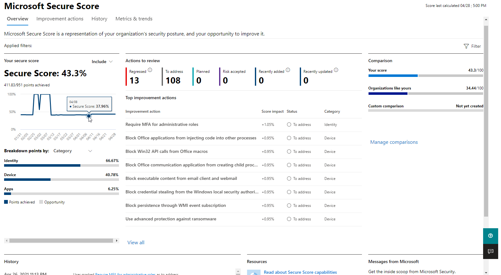
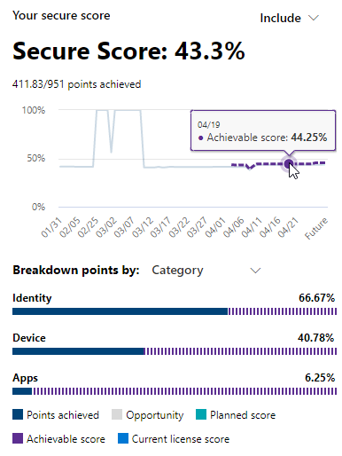

# Оценка позы безопасности с помощью microsoft Secure Score

[!INCLUDE [Microsoft 365 Defender rebranding](../includes/microsoft-defender.md)]

Оценка безопасности (Майкрософт) — это измерение уровня безопасности организации. Чем выше она, тем больше действий по укреплению безопасности предпринимает организация. Его можно найти в https://security.microsoft.com/securescore центре [Microsoft 365 безопасности.](overview-security-center.md)

Чтобы быстрее найти нужные сведения, действия по улучшению Майкрософт организованы в группы:

* Identity (Azure Active Directory учетные записи & ролей)
* Device (Microsoft Defender for Endpoint, known as [Microsoft Secure Score for Devices)](/windows/security/threat-protection/microsoft-defender-atp/tvm-microsoft-secure-score-devices)
* Приложения (приложения электронной почты и облачные приложения, включая Office 365 и Microsoft Cloud App Security)

>[!NOTE]
>В недавнем выпуске Microsoft Secure Score была выпущена улучшенная модель оценки, которая временно несовместима с показателем безопасности удостоверений и API Graph API. [Просмотреть сведения](microsoft-secure-score-whats-new.md)

На странице Обзор результатов microsoft Secure Score можно просмотреть, как разделять точки между этими группами и какие точки доступны. Вы также можете получить полное представление общего балла, исторического тренда вашего безопасного балла с сравнениями эталонных показателей, а также приоритетные действия по улучшению, которые можно принять для улучшения вашего счета.

## Проверка текущего балла

Чтобы проверить текущую оценку, перейдите на страницу обзоров microsoft Secure Score и найдите плитку, на которую будет написано **Ваше безопасное количество баллов.** Ваш счет будет показан в процентах, а также количество очков, которые вы получили из общего возможного количества баллов.

Кроме того, если вы выберите кнопку **Включить** рядом со своим счетом, вы можете выбрать различные представления вашего счета. Эти различные представления показателей будут отображаться на графике на плитке показателей и диаграмме разбивки точки.

Ниже баллов можно добавить к представлению общую оценку, чтобы дать вам более полное представление об общем счете:

- **Планируемый результат.** Показать прогнозируемый результат при планировании действий
- **Текущая оценка лицензии.** Показать результат, который можно достичь с помощью текущей лицензии Майкрософт
- **Достижимая оценка:** показать результат, который можно достичь с помощью лицензий Майкрософт и текущей оценки риска

Это представление будет выглядеть так, если вы включили все возможные представления показателей:

## Примите меры для улучшения показателей

На **вкладке Действия** по улучшению перечислены рекомендации по безопасности, которые адресовывались возможным поверхностям атаки. Он также включает их состояние (для решения, запланированного, риска, принятого, разрешенного с помощью третьей стороны, разрешенного путем альтернативного смягчения и завершения). Вы можете искать, фильтровать и групповать все действия по улучшению.  

### Ранжирование

Ранжирование основано на количестве баллов, которые необходимо достичь, сложности реализации, влиянии пользователя и сложности. Действия по улучшению с наивысшим ранжом имеют большое количество точек, остающихся с низкой сложностью, влиянием пользователя и сложностью.

### Просмотр сведений о действиях по улучшению

При выборе определенного действия по улучшению появляется полная вылетная страница.  

Чтобы завершить действие, у вас есть несколько вариантов:

- Выберите **Управление,** чтобы перейти на экран конфигурации и внести изменения. Затем вы получите очки, которые стоит действие, видимые в вылете. Обновление баллов обычно займет около 24 часов.

- Выберите **Share,** чтобы скопировать прямую ссылку на действие по улучшению. Вы также можете выбрать платформу для обмена ссылками, такими как электронная почта, Microsoft Teams или Microsoft Planner.

Добавление  примечаний, чтобы отслеживать ход выполнения или что-либо еще, что вы хотите прокомментировать. Если вы добавите собственные **теги** к действию по улучшению, вы можете фильтровать эти теги.

### Выберите состояние действия по улучшению

Выберите все состояния и записи, определенные действию по улучшению.

- **Для решения** — вы признаете, что необходимо действие по улучшению, и планируете его решить на определенном этапе в будущем. Это состояние также применяется к действиям, которые обнаруживаются частично, но не полностью завершены.
- **Запланированные** . Существуют конкретные планы по завершению действия по улучшению.
- **Риск принят** . Безопасность всегда должна быть сбалансирована с юзабью, и не каждая рекомендация будет работать для вашей среды. В этом случае вы можете принять риск или оставшийся риск, а не принимать меры по улучшению. Вам не будут даны очки, но действие больше не будет видно в списке действий по улучшению. Это действие можно просмотреть в истории или отменить в любое время.
- **Разрешено** с помощью третьей стороны и разрешено путем альтернативного смягчения **последствий** . Действие по улучшению уже было устранено сторонним приложением или программным обеспечением или внутренним средством. Вы получите очки, которые стоит действие, так что ваш балл лучше отражает общую осанку безопасности. Если сторонний или внутренний инструмент больше не покрывает управление, можно выбрать другой статус. Имейте в виду, что Корпорация Майкрософт не будет иметь видимости в полноте реализации, если действие по улучшению помечено как любой из этих статусов.

#### Действия по & управление уязвимостями угроз

Для действий по улучшению в категории "Устройство" нельзя выбрать статусы. Вместо этого вам будет направлена  рекомендация по контроль угроз и уязвимостей безопасности в Центр безопасности в Microsoft Defender [для](/windows/security/threat-protection/microsoft-defender-atp/use) принятия действий. Исключение, которое вы выбираете, и обоснование, которое вы пишете, будет иметь определенный характер для этого портала. Он не будет присутствовать на портале Microsoft Secure Score.

#### Завершенные действия по улучшению

Действия по улучшению имеют состояние "завершено" после достижения всех возможных точек для действия по улучшению. Завершенные действия по улучшению подтверждены, несмотря на данные Майкрософт, и вы не можете изменить состояние.

### Оценка сведений и оценка влияния пользователей

Раздел под **названием "С** первого взгляда" расскажет вам о категории, атаках, которые она может защитить, и о продукте.

**Влияние пользователя** — это то, что пользователи будут  испытывать, если будет принято действие по улучшению, а затронутыми пользователями будут люди, которые будут затронуты.

### Реализация действия по улучшению

В **разделе Реализация** показаны все необходимые условия, пошаговая реализация действий по улучшению, текущее состояние реализации действия по улучшению и дополнительные ссылки.

К обязательным условиям относятся все необходимые лицензии или действия, которые необходимо завершить до решения проблемы с улучшением. Убедитесь, что в лицензии достаточно мест для выполнения действия по улучшению и чтобы эти лицензии применялись к необходимым пользователям.  

## Мы ждем ваших отзывов!

Если у вас есть какие-либо проблемы, дайте нам знать, разместив в сообществе [безопасность, конфиденциальность & соответствия](https://techcommunity.microsoft.com/t5/Security-Privacy-Compliance/bd-p/security_privacy) требованиям. Мы отслеживаем сообщество и предоставляем помощь.

## Связанные ресурсы

- [Обзор результатов microsoft Secure Score](microsoft-secure-score.md)
- [Отслеживание истории microsoft Secure Score и достижения целей](microsoft-secure-score-history-metrics-trends.md)
- [Что вскоре появится](microsoft-secure-score-whats-coming.md)
- [Новые возможности](microsoft-secure-score-whats-new.md)