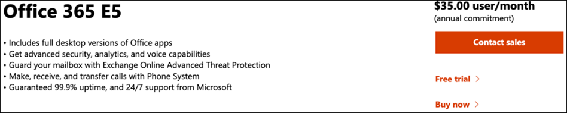

# Настройка среды пробной лаборатории Microsoft 365 Defender 

[!INCLUDE [Microsoft 365 Defender rebranding](../includes/microsoft-defender.md)]

**Область применения:**
- Microsoft 365 Defender 

Создание пробной Microsoft 365 Defender или пилотной среды и ее развертывание — это трех этапный процесс:

| [Этап 1. Подготовка](prepare-m365d-eval.md) | Этап 2. Настройка | [Этап 3. Подключение](config-m365d-eval.md) |  [Вернуться к экспериментальной книге воспроизведения](m365d-pilot.md) |
|--|--|--|--|
||*Вы здесь!*  | | |

Вы в настоящее время на этапе настройка. Сначала необходимо получить доступ к Microsoft 365 центру безопасности, а затем настроить пробную лабораторию или пилотную среду.

Зарегистрируйся Office 365 или Azure Active Directory, чтобы создать *клиент .onmicrosoft.com,* который можно использовать для регистрации Microsoft 365 E5 лицензии. 

>[!NOTE]
>Если у вас уже есть Office 365 или Azure Active Directory подписка, вы можете пропустить этапы Office 365 E5 или экспериментальный этап создания клиента.

На этом этапе вы будете руководствоваться:
- Создание клиента Office 365 E5
- Включить Microsoft 365 пробную подписку

## Создание клиента Office 365 E5
>[!NOTE]
>Если у вас уже есть Office 365 или Azure Active Directory подписка, можно пропустить этапы создания Office 365 E5.

1. Перейдите на [портал продуктов Office 365 E5](https://www.microsoft.com/microsoft-365/business/office-365-enterprise-e5-business-software?activetab=pivot%3aoverviewtab) и выберите **бесплатную пробную.**

   
  
2. Завершите пробную регистрацию, введите свой адрес электронной почты (личный или корпоративный). Нажмите **кнопку Настройка учетной записи**.

   

3. Заполните имя, фамилию, номер бизнес-телефона, имя компании, размер компании и страну или регион.  

   
   
   > [!NOTE]
   > Страна или регион, который вы здесь застроили, определяет регион центра обработки данных, в Office 365 будет организован ваш центр обработки данных.
  
4. Выберите свое предпочтение проверки: через текстовое сообщение или вызов. Нажмите **кнопку Отправить код проверки**. 

   

5. Установите настраиваемую доменную фамилию для клиента, а затем нажмите **кнопку Далее**.

   
 
6. Настройка первого удостоверения, которое будет глобальным администратором для клиента. Заполните **имя и** **пароль.** Нажмите кнопку **Зарегистрироваться**.

   

7. Нажмите **кнопку Перейти** к установке для завершения Office 365 предварительного клиента E5.

   

8. Подключение корпоративного домена Office 365 клиента. [Необязательный] Выберите Подключение домен, который вы **уже владеете,** и введите в доменное имя. Нажмите **Далее**.

   
 
9. Добавьте запись TXT или MX для проверки владения доменом. После того как вы добавите запись TXT или MX в свой домен, выберите **Проверить**.

   
 
10. [Необязательный] Создайте дополнительные учетные записи пользователей для клиента. Этот шаг можно пропустить, нажав **кнопку Далее.**

    
 
11. [Необязательный] Скачайте Office приложения. Нажмите **кнопку Далее,** чтобы пропустить этот шаг. 

    

12. [Необязательный] Перенос сообщений электронной почты. Опять же, вы можете пропустить этот шаг.

    
 
13. Выберите онлайн-службы. Выберите **Exchange** и нажмите **кнопку Далее**. 

    

14. Добавьте записи MX, CNAME и TXT в домен. После завершения выберите **Проверить**.

    
 
15. Поздравляем, вы завершили подготовка Office 365 клиента.

    

## Включить Microsoft 365 пробную подписку

>[!NOTE]
>Регистрация для пробной пробной записи дает вам 25 лицензий пользователей, которые можно использовать в течение месяца. Дополнительные [сведения см. в материале Try or Buy an M365 subscription.](../../commerce/try-or-buy-microsoft-365.md)

1. Из [Microsoft 365 центра администрирования](https://admin.microsoft.com/)щелкните **Биллинг** и перейдите к **службам покупки.**

2. Выберите **Microsoft 365 E5** и нажмите **кнопку Начните бесплатную пробную версия**. 

   

3. Выберите свое предпочтение проверки: через текстовое сообщение или вызов. После того как вы решили, введите номер телефона, выберите **текст меня** или **позвоните** мне в зависимости от выбора.

   
 
4. Введите код проверки и **нажмите кнопку Начните бесплатную пробную проверку.**

   

5. Нажмите **кнопку Попробуйте** сейчас, чтобы подтвердить Microsoft 365 E5 пробную попытку.

   
 
6. Перейдите в **Microsoft 365 Центр администрирования**  >    >  **Активные пользователи**. Выберите учетную запись пользователя, **выберите Управление** лицензиями на продукты, а затем обмен лицензией с Office 365 E5 на **Microsoft 365 E5**. Щелкните **Сохранить**.

   
 
7. Выберите глобальную учетную запись администратора и нажмите **кнопку Управление иным пользователем.**

   

8. [Необязательный] Измените домен с *onmicrosoft.com* на собственный домен в зависимости от того, что вы выбрали на предыдущих действиях. Нажмите кнопку **Сохранить изменения**.

   

## Следующий этап
|[Этап 3. Настройка & на борту](config-m365d-eval.md) | Настройте каждый столб Microsoft 365 Defender для Microsoft 365 лаборатории или пилотной среды Defender и на борту конечных точек.
|:-------|:-----|
