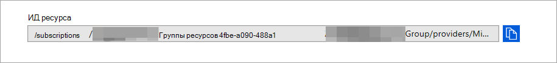

# <a name="configure-microsoft-365-defender-to-stream-advanced-hunting-events-to-your-azure-event-hub"></a><span data-ttu-id="cf29c-104">Настройка Microsoft 365 Defender для потоковой передачи событий предварительной охоты в центр событий Azure</span><span class="sxs-lookup"><span data-stu-id="cf29c-104">Configure Microsoft 365 Defender to stream Advanced Hunting events to your Azure Event Hub</span></span>

[!INCLUDE [Microsoft 365 Defender rebranding](../../includes/microsoft-defender.md)]


<span data-ttu-id="cf29c-105">**Область применения:**</span><span class="sxs-lookup"><span data-stu-id="cf29c-105">**Applies to:**</span></span>
- [<span data-ttu-id="cf29c-106">Microsoft 365 Defender</span><span class="sxs-lookup"><span data-stu-id="cf29c-106">Microsoft 365 Defender</span></span>](https://go.microsoft.com/fwlink/?linkid=2118804)

[!include[Prerelease information](../../includes/prerelease.md)]

## <a name="before-you-begin"></a><span data-ttu-id="cf29c-107">Подготовка</span><span class="sxs-lookup"><span data-stu-id="cf29c-107">Before you begin</span></span>

1. <span data-ttu-id="cf29c-108">Создайте [центр событий в](/azure/event-hubs/) клиенте.</span><span class="sxs-lookup"><span data-stu-id="cf29c-108">Create an [Event hub](/azure/event-hubs/) in your tenant.</span></span>

2. <span data-ttu-id="cf29c-109">Войдите в клиент [Azure,](https://ms.portal.azure.com/)перейдите к подпискам > подписки > поставщиков ресурсов **> в Microsoft.Insights**.</span><span class="sxs-lookup"><span data-stu-id="cf29c-109">Log in to your [Azure tenant](https://ms.portal.azure.com/), go to **Subscriptions > Your subscription > Resource Providers > Register to Microsoft.Insights**.</span></span>

3. <span data-ttu-id="cf29c-110">Создайте пространство имен центра событий, **перейдите в** центр событий > добавить и выбрать уровень цен, единицы пропускной способности и авто-надувка, соответствующие ожидаемой нагрузке.</span><span class="sxs-lookup"><span data-stu-id="cf29c-110">Create an Event Hub Namespace, go to **Event Hub > Add** and select the pricing tier, throughput units and Auto-Inflate appropriate for expected load.</span></span> <span data-ttu-id="cf29c-111">Дополнительные сведения см. в [этой теме Pricing - Event Hub | Microsoft Azure](https://azure.microsoft.com/en-us/pricing/details/event-hubs/).</span><span class="sxs-lookup"><span data-stu-id="cf29c-111">For more information, see [Pricing - Event Hub | Microsoft Azure](https://azure.microsoft.com/en-us/pricing/details/event-hubs/).</span></span>  

### <a name="add-contributor-permissions"></a><span data-ttu-id="cf29c-112">Добавление разрешений для участников</span><span class="sxs-lookup"><span data-stu-id="cf29c-112">Add contributor permissions</span></span> 
<span data-ttu-id="cf29c-113">После создания пространства имен Центра событий вам потребуется добавить главу службы регистрации приложений в качестве reader, приемник данных Azure Event Hub и пользователя, который будет вход в Microsoft 365 Defender в качестве участника (это также можно сделать на уровне Resource Group или Подписка).</span><span class="sxs-lookup"><span data-stu-id="cf29c-113">Once the Event Hub namespace is created you will need to add the App Registration Service Principal as Reader, Azure Event Hub Data Receiver, and the user who will be logging into Microsoft 365 Defender as Contributor (this can also be done at Resource Group or Subscription level).</span></span> 

<span data-ttu-id="cf29c-114">Перейдите в пространство имен узлов событий > управления доступом **(IAM)** > добавить и проверить в соответствии **с назначениями роли**.</span><span class="sxs-lookup"><span data-stu-id="cf29c-114">Go to **Event hubs namespace > Access control (IAM) > Add** and verify under **Role assignments**.</span></span>

## <a name="enable-raw-data-streaming"></a><span data-ttu-id="cf29c-115">Включить потоковую передачу необработанных данных</span><span class="sxs-lookup"><span data-stu-id="cf29c-115">Enable raw data streaming</span></span>

1. <span data-ttu-id="cf29c-116">Войдите в [центр безопасности Microsoft 365 Defender](https://security.microsoft.com) в качестве ***Глобального** администратора _ или _*_Администратора_ безопасности \*\*.</span><span class="sxs-lookup"><span data-stu-id="cf29c-116">Log in to the [Microsoft 365 Defender security center](https://security.microsoft.com) as a ***Global Administrator** _ or _*_Security Administrator_\*\*.</span></span>

2. <span data-ttu-id="cf29c-117">Перейдите на [страницу Параметры API потокового воспроизведения.](https://security.microsoft.com/settings/mtp_settings/raw_data_export)</span><span class="sxs-lookup"><span data-stu-id="cf29c-117">Go to the [Streaming API settings page](https://security.microsoft.com/settings/mtp_settings/raw_data_export).</span></span>

3. <span data-ttu-id="cf29c-118">Нажмите **кнопку Добавить**.</span><span class="sxs-lookup"><span data-stu-id="cf29c-118">Click on **Add**.</span></span>

4. <span data-ttu-id="cf29c-119">Выберите имя для новых параметров.</span><span class="sxs-lookup"><span data-stu-id="cf29c-119">Choose a name for your new settings.</span></span>

5. <span data-ttu-id="cf29c-120">Выберите **перенаступив события в Центр событий Azure.**</span><span class="sxs-lookup"><span data-stu-id="cf29c-120">Choose **Forward events to Azure Event Hub**.</span></span>

6. <span data-ttu-id="cf29c-121">Вы можете выбрать, хотите ли вы экспортировать данные событий в единый центр событий или экспортировать каждую таблицу событий в другой центр событий в пространстве имен Event Hub.</span><span class="sxs-lookup"><span data-stu-id="cf29c-121">You can select if you want to export the event data to a single Event Hub, or to export each event table to a different event hub in your Event Hub namespace.</span></span> 

7. <span data-ttu-id="cf29c-122">Чтобы экспортировать данные событий в единый  центр событий, введите имя центра событий и свой ИД ресурса **Event Hub.**</span><span class="sxs-lookup"><span data-stu-id="cf29c-122">To export the event data to a single Event Hub, enter your **Event Hub name** and your **Event Hub resource ID**.</span></span>

   <span data-ttu-id="cf29c-123">Чтобы получить ИД ресурса **Event Hub,** перейдите на страницу пространства имен Azure Event Hub на вкладке [Azure](https://ms.portal.azure.com/)Properties > скопируйте текст в  >   статье Resource **ID:**</span><span class="sxs-lookup"><span data-stu-id="cf29c-123">To get your **Event Hub resource ID**, go to your Azure Event Hub namespace page on [Azure](https://ms.portal.azure.com/) > **Properties** tab > copy the text under **Resource ID**:</span></span>

   

8. <span data-ttu-id="cf29c-125">Выберите события, которые необходимо транслировать, и нажмите кнопку **Сохранить**.</span><span class="sxs-lookup"><span data-stu-id="cf29c-125">Choose the events you want to stream and click **Save**.</span></span>

## <a name="the-schema-of-the-events-in-azure-event-hub"></a><span data-ttu-id="cf29c-126">Схема событий в центре событий Azure</span><span class="sxs-lookup"><span data-stu-id="cf29c-126">The schema of the events in Azure Event Hub</span></span>

```
{
    "records": [
                    {
                        "time": "<The time Microsoft 365 Defender received the event>"
                        "tenantId": "<The Id of the tenant that the event belongs to>"
                        "category": "<The Advanced Hunting table name with 'AdvancedHunting-' prefix>"
                        "properties": { <Microsoft 365 Defender Advanced Hunting event as Json> }
                    }
                    ...
                ]
}
```

- <span data-ttu-id="cf29c-127">Каждое сообщение Центра событий в Центре событий Azure содержит список записей.</span><span class="sxs-lookup"><span data-stu-id="cf29c-127">Each Event Hub message in Azure Event Hub contains list of records.</span></span>

- <span data-ttu-id="cf29c-128">Каждая запись содержит имя события, Microsoft 365 защитник получил событие, клиент, который ему принадлежит (события будут получены только от клиента), и событие в формате JSON в свойстве под названием **"свойства".**</span><span class="sxs-lookup"><span data-stu-id="cf29c-128">Each record contains the event name, the time Microsoft 365 Defender received the event, the tenant it belongs (you will only get events from your tenant), and the event in JSON format in a property called "**properties**".</span></span>

- <span data-ttu-id="cf29c-129">Дополнительные сведения о схеме событий Microsoft 365 Defender см. в [обзоре Advanced Hunting.](advanced-hunting-overview.md)</span><span class="sxs-lookup"><span data-stu-id="cf29c-129">For more information about the schema of Microsoft 365 Defender events, see [Advanced Hunting overview](advanced-hunting-overview.md).</span></span>

- <span data-ttu-id="cf29c-130">В таблице Advanced Hunting **в таблице DeviceInfo** имеется столбец **MachineGroup,** содержащий группу устройства.</span><span class="sxs-lookup"><span data-stu-id="cf29c-130">In Advanced Hunting, the **DeviceInfo** table has a column named **MachineGroup** which contains the group of the device.</span></span> <span data-ttu-id="cf29c-131">Здесь каждое событие также будет украшено этим столбцом.</span><span class="sxs-lookup"><span data-stu-id="cf29c-131">Here every event will be decorated with this column as well.</span></span> 


## <a name="data-types-mapping"></a><span data-ttu-id="cf29c-132">Сопоставление типов данных</span><span class="sxs-lookup"><span data-stu-id="cf29c-132">Data types mapping</span></span>

<span data-ttu-id="cf29c-133">Чтобы получить типы данных для свойств событий, сделайте следующее:</span><span class="sxs-lookup"><span data-stu-id="cf29c-133">To get the data types for event properties do the following:</span></span>

1. <span data-ttu-id="cf29c-134">Войдите в [Microsoft 365 центр безопасности](https://security.microsoft.com) и перейдите на [страницу Расширенный поиск](https://security.microsoft.com/hunting-package).</span><span class="sxs-lookup"><span data-stu-id="cf29c-134">Log in to [Microsoft 365 security center](https://security.microsoft.com) and go to [Advanced Hunting page](https://security.microsoft.com/hunting-package).</span></span>

2. <span data-ttu-id="cf29c-135">Запустите следующий запрос, чтобы получить сопоставление типов данных для каждого события:</span><span class="sxs-lookup"><span data-stu-id="cf29c-135">Run the following query to get the data types mapping for each event:</span></span>
 
   ```
   {EventType}
   | getschema
   | project ColumnName, ColumnType 
   ```

- <span data-ttu-id="cf29c-136">Вот пример события "Информация о устройстве":</span><span class="sxs-lookup"><span data-stu-id="cf29c-136">Here is an example for Device Info event:</span></span> 

  

## <a name="related-topics"></a><span data-ttu-id="cf29c-138">Статьи по теме</span><span class="sxs-lookup"><span data-stu-id="cf29c-138">Related topics</span></span>
- [<span data-ttu-id="cf29c-139">Обзор расширенных охоты</span><span class="sxs-lookup"><span data-stu-id="cf29c-139">Overview of Advanced Hunting</span></span>](advanced-hunting-overview.md)
- [<span data-ttu-id="cf29c-140">Microsoft 365 Защитник потокового API</span><span class="sxs-lookup"><span data-stu-id="cf29c-140">Microsoft 365 Defender streaming API</span></span>](streaming-api.md)
- [<span data-ttu-id="cf29c-141">Поток событий Microsoft 365 Defender в учетную запись хранилища Azure</span><span class="sxs-lookup"><span data-stu-id="cf29c-141">Stream Microsoft 365 Defender events to your Azure storage account</span></span>](streaming-api-storage.md)
- [<span data-ttu-id="cf29c-142">Документация azure Event Hub</span><span class="sxs-lookup"><span data-stu-id="cf29c-142">Azure Event Hub documentation</span></span>](/azure/event-hubs/)
- [<span data-ttu-id="cf29c-143">Устранение проблем с подключением - Центр событий Azure</span><span class="sxs-lookup"><span data-stu-id="cf29c-143">Troubleshoot connectivity issues - Azure Event Hub</span></span>](/azure/event-hubs/troubleshooting-guide)
