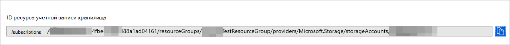

# <a name="configure-microsoft-365-defender-to-stream-advanced-hunting-events-to-your-storage-account"></a>Настройка Microsoft 365 Defender для потоковой передачи событий advanced Hunting в служба хранилища учетную запись

[!INCLUDE [Microsoft 365 Defender rebranding](../../includes/microsoft-defender.md)]


**Область применения:**
- [Microsoft 365 Defender](https://go.microsoft.com/fwlink/?linkid=2118804)

[!include[Prerelease information](../../includes/prerelease.md)]

## <a name="before-you-begin"></a>Прежде чем начать

1. Создайте [служба хранилища учетную запись](/azure/storage/common/storage-account-overview) в клиенте.

2. Войдите в клиент [Azure,](https://ms.portal.azure.com/)перейдите на подписки > подписки > поставщиков ресурсов > зарегистрироваться в **Microsoft.Аналитика.**

## <a name="enable-raw-data-streaming"></a>Включить потоковую передачу необработанных данных

1. Войдите на портал Microsoft 365 Defender () в качестве <https://security.microsoft.com> ***Глобального** администратора _ или _*_администратора_ безопасности **.

2. Перейдите **Параметры** \> **Microsoft 365 Defender** \> **API потоковой передачи.** Чтобы перейти непосредственно на страницу **API потоковой** передачи, используйте <https://security.microsoft.com/settings/mtp_settings/raw_data_export> .

3. Нажмите **Добавить**.

4. В **вылете добавлены новые параметры API** потокового воспроизведения, которые появляются, настройте следующие параметры:
   1. **Имя.** Выберите имя для новых параметров.
   2. Выберите **события Forward для служба хранилища Azure**.
   3. В поле **служба хранилища ресурса** учетной записи, которое отображается, **введите служба хранилища-служба хранилища учетной записи.** Чтобы получить **служба хранилища** ресурса учетной записи, откройте портал Azure по ссылке , нажмите кнопку служба хранилища учетные записи перейдите на вкладку свойств скопируйте текст под служба хранилища ID ресурса учетной <https://portal.azure.com>  \> \> **записи**.

      

   4. Возвращаясь к **вылету Добавить новые параметры API** потоковой передачи, выберите типы **событий,** которые необходимо транслировать.

   По завершению нажмите кнопку **Отправить**.

## <a name="the-schema-of-the-events-in-the-storage-account"></a>Схема событий в служба хранилища учетной записи

- Для каждого типа событий будет создан контейнер blob:

  

- Схема каждой строки в blob является следующей JSON:

  ```JSON
  {
          "time": "<The time Microsoft 365 Defender received the event>"
          "tenantId": "<Your tenant ID>"
          "category": "<The Advanced Hunting table name with 'AdvancedHunting-' prefix>"
          "properties": { <Microsoft 365 Defender Advanced Hunting event as Json> }
  }
  ```

- Каждый blob содержит несколько строк.

- Каждая строка содержит имя события, время получения события Defender для Конечной точки, его место для клиента (вы получите события только от клиента) и событие в формате JSON в свойстве под названием "свойства".

- Дополнительные сведения о схеме событий Microsoft 365 Defender см. в [обзоре Advanced Hunting.](../defender/advanced-hunting-overview.md)

## <a name="data-types-mapping"></a>Сопоставление типов данных

Чтобы получить типы данных для свойств событий, сделайте следующее:

1. Войдите на портал Microsoft 365 Defender () и <https://security.microsoft.com> перейдите на **охоту** \> **advanced hunting**. Чтобы перейти непосредственно на **страницу Расширенный поиск,** используйте <security.microsoft.com/advanced-hunting>.

2. На **вкладке Запрос** запустите следующий запрос, чтобы получить сопоставление типов данных для каждого события:

   ```text
   {EventType}
   | getschema
   | project ColumnName, ColumnType
   ```

- Вот пример события "Информация о устройстве":

  

## <a name="related-topics"></a>Статьи по теме

- [Обзор расширенных охоты](../defender/advanced-hunting-overview.md)
- [Microsoft 365 Defender Потоковый API](streaming-api.md)
- [Поток Microsoft 365 Defender событий в учетную запись хранилища Azure](streaming-api-storage.md)
- [служба хранилища Azure Документация по учетной записи](/azure/storage/common/storage-account-overview)
