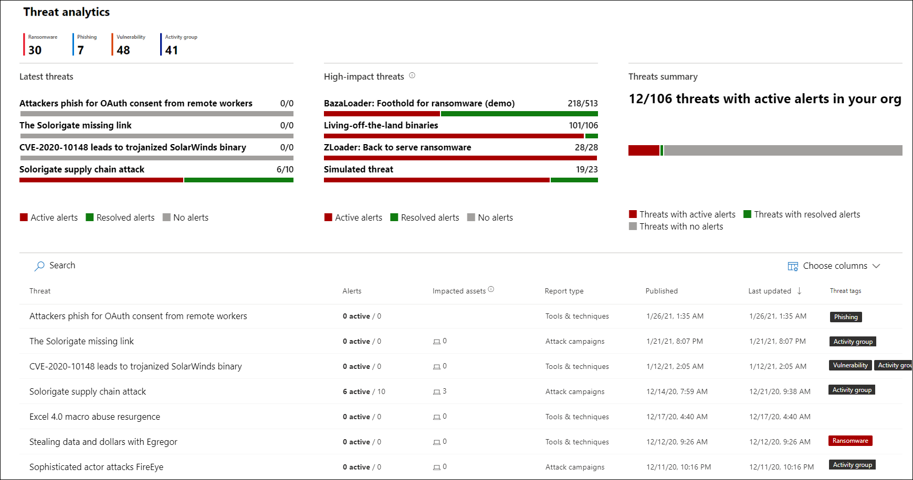
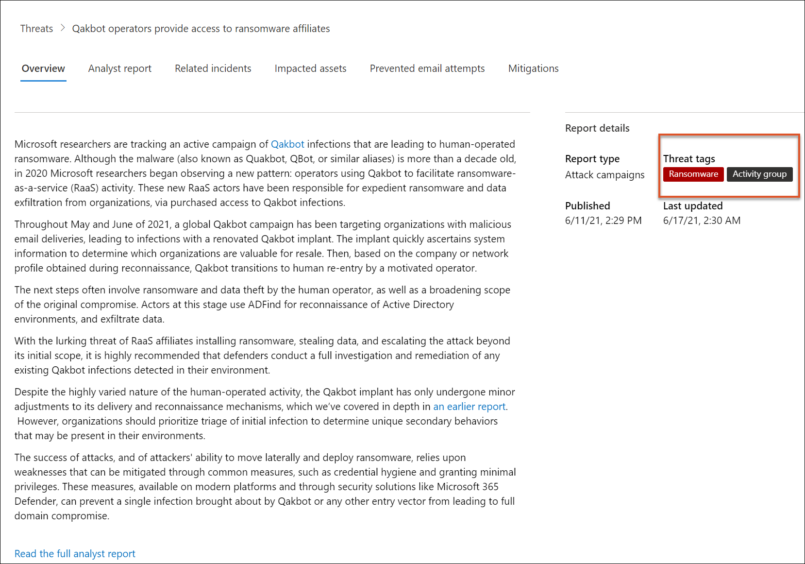
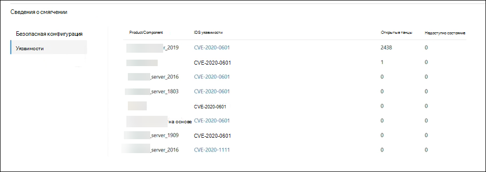

# Отслеживание и реагирование на возникающие угрозы с помощью аналитики угрозTrack and respond to emerging threats with threat analytics 

[!INCLUDE [Microsoft 365 Defender rebranding](../includes/microsoft-defender.md)]

**Область применения:****Applies to:**
- Microsoft 365 DefenderMicrosoft 365 Defender

> Хотите попробовать Microsoft 365 Defender?Want to experience Microsoft 365 Defender? Вы можете [оценить его в лабораторной среде](m365d-evaluation.md?ocid=cx-docs-MTPtriallab) или [запустить пилотный проект в производственной среде](m365d-pilot.md?ocid=cx-evalpilot).You can [evaluate it in a lab environment](m365d-evaluation.md?ocid=cx-docs-MTPtriallab) or [run your pilot project in production](m365d-pilot.md?ocid=cx-evalpilot).
>

[!INCLUDE [Prerelease](../includes/prerelease.md)]

Аналитика угроз — это наше решение для анализа угроз в продукте от экспертных исследователей безопасности Майкрософт, предназначенное для обеспечения максимальной эффективности групп безопасности при решении возникающих угроз, в том числе:Threat analytics is our in-product threat intelligence solution from expert Microsoft security researchers, designed to assist security teams to be as efficient as possible while facing emerging threats, including:

- Активные субъекты угроз и их кампанииActive threat actors and their campaigns
- Популярные и новые методы атакиPopular and new attack techniques
- Критические уязвимостиCritical vulnerabilities
- Общие поверхности атакиCommon attack surfaces
- Распространенные вредоносные программыPrevalent malware

Просмотрите это короткое видео, чтобы узнать больше о том, как аналитика угроз может помочь отслеживать последние угрозы и останавливать их.Watch this short video to learn more about how threat analytics can help you track the latest threats and stop them.

>[!VIDEO https://www.microsoft.com/en-us/videoplayer/embed/RWwJfU]

Вы можете получить доступ к аналитике угроз либо с верхней левой стороны панели навигации Microsoft 365 портала безопасности, либо с выделенной карты мониторинга, на которой показаны главные угрозы в вашей организации. Получение видимости активных или текущих кампаний и знание действий с помощью аналитики угроз может помочь оснастить команду операций безопасности обоснованными решениями.You can access threat analytics either from the upper left-hand side of Microsoft 365 security portal’s navigation bar, or from a dedicated dashboard card which shows the top threats in your org. Getting visibility on active or ongoing campaigns and knowing what to do through threat analytics can help equip your security operations team with informed decisions. 

_Где получить доступ к аналитике угроз__Where to access threat analytics_

При частом и распространенном распространении более сложных противников и новых угроз очень важно быстро:With more sophisticated adversaries and new threats emerging frequently and prevalently, it's critical to be able to quickly:

- Определение и реагирование на возникающие угрозыIdentify and react to emerging threats 
- Узнайте, находятся ли вы в настоящее время под атакойLearn if you are currently under attack
- Оценка влияния угрозы для ваших активовAssess the impact of the threat to your assets
- Проверка устойчивости к угрозам или воздействия на нихReview your resilience against or exposure to the threats
- Определите меры по смягчению последствий, восстановлению или предотвращению, которые можно принять для остановки или сдерживания угроз.Identify the mitigation, recovery, or prevention actions you can take to stop or contain the threats

В каждом отчете содержится анализ отслеживаемой угрозы и подробное руководство по защите от этой угрозы.Each report provides an analysis of a tracked threat and extensive guidance on how to defend against that threat. В нее также включены данные из сети, указывающие, активна ли угроза и есть ли у вас применимые средства защиты.It also incorporates data from your network, indicating whether the threat is active and if you have applicable protections in place.

## Просмотр панели мониторинга аналитики угрозView the threat analytics dashboard

Панель мониторинга аналитики угроз[(security.microsoft.com/threatanalytics3)](https://security.microsoft.com/threatanalytics3)выделяет отчеты, наиболее релевантные для организации.The threat analytics dashboard ([security.microsoft.com/threatanalytics3](https://security.microsoft.com/threatanalytics3)) highlights the reports that are most relevant to your organization. В нем подводятся итоги угроз в следующих разделах:It summarizes the threats in the following sections:

- **Последние угрозы**— списки недавно опубликованных или обновленных отчетов об угрозах, а также количество активных и разрешенных оповещений.**Latest threats**—lists the most recently published or updated threat reports, along with the number of active and resolved alerts.
- **Угрозы с высоким уровнем** воздействия — это списки угроз, которые наиболее сильно влияют на организацию.**High-impact threats**—lists the threats that have the highest impact to your organization. В этом разделе сначала перечислены угрозы с наивысшим числом активных и разрешенных оповещений.This section lists threats with the highest number of active and resolved alerts first.
- **Сводка угроз**— обеспечивает общее влияние всех отслеживаемой угрозы, показывая количество угроз с активными и разрешенными оповещениями.**Threat summary**—provides the overall impact of all tracked threats by showing the number of threats with active and resolved alerts.

Выберите угрозу с панели мониторинга, чтобы просмотреть отчет об этой угрозе.Select a threat from the dashboard to view the report for that threat.

_Панель мониторинга аналитики угроз. Вы также можете щелкнуть значок Поиска для ключа в ключевом слове, связанном с отчетом аналитики угроз, который вы хотите прочитать.__Threat analytics dashboard. You can also click the Search icon to key in a keyword related to the threat analytics report that you'd like to read._ 

## Просмотр отчета аналитики угрозView a threat analytics report

Каждый отчет аналитики угроз содержит сведения в нескольких разделах:Each threat analytics report provides information in several sections: 

- [**Обзор****Overview**](#overview-quickly-understand-the-threat-assess-its-impact-and-review-defenses) 
- [**Отчет аналитика****Analyst report**](#analyst-report-get-expert-insight-from-microsoft-security-researchers)
- [**Связанные инциденты****Related incidents**](#related-incidents-view-and-manage-related-incidents)
- [**Влияние активов****Impacted assets**](#impacted-assets-get-list-of-impacted-devices-and-mailboxes)
- [**Предотвратимые попытки электронной почты****Prevented email attempts**](#prevented-email-attempts-view-blocked-or-junked-threat-emails)
- [**Смягчение последствий****Mitigations**](#mitigations-review-list-of-mitigations-and-the-status-of-your-devices)

### Обзор. Быстрое понимание угрозы, оценка ее воздействия и проверка защитыOverview: Quickly understand the threat, assess its impact, and review defenses

В **разделе Обзор** представлен предварительный просмотр подробного отчета аналитика.The **Overview** section provides a preview of the detailed analyst report. Он также предоставляет диаграммы, которые подчеркивают влияние угрозы для организации и вашей экспозиции с помощью неправильно сконфигурованных и неоплаченных устройств.It also provides charts that highlight the impact of the threat to your organization and your exposure through misconfigured and unpatched devices.

_Обзор раздела отчета аналитики угроз__Overview section of a threat analytics report_

#### Оценка влияния на организациюAssess impact on your organization
Каждый отчет содержит диаграммы, предназначенные для предоставления сведений о влиянии угрозы на организацию:Each report includes charts designed to provide information about the organizational impact of a threat:
- **Связанные инциденты**— это обзор воздействия отслеживаемой угрозы для организации с помощью следующих данных:**Related incidents**—provides an overview of the impact of the tracked threat to your organization with the following data:
  - Количество активных оповещений и количество связанных с ними активных инцидентовNumber of active alerts and the number of active incidents they are associated with
  - Серьезность активных инцидентовSeverity of active incidents
- **Оповещения со временем**— показывает количество связанных оповещений **Active** и **Resolved** с течением времени.**Alerts over time**—shows the number of related **Active** and **Resolved** alerts over time. Количество разрешенных оповещений указывает, как быстро организация реагирует на оповещения, связанные с угрозой.The number of resolved alerts indicates how quickly your organization responds to alerts associated with a threat. В идеале на диаграмме должны быть показаны оповещения, разрешенные в течение нескольких дней.Ideally, the chart should be showing alerts resolved within a few days.
- **Влияние активов**— показывает количество различных устройств и учетных записей электронной почты (почтовых ящиков), которые в настоящее время имеют по крайней мере одно активное оповещение, связанное с отслеживаемой угрозой.**Impacted assets**—shows the number of distinct devices and email accounts (mailboxes) that currently have at least one active alert associated with the tracked threat. Оповещения срабатывает для почтовых ящиков, которые получали сообщения угрозы.Alerts are triggered for mailboxes that received threat emails. Просмотрите политики на уровне организаций и пользователей для переопределей, которые вызывают доставку электронных сообщений с угрозами.Review both org- and user-level policies for overrides that cause the delivery of threat emails.
- **Предотвратимые** попытки электронной почты — показывает количество сообщений электронной почты за последние семь дней, которые были заблокированы перед доставкой или доставлены в папку нежелательной почты.**Prevented email attempts**—shows the number of emails from the past seven days that were either blocked before delivery or delivered to the junk mail folder.

#### Проверка устойчивости и осанки безопасностиReview security resilience and posture
Каждый отчет содержит диаграммы, в которых представлен обзор устойчивости организации к данной угрозе:Each report includes charts that provide an overview of how resilient your organization is against a given threat:
- **Состояние безопасной конфигурации**— отображает количество устройств с неправильными настройками безопасности.**Secure configuration status**—shows the number of devices with misconfigured security settings. Применение рекомендуемых параметров безопасности для смягчения угрозы.Apply the recommended security settings to help mitigate the threat. Устройства считаются **Безопасными,**  если они применили все отслеживаемые параметры.Devices are considered **Secure** if they have applied _all_ the tracked settings.
- **Состояние исправления уязвимости**— показывает количество уязвимых устройств.**Vulnerability patching status**—shows the number of vulnerable devices. Применение обновлений или исправлений безопасности для устранения уязвимостей, использованных угрозой.Apply security updates or patches to address vulnerabilities exploited by the threat.

#### Просмотр отчетов по тегам угрозView reports per threat tags
Вы можете фильтровать список отчетов об угрозах и просматривать наиболее релевантные отчеты в соответствии с определенным тегом угрозы (категория) или типом отчета.You can filter the threat report list and view the most relevant reports according to a specific threat tag (category) or a report type. 
- **Теги угроз** помогают просматривать наиболее релевантные отчеты в соответствии с определенной категорией угроз.**Threat tags**—assist you in viewing the most relevant reports according to a specific threat category. Например, все отчеты, связанные с программой-вымогателями.For example, all reports related to ransomware.
- **Типы отчетов**— помогают просматривать наиболее релевантные отчеты в соответствии с определенным типом отчета.**Report types**—assist you in viewing the most relevant reports according to a specific report type. Например, все отчеты, которые охватывают инструменты и методы.For example, all reports that cover tools and techniques. 
- **Фильтры** помогают эффективно просматривать список отчетов об угрозах и фильтровать представление на основе определенного тега угрозы или типа отчета.**Filters**—assist you in efficiently reviewing the threat report list and filtering the view based on a specific threat tag or report type. Например, просмотрите все отчеты об угрозах, относящиеся к категории вымогателей, или отчеты об угрозах, которые охватывают уязвимости.For example, review all threat reports related to ransomware category, or threat reports that cover vulnerabilities.

##### Как это работает?How does it work?
Группа microsoft Threat Intelligence добавила теги угроз в каждый отчет об угрозах:The Microsoft Threat Intelligence team has added threat tags to each threat report:
- Теперь доступны четыре тега угрозы:Four threat tags are now available:
  - ВымогателейRansomware
  - ФишинговоеPhishing
  - УязвимостьVulnerability
  - Группа действийActivity group
- Теги угроз представлены в верхней части страницы аналитики угроз с счетчиками количества доступных отчетов под каждым тегом.Threat tags are presented at the top of the threat analytics page, with counters for the number of available reports under each tag.
    
- Список также можно сортировать по тегам угроз:   The list can also be sorted by threat tags:   
- Фильтры доступны для каждого тега угрозы и типа отчета:   Filters are available per threat tag and report type:   

### Отчет аналитика: получите экспертную информацию от исследователей безопасности МайкрософтAnalyst report: Get expert insight from Microsoft security researchers
В разделе **Отчет аналитика** ознакомьтесь с подробным отчетом эксперта.In the **Analyst report** section, read through the detailed expert write-up. В большинстве отчетов подробно описаны цепочки атак, включая тактику и методы, относячимые к базе ATT MITRE&CK, исчерпывающие списки рекомендаций и мощные рекомендации по охоте на угрозы. Most reports provide detailed descriptions of attack chains, including tactics and techniques mapped to the MITRE ATT&CK framework, exhaustive lists of recommendations, and powerful [threat hunting](advanced-hunting-overview.md) guidance.

[Дополнительные новости о отчете аналитикаLearn more about the analyst report](threat-analytics-analyst-reports.md)

### Связанные инциденты: просмотр и управление связанными инцидентамиRelated incidents: View and manage related incidents
На **вкладке Связанные инциденты** содержится список всех инцидентов, связанных с отслеживаемой угрозой.The **Related incidents** tab provides the list of all incidents related to the tracked threat. Вы можете назначать инциденты или управлять оповещениями, связанными с каждым инцидентом.You can assign incidents or manage alerts linked to each incident. 

_Раздел связанных инцидентов отчета аналитики угроз__Related incidents section of a threat analytics report_

### Влияние активов: получить список устройств и почтовых ящиков с влияниемImpacted assets: Get list of impacted devices and mailboxes
Актив считается затронутым, если он зависит от активного, неурегулированного оповещения.An asset is considered impacted if it is affected by an active, unresolved alert. На **вкладке Impacted assets** перечислены следующие типы активов с влиянием:The **Impacted assets** tab lists the following types of impacted assets:
- **Влияли устройства**— конечные точки с неурегулированными оповещениями Microsoft Defender для конечных точек.**Impacted devices**—endpoints that have unresolved Microsoft Defender for Endpoint alerts. Как правило, эти оповещений повещают об известных индикаторах и действиях угроз.These alerts typically fire on sightings of known threat indicators and activities.
- **Повлияли почтовые ящики**— почтовые ящики, которые получили сообщения электронной почты, которые вызвали Microsoft Defender для Office 365 оповещений.**Impacted mailboxes**—mailboxes that have received email messages that have triggered Microsoft Defender for Office 365 alerts. В то время как большинство сообщений, которые вызывают оповещения, как правило, блокируют, политики на уровне пользователя или организации могут переопределять фильтры.While most messages that trigger alerts are typically blocked, user- or org-level policies can override filters.

_Раздел "Влияние на активы" отчета об аналитике угроз__Impacted assets section of a threat analytics report_

### Предотвратимые попытки электронной почты: просмотр заблокированных или нежелательных сообщений угрозыPrevented email attempts: View blocked or junked threat emails
Microsoft Defender для Office 365 обычно блокирует сообщения электронной почты с известными индикаторами угроз, включая вредоносные ссылки или вложения.Microsoft Defender for Office 365 typically blocks emails with known threat indicators, including malicious links or attachments. В некоторых случаях механизмы активной фильтрации, проверяющие подозрительный контент, вместо этого отправляют сообщения угрозы в папку нежелательной почты.In some cases, proactive filtering mechanisms that check for suspicious content will instead send threat emails to the junk mail folder. В любом случае вероятность запуска кода вредоносных программ на устройстве снижается.In either case, the chances of the threat launching malware code on the device is reduced.

В **вкладке "Предотвратить** попытки электронной почты" перечислены все электронные сообщения, которые были заблокированы перед доставкой или отправлены в папку нежелательной почты Microsoft Defender для Office 365.The **Prevented email attempts** tab lists all the emails that have either been blocked before delivery or sent to the junk mail folder by Microsoft Defender for Office 365. 

_Раздел Предотвращение попыток электронной почты отчета аналитики угроз__Prevented email attempts section of a threat analytics report_

### Смягчение последствий: обзор списка смягчения последствий и состояния устройствMitigations: Review list of mitigations and the status of your devices
В разделе **Mitigations** просмотрите список конкретных рекомендаций, которые помогут повысить устойчивость организации к угрозе.In the **Mitigations** section, review the list of specific actionable recommendations that can help you increase your organizational resilience against the threat. Список отслеживаемого смягчения включает в себя:The list of tracked mitigations includes:

- **Обновления безопасности —** развертывание поддерживаемых обновлений безопасности программного обеспечения для уязвимостей, найденных на бортовых устройствах**Security updates**—deployment of supported software security updates for vulnerabilities found on onboarded devices
- **Поддерживаемые конфигурации безопасности****Supported security configurations**
  - Облачная защитаCloud-delivered protection  
  - Защита потенциально нежелательного приложения (PUA)Potentially unwanted application (PUA) protection
  - Защита в режиме реального времениReal-time protection
 
Сведения о смягчении последствий в этом разделе включают данные из [контроль угроз и уязвимостей,](/windows/security/threat-protection/microsoft-defender-atp/next-gen-threat-and-vuln-mgt)которые также предоставляют подробные сведения о сверлении из различных ссылок в отчете.Mitigation information in this section incorporates data from [threat and vulnerability management](/windows/security/threat-protection/microsoft-defender-atp/next-gen-threat-and-vuln-mgt), which also provides detailed drill-down information from various links in the report.

 

_Раздел "Смягчение последствий" отчета об аналитике угроз__Mitigations section of a threat analytics report_

## Дополнительные сведения и ограничения отчетаAdditional report details and limitations
>[!NOTE]
>В рамках единой системы безопасности аналитика угроз теперь доступна не только для Microsoft Defender для конечной точки, но и для Microsoft Defender для Office владельцев лицензий E5.As part of the unified security experience, threat analytics is now available not just for Microsoft Defender for Endpoint, but also for Microsoft Defender for Office E5 license holders.
>Если вы не используете портал Microsoft 365 безопасности (Microsoft 365 Defender), вы также можете увидеть сведения об отчете (без microsoft Defender для Office данных) на портале Центр безопасности в Microsoft Defender (Microsoft Defender для конечной точки).If you are not using the Microsoft 365 security portal (Microsoft 365 Defender), you can also see the report details (without the Microsoft Defender for Office data) in the Microsoft Defender Security Center portal (Microsoft Defender for Endpoint). 

Чтобы получить доступ к отчету аналитики угроз, необходимы определенные роли и разрешения.To access threat analytics report you need certain roles and permissions. Подробные сведения см. в пользовательских ролях в [области управления доступом на основе ролей Microsoft 365 Defender.](custom-roles.md)See [Custom roles in role-based access control for Microsoft 365 Defender](custom-roles.md) for details.
  - Чтобы просмотреть данные оповещений, инцидентов или сеяных активов, необходимо иметь разрешения в Microsoft Defender для Office или Microsoft Defender для данных оповещений endpoint или обоих.To view alerts, incidents, or impacted assets data, you need to have permissions to Microsoft Defender for Office or Microsoft Defender for Endpoint alerts data, or both.
  - Чтобы просмотреть предотвратимые попытки электронной почты, необходимо иметь разрешения в Microsoft Defender для Office данных охоты.To view prevented email attempts, you need to have permissions to Microsoft Defender for Office hunting data. 
  - Чтобы просмотреть сведения о смягчении последствий, необходимо иметь разрешения на контроль угроз и уязвимостей данных в Microsoft Defender для конечной точки.To view mitigations, you need to have permissions to threat and vulnerability management data in Microsoft Defender for Endpoint.

При анализе данных аналитики угроз помните следующие факторы:When looking at the threat analytics data, remember the following factors:
- Диаграммы отражают только отслеживаемые меры по смягчению последствий.Charts reflect only mitigations that are tracked. Ознакомьтесь с обзором отчетов о дополнительных смягчениях, которые не показаны в диаграммах.Check the report overview for additional mitigations that are not shown in the charts.
- Смягчение последствий не гарантирует полную устойчивость.Mitigations don't guarantee complete resilience. Предоставленные меры по смягчению последствий отражают наилучшие действия, необходимые для повышения устойчивости.The provided mitigations reflect the best possible actions needed to improve resiliency.
- Устройства считаются недоступными, если они не передают данные службе.Devices are counted as "unavailable" if they have not transmitted data to the service.
- Статистика, связанная с антивирусом, основана на антивирусная программа в Microsoft Defender параметров.Antivirus-related statistics are based on Microsoft Defender Antivirus settings. Устройства с сторонними антивирусными решениями могут отображаться как "открытые".Devices with third-party antivirus solutions can appear as "exposed".

## Похожие темыRelated topics
- [Упреждающий поиск угроз с помощью продвинутой охотыProactively find threats with advanced hunting](advanced-hunting-overview.md) 
- [Понимание раздела отчетов аналитикаUnderstand the analyst report section](threat-analytics-analyst-reports.md)
- [Оценка и устранение недостатков и воздействий безопасностиAssess and resolve security weaknesses and exposures](/windows/security/threat-protection/microsoft-defender-atp/next-gen-threat-and-vuln-mgt)
