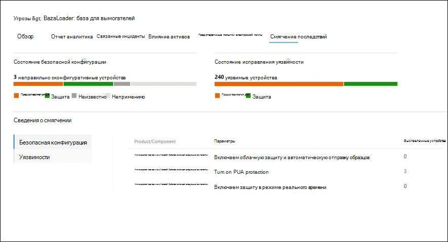

# Отслеживание и реагирование на возникающие угрозы с помощью аналитики угроз 

[!INCLUDE [Microsoft 365 Defender rebranding](../includes/microsoft-defender.md)]

**Область применения:**
- Microsoft 365 Defender

> Хотите попробовать Microsoft 365 Defender? Вы можете [оценить его в лабораторной среде](m365d-evaluation.md?ocid=cx-docs-MTPtriallab) или [запустить пилотный проект в производственной среде](m365d-pilot.md?ocid=cx-evalpilot).
>

[!INCLUDE [Prerelease](../includes/prerelease.md)]

Аналитика угроз — это наше решение для анализа угроз в продукте от экспертных исследователей безопасности Майкрософт, предназначенное для обеспечения максимальной эффективности групп безопасности при решении возникающих угроз, в том числе:

- Активные субъекты угроз и их кампании
- Популярные и новые методы атаки
- Критические уязвимости
- Общие поверхности атаки
- Распространенные вредоносные программы

Просмотрите это короткое видео, чтобы узнать больше о том, как аналитика угроз может помочь отслеживать последние угрозы и останавливать их.

>[!VIDEO https://www.microsoft.com/en-us/videoplayer/embed/RWwJfU]

Вы можете получить доступ к аналитике угроз либо с верхней левой стороны панели навигации Microsoft 365 портала безопасности, либо с выделенной карты мониторинга, на которой показаны главные угрозы в вашей организации. Получение видимости активных или текущих кампаний и знание действий с помощью аналитики угроз может помочь оснастить команду операций безопасности обоснованными решениями. 

_Где получить доступ к аналитике угроз_

При частом и распространенном распространении более сложных противников и новых угроз очень важно быстро:

- Определение и реагирование на возникающие угрозы 
- Узнайте, находятся ли вы в настоящее время под атакой
- Оценка влияния угрозы для ваших активов
- Проверка устойчивости к угрозам или воздействия на них
- Определите меры по смягчению последствий, восстановлению или предотвращению, которые можно принять для остановки или сдерживания угроз.

В каждом отчете содержится анализ отслеживаемой угрозы и подробное руководство по защите от этой угрозы. В нее также включены данные из сети, указывающие, активна ли угроза и есть ли у вас применимые средства защиты.

## Просмотр панели мониторинга аналитики угроз

Панель мониторинга аналитики угроз[(security.microsoft.com/threatanalytics3)](https://security.microsoft.com/threatanalytics3)выделяет отчеты, наиболее релевантные для организации. В нем подводятся итоги угроз в следующих разделах:

- **Последние угрозы**— списки недавно опубликованных или обновленных отчетов об угрозах, а также количество активных и разрешенных оповещений.
- **Угрозы с высоким уровнем** воздействия — это списки угроз, которые наиболее сильно влияют на организацию. В этом разделе сначала перечислены угрозы с наивысшим числом активных и разрешенных оповещений.
- **Сводка угроз**— обеспечивает общее влияние всех отслеживаемой угрозы, показывая количество угроз с активными и разрешенными оповещениями.

Выберите угрозу с панели мониторинга, чтобы просмотреть отчет об этой угрозе.

_Панель мониторинга аналитики угроз. Вы также можете щелкнуть значок Поиска для ключа в ключевом слове, связанном с отчетом аналитики угроз, который вы хотите прочитать._ 

## Просмотр отчета аналитики угроз

Каждый отчет аналитики угроз содержит сведения в нескольких разделах: 

- [**Обзор**](#overview-quickly-understand-the-threat-assess-its-impact-and-review-defenses) 
- [**Отчет аналитика**](#analyst-report-get-expert-insight-from-microsoft-security-researchers)
- [**Связанные инциденты**](#related-incidents-view-and-manage-related-incidents)
- [**Влияние активов**](#impacted-assets-get-list-of-impacted-devices-and-mailboxes)
- [**Предотвратимые попытки электронной почты**](#prevented-email-attempts-view-blocked-or-junked-threat-emails)
- [**Смягчение последствий**](#mitigations-review-list-of-mitigations-and-the-status-of-your-devices)

### Обзор. Быстрое понимание угрозы, оценка ее воздействия и проверка защиты

В **разделе Обзор** представлен предварительный просмотр подробного отчета аналитика. Он также предоставляет диаграммы, которые подчеркивают влияние угрозы для организации и вашей экспозиции с помощью неправильно сконфигурованных и неоплаченных устройств.

_Обзор раздела отчета аналитики угроз_

#### Оценка влияния на организацию
Каждый отчет содержит диаграммы, предназначенные для предоставления сведений о влиянии угрозы на организацию:
- **Связанные инциденты**— это обзор воздействия отслеживаемой угрозы для организации с помощью следующих данных:
  - Количество активных оповещений и количество связанных с ними активных инцидентов
  - Серьезность активных инцидентов
- **Оповещения со временем**— показывает количество связанных оповещений **Active** и **Resolved** с течением времени. Количество разрешенных оповещений указывает, как быстро организация реагирует на оповещения, связанные с угрозой. В идеале на диаграмме должны быть показаны оповещения, разрешенные в течение нескольких дней.
- **Влияние активов**— показывает количество различных устройств и учетных записей электронной почты (почтовых ящиков), которые в настоящее время имеют по крайней мере одно активное оповещение, связанное с отслеживаемой угрозой. Оповещения срабатывает для почтовых ящиков, которые получали сообщения угрозы. Просмотрите политики на уровне организаций и пользователей для переопределей, которые вызывают доставку электронных сообщений с угрозами.
- **Предотвратимые** попытки электронной почты — показывает количество сообщений электронной почты за последние семь дней, которые были заблокированы перед доставкой или доставлены в папку нежелательной почты.

#### Проверка устойчивости и осанки безопасности
Каждый отчет содержит диаграммы, в которых представлен обзор устойчивости организации к данной угрозе:
- **Состояние безопасной конфигурации**— отображает количество устройств с неправильными настройками безопасности. Применение рекомендуемых параметров безопасности для смягчения угрозы. Устройства считаются **Безопасными,**  если они применили все отслеживаемые параметры.
- **Состояние исправления уязвимости**— показывает количество уязвимых устройств. Применение обновлений или исправлений безопасности для устранения уязвимостей, использованных угрозой.

#### Просмотр отчетов по тегам угроз
Вы можете фильтровать список отчетов об угрозах и просматривать наиболее релевантные отчеты в соответствии с определенным тегом угрозы (категория) или типом отчета. 
- **Теги угроз** помогают просматривать наиболее релевантные отчеты в соответствии с определенной категорией угроз. Например, все отчеты, связанные с программой-вымогателями.
- **Типы отчетов**— помогают просматривать наиболее релевантные отчеты в соответствии с определенным типом отчета. Например, все отчеты, которые охватывают инструменты и методы. 
- **Фильтры** помогают эффективно просматривать список отчетов об угрозах и фильтровать представление на основе определенного тега угрозы или типа отчета. Например, просмотрите все отчеты об угрозах, относящиеся к категории вымогателей, или отчеты об угрозах, которые охватывают уязвимости.

##### Как это работает?
Группа microsoft Threat Intelligence добавила теги угроз в каждый отчет об угрозах:
- Теперь доступны четыре тега угрозы:
  - Вымогателей
  - Фишинговое
  - Уязвимость
  - Группа действий
- Теги угроз представлены в верхней части страницы аналитики угроз с счетчиками количества доступных отчетов под каждым тегом.
    
- Список также можно сортировать по тегам угроз:   
- Фильтры доступны для каждого тега угрозы и типа отчета:   

### Отчет аналитика: получите экспертную информацию от исследователей безопасности Майкрософт
В разделе **Отчет аналитика** ознакомьтесь с подробным отчетом эксперта. В большинстве отчетов подробно описаны цепочки атак, включая тактику и методы, относячимые к базе ATT MITRE&CK, исчерпывающие списки рекомендаций и мощные рекомендации по охоте на угрозы. 

[Дополнительные новости о отчете аналитика](threat-analytics-analyst-reports.md)

### Связанные инциденты: просмотр и управление связанными инцидентами
На **вкладке Связанные инциденты** содержится список всех инцидентов, связанных с отслеживаемой угрозой. Вы можете назначать инциденты или управлять оповещениями, связанными с каждым инцидентом. 

_Раздел связанных инцидентов отчета аналитики угроз_

### Влияние активов: получить список устройств и почтовых ящиков с влиянием
Актив считается затронутым, если он зависит от активного, неурегулированного оповещения. На **вкладке Impacted assets** перечислены следующие типы активов с влиянием:
- **Влияли устройства**— конечные точки с неурегулированными оповещениями Microsoft Defender для конечных точек. Как правило, эти оповещений повещают об известных индикаторах и действиях угроз.
- **Повлияли почтовые ящики**— почтовые ящики, которые получили сообщения электронной почты, которые вызвали Microsoft Defender для Office 365 оповещений. В то время как большинство сообщений, которые вызывают оповещения, как правило, блокируют, политики на уровне пользователя или организации могут переопределять фильтры.

_Раздел "Влияние на активы" отчета об аналитике угроз_

### Предотвратимые попытки электронной почты: просмотр заблокированных или нежелательных сообщений угрозы
Microsoft Defender для Office 365 обычно блокирует сообщения электронной почты с известными индикаторами угроз, включая вредоносные ссылки или вложения. В некоторых случаях механизмы активной фильтрации, проверяющие подозрительный контент, вместо этого отправляют сообщения угрозы в папку нежелательной почты. В любом случае вероятность запуска кода вредоносных программ на устройстве снижается.

В **вкладке "Предотвратить** попытки электронной почты" перечислены все электронные сообщения, которые были заблокированы перед доставкой или отправлены в папку нежелательной почты Microsoft Defender для Office 365. 

_Раздел Предотвращение попыток электронной почты отчета аналитики угроз_

### Смягчение последствий: обзор списка смягчения последствий и состояния устройств
В разделе **Mitigations** просмотрите список конкретных рекомендаций, которые помогут повысить устойчивость организации к угрозе. Список отслеживаемого смягчения включает в себя:

- **Обновления безопасности —** развертывание поддерживаемых обновлений безопасности программного обеспечения для уязвимостей, найденных на бортовых устройствах
- **Поддерживаемые конфигурации безопасности**
  - Облачная защита  
  - Защита потенциально нежелательного приложения (PUA)
  - Защита в режиме реального времени
 
Сведения о смягчении последствий в этом разделе включают данные из [контроль угроз и уязвимостей,](/windows/security/threat-protection/microsoft-defender-atp/next-gen-threat-and-vuln-mgt)которые также предоставляют подробные сведения о сверлении из различных ссылок в отчете.

 

_Раздел "Смягчение последствий" отчета об аналитике угроз_

## Дополнительные сведения и ограничения отчета
>[!NOTE]
>В рамках единой системы безопасности аналитика угроз теперь доступна не только для Microsoft Defender для конечной точки, но и для Microsoft Defender для Office владельцев лицензий E5.
>Если вы не используете портал Microsoft 365 безопасности (Microsoft 365 Defender), вы также можете увидеть сведения об отчете (без microsoft Defender для Office данных) на портале Центр безопасности в Microsoft Defender (Microsoft Defender для конечной точки). 

Чтобы получить доступ к отчету аналитики угроз, необходимы определенные роли и разрешения. Подробные сведения см. в пользовательских ролях в [области управления доступом на основе ролей Microsoft 365 Defender.](custom-roles.md)
  - Чтобы просмотреть данные оповещений, инцидентов или сеяных активов, необходимо иметь разрешения в Microsoft Defender для Office или Microsoft Defender для данных оповещений endpoint или обоих.
  - Чтобы просмотреть предотвратимые попытки электронной почты, необходимо иметь разрешения в Microsoft Defender для Office данных охоты. 
  - Чтобы просмотреть сведения о смягчении последствий, необходимо иметь разрешения на контроль угроз и уязвимостей данных в Microsoft Defender для конечной точки.

При анализе данных аналитики угроз помните следующие факторы:
- Диаграммы отражают только отслеживаемые меры по смягчению последствий. Ознакомьтесь с обзором отчетов о дополнительных смягчениях, которые не показаны в диаграммах.
- Смягчение последствий не гарантирует полную устойчивость. Предоставленные меры по смягчению последствий отражают наилучшие действия, необходимые для повышения устойчивости.
- Устройства считаются недоступными, если они не передают данные службе.
- Статистика, связанная с антивирусом, основана на антивирусная программа в Microsoft Defender параметров. Устройства с сторонними антивирусными решениями могут отображаться как "открытые".

## Похожие темы
- [Упреждающий поиск угроз с помощью продвинутой охоты](advanced-hunting-overview.md) 
- [Понимание раздела отчетов аналитика](threat-analytics-analyst-reports.md)
- [Оценка и устранение недостатков и воздействий безопасности](/windows/security/threat-protection/microsoft-defender-atp/next-gen-threat-and-vuln-mgt)
