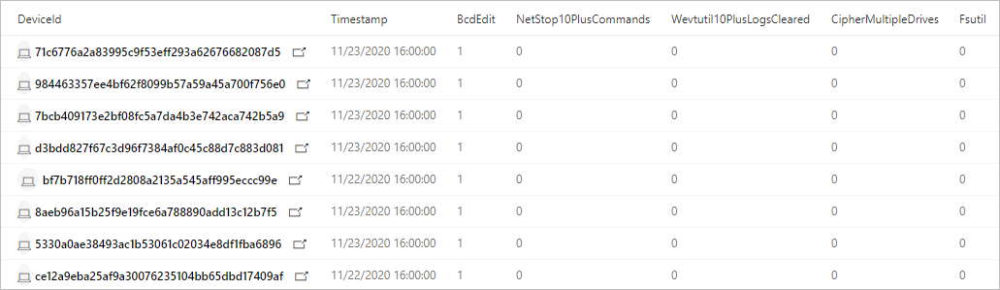

# <a name="hunt-for-ransomware"></a>Охота на программу-шантажиста

[!INCLUDE [Microsoft 365 Defender rebranding](../includes/microsoft-defender.md)]

**Область применения:**
- Microsoft 365 Defender

Программы-программы-вымогателя быстро эволюционировали от простых вредоносных программ, влияющих на отдельных пользователей компьютеров, до корпоративной угрозы, которая серьезно влияет на отрасли и правительственные учреждения. Несмотря на то что [Защитник Microsoft 365](microsoft-threat-protection.md) предоставляет множество возможностей, которые обнаруживают и блокируют программы-вымогателя и связанные с ними действия по вторжению, упреждающие проверки на наличие признаков компрометации могут помочь защитить сеть.

> [Ознакомьтесь с управляемыми людьми программами-вымогателями](https://www.microsoft.com/security/blog/2020/03/05/human-operated-ransomware-attacks-a-preventable-disaster/)

С [помощью расширенных поисков](advanced-hunting-overview.md) в Microsoft 365 Defender вы можете создавать запросы, которые будут находить отдельные артефакты, связанные с действиями программ-вымогателей. Вы также можете запускать более сложные запросы, которые могут искать признаки активности и взвешить эти знаки, чтобы найти устройства, которые требуют немедленного внимания.

## <a name="signs-of-ransomware-activity"></a>Признаки действий программы-вымогателя
Исследователи безопасности Майкрософт обнаружили различные распространенные, но незначительные артефакты во многих кампаниях программы-вымогателя, запущенных сложными злоумышленниками. Эти знаки в основном связаны с использованием системных средств для подготовки шифрования, предотвращения обнаружения и очистки экспертных свидетельств.

| Действия программы-вымогателя | Распространенные инструменты | Intent |
|--|--|--|
| Остановка процессов | _taskkill.exe_, _net stop_ | Убедитесь, что файлы, нацеленные на шифрование, не заблокированы различными приложениями. |
| Отключение служб | _sc.exe_ | - Убедитесь, что файлы, нацеленные на шифрование, не заблокированы различными приложениями.<br>- Запретить программное обеспечение безопасности нарушать шифрование и другие действия программы-вымогателя.<br>- Остановить создание резервных копий программным обеспечением.  |
| Удаление журналов и файлов | _cipher.exe_, _wevtutil_, _fsutil.exe_ | Удалите экспертные доказательства. |
| Удаление теневых копий  | _vsadmin.exe_, _wmic.exe_ | Удалите теневые копии дисков, которые можно использовать для восстановления зашифрованных файлов. |
| Удаление и остановка резервных копий | _wbadmin.exe_ | Удалите существующие резервные копии и остановите запланированные задачи резервного копирования, не мешая восстановлению после шифрования. |
| Изменение параметров загрузки | _bcdedit.exe_ | Отключите предупреждения и автоматическое восстановление после сбоев загрузки, которые могут быть вызваны процессом шифрования. |
| Отключение средств восстановления | _schtasks.exe_, _regedit.exe_, | Отключите функцию восстановления системы и другие параметры восстановления системы. |

## <a name="check-for-individual-signs-of-ransomware-activity"></a>Проверка отдельных признаков действий программы-вымогателя
Многие действия, которые составляют поведение программ-вымогателей, включая действия, описанные в предыдущем разделе, могут быть безвещаными. При использовании следующих запросов для поиска программ-вымогателей запустите несколько запросов, чтобы проверить, не проявляют ли те же устройства различные признаки возможных действий программы-вымогателя.

### <a name="stopping-multiple-processes-using-_taskkillexe_"></a>Остановка нескольких процессов с помощью _taskkill.exe_
Этот запрос проверяет попытки остановить по крайней мере 10 отдельных процессов с помощью _taskkill.exe._ [Выполнить запрос](https://security.microsoft.com/hunting?query=H4sIAAAAAAAEAI2RS2vCUBCFz7rgfwiuIkit3eumVSgtpYvuS9SLDTY2eLUvxN_eb8YHKlFkyNzJzDkn505aailRX7mmGlFlmhNBhUrOSGeuT3L0s6QqNaMagolEcMyCbApjx2e8TYhcH8Q1mB-emq50z_lF39gvBzo9-gEF-6Yhlyh9653ejCfRK6zCsaZfuJOu-x2jkqqN-0Yls-8-gp6dZ52OVuT6Sad1plulyN0KIkMt15_zt7zHDe8OBwv3btoJToa7Tnp0T8Ou9WzfT761gPOm3_FQ16Zxp2qcCdg33_rlyokG-iXv7_4BRNMnhkortmvTW6rqnZ7bgP2Vtm70D3d9wcFaAgAA&runQuery=true&timeRangeId=week)

```kusto
// Find attempts to stop processes using taskkill.exe
DeviceProcessEvents
| where Timestamp > ago(1d)
| where FileName =~ "taskkill.exe" 
| summarize taskKillCount = dcount(ProcessCommandLine), TaskKillList = make_set(ProcessCommandLine) by DeviceId, bin(Timestamp, 2m)
| where taskKillCount > 10
```
  
### <a name="stopping-processes-using-_net-stop_"></a>Остановка процессов с помощью _сетевой остановки_
Этот запрос проверяет попытки остановить по крайней мере 10 отдельных процессов с помощью _команды net stop._ [Выполнить запрос](https://security.microsoft.com/hunting?query=H4sIAAAAAAAEAI2RQUvDUBCE5yz0P4ScUijWereXVkGQIti7aA1pqakhL7VVxN_ebzc1NBChPLJv2Z2ZN5sdaqhId1ppozeyF1WcVLkK7kCl0gcx-F2QFSrJFmACJ3XMlmgKGfmGWnXC6OlCU2qfIIz12OLfUk_h2FuG_IG505JayRdpDit3bIW33B2M3WeGSqIRrvudTJvpnWzmPKvc6JcYHx1eEvd8savV07e9TchzTt198AlNZ0kluNLfjHHjIPAvak4J_tvx9XtPR6ypbn1icxShvGgqyVkO-hrAm7VUrRcaTWOs6T_7hs7XjfSqL-Lpvu5BDLxjqKRjI9a9Juvew__T2x5HutIB3T1qt4QCAAA&runQuery=true&timeRangeId=week)

```kusto
// Find attempts to stop processes using net stop
DeviceProcessEvents
| where Timestamp > ago(1d)
| where FileName =~ "net.exe" and ProcessCommandLine has "stop"
| summarize netStopCount = dcount(ProcessCommandLine), NetStopList = make_set(ProcessCommandLine) by DeviceId, bin(Timestamp, 2m)
| where netStopCount > 10
```
### <a name="deletion-of-data-on-multiple-drives-using-_cipherexe_"></a>Удаление данных на нескольких дисках с _помощью_ cipher.exe
Этот запрос проверяет попытки удаления данных на нескольких дисках _с помощьюcipher.exe._ Это действие обычно делается программами-вымогателями для предотвращения восстановления данных после шифрования. [Выполнить запрос](https://security.microsoft.com/hunting?query=H4sIAAAAAAAEAI1SXUvDQBCcZ8H_cOQpgWLoD7AvVUEo4oPvElO1pblUcmn9QPztzk6TEuEsIdzdZndndm73cuRwWGDLb0PrhWfDs8Qab1jhmX8X3D-4HJbcK66W0Rqv8hT8K4RsiPW0PHbMasVQdbiGf3vaAec4wxWtPT0lz3vhSsUCrpVVE33I_Cb6vdNhTA9EeeVaVc8KDjOugmq2SDFlrSyKvCHS1NwJZ55L_HBPondNGDGWXP2JdyMnv927UnXHWwf6l4MunupXTOPfXszVT8_smriFOCxrRU-QclOQDLgCNRwQ1u8vZc8H2o1xp-7a7U1NefSko6pnmKjakNVi4chpiA39j-rGeF6HJ3xyH76NW2ZMFLGsNDJ9i05pZSPmVdDfq-jncfqtOuU5zSuQz6Zq92w7Hfbm-9cUm-d_vZ9J9S81O2KIfAMAAA&runQuery=true&timeRangeId=week)

```kusto
// Look for cipher.exe deleting data from multiple drives
DeviceProcessEvents
| where Timestamp > ago(1d)
| where FileName =~ "cipher.exe" 
// cipher.exe /w flag used for deleting data 
| where ProcessCommandLine has "/w" 
| summarize CipherCount = dcount(ProcessCommandLine),
CipherList = make_set(ProcessCommandLine) by DeviceId, bin(Timestamp, 1m) 
// cipher.exe accessing multiple drives in a short timeframe 
| where CipherCount > 1
```

### <a name="clearing-of-forensic-evidence-from-event-logs-using-_wevtutil_"></a>Очистка экспертных свидетельств из журналов событий с помощью _wevtutil_
Этот запрос проверяет попытки очистить по крайней мере 10 записей журнала из журналов событий с помощью _wevtutil._ [Выполнить запрос](https://security.microsoft.com/hunting?query=H4sIAAAAAAAEAJWRTU_CQBCG37OJ_2HDqSQkwMGjXgoHEg4cUI-m2hUaqGu6BaPxx_vsEFCTxmA225nOvB_tzFBDOc0VOBuyZ2JD3CnKEwMVpzfyPbVWlba8t9Sdnsi9CsPXdLfWf7Wq4xm0QuVSF5oYv4LhtQAfLIucKXWvF5gH5Ke5rak1prKEVRu2xalG3emGW6AdlGmsUv1O5m-fnLzmFHiV_G9FTKg1lUjs6Z5vucPvljsD0TOXhP6_Vm7841dFZnPAN2A_DDu36eSnCSbNnc3B6Zpb4nasZGf59zWA963orZdcEiKelBNvQ_fBNny-utOj3nn-3OUMxMA6CZV1bCt1r8i6d_TXFNKWxxrpC48hm8miAgAA&runQuery=true&timeRangeId=week)

```kusto
// Look for use of wevtutil to clear multiple logs
DeviceProcessEvents
| where Timestamp > ago(1d)
| where ProcessCommandLine has "WEVTUTIL" and ProcessCommandLine has "CL"
| summarize LogClearCount = dcount(ProcessCommandLine), ClearedLogList = make_set(ProcessCommandLine) by DeviceId, bin(Timestamp, 5m)
| where LogClearCount > 10
```

### <a name="turning-off-services-using-_scexe_"></a>Отключение служб с _помощьюsc.exe_
Этот запрос проверяет попытки отключить по крайней мере 10 существующих служб _с_ помощьюsc.exe. [Выполнить запрос](https://security.microsoft.com/hunting?query=H4sIAAAAAAAEAKWST2vCQBDF31nodwg5RZCqhx7bi3ooeCjovaQxraIxxfU_fvj-ZoiiEIqlhM3Ozrz3ZnZm22or0lAl3xzrk33FHpTpUbn2rEgTzfCk-tACa6kvR-Qgt5wzrKAHNdTHOnveiJZVLGiAP4e5rpAnFHaauoZlGMMqHLsmT6FvfC-slFylEnWpoVnLvM3Twy74UnJNuJdVa6gpnsAe-81iVzbE3_kZiCV9mlHZf3Sue5pzii-3C9pU3BWYo_NGKPdvGJZh4x2N9Owzyi6e5K5qmmrVKg_9dNY11hzvu0_8fu0ItQP_6zfxCqLlEUMlNVO36BNW_ax_74K9l646-gFts39I1AIAAA&runQuery=true&timeRangeId=week)

```kusto
// Look for sc.exe disabling services
DeviceProcessEvents
| where Timestamp > ago(1d)
| where ProcessCommandLine has "sc" and ProcessCommandLine has "config" and ProcessCommandLine has "disabled"
| summarize ScDisableCount = dcount(ProcessCommandLine), ScDisableList = make_set(ProcessCommandLine) by DeviceId, bin(Timestamp, 5m)
| where ScDisableCount > 10
```

### <a name="turning-off-system-restore"></a>Отключение восстановления системы
Этот запрос определяет попытки остановить восстановление системы и запретить системе создавать точки восстановления, которые можно использовать для восстановления данных, зашифрованных программами-вымогателями. [Выполнить запрос](https://security.microsoft.com/hunting?query=H4sIAAAAAAAEAK2S3UrDQBCFz7XgO6y9id4o6HWvrIVCkaJPENOYFNumZGO1ID673w4xJA1isbJMZnZ-zpzM7EiptlooQc9UqjDLc-7wp1qrwj7Via44MzK35FTotTI5PXMr0aVe8cy15NzoGo-zqg_0m3KQSsRpQtbC6uMGpdt3jHeJfU_GymqG-uQb9XpcEn1HIuvmGpZT0Aq99Dim4G3ousNO8K04sSE6EEN22kL6jvzO-LaDNW2QzqxLmGBsPo9vUMt_oA8Na3DQv3vwcmPiifpmds48jkhut8T2FLikxm_T4bI_m_6uQt-wrXO28lPPSBcdziOqPFlP9RYy47tDKtuZM07hVtSvaJ_HYRPL63-NyMgtmtWv5684jy2WDx2O0ZEM562ZBLQvURxur6gDAAA&runQuery=true&timeRangeId=week)

```kusto
DeviceProcessEvents
//Pivoting for rundll32  
| where InitiatingProcessFileName =~ 'rundll32.exe'   
//Looking for empty command line   
and InitiatingProcessCommandLine !contains " " and InitiatingProcessCommandLine != ""  
//Looking for schtasks.exe as the created process  
and FileName in~ ('schtasks.exe')  
//Disabling system restore   
and ProcessCommandLine has 'Change' and ProcessCommandLine has 'SystemRestore' 
and ProcessCommandLine has 'disable'
```

### <a name="backup-deletion"></a>Удаление резервных копий
Этот запрос определяет использованиеwmic.exe _для_ удаления моментальных снимков теневой копии перед шифрованием. [Выполнить запрос](https://security.microsoft.com/hunting?query=H4sIAAAAAAAEAJWS2wqCQBCG_-ugd5CupTfoqgMIEV70AqFLGp5QyYLo2fsavEjxwlhWZ7-df2Z2dndyuitVxD9UrdKshrGHOxVqsZda6CVPnRJYzfR0QJVhnXRRbmSjN98VXrlFXEMfzNWkfphti50zLmSMdURfmFcCaSxqY3aMX4eqVKUn1OsV_8eLWX_rbwcVVhblBovY8bT76U-AxoedWeeWp7WzV0YDMqSQFNZavuuopnHH_Iku-lbJnLPMyxnYDTp4bZ5P9M5uNpsZIWSn7l_CuNoPSggb4z4CAAA&runQuery=true&timeRangeId=week)

```kusto
DeviceProcessEvents
| where FileName =~ "wmic.exe"
| where ProcessCommandLine has "shadowcopy" and ProcessCommandLine has "delete"
| project DeviceId, Timestamp, InitiatingProcessFileName, FileName,
ProcessCommandLine, InitiatingProcessIntegrityLevel, InitiatingProcessParentFileName
```

## <a name="check-for-multiple-signs-of-ransomware-activity"></a>Проверка на нескольких признаков действий программы-вымогателя
Вместо отдельного выполнения нескольких запросов можно также использовать комплексный запрос, который проверяет наличие нескольких признаков действий программы-вымогателя, чтобы определить затронутые устройства. Следующий консолидированный запрос:
- Ищет относительно конкретные и незаметные признаки действий программы-вымогателя
- Взвешывает наличие этих знаков
- Определяет устройства с более высокой вероятностью того, что они будут целью программ-вымогателей 

При запуске этот консолидированный запрос возвращает список устройств с несколькими признаками атаки. Также отображается количество действий программы-вымогателя каждого типа. Чтобы запустить этот консолидированный запрос, скопируйте его непосредственно в редактор запросов ["Расширенный поиск".](https://security.microsoft.com/advanced-hunting) 

```kusto
// Find attempts to stop processes using taskkill.exe
let taskKill = DeviceProcessEvents
| where Timestamp > ago(1d)
| where FileName =~ "taskkill.exe" 
| summarize taskKillCount = dcount(ProcessCommandLine), TaskKillList = make_set(ProcessCommandLine) by DeviceId, bin(Timestamp, 2m)
| where taskKillCount > 10;
// Find attempts to stop processes using net stop
let netStop = DeviceProcessEvents
| where Timestamp > ago(1d)
| where FileName =~ "net.exe" and ProcessCommandLine has "stop"
| summarize netStopCount = dcount(ProcessCommandLine), NetStopList = make_set(ProcessCommandLine) by DeviceId, bin(Timestamp, 2m)
| where netStopCount > 10;
// Look for cipher.exe deleting data from multiple drives
let cipher = DeviceProcessEvents
| where Timestamp > ago(1d)
| where FileName =~ "cipher.exe" 
// cipher.exe /w flag used for deleting data 
| where ProcessCommandLine has "/w" 
| summarize CipherCount = dcount(ProcessCommandLine), 
CipherList = make_set(ProcessCommandLine) by DeviceId, bin(Timestamp, 1m) 
// cipher.exe accessing multiple drives in a short timeframe 
| where CipherCount > 1;
// Look for use of wevtutil to clear multiple logs
let wevtutilClear = DeviceProcessEvents
| where Timestamp > ago(1d)
| where ProcessCommandLine has "WEVTUTIL" and ProcessCommandLine has "CL"
| summarize LogClearCount = dcount(ProcessCommandLine), ClearedLogList = make_set(ProcessCommandLine) by DeviceId, bin(Timestamp, 5m)
| where LogClearCount > 10;
// Look for sc.exe disabling services
let scDisable = DeviceProcessEvents
| where Timestamp > ago(1d)
| where ProcessCommandLine has "sc" and ProcessCommandLine has "config" and ProcessCommandLine has "disabled"
| summarize ScDisableCount = dcount(ProcessCommandLine), ScDisableList = make_set(ProcessCommandLine) by DeviceId, bin(Timestamp, 5m)
| where ScDisableCount > 10;
// Main query for counting and aggregating evidence
DeviceProcessEvents
| where Timestamp > ago(1d)
| where FileName =~ "vssadmin.exe" and ProcessCommandLine has_any("list shadows", "delete shadows")
or FileName =~ "fsutil.exe" and ProcessCommandLine has "usn" and ProcessCommandLine has "deletejournal"
or ProcessCommandLine has("bcdedit") and ProcessCommandLine has_any("recoveryenabled no", "bootstatuspolicy ignoreallfailures")
or ProcessCommandLine has "wbadmin" and ProcessCommandLine has "delete" and ProcessCommandLine has_any("backup", "catalog", "systemstatebackup")
or (ProcessCommandLine has "wevtutil" and ProcessCommandLine has "cl") 
or (ProcessCommandLine has "wmic" and ProcessCommandLine has "shadowcopy delete")
or (ProcessCommandLine has "sc" and ProcessCommandLine has "config" and ProcessCommandLine has "disabled")
| extend Bcdedit = iff(ProcessCommandLine has "bcdedit" and ProcessCommandLine has_any("recoveryenabled no", "bootstatuspolicy ignoreallfailures"), 1, 0)
| extend ShadowCopyDelete = iff (ProcessCommandLine has "shadowcopy delete", 1, 0)
| extend VssAdminShadows = iff(ProcessCommandLine has "vssadmin" and ProcessCommandLine has_any("list shadows", "delete shadows"), 1, 0)
| extend Wbadmin = iff(ProcessCommandLine has "wbadmin" and ProcessCommandLine has "delete" and ProcessCommandLine has_any("backup", "catalog", "systemstatebackup"), 1,0)
| extend Fsutil = iff(ProcessCommandLine has "fsutil" and ProcessCommandLine has "usn" and ProcessCommandLine has "deletejournal", 1, 0)
| summarize FirstActivity = min(Timestamp), ReportId = any(ReportId), Commands = make_set(ProcessCommandLine) by DeviceId, Fsutil, Wbadmin, ShadowCopyDelete, Bcdedit, VssAdminShadows, bin(Timestamp, 6h)
// Joining extra evidence
| join kind=leftouter (wevtutilClear) on $left.DeviceId == $right.DeviceId
| join kind=leftouter (cipher) on $left.DeviceId == $right.DeviceId
| join kind=leftouter (netStop) on $left.DeviceId == $right.DeviceId
| join kind=leftouter (taskKill) on $left.DeviceId == $right.DeviceId
| join kind=leftouter (scDisable) on $left.DeviceId == $right.DeviceId
| extend WevtutilUse = iff(LogClearCount > 10, 1, 0)
| extend CipherUse = iff(CipherCount > 1, 1, 0)
| extend NetStopUse = iff(netStopCount > 10, 1, 0)
| extend TaskkillUse = iff(taskKillCount > 10, 1, 0)
| extend ScDisableUse = iff(ScDisableCount > 10, 1, 0)
// Adding up all evidence
| mv-expand CommandList = NetStopList, TaskKillList, ClearedLogList, CipherList, Commands, ScDisableList
// Format results
| summarize BcdEdit = iff(make_set(Bcdedit) contains "1" , 1, 0), NetStop10PlusCommands = iff(make_set(NetStopUse) contains "1", 1, 0), Wevtutil10PlusLogsCleared = iff(make_set(WevtutilUse) contains "1", 1, 0),
CipherMultipleDrives = iff(make_set(CipherUse) contains "1", 1, 0), Fsutil = iff(make_set(Fsutil) contains "1", 1, 0), ShadowCopyDelete = iff(make_set(ShadowCopyDelete) contains "1", 1, 0),
Wbadmin = iff(make_set(Wbadmin) contains "1", 1, 0), TaskKill10PlusCommand = iff(make_set(TaskkillUse) contains "1", 1, 0), VssAdminShadow = iff(make_set(VssAdminShadows) contains "1", 1, 0), 
ScDisable = iff(make_set(ScDisableUse) contains "1", 1, 0), TotalEvidenceCount = count(CommandList), EvidenceList = make_set(Commands), StartofBehavior = min(FirstActivity) by DeviceId, bin(Timestamp, 1d)
| extend UniqueEvidenceCount = BcdEdit + NetStop10PlusCommands + Wevtutil10PlusLogsCleared + CipherMultipleDrives + Wbadmin + Fsutil + TaskKill10PlusCommand + VssAdminShadow + ScDisable + ShadowCopyDelete
| where UniqueEvidenceCount > 2
```
### <a name="understand-and-tweak-the-query-results"></a>Анализ и настройка результатов запроса
Консолидированный запрос возвращает следующие результаты:

- **DeviceId**— определяет затронутное устройство 
- **TimeStamp**— первый раз, когда на устройстве наблюдались все знаки действий программы-вымогателя
- **Конкретные признаки действий**— количество для каждого знака, показанного в нескольких столбцах, например _BcdEdit_ или _FsUtil_
- **TotalEvidenceCount**— количество наблюдаемых знаков
- **UniqueEvidenceCount**— количество типов наблюдаемых знаков



*Результаты запроса, показывающие затронутые устройства и количество различных признаков действий программы-вымогателя*

По умолчанию в результатах запроса перечислены только устройства, которые имеют более двух типов действий программы-вымогателя. Чтобы увидеть все устройства с любым знаком активности программы-вымогателя, измените следующий оператор и установите нулевое `where` значение (0). Чтобы увидеть меньше устройств, установите большее число. 

```kusto
| where UniqueEvidenceCount > 2
```

## <a name="related-topics"></a>Связанные статьи
- [Обзор расширенной охоты на угрозы](advanced-hunting-overview.md)
- [Изучение языка запросов](advanced-hunting-query-language.md)
- [Работа с результатами запросов](advanced-hunting-query-results.md)
- [Использование общих запросов](advanced-hunting-shared-queries.md)
- [Сведения о схеме](advanced-hunting-schema-tables.md)
- [Рекомендации по применению запросов](advanced-hunting-best-practices.md)