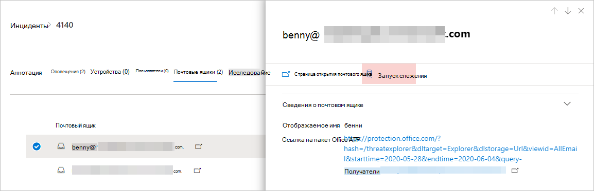
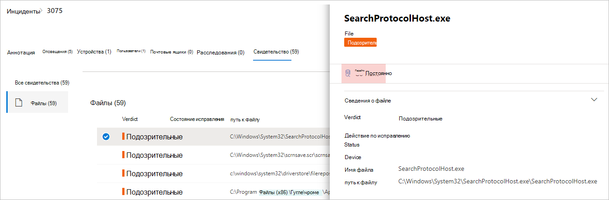
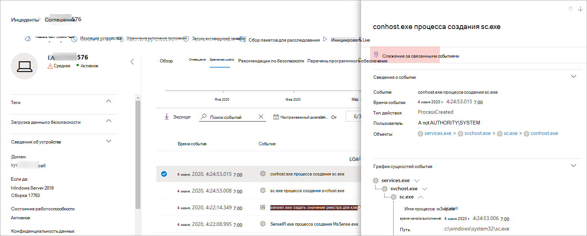

# <a name="quickly-hunt-for-entity-or-event-information-with-go-hunt"></a>Быстрая поиск сведений об объектах или событиях с помощью перейти на поиск

[!INCLUDE [Microsoft 365 Defender rebranding](../includes/microsoft-defender.md)]


**Область применения:**
- Microsoft 365 Defender

С помощью *действия «Go hunt»* вы можете быстро исследовать события и различные типы суружества, используя мощные расширенные возможности [выследавания](advanced-hunting-overview.md) на основе запросов. Это действие автоматически выполняет запрос на расширенный поиск для поиска релевантной информации о выбранном событии или объекте.

Действие *"Go hunt"* доступно в различных разделах центра безопасности при отобратели событий или сведений об объектах. Например, вы можете использовать *go hunt* из следующих разделов:

- На странице [инцидента можно](investigate-incidents.md#incident-overview)просмотреть сведения о пользователях, устройствах и многих других организациях, связанных с инцидентом. При выборе сущности вы получаете дополнительные сведения, а также различные действия, которые можно принять с этой сущностью. В примере ниже выбирается почтовый ящик, в котором отображаются сведения о почтовом ящике, а также возможность искать дополнительные сведения о почтовом ящике.

    

- На странице инцидента также можно получить доступ к списку сущностям на вкладке свидетельства. Выбор одной из этих сущностей позволяет быстро искать сведения об этом объекте.

    


- При просмотре временной шкалы для устройства можно выбрать событие на временной шкале, чтобы просмотреть дополнительные сведения об этом событии. После выбора события вы получаете возможность искать другие важные события в расширенных охотах.

    

При выборе **"Go hunt"** или **"Hunt"** для связанных событий проходят различные запросы в зависимости от того, выбрана ли сущность или событие.

## <a name="query-for-entity-information"></a>Запрос сведений об объектах
При использовании *go hunt* для запроса сведений о пользователе, устройстве или любом другом типе сущности запрос проверяет все соответствующие таблицы схемы на наличие событий, связанных с этим объектом. Для поддержания управляемости результатов областью запроса является примерно тот же период времени, что и самый ранний период активности за последние 30 дней, связанный с сущностью и связанный с инцидентом.

Вот пример запроса на поиск по запросу go для устройства:

```kusto
let selectedTimestamp = datetime(2020-06-02T02:06:47.1167157Z);
let deviceName = "fv-az770.example.com";
let deviceId = "device-guid";
search in (DeviceLogonEvents, DeviceProcessEvents, DeviceNetworkEvents, DeviceFileEvents, DeviceRegistryEvents, DeviceImageLoadEvents, DeviceEvents, DeviceImageLoadEvents, IdentityLogonEvents, IdentityQueryEvents)
Timestamp between ((selectedTimestamp - 1h) .. (selectedTimestamp + 1h))
and DeviceName == deviceName
// or RemoteDeviceName == deviceName
// or DeviceId == deviceId
| take 100
```
### <a name="supported-entity-types"></a>Поддерживаемые типы су-
Вы можете использовать *go hunt* после выбора любого из этих типов сущности:

- Файлы
- Сообщения электронной почты
- Кластеры электронной почты
- Почтовые ящики
- Пользователи
- Устройства
- IP-адреса
- URL-адреса

## <a name="query-for-event-information"></a>Запрос сведений о событии
При использовании *go hunt* для запроса сведений о событии временной шкалы запрос проверяет все соответствующие таблицы схемы на наличие других событий, происходящих во время выбранного события. Например, в следующих запросах перечислены события в различных таблицах схем, которые произошли за один период времени на одном устройстве:

```kusto
// List relevant events 30 minutes before and after selected LogonAttempted event
let selectedEventTimestamp = datetime(2020-06-04T01:29:09.2496688Z);
search in (DeviceFileEvents, DeviceProcessEvents, DeviceEvents, DeviceRegistryEvents, DeviceNetworkEvents, DeviceImageLoadEvents, DeviceLogonEvents)
    Timestamp between ((selectedEventTimestamp - 30m) .. (selectedEventTimestamp + 30m))
    and DeviceId == "079ecf9c5798d249128817619606c1c47369eb3e"
| sort by Timestamp desc
| extend Relevance = iff(Timestamp == selectedEventTimestamp, "Selected event", iff(Timestamp < selectedEventTimestamp, "Earlier event", "Later event"))
| project-reorder Relevance
```

## <a name="adjust-the-query"></a>Настройка запроса
С некоторым знанием языка [запроса](advanced-hunting-query-language.md)вы можете настроить запрос в своих предпочтениях. Например, можно настроить эту строку, которая определяет размер окне времени:

```kusto
Timestamp between ((selectedTimestamp - 1h) .. (selectedTimestamp + 1h))
```

Помимо изменения запроса, чтобы получить более релевантные результаты, можно также:
- [Просмотр результатов в качестве диаграмм](advanced-hunting-query-results.md#view-query-results-as-a-table-or-chart)
- [Создание настраиваемой правила обнаружения](custom-detection-rules.md)

## <a name="related-topics"></a>Связанные статьи
- [Обзор расширенной охоты на угрозы](advanced-hunting-overview.md)
- [Изучение языка запросов](advanced-hunting-query-language.md)
- [Работа с результатами запросов](advanced-hunting-query-results.md)
- [Настраиваемые правила обнаружения](custom-detection-rules.md)
