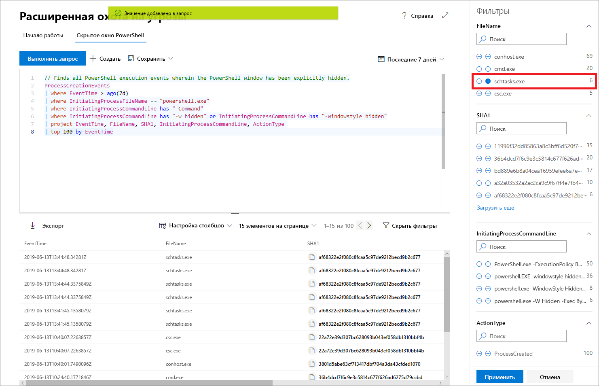

# Защита от угроз (Майкрософт) позволяет осуществлять их расширенное выслеживание на профилактической основе

**Область применения:**
- Защита от угроз (Майкрософт)

[!include[Prerelease information](prerelease.md)]

Расширенное выслеживание— это средство для выслеживания угроз на основе запросов, которое позволяет изучать необработанные данные за период до 30 дней. Оно дает возможность проводить инспекцию событий в своей сети для поиска интересных индикаторов и объектов на профилактической основе. Гибкое управление доступом к данным позволяет выслеживать как известные, так и потенциальные угрозы без ограничений.

В Центре безопасности Microsoft 365 в рамках расширенного выслеживания поддерживаются запросы на поиск в данных в ATP в Microsoft Defender с покрытием данных с подключенных устройств и в Office 365 ATP с предоставлением данных из электронной почты. Воспользоваться расширенным выслеживанием можно, [включив Защиту от угроз (Майкрософт)](mtp-enable.md).

## Начало работы с расширенным выслеживанием

Чтобы быстро приступить к работе с расширенным выслеживанием и освоиться с ним, нужно выполнить несколько действий.

| Цель обучения | Описание | Ресурс |
|--|--|--|
| **Освоение языка** | Расширенное выслеживание основано на [языке запросов Kusto](https://docs.microsoft.com/azure/kusto/query/) с поддержкой аналогичного синтаксиса и аналогичных операторов. Начать изучение языка запросов можно, выполнив свой первый запрос. | [Сведения о языке запросов](advanced-hunting-query-language.md) |
| **Сведения о схеме** | Формирование четкого и глубокого представления о таблицах схемы и входящих в них столбцах. Это поможет определять, где искать данные и как создавать запросы. | [Справочник по схеме](advanced-hunting-schema-tables.md) |
| **Использование предварительно настроенных запросов** | Возможен поиск в коллекции предварительно настроенных запросов для использования при разных сценариев выслеживания угроз. | [Использование общих запросов](advanced-hunting-shared-queries.md)
| **Оптимизация запросов** | Общие сведения о создании эффективных запросов и запросов с объединенными данными из сообщений электронной почты и c устройств. | [Рекомендации по примению запросов](advanced-hunting-shared-queries.md), [Выслеживание на устройствах и в сообщениях электронной почты](advanced-hunting-best-practices.md)

## Помощь при написании запросов
Ниже перечислены функции, благодаря которым запросы можно создавать быстрее.
- **Автозаполнение** — отображение по мере ввода текста запроса вариантов, имеющихся в системе расширенного выслеживания. 
- **Справочник по схеме** — справочник по схеме со списком таблиц и их столбцов, расположенный рядом с рабочей областью. Чтобы получить об элементе дополнительные сведения, нужно навести на него указатель мыши. Чтобы вставить элемент в редактор запросов, нужно дважды щелкнуть по нему.

## Детализация результатов запроса
Чтобы просмотреть дополнительные сведения об объектах в результатах поиска по запросу, например, компьютерах, файлах, пользователях, IP-адресах и URL-адресах, нужно просто щелкнуть идентификатор объекта. Открывается страница c данными профиля выбранного объекта в центре безопасности Microsoft Defender.

## Регулирование запросов на основе результатов
Чтобы оперативно улучшить свой запрос, нужно щелкнуть правой кнопкой мыши одно из значений в полученном наборе результатов. Предлагаемые варианты можно использовать для

- открытого поиска избранного значения (`==`)
- исключения избранного значения из запроса (`!=`)
- Чтобы добавить к своему запросу определенное значение, можно использовать дополнительные операторы, например, `contains`, `starts with` и`ends with` 

## Фильтрация результатов запроса
Используя отображаемые справа фильтры, можно сформировать сводку о полученном наборе результатов. В каждом столбце есть раздел, в котором приводятся уникальные обнаруженные для этого столбца значения и количество экземпляров.

С помощью кнопок "+" и "-" для значений, которые нужно включить или исключить, можно уточнить запрос и затем выбрать команду**Выполнить запрос**.

Использование фильтра с целью изменения запроса и отправка этого запроса позволяют получить новые соответствующие результаты.

## См. также
- [Изучение языка запросов](advanced-hunting-query-language.md)
- [Использование общих запросов](advanced-hunting-shared-queries.md)
- [Поиск угроз на устройствах и в сообщениях электронной почты](advanced-hunting-query-emails-devices.md)
- [Сведения о схеме](advanced-hunting-schema-tables.md)
- [Рекомендации по применению запросов](advanced-hunting-best-practices.md)