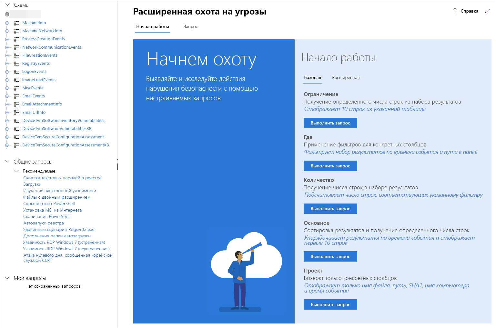

# <a name="learn-the-advanced-hunting-query-language"></a>Познакомьтесь с языком запросов расширенной охоты

**Область применения:**
- Защита от угроз (Майкрософт)

[!INCLUDE [Prerelease information](../includes/prerelease.md)]

Расширенный поиск основывается на [языке запросов Kusto](https://docs.microsoft.com/azure/kusto/query/). С помощью синтаксиса и операторов Кусто можно создавать запросы, которые позволяют найти информацию в [схеме](advanced-hunting-schema-tables.md), специально структурированной для расширенного поиска. Чтобы лучше понять эти концепции, запустите ваш первый запрос.

## <a name="try-your-first-query"></a>Попробуйте выполнить первый запрос

Чтобы выполнить ваш первый запрос, в центре безопасности Microsoft 365 перейдите в раздел **Охота**. Используйте следующий пример:

```kusto
// Finds PowerShell execution events that could involve a download.
DeviceProcessEvents 
| where Timestamp > ago(7d)
| where FileName in ("powershell.exe", "POWERSHELL.EXE", "powershell_ise.exe", "POWERSHELL_ISE.EXE") 
| where ProcessCommandLine has "Net.WebClient"
        or ProcessCommandLine has "DownloadFile"
        or ProcessCommandLine has "Invoke-WebRequest"
        or ProcessCommandLine has "Invoke-Shellcode"
        or ProcessCommandLine contains "http:"
| project Timestamp, DeviceName, InitiatingProcessFileName, FileName, ProcessCommandLine
| top 100 by Timestamp
```

Так это будет выглядеть в расширенной охоте.


Запрос начинается с короткого комментария, описывающего назначение запроса. Это будет полезным, если впоследствии вы решите сохранить свой запрос и поделиться им с другими пользователями в вашей организации.

```kusto
// Finds PowerShell execution events that could involve a download.
DeviceProcessEvents
```

Как правило, запрос начинается с имени таблицы, за которым следует ряд элементов, начинающихся с вертикальной черты (`|`). В этом примере мы начинаем с добавления имени таблицы `DeviceProcessEvents` и при необходимости добавляем элементы, отмеченные вертикальной чертой.

Первый элемент, отмеченный вертикальной чертой, является фильтром времени, ограниченном предыдущими семью днями. Сохранение как можно более узкого временного диапазона гарантирует, что запросы работают хорошо, возвращают управляемые результаты и не превышают времени ожидания.

```kusto
| where Timestamp > ago(7d)
```

За диапазоном времени непосредственно следует поиск файлов, представляющих приложение PowerShell.

```kusto
| where FileName in ("powershell.exe", "POWERSHELL.EXE", "powershell_ise.exe", "POWERSHELL_ISE.EXE")
```

Затем запрос ищет командные строки, которые, как правило, используются с PowerShell для скачивания файлов.

```kusto
| where ProcessCommandLine has "Net.WebClient"
        or ProcessCommandLine has "DownloadFile"
        or ProcessCommandLine has "Invoke-WebRequest"
        or ProcessCommandLine has "Invoke-Shellcode"
        or ProcessCommandLine contains "http:"
```

Теперь, когда ваш запрос четко определяет данные, которые вы хотите найти, вы можете добавить элементы, которые определяют то, как будут выглядеть результаты. `project` возвращает определенные столбцы и `top` ограничивает количество результатов, делая результаты хорошо отформатированными и достаточно большими и простыми в обработке.

```kusto
| project Timestamp, DeviceName, InitiatingProcessFileName, FileName, ProcessCommandLine
| top 100 by Timestamp'
```

Нажмите кнопку **Выполнить запрос**, чтобы увидеть результаты. Вы можете развернуть экран, чтобы сосредоточиться на вашем запросе охоты и результатах.

## <a name="learn-common-query-operators-for-advanced-hunting"></a>Познакомьтесь с обычными операторами запросов для расширенной охоты

Теперь, когда вы выполнили свой первый запрос и получили общее представление о его компонентах, пришло время вернуться немного назад и изучить некоторые основы. Язык запросов Kusto, используемый в расширенной охоте, поддерживает ряд операторов, включая обычные, описанные ниже.

| Оператор | Описание и использование |
|--|--|
| `where` | Фильтрация таблицы по подмножеству строк, удовлетворяющих предикату. |
| `summarize` | Создание таблицы, в которой объединяется содержимое исходной таблицы. |
| `join` | Объединение строк двух таблиц, чтобы сформировать новую таблицу, сопоставляя значения заданных столбцов из каждой таблицы. |
| `count` | Возврат количества записей в исходный набор записей. |
| `top` | Возврат первых N записей, отсортированных по заданным столбцам. |
| `limit` | Возврат до заданного количества строк. |
| `project` | Выбор столбцов, которые нужно включить, переименовать или перетащить, и вставка новых вычисляемых столбцов. |
| `extend` | Создание вычисляемых столбцов и их добавление в результирующий набор. |
| `makeset` |  Возврат динамического массива (JSON) множества различных значений, которые выражение (Expr) принимает в группе. |
| `find` | Поиск строк, соответствующих предикату, по набору таблиц. |

Чтобы просмотреть реальные примеры этих операторов, запустите их из пункта **Начать работу** в разделе Расширенная охота.

## <a name="understand-data-types-and-their-query-syntax-implications"></a>Общие сведения о типах данных и их влиянии на синтаксис запроса

Данные в таблицах расширенной охоты, как правило, относятся к указанным ниже типам данных.

| Тип данных | Описание и влияния запроса |
|--|--|
| `datetime` | Данные и сведения о времени, обычно представляющие временные метки событий |
| `string` | Строка символов |
| `bool` | Истина или ложь |
| `int` | 32-разрядное числовое значение  |
| `long` | 64-разрядное числовое значение |

## <a name="use-sample-queries"></a>Использование примеров запросов

Раздел **Начало работы** содержит несколько простых запросов, использующих часто используемые операторы. Попробуйте выполнить эти запросы и внести в них небольшие изменения.



>[!NOTE]
>Кроме примеров базовых запросов, вы можете получить доступ к [общим запросам](advanced-hunting-shared-queries.md) для определенных сценариев охоты на угрозы. Ознакомьтесь с общими запросами в левой части страницы репозитории запросов GitHub.

## <a name="access-query-language-documentation"></a>Документация по языку условий запросов

Дополнительные сведения о языке запросов Kusto и поддерживаемых операторах см. в статье [Документация по языку запросов Kusto](https://docs.microsoft.com/azure/kusto/query/).

## <a name="related-topics"></a>См. также
- [Активная охота на угрозы](advanced-hunting-overview.md)
- [Использование общих запросов](advanced-hunting-shared-queries.md)
- [Поиск угроз на устройствах и в сообщениях электронной почты](advanced-hunting-query-emails-devices.md)
- [Общие сведения о схеме](advanced-hunting-schema-tables.md)
- [Рекомендации по применению запросов](advanced-hunting-best-practices.md)