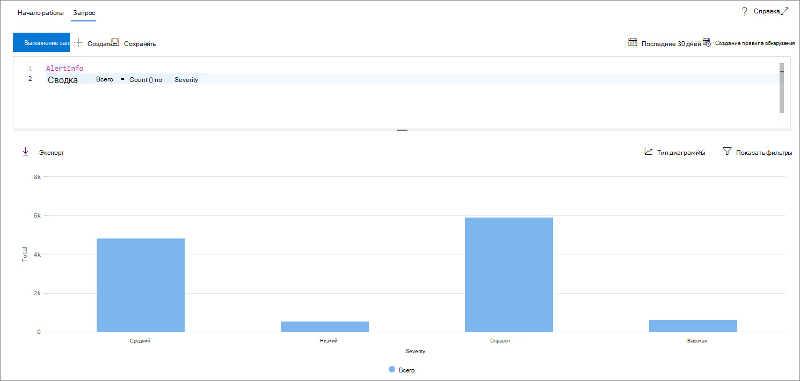

# <a name="work-with-advanced-hunting-query-results"></a><span data-ttu-id="71053-104">Работать с расширенными результатами запроса поиска</span><span class="sxs-lookup"><span data-stu-id="71053-104">Work with advanced hunting query results</span></span>

[!INCLUDE [Microsoft 365 Defender rebranding](../includes/microsoft-defender.md)]


<span data-ttu-id="71053-105">**Область применения:**</span><span class="sxs-lookup"><span data-stu-id="71053-105">**Applies to:**</span></span>
- <span data-ttu-id="71053-106">Защита от угроз (Майкрософт)</span><span class="sxs-lookup"><span data-stu-id="71053-106">Microsoft Threat Protection</span></span>

[!INCLUDE [Prerelease information](../includes/prerelease.md)]

<span data-ttu-id="71053-107">Несмотря на то, что [Расширенные](advanced-hunting-overview.md) запросы поиска можно создавать для получения очень точной информации, вы также можете работать с результатами запроса, чтобы получить дополнительные сведения и исследовать конкретные действия и индикаторы.</span><span class="sxs-lookup"><span data-stu-id="71053-107">While you can construct your [advanced hunting](advanced-hunting-overview.md) queries to return very precise information, you can also work with the query results to gain further insight and investigate specific activities and indicators.</span></span> <span data-ttu-id="71053-108">В результатах запроса можно выполнить следующие действия:</span><span class="sxs-lookup"><span data-stu-id="71053-108">You can take the following actions on your query results:</span></span>

- <span data-ttu-id="71053-109">Просмотр результатов в виде таблицы или диаграммы</span><span class="sxs-lookup"><span data-stu-id="71053-109">View results as a table or chart</span></span>
- <span data-ttu-id="71053-110">Экспорт таблиц и диаграмм</span><span class="sxs-lookup"><span data-stu-id="71053-110">Export tables and charts</span></span>
- <span data-ttu-id="71053-111">Детализация подробных сведений об объекте</span><span class="sxs-lookup"><span data-stu-id="71053-111">Drill down to detailed entity information</span></span>
- <span data-ttu-id="71053-112">Настройка запросов непосредственно из результатов или применение фильтров</span><span class="sxs-lookup"><span data-stu-id="71053-112">Tweak your queries directly from the results or apply filters</span></span>

## <a name="view-query-results-as-a-table-or-chart"></a><span data-ttu-id="71053-113">Просмотр результатов запроса в виде таблицы или диаграммы</span><span class="sxs-lookup"><span data-stu-id="71053-113">View query results as a table or chart</span></span>
<span data-ttu-id="71053-114">По умолчанию при расширенном поиске отображаются результаты запроса в виде табличных данных.</span><span class="sxs-lookup"><span data-stu-id="71053-114">By default, advanced hunting displays query results as tabular data.</span></span> <span data-ttu-id="71053-115">Вы также можете отображать одни и те же данные в виде диаграммы.</span><span class="sxs-lookup"><span data-stu-id="71053-115">You can also display the same data as a chart.</span></span> <span data-ttu-id="71053-116">Расширенный поиск поддерживает следующие представления:</span><span class="sxs-lookup"><span data-stu-id="71053-116">Advanced hunting supports the following views:</span></span>

| <span data-ttu-id="71053-117">Тип представления</span><span class="sxs-lookup"><span data-stu-id="71053-117">View type</span></span> | <span data-ttu-id="71053-118">Описание</span><span class="sxs-lookup"><span data-stu-id="71053-118">Description</span></span> |
| -- | -- |
| <span data-ttu-id="71053-119">**Table**</span><span class="sxs-lookup"><span data-stu-id="71053-119">**Table**</span></span> | <span data-ttu-id="71053-120">Отображает результаты запроса в табличном формате</span><span class="sxs-lookup"><span data-stu-id="71053-120">Displays the query results in tabular format</span></span> |
| <span data-ttu-id="71053-121">**Гистограмма**</span><span class="sxs-lookup"><span data-stu-id="71053-121">**Column chart**</span></span> | <span data-ttu-id="71053-122">Отображает ряд уникальных элементов на оси x как вертикальные полосы, высота которых представляет числовые значения из другого поля</span><span class="sxs-lookup"><span data-stu-id="71053-122">Renders a series of unique items on the x-axis as vertical bars whose heights represent numeric values from another field</span></span> |
| <span data-ttu-id="71053-123">**Гистограмма с накоплением**</span><span class="sxs-lookup"><span data-stu-id="71053-123">**Stacked column chart**</span></span> | <span data-ttu-id="71053-124">Отрисовывает ряд уникальных элементов на оси x в виде вертикальных полос с накоплением, высота которых представляет числовые значения из одного или нескольких других полей</span><span class="sxs-lookup"><span data-stu-id="71053-124">Renders a series of unique items on the x-axis as stacked vertical bars whose heights represent numeric values from one or more other fields</span></span> |
| <span data-ttu-id="71053-125">**Круговая диаграмма**</span><span class="sxs-lookup"><span data-stu-id="71053-125">**Pie chart**</span></span> | <span data-ttu-id="71053-126">Отображает секторы, представляющие уникальные элементы.</span><span class="sxs-lookup"><span data-stu-id="71053-126">Renders sectional pies representing unique items.</span></span> <span data-ttu-id="71053-127">Размер каждого круга представляет числовые значения из другого поля.</span><span class="sxs-lookup"><span data-stu-id="71053-127">The size of each pie represents numeric values from another field.</span></span> |
| <span data-ttu-id="71053-128">**Кольцевой график**</span><span class="sxs-lookup"><span data-stu-id="71053-128">**Donut chart**</span></span> | <span data-ttu-id="71053-129">Отображает разделы, представляющие уникальные элементы.</span><span class="sxs-lookup"><span data-stu-id="71053-129">Renders sectional arcs representing unique items.</span></span> <span data-ttu-id="71053-130">Длина каждой дуги представляет числовые значения из другого поля.</span><span class="sxs-lookup"><span data-stu-id="71053-130">The length of each arc represents numeric values from another field.</span></span> |
| <span data-ttu-id="71053-131">**График**</span><span class="sxs-lookup"><span data-stu-id="71053-131">**Line chart**</span></span> | <span data-ttu-id="71053-132">Отображает числовые значения для ряда уникальных элементов и соединяет значения, которые отображаются на диаграмме.</span><span class="sxs-lookup"><span data-stu-id="71053-132">Plots numeric values for a series of unique items and connects the plotted values</span></span> |
| <span data-ttu-id="71053-133">**Точечная диаграмма**</span><span class="sxs-lookup"><span data-stu-id="71053-133">**Scatter chart**</span></span> | <span data-ttu-id="71053-134">Отображает числовые значения для ряда уникальных элементов</span><span class="sxs-lookup"><span data-stu-id="71053-134">Plots numeric values for a series of unique items</span></span> |
| <span data-ttu-id="71053-135">**Диаграмма с областями**</span><span class="sxs-lookup"><span data-stu-id="71053-135">**Area chart**</span></span> | <span data-ttu-id="71053-136">Отображает числовые значения для ряда уникальных элементов и заполняет разделы под выводимыми значениями</span><span class="sxs-lookup"><span data-stu-id="71053-136">Plots numeric values for a series of unique items and fills the sections below the plotted values</span></span> |

### <a name="construct-queries-for-effective-charts"></a><span data-ttu-id="71053-137">Создание запросов для эффективных диаграмм</span><span class="sxs-lookup"><span data-stu-id="71053-137">Construct queries for effective charts</span></span>
<span data-ttu-id="71053-138">При отображении диаграмм Расширенный поиск автоматически определяет интересующие столбцы и числовые значения для статистической обработки.</span><span class="sxs-lookup"><span data-stu-id="71053-138">When rendering charts, advanced hunting automatically identifies columns of interest and the numeric values to aggregate.</span></span> <span data-ttu-id="71053-139">Чтобы получить осмысленные диаграммы, создайте запросы для возврата определенных значений, которые необходимо отобразить в визуальном виде.</span><span class="sxs-lookup"><span data-stu-id="71053-139">To get meaningful charts, construct your queries to return the specific values you want to see visualized.</span></span> <span data-ttu-id="71053-140">Ниже приведено несколько примеров запросов и результирующих диаграмм.</span><span class="sxs-lookup"><span data-stu-id="71053-140">Here are some sample queries and the resulting charts.</span></span>

#### <a name="alerts-by-severity"></a><span data-ttu-id="71053-141">Оповещения по степени серьезности</span><span class="sxs-lookup"><span data-stu-id="71053-141">Alerts by severity</span></span>
<span data-ttu-id="71053-142">С помощью `summarize` оператора можно получить числовое количество значений, которые вы хотите создать в диаграмме.</span><span class="sxs-lookup"><span data-stu-id="71053-142">Use the `summarize` operator to obtain a numeric count of the values you want to chart.</span></span> <span data-ttu-id="71053-143">В приведенном ниже запросе используется `summarize` оператор, чтобы получить количество оповещений по степени серьезности.</span><span class="sxs-lookup"><span data-stu-id="71053-143">The query below uses the `summarize` operator to get the number of alerts by severity.</span></span>

```kusto
AlertInfo
| summarize Total = count() by Severity
```
<span data-ttu-id="71053-144">При отображении результатов на гистограмме значения степени серьезности отображаются как отдельный столбец.</span><span class="sxs-lookup"><span data-stu-id="71053-144">When rendering the results, a column chart displays each severity value as a separate column:</span></span>

<span data-ttu-id="71053-145">
 *результаты запроса для оповещений по уровню серьезности отображаются в виде* гистограммы</span><span class="sxs-lookup"><span data-stu-id="71053-145">
*Query results for alerts by severity displayed as a column chart*</span></span>

#### <a name="alert-severity-by-operating-system"></a><span data-ttu-id="71053-146">Серьезность оповещений по операционной системе</span><span class="sxs-lookup"><span data-stu-id="71053-146">Alert severity by operating system</span></span>
<span data-ttu-id="71053-147">Кроме того, можно использовать `summarize` оператор, чтобы подготовить результаты для значений диаграмм из нескольких полей.</span><span class="sxs-lookup"><span data-stu-id="71053-147">You could also use the `summarize` operator to prepare results for charting values from multiple fields.</span></span> <span data-ttu-id="71053-148">Например, вам может потребоваться определить, как серьезность оповещений распределяется между операционными системами (ОС).</span><span class="sxs-lookup"><span data-stu-id="71053-148">For example, you might want to understand how alert severities are distributed across operating systems (OS).</span></span> 

<span data-ttu-id="71053-149">Приведенный ниже запрос использует `join` оператор для получения сведений о ОС из `DeviceInfo` таблицы, а затем использует `summarize` для подсчета значений в `OSPlatform` `Severity` столбцах и.</span><span class="sxs-lookup"><span data-stu-id="71053-149">The query below uses a `join` operator to pull in OS information from the `DeviceInfo` table, and then uses `summarize` to count values in both the `OSPlatform` and `Severity` columns:</span></span>

```kusto
AlertInfo
| join AlertEvidence on AlertId
| join DeviceInfo on DeviceId
| summarize Count = count() by OSPlatform, Severity 
```
<span data-ttu-id="71053-150">Эти результаты лучше всего подходят для наглядной гистограммы с накоплением:</span><span class="sxs-lookup"><span data-stu-id="71053-150">These results are best visualized using a stacked column chart:</span></span>

<span data-ttu-id="71053-151">
 *результатов запроса для оповещений по операционной системе и уровню серьезности, отображаемым в виде диаграммы с накоплением*</span><span class="sxs-lookup"><span data-stu-id="71053-151">
*Query results for alerts by OS and severity displayed as a stacked chart*</span></span>

#### <a name="phishing-emails-across-top-ten-sender-domains"></a><span data-ttu-id="71053-152">Фишинговые сообщения через десять доменов отправителей</span><span class="sxs-lookup"><span data-stu-id="71053-152">Phishing emails across top ten sender domains</span></span>
<span data-ttu-id="71053-153">Если вы работаете со списком неконечных значений, вы можете использовать оператор, чтобы отобразить `Top` только значения с наибольшим количеством экземпляров.</span><span class="sxs-lookup"><span data-stu-id="71053-153">If you're dealing with a list of values that isn’t finite, you can use the `Top` operator to chart only the values with the most instances.</span></span> <span data-ttu-id="71053-154">Например, чтобы получить первые десять доменов отправителей с наиболее поддельными сообщениями, используйте следующий запрос:</span><span class="sxs-lookup"><span data-stu-id="71053-154">For example, to get the top ten sender domains with the most phishing emails, use the query below:</span></span>

```kusto
EmailEvents
| where PhishFilterVerdict == "Phish"
| summarize Count = count() by SenderFromDomain
| top 10 by Count
```
<span data-ttu-id="71053-155">Используйте представление круговой диаграммы для эффективного отображения распределения между верхними доменами:</span><span class="sxs-lookup"><span data-stu-id="71053-155">Use the pie chart view to effectively show distribution across the top domains:</span></span>

<span data-ttu-id="71053-156">
 *распределением фишинговых сообщений между верхними доменами отправителя*</span><span class="sxs-lookup"><span data-stu-id="71053-156">
*Pie chart showing distribution of phishing emails across top sender domains*</span></span>

#### <a name="file-activities-over-time"></a><span data-ttu-id="71053-157">Действия с файлами с течением времени</span><span class="sxs-lookup"><span data-stu-id="71053-157">File activities over time</span></span>
<span data-ttu-id="71053-158">С помощью `summarize` оператора с `bin()` функцией можно проверить наличие событий, связанных с определенным индикатором, с течением времени.</span><span class="sxs-lookup"><span data-stu-id="71053-158">Using the `summarize` operator with the `bin()` function, you can check for events involving a particular indicator over time.</span></span> <span data-ttu-id="71053-159">В запросе ниже показано, как подсчитывает события `invoice.doc` , связанные с файлом, с интервалом в 30 минут, чтобы показать пиковые действия, связанные с этим файлом:</span><span class="sxs-lookup"><span data-stu-id="71053-159">The query below counts events involving the file `invoice.doc` at 30 minute intervals to show spikes in activity related to that file:</span></span>

```kusto
AppFileEvents
| union DeviceFileEvents
| where FileName == "invoice.doc"
| summarize FileCount = count() by bin(Timestamp, 30m)
```
<span data-ttu-id="71053-160">На графике ниже показано, как четко выделить периоды времени с большим количеством действий, включающих в себя `invoice.doc` :</span><span class="sxs-lookup"><span data-stu-id="71053-160">The line chart below clearly highlights time periods with more activity involving `invoice.doc`:</span></span> 

<span data-ttu-id="71053-161">
 *показывает количество событий, связанных с файлом* , с течением времени</span><span class="sxs-lookup"><span data-stu-id="71053-161">
*Line chart showing the number of events involving a file over time*</span></span>


## <a name="export-tables-and-charts"></a><span data-ttu-id="71053-162">Экспорт таблиц и диаграмм</span><span class="sxs-lookup"><span data-stu-id="71053-162">Export tables and charts</span></span>
<span data-ttu-id="71053-163">После выполнения запроса нажмите кнопку **Экспорт** , чтобы сохранить результаты в локальный файл.</span><span class="sxs-lookup"><span data-stu-id="71053-163">After running a query, select **Export** to save the results to local file.</span></span> <span data-ttu-id="71053-164">Выбранное представление определяет, как будут экспортироваться результаты.</span><span class="sxs-lookup"><span data-stu-id="71053-164">Your chosen view determines how the results are exported:</span></span>

- <span data-ttu-id="71053-165">**Представление таблицы** — результаты запроса экспортируются в табличную форму в виде книги Microsoft Excel</span><span class="sxs-lookup"><span data-stu-id="71053-165">**Table view** — the query results are exported in tabular form as a Microsoft Excel workbook</span></span>
- <span data-ttu-id="71053-166">**Любая диаграмма** — результаты запроса экспортируются в виде изображения в формате JPEG для визуализированной диаграммы</span><span class="sxs-lookup"><span data-stu-id="71053-166">**Any chart** — the query results are exported as a JPEG image of the rendered chart</span></span>

## <a name="drill-down-from-query-results"></a><span data-ttu-id="71053-167">Детализация результатов запроса</span><span class="sxs-lookup"><span data-stu-id="71053-167">Drill down from query results</span></span>
<span data-ttu-id="71053-168">Чтобы быстро проверить запись в результатах запроса, выберите соответствующую строку, чтобы открыть панель " **проверить запись** ".</span><span class="sxs-lookup"><span data-stu-id="71053-168">To quickly inspect a record in your query results, select the corresponding row to open the **Inspect record** panel.</span></span> <span data-ttu-id="71053-169">На основе выбранной записи в панели выводятся следующие сведения:</span><span class="sxs-lookup"><span data-stu-id="71053-169">The panel provides the following information based on the selected record:</span></span>

- <span data-ttu-id="71053-170">**Assets (ресурсы** ) — обобщенное представление основных активов (почтовых ящиков, устройств и пользователей), которые были найдены в записи, дополненными сведениями, такими как риск и уровни экспозиции</span><span class="sxs-lookup"><span data-stu-id="71053-170">**Assets** — summarized view of the main assets (mailboxes, devices, and users) found in the record, enriched with available information, such as risk and exposure levels</span></span>
- <span data-ttu-id="71053-171">**Process Tree** — создается для записей со сведениями о процессах и дополнено использованием доступных контекстных сведений; в общем случае запросы, возвращающие больше столбцов, могут привести к более широкому дереву процессов.</span><span class="sxs-lookup"><span data-stu-id="71053-171">**Process tree** — generated for records with process information and enriched using available contextual information; in general, queries that return more columns can result in richer process trees.</span></span>
- <span data-ttu-id="71053-172">**Все сведения** — все значения из столбцов записи</span><span class="sxs-lookup"><span data-stu-id="71053-172">**All details** — all the values from the columns in the record</span></span>  


<span data-ttu-id="71053-174">Чтобы просмотреть дополнительные сведения об определенной сущности в результатах запроса, такие как компьютер, файл, пользователь, IP-адрес или URL-адрес, выберите идентификатор сущности, чтобы открыть страницу подробных профилей для этого объекта.</span><span class="sxs-lookup"><span data-stu-id="71053-174">To view more information about a specific entity in your query results, such as a machine, file, user, IP address, or URL, select the entity identifier to open a detailed profile page for that entity.</span></span>

## <a name="tweak-your-queries-from-the-results"></a><span data-ttu-id="71053-175">Регулирование запросов на основе результатов</span><span class="sxs-lookup"><span data-stu-id="71053-175">Tweak your queries from the results</span></span>
<span data-ttu-id="71053-176">Чтобы оперативно улучшить свой запрос, нужно щелкнуть правой кнопкой мыши одно из значений в полученном наборе результатов.</span><span class="sxs-lookup"><span data-stu-id="71053-176">Right-click a value in the result set to quickly enhance your query.</span></span> <span data-ttu-id="71053-177">Предлагаемые варианты можно использовать для</span><span class="sxs-lookup"><span data-stu-id="71053-177">You can use the options to:</span></span>

- <span data-ttu-id="71053-178">открытого поиска избранного значения (`==`)</span><span class="sxs-lookup"><span data-stu-id="71053-178">Explicitly look for the selected value (`==`)</span></span>
- <span data-ttu-id="71053-179">исключения избранного значения из запроса (`!=`)</span><span class="sxs-lookup"><span data-stu-id="71053-179">Exclude the selected value from the query (`!=`)</span></span>
- <span data-ttu-id="71053-180">Чтобы добавить к своему запросу определенное значение, можно использовать дополнительные операторы, например, `contains`, `starts with` и`ends with`</span><span class="sxs-lookup"><span data-stu-id="71053-180">Get more advanced operators for adding the value to your query, such as `contains`, `starts with` and `ends with`</span></span> 


## <a name="filter-the-query-results"></a><span data-ttu-id="71053-182">Фильтрация результатов запроса</span><span class="sxs-lookup"><span data-stu-id="71053-182">Filter the query results</span></span>
<span data-ttu-id="71053-183">Используя отображаемые справа фильтры, можно сформировать сводку о полученном наборе результатов.</span><span class="sxs-lookup"><span data-stu-id="71053-183">The filters displayed to the right provide a summary of the result set.</span></span> <span data-ttu-id="71053-184">В каждом столбце есть раздел, в котором приводятся уникальные обнаруженные для этого столбца значения и количество экземпляров.</span><span class="sxs-lookup"><span data-stu-id="71053-184">Each column has its own section that lists the distinct values found for that column and the number of instances.</span></span>

<span data-ttu-id="71053-185">Уточните свой запрос, нажав `+` кнопку или `-` на значения, которые нужно включить или исключить, а затем выбрав **выполнить запрос**.</span><span class="sxs-lookup"><span data-stu-id="71053-185">Refine your query by selecting the `+` or `-` buttons on the values that you want to include or exclude and then selecting **Run query**.</span></span>


<span data-ttu-id="71053-187">Использование фильтра с целью изменения запроса и отправка этого запроса позволяют получить новые соответствующие результаты.</span><span class="sxs-lookup"><span data-stu-id="71053-187">Once you apply the filter to modify the query and then run the query, the results are updated accordingly.</span></span>

## <a name="related-topics"></a><span data-ttu-id="71053-188">См. также</span><span class="sxs-lookup"><span data-stu-id="71053-188">Related topics</span></span>
- [<span data-ttu-id="71053-189">Обзор расширенной охоты на угрозы</span><span class="sxs-lookup"><span data-stu-id="71053-189">Advanced hunting overview</span></span>](advanced-hunting-overview.md)
- [<span data-ttu-id="71053-190">Изучение языка запросов</span><span class="sxs-lookup"><span data-stu-id="71053-190">Learn the query language</span></span>](advanced-hunting-query-language.md)
- [<span data-ttu-id="71053-191">Использование общих запросов</span><span class="sxs-lookup"><span data-stu-id="71053-191">Use shared queries</span></span>](advanced-hunting-shared-queries.md)
- [<span data-ttu-id="71053-192">Охота на различных устройствах, в письмах, приложениях и удостоверениях</span><span class="sxs-lookup"><span data-stu-id="71053-192">Hunt across devices, emails, apps, and identities</span></span>](advanced-hunting-query-emails-devices.md)
- [<span data-ttu-id="71053-193">Сведения о схеме</span><span class="sxs-lookup"><span data-stu-id="71053-193">Understand the schema</span></span>](advanced-hunting-schema-tables.md)
- [<span data-ttu-id="71053-194">Рекомендации по применению запросов</span><span class="sxs-lookup"><span data-stu-id="71053-194">Apply query best practices</span></span>](advanced-hunting-best-practices.md)
- [<span data-ttu-id="71053-195">Обзор настраиваемых обнаружений</span><span class="sxs-lookup"><span data-stu-id="71053-195">Custom detections overview</span></span>](custom-detections-overview.md)
