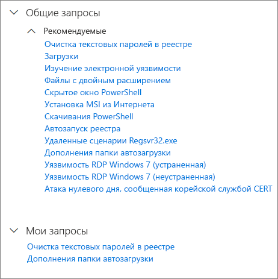

# Использование общих запросов в расширенной охотеUse shared queries in advanced hunting

**Область применения:****Applies to:**
- Защита от угроз (Майкрософт)Microsoft Threat Protection

[!include[Prerelease information](prerelease.md)]

Запросами [расширенной охоты](advanced-hunting-overview.md) можно делиться с пользователями одной организации.[Advanced hunting](advanced-hunting-overview.md) queries can be shared among users in the same organization. Вы также можете найти общедоступные запросы в GitHub.You can also find queries shared publicly on GitHub. Эти запросы позволяют быстро реализовывать сценарии охоты на угрозы, не создавая запросы с нуля.These queries let you quickly pursue specific threat hunting scenarios without having to write queries from scratch.

## Сохранение и изменение запроса и предоставление к нему общего доступаSave, modify, and share a query
Вы можете сохранить новый или существующий запрос, чтобы он был доступен только вам, или поделиться им с пользователями своей организации.You can save a new or existing query so that it is only accessible to you or shared with other users in your organization. 

1. Создание или изменение запросаCreate or modify a lookup table 

2. Нажмите разворачивающуюся кнопку **Сохранить запрос** и выберите параметр **Сохранить как**.Click the **Save query** drop-down button and select **Save as**.
    
3. Введите имя запроса.Enter a name for the title. 

   

4. Выберите папку, в которую нужно сохранить запрос.Select the folder where you'd like to save the query.
    - **Общие запросы** — общие для всех пользователей вашей организации**Shared queries** — shared to all users your organization
    - **Мои запросы** — доступны только для вас**My queries** — accessible only to you
    
5. Нажмите кнопку **Сохранить**.Select **Save**. 

## Удаление или переименование запросаDelete or rename a query
1. Щелкните правой кнопкой мыши запрос, который нужно переименовать или удалить.Right-click on a query you want to rename or delete.

    

2. Нажмите кнопку **Удалить** и подтвердите удаление.Select **Delete** and confirm deletion. Или нажмите кнопку **Переименовать** и введите новое имя запроса.Or select **Rename** and provide a new name for the query.

## Доступ к запросам в репозитории GitHubAccess queries in the GitHub repository  
Исследователи безопасности Майкрософт часто делятся запросами расширенной охоты в [специальном общедоступном репозитории в GitHub](https://github.com/microsoft/MTP-AHQ).Microsoft security researchers regularly share advanced hunting queries in a [designated public repository on GitHub](https://github.com/microsoft/MTP-AHQ). Этот репозиторий открыт для участия.This repository is open to contributions. Чтобы внести свой вклад, [бесплатно присоединяйтесь к GitHub](https://github.com/).To contribute, [join GitHub for free](https://github.com/).

>[!tip]
>Исследователи безопасности Майкрософт также предоставляют запросы расширенной охоты, которые можно использовать для обнаружения действий и индикаторов, связанных с возникающими угрозами.Microsoft security researchers also provide advanced hunting queries that you can use to locate activities and indicators associated with emerging threats. Эти запросы предоставляются в рамках отчетов [аналитики угроз](https://docs.microsoft.com/windows/security/threat-protection/microsoft-defender-atp/threat-analytics) в Центре безопасности в Microsoft Defender.These queries are provided as part of the [threat analytics](https://docs.microsoft.com/windows/security/threat-protection/microsoft-defender-atp/threat-analytics) reports in Microsoft Defender Security Center.

## См. такжеRelated topics
- [Профилактическая охота на угрозыProactively hunt for threats](advanced-hunting-overview.md)
- [Сведения о языке запросовLearn the query language](advanced-hunting-query-language.md)
- [Охота на угрозы в электронной почте и устройствахHunt for threats across devices and emails](advanced-hunting-query-emails-devices.md)
- [Общие сведения о схемеUnderstand the schema](advanced-hunting-schema-tables.md)
- [Рекомендации по применению запросовApply query best practices](advanced-hunting-best-practices.md)