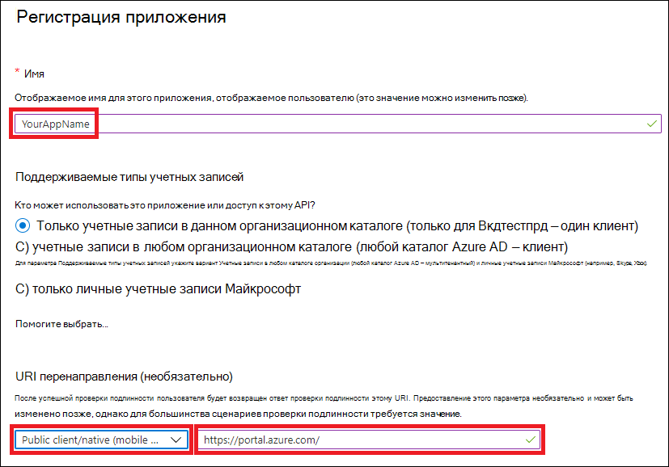
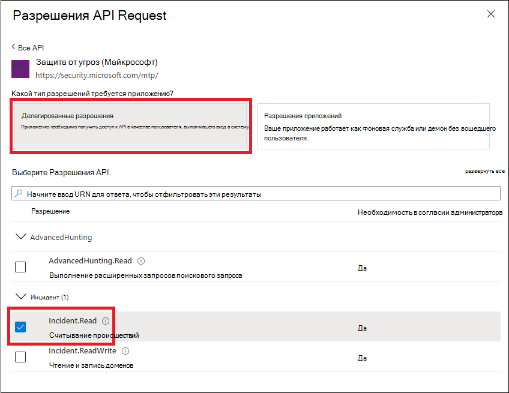
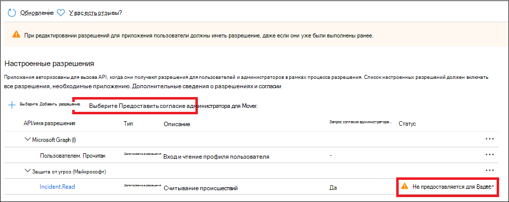

# <a name="create-an-app-to-access-microsoft-365-defender-apis-on-behalf-of-a-user"></a><span data-ttu-id="dc894-104">Создание приложения для доступа к API Microsoft 365 Defender от имени пользователя</span><span class="sxs-lookup"><span data-stu-id="dc894-104">Create an app to access Microsoft 365 Defender APIs on behalf of a user</span></span>

[!INCLUDE [Microsoft 365 Defender rebranding](../includes/microsoft-defender.md)]

<span data-ttu-id="dc894-105">**Область применения:**</span><span class="sxs-lookup"><span data-stu-id="dc894-105">**Applies to:**</span></span>

- <span data-ttu-id="dc894-106">Microsoft 365 Defender</span><span class="sxs-lookup"><span data-stu-id="dc894-106">Microsoft 365 Defender</span></span>

> [!IMPORTANT]
> <span data-ttu-id="dc894-107">Некоторые сведения относятся к предварительно выпущенным продуктам, которые могут быть существенно изменены до его коммерческого выпуска.</span><span class="sxs-lookup"><span data-stu-id="dc894-107">Some information relates to prereleased product which may be substantially modified before it's commercially released.</span></span> <span data-ttu-id="dc894-108">Microsoft makes no warranties, express or implied, with respect to the information provided here.</span><span class="sxs-lookup"><span data-stu-id="dc894-108">Microsoft makes no warranties, express or implied, with respect to the information provided here.</span></span>

<span data-ttu-id="dc894-109">На этой странице описывается создание приложения для получения программного доступа к Защитнику Microsoft 365 от имени одного пользователя.</span><span class="sxs-lookup"><span data-stu-id="dc894-109">This page describes how to create an application to get programmatic access to Microsoft 365 Defender on behalf of a single user.</span></span>

<span data-ttu-id="dc894-110">Если вам нужен программный доступ к Microsoft 365 Defender без определенного пользователя (например, если вы пишете фоновое приложение или программу-программу), см. статью "Создание приложения для доступа к [Microsoft 365 Defender](api-create-app-web.md)без пользователя".</span><span class="sxs-lookup"><span data-stu-id="dc894-110">If you need programmatic access to Microsoft 365 Defender without a defined user (for example, if you're writing a background app or daemon), see [Create an app to access Microsoft 365 Defender without a user](api-create-app-web.md).</span></span> <span data-ttu-id="dc894-111">Если вам нужно предоставить доступ нескольким клиентам (например, если вы обслуживаете крупную организацию или группу клиентов), см. статью "Создание приложения с партнерским доступом к API Защитника [Microsoft 365".](api-partner-access.md) Если вы не знаете, какой тип доступа вам нужен, см. ["Начало работы".](api-access.md)</span><span class="sxs-lookup"><span data-stu-id="dc894-111">If you need to provide access for multiple tenants—for example, if you're serving a large organization or a group of customers—see [Create an app with partner access to Microsoft 365 Defender APIs](api-partner-access.md).If you're not sure which kind of access you need, see [Get started](api-access.md).</span></span>

<span data-ttu-id="dc894-112">Защитник Microsoft 365 предоставляет большую часть своих данных и действий с помощью набора программных API.</span><span class="sxs-lookup"><span data-stu-id="dc894-112">Microsoft 365 Defender exposes much of its data and actions through a set of programmatic APIs.</span></span> <span data-ttu-id="dc894-113">Эти API помогают автоматизировать процессы и использовать возможности Защитника Microsoft 365.</span><span class="sxs-lookup"><span data-stu-id="dc894-113">Those APIs help you automate workflows and make use of Microsoft 365 Defender's capabilities.</span></span> <span data-ttu-id="dc894-114">Для доступа к этому API требуется проверка подлинности OAuth2.0.</span><span class="sxs-lookup"><span data-stu-id="dc894-114">This API access requires OAuth2.0 authentication.</span></span> <span data-ttu-id="dc894-115">Дополнительные сведения см. в потоке кода авторизации [OAuth 2.0.](https://docs.microsoft.com/azure/active-directory/develop/active-directory-v2-protocols-oauth-code)</span><span class="sxs-lookup"><span data-stu-id="dc894-115">For more information, see [OAuth 2.0 Authorization Code Flow](https://docs.microsoft.com/azure/active-directory/develop/active-directory-v2-protocols-oauth-code).</span></span>

<span data-ttu-id="dc894-116">Как правило, для использования этих API необходимо сделать следующее:</span><span class="sxs-lookup"><span data-stu-id="dc894-116">In general, you'll need to take the following steps to use these APIs:</span></span>

- <span data-ttu-id="dc894-117">Создайте приложение Azure Active Directory (Azure AD).</span><span class="sxs-lookup"><span data-stu-id="dc894-117">Create an Azure Active Directory (Azure AD) application.</span></span>
- <span data-ttu-id="dc894-118">Получение маркера доступа с помощью этого приложения.</span><span class="sxs-lookup"><span data-stu-id="dc894-118">Get an access token using this application.</span></span>
- <span data-ttu-id="dc894-119">Используйте маркер для доступа к API Защитника Microsoft 365.</span><span class="sxs-lookup"><span data-stu-id="dc894-119">Use the token to access Microsoft 365 Defender API.</span></span>

<span data-ttu-id="dc894-120">В этой статье объясняется, как:</span><span class="sxs-lookup"><span data-stu-id="dc894-120">This article explains how to:</span></span>

- <span data-ttu-id="dc894-121">Создание приложения Azure AD</span><span class="sxs-lookup"><span data-stu-id="dc894-121">Create an Azure AD application</span></span>
- <span data-ttu-id="dc894-122">Получите маркер доступа к Защитнику Microsoft 365</span><span class="sxs-lookup"><span data-stu-id="dc894-122">Get an access token to Microsoft 365 Defender</span></span>
- <span data-ttu-id="dc894-123">Проверка маркера</span><span class="sxs-lookup"><span data-stu-id="dc894-123">Validate the token</span></span>

> [!NOTE]
> <span data-ttu-id="dc894-124">При доступе к API Microsoft 365 Defender от имени пользователя необходимы правильные разрешения приложения и разрешения пользователя.</span><span class="sxs-lookup"><span data-stu-id="dc894-124">When accessing Microsoft 365 Defender API on behalf of a user, you will need the correct application permissions and user permissions.</span></span>

> [!TIP]
> <span data-ttu-id="dc894-125">Если у вас есть разрешение на выполнение действия на портале, у вас есть разрешение на выполнение действия в API.</span><span class="sxs-lookup"><span data-stu-id="dc894-125">If you have the permission to perform an action in the portal, you have the permission to perform the action in the API.</span></span>

## <a name="create-an-app"></a><span data-ttu-id="dc894-126">Создать приложение</span><span class="sxs-lookup"><span data-stu-id="dc894-126">Create an app</span></span>

1. <span data-ttu-id="dc894-127">Во sign in to [Azure](https://portal.azure.com) as a user with the **Global Administrator** role.</span><span class="sxs-lookup"><span data-stu-id="dc894-127">Sign in to [Azure](https://portal.azure.com) as a user with the **Global Administrator** role.</span></span>

2. <span data-ttu-id="dc894-128">Перейдите к регистрации нового приложения **Azure Active Directory.**  >    >  </span><span class="sxs-lookup"><span data-stu-id="dc894-128">Navigate to **Azure Active Directory** > **App registrations** > **New registration**.</span></span>

   

3. <span data-ttu-id="dc894-130">В форме выберите имя приложения и введите следующие сведения для URI перенаправления, а затем выберите **"Регистрация".**</span><span class="sxs-lookup"><span data-stu-id="dc894-130">In the form, choose a name for your application and enter the following information for the redirect URI, then select **Register**.</span></span>

   

   - <span data-ttu-id="dc894-132">**Тип приложения:** Общедоступный клиент</span><span class="sxs-lookup"><span data-stu-id="dc894-132">**Application type:** Public client</span></span>
   - <span data-ttu-id="dc894-133">**URI перенаправления:**https://portal.azure.com</span><span class="sxs-lookup"><span data-stu-id="dc894-133">**Redirect URI:** https://portal.azure.com</span></span>

4. <span data-ttu-id="dc894-134">На странице приложения выберите API "Разрешения для добавления разрешений" **API,** которые моя организация использует >, введите "Защита от угроз (Майкрософт)" и выберите "Защита от  >    >   **угроз (Майкрософт)".** </span><span class="sxs-lookup"><span data-stu-id="dc894-134">On your application page, select **API Permissions** > **Add permission** > **APIs my organization uses** >, type **Microsoft Threat Protection**, and select **Microsoft Threat Protection**.</span></span> <span data-ttu-id="dc894-135">Теперь ваше приложение может получить доступ к Microsoft 365 Defender.</span><span class="sxs-lookup"><span data-stu-id="dc894-135">Your app can now access Microsoft 365 Defender.</span></span>

   > [!TIP]
   > <span data-ttu-id="dc894-136">*Защита от угроз (Майкрософт)* — это прежнее имя Защитника Microsoft 365, которое не будет отображаться в исходном списке.</span><span class="sxs-lookup"><span data-stu-id="dc894-136">*Microsoft Threat Protection* is a former name for Microsoft 365 Defender, and will not appear in the original list.</span></span> <span data-ttu-id="dc894-137">Чтобы увидеть, как оно появляется, необходимо начать писать его имя в текстовом поле.</span><span class="sxs-lookup"><span data-stu-id="dc894-137">You need to start writing its name in the text box to see it appear.</span></span>

   

   - <span data-ttu-id="dc894-139">Choose **Delegated permissions**.</span><span class="sxs-lookup"><span data-stu-id="dc894-139">Choose **Delegated permissions**.</span></span> <span data-ttu-id="dc894-140">Выберите соответствующие разрешения для сценария **(например, Incident.Read),** а затем выберите **"Добавить разрешения".**</span><span class="sxs-lookup"><span data-stu-id="dc894-140">Choose the relevant permissions for your scenario (for example **Incident.Read**), and then select **Add permissions**.</span></span>

   

    > [!NOTE]
    > <span data-ttu-id="dc894-142">Необходимо выбрать соответствующие разрешения для сценария.</span><span class="sxs-lookup"><span data-stu-id="dc894-142">You need to select the relevant permissions for your scenario.</span></span> <span data-ttu-id="dc894-143">*Прочитать все инциденты* можно только в качестве примера.</span><span class="sxs-lookup"><span data-stu-id="dc894-143">*Read all incidents* is just an example.</span></span> <span data-ttu-id="dc894-144">Чтобы определить необходимые разрешения, обратитесь к разделу **"Разрешения"** в API, который требуется вызвать.</span><span class="sxs-lookup"><span data-stu-id="dc894-144">To determine which permission you need, please look at the **Permissions** section in the API you want to call.</span></span>
    >
    > <span data-ttu-id="dc894-145">Например, чтобы выполнить [расширенные запросы,](api-advanced-hunting.md)выберите разрешение "Выполнение расширенных запросов"; чтобы [изолировать устройство,](https://docs.microsoft.com/windows/security/threat-protection/microsoft-defender-atp/isolate-machine)выберите разрешение "Изолировать компьютер".</span><span class="sxs-lookup"><span data-stu-id="dc894-145">For instance, to [run advanced queries](api-advanced-hunting.md), select the 'Run advanced queries' permission; to [isolate a device](https://docs.microsoft.com/windows/security/threat-protection/microsoft-defender-atp/isolate-machine), select the 'Isolate machine' permission.</span></span>

5. <span data-ttu-id="dc894-146">Выберите **"Предоставить согласие администратора".**</span><span class="sxs-lookup"><span data-stu-id="dc894-146">Select **Grant admin consent**.</span></span> <span data-ttu-id="dc894-147">При каждом добавлении разрешения  необходимо выбрать разрешение администратора, чтобы оно вступает в силу.</span><span class="sxs-lookup"><span data-stu-id="dc894-147">Every time you add a permission, you must select **Grant admin consent** for it to take effect.</span></span>

   

6. <span data-ttu-id="dc894-149">Зафиксировать свой ИД приложения и ид клиента в надежном месте.</span><span class="sxs-lookup"><span data-stu-id="dc894-149">Record your application ID and your tenant ID somewhere safe.</span></span> <span data-ttu-id="dc894-150">Они перечислены в списке **"Обзор"** на странице приложения.</span><span class="sxs-lookup"><span data-stu-id="dc894-150">They're listed under **Overview** on your application page.</span></span>

   

## <a name="get-an-access-token"></a><span data-ttu-id="dc894-152">Получение токена доступа</span><span class="sxs-lookup"><span data-stu-id="dc894-152">Get an access token</span></span>

<span data-ttu-id="dc894-153">Дополнительные сведения о маркерах Azure Active Directory см. в руководстве [по Azure AD.](https://docs.microsoft.com/azure/active-directory/develop/active-directory-v2-protocols-oauth-client-creds)</span><span class="sxs-lookup"><span data-stu-id="dc894-153">For more information on Azure Active Directory tokens, see the [Azure AD tutorial](https://docs.microsoft.com/azure/active-directory/develop/active-directory-v2-protocols-oauth-client-creds).</span></span>

### <a name="get-an-access-token-using-powershell"></a><span data-ttu-id="dc894-154">Получить маркер доступа с помощью PowerShell</span><span class="sxs-lookup"><span data-stu-id="dc894-154">Get an access token using PowerShell</span></span>

```PowerShell
if(!(Get-Package adal.ps)) { Install-Package -Name adal.ps } # Install the ADAL.PS package in case it's not already present

$tenantId = '' # Paste your directory (tenant) ID here.
$clientId = '' # Paste your application (client) ID here.
$redirectUri = '' # Paste your app's redirection URI

$authority = "https://login.windows.net/$tenantId"
$resourceUrl = 'https://api.security.microsoft.com'

$response = Get-ADALToken -Resource $resourceUrl -ClientId $cleintId -RedirectUri $redirectUri -Authority $authority -PromptBehavior:Always
$response.AccessToken | clip

$response.AccessToken
```

## <a name="validate-the-token"></a><span data-ttu-id="dc894-155">Проверка маркера</span><span class="sxs-lookup"><span data-stu-id="dc894-155">Validate the token</span></span>

1. <span data-ttu-id="dc894-156">Скопируйте и в paste маркер в [JWT,](https://jwt.ms) чтобы декодировать его.</span><span class="sxs-lookup"><span data-stu-id="dc894-156">Copy and paste the token into [JWT](https://jwt.ms) to decode it.</span></span>
1. <span data-ttu-id="dc894-157">Убедитесь, что *утверждение ролей* внутри раскодирования маркера содержит нужные разрешения.</span><span class="sxs-lookup"><span data-stu-id="dc894-157">Make sure that the *roles* claim within the decoded token contains the desired permissions.</span></span>

<span data-ttu-id="dc894-158">На следующем изображении можно увидеть раскодный маркер, полученный из приложения, с ```Incidents.Read.All``` разрешениями ```Incidents.ReadWrite.All``` и ```AdvancedHunting.Read.All``` разрешениями:</span><span class="sxs-lookup"><span data-stu-id="dc894-158">In the following image, you can see a decoded token acquired from an app, with ```Incidents.Read.All```, ```Incidents.ReadWrite.All```, and ```AdvancedHunting.Read.All``` permissions:</span></span>


## <a name="use-the-token-to-access-the-microsoft-365-defender-api"></a><span data-ttu-id="dc894-160">Использование маркера для доступа к API Защитника Microsoft 365</span><span class="sxs-lookup"><span data-stu-id="dc894-160">Use the token to access the Microsoft 365 Defender API</span></span>

1. <span data-ttu-id="dc894-161">Выберите нужный API (инциденты или расширенный поиск).</span><span class="sxs-lookup"><span data-stu-id="dc894-161">Choose the API you want to use (incidents, or advanced hunting).</span></span> <span data-ttu-id="dc894-162">Дополнительные сведения [см. в поддерживаемых API Microsoft 365 Defender.](api-supported.md)</span><span class="sxs-lookup"><span data-stu-id="dc894-162">For more information, see [Supported Microsoft 365 Defender APIs](api-supported.md).</span></span>
2. <span data-ttu-id="dc894-163">В http-запросе, который вы будете отправлять, задайте для загона авторизации `"Bearer" <token>` *,Bearer* является схемой авторизации, а маркер является вашим проверенным  маркером.</span><span class="sxs-lookup"><span data-stu-id="dc894-163">In the http request you're about to send, set the authorization header to `"Bearer" <token>`, *Bearer* being the authorization scheme, and *token* being your validated token.</span></span>
3. <span data-ttu-id="dc894-164">Срок действия маркера истекает в течение одного часа.</span><span class="sxs-lookup"><span data-stu-id="dc894-164">The token will expire within one hour.</span></span> <span data-ttu-id="dc894-165">За это время можно отправить несколько запросов с одним маркером.</span><span class="sxs-lookup"><span data-stu-id="dc894-165">You can send more than one request during this time  with the same token.</span></span>

<span data-ttu-id="dc894-166">В следующем примере показано, как отправить запрос, чтобы получить список инцидентов с **помощью C#**.</span><span class="sxs-lookup"><span data-stu-id="dc894-166">The following example shows how to send a request to get a list of incidents **using C#**.</span></span>

```C#
    var httpClient = new HttpClient();
    var request = new HttpRequestMessage(HttpMethod.Get, "https://api.security.microsoft.com/api/incidents");

    request.Headers.Authorization = new AuthenticationHeaderValue("Bearer", token);

    var response = httpClient.SendAsync(request).GetAwaiter().GetResult();
```

## <a name="related-articles"></a><span data-ttu-id="dc894-167">Статьи по теме</span><span class="sxs-lookup"><span data-stu-id="dc894-167">Related articles</span></span>

- [<span data-ttu-id="dc894-168">Обзор API Microsoft 365 Defender</span><span class="sxs-lookup"><span data-stu-id="dc894-168">Microsoft 365 Defender APIs overview</span></span>](api-overview.md)
- [<span data-ttu-id="dc894-169">Доступ к API Microsoft 365 Defender</span><span class="sxs-lookup"><span data-stu-id="dc894-169">Access the Microsoft 365 Defender APIs</span></span>](api-access.md)
- [<span data-ttu-id="dc894-170">Создание приложения "Hello world"</span><span class="sxs-lookup"><span data-stu-id="dc894-170">Create a 'Hello world' app</span></span>](api-hello-world.md)
- [<span data-ttu-id="dc894-171">Создание приложения для доступа к Защитнику Microsoft 365 без пользователя</span><span class="sxs-lookup"><span data-stu-id="dc894-171">Create an app to access Microsoft 365 Defender without a user</span></span>](api-create-app-web.md)
- [<span data-ttu-id="dc894-172">Создание приложения с мультиязычным доступом партнеров к API Защитника Microsoft 365</span><span class="sxs-lookup"><span data-stu-id="dc894-172">Create an app with multi-tenant partner access to Microsoft 365 Defender APIs</span></span>](api-partner-access.md)
- [<span data-ttu-id="dc894-173">Узнайте об ограничениях API и лицензировании</span><span class="sxs-lookup"><span data-stu-id="dc894-173">Learn about API limits and licensing</span></span>](api-terms.md)
- [<span data-ttu-id="dc894-174">Коды ошибок</span><span class="sxs-lookup"><span data-stu-id="dc894-174">Understand error codes</span></span>](api-error-codes.md)
- [<span data-ttu-id="dc894-175">Авторизация OAuth 2.0 для доступа к API и входу пользователя</span><span class="sxs-lookup"><span data-stu-id="dc894-175">OAuth 2.0 authorization for user sign in and API access</span></span>](https://docs.microsoft.com/azure/active-directory/develop/active-directory-v2-protocols-oauth-code)
