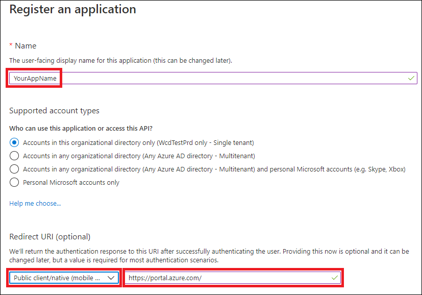

# <a name="access-microsoft-threat-protection-apis-on-behalf-of-user"></a>Доступ к API Microsoft Threat protection от имени пользователя

**Область применения:**
- Защита от угроз (Майкрософт)

>[!IMPORTANT] 
>Некоторые сведения относятся к предварительно выпущенным продуктам, которые могут быть значительно изменены до выпуска. Microsoft makes no warranties, express or implied, with respect to the information provided here.


На этой странице описывается, как создать приложение для получения программного доступа к защите от угроз Майкрософт от имени пользователя.

Если вам требуется программный доступ к защите угроз Майкрософт без пользователя, обратитесь к разделу [Создание приложения для доступа к защите от угроз Майкрософт без участия пользователя](api-create-app-web.md).

Если вы не знаете, какой необходим доступ, ознакомьтесь со сведениями о том, как [получить доступ к API Microsoft Threat protection](api-access.md).

Защита от угроз Майкрософт предоставляет множество своих данных и действий через набор программных интерфейсов API. Эти API позволяют автоматизировать рабочие процессы и внедрять их на основе возможностей защиты от угроз Майкрософт. Для доступа к API требуется проверка подлинности OAuth 2.0. Для получения дополнительных сведений см [код авторизации OAuth 2,0](https://docs.microsoft.com/azure/active-directory/develop/active-directory-v2-protocols-oauth-code).

В общем случае необходимо выполнить следующие действия, чтобы использовать API:
- Создание приложения AAD
- Получение маркера доступа с помощью этого приложения
- Использование маркера для доступа к API защиты от угроз Майкрософт

На этой странице объясняется, как создать приложение AAD, получить маркер доступа к защите от угроз Майкрософт и проверить маркер.

>[!NOTE]
> При доступе к API Microsoft Threat protection от имени пользователя вам потребуется соответствующее разрешение приложения и разрешение пользователя.


>[!TIP]
> Если у вас есть разрешение на выполнение действий на портале, у вас есть разрешение на выполнение действия в API.

## <a name="create-an-app"></a>Создание приложения

1. Войдите в [Azure](https://portal.azure.com) с помощью учетной записи пользователя с ролью **глобального администратора** .

2. Перейдите к разделу Регистрация приложений **Azure Active Directory**с  >  **App registrations**  >  **новой регистрацией**. 

   

3. В поле регистрация из введите следующие сведения, а затем нажмите кнопку **Регистрация**.

   

   - **Имя:** Имя приложения
   - **Тип приложения:** Общедоступный клиент
   - **URI перенаправления:**https://portal.azure.com

4. Чтобы разрешить приложению доступ к защите от угроз Майкрософт и назначить ей разрешения, на странице приложения выберите **разрешения API**  >  **Добавление**разрешений  >  **API "Моя организация использует** >", введите **Microsoft Threat protection**, а затем выберите **Microsoft Threat protection**.

    >[!NOTE]
    > Защита от угроз Майкрософт не отображается в исходном списке. Чтобы отобразить его имя, необходимо сначала начать его ввод в текстовое поле.

      

    - Выберите **делегированные разрешения** > выберите соответствующие разрешения для вашего сценария, например " **инцидент. чтение**", а затем нажмите кнопку **Добавить разрешения**.

      

     >[!IMPORTANT]
     >Необходимо выбрать соответствующие разрешения. 

    -  Чтобы определить, какое разрешение необходимо, просмотрите раздел **разрешения** в API, который вы хотите вызвать.

    - Щелкните **разрешение GRANT**

      >[!NOTE]
      >Каждый раз при добавлении разрешения необходимо щелкнуть разрешение **Grant** , чтобы новое разрешение вступило в силу.

      

6. Запишите идентификатор своего приложения и идентификатор клиента:

   - На странице приложения перейдите в раздел **Overview (обзор** ) и скопируйте следующее:

   


## <a name="get-an-access-token-using-powershell"></a>Получение маркера доступа с помощью PowerShell

```
#Install the ADAL.PS package if it's not installed.
if(!(Get-Package adal.ps)) { Install-Package -Name adal.ps }

$authority = "https://login.windows.net/{tenant-id}" # replace {tenant-id} with your tenant ID.

$clientId = "{application-id}" #replace {application-id} with your application ID.

$redirectUri = "{redirect-uri}" # replace {redirect-uri} with your application redirect URI.

$resourceUrl = "https://api.security.microsoft.com"

$response = Get-ADALToken -Resource $resourceUrl -ClientId $clientId -RedirectUri $redirectUri -Authority $authority -PromptBehavior:Always
$response.AccessToken | clip
$response.AccessToken
```

## <a name="related-topics"></a>Статьи по теме
- [Доступ к API защиты от угроз Майкрософт](api-access.md)
- [Доступ к защите от угроз Майкрософт с помощью контекста приложения](api-create-app-web.md)
