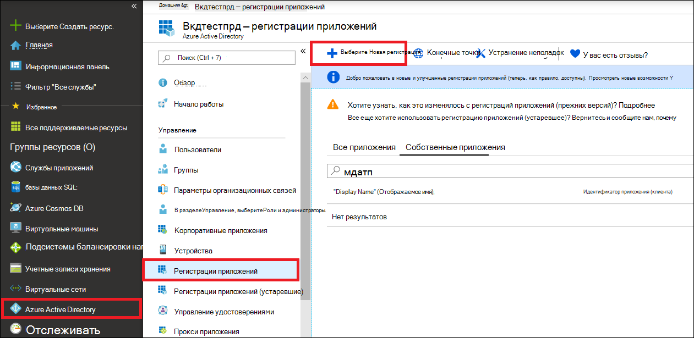
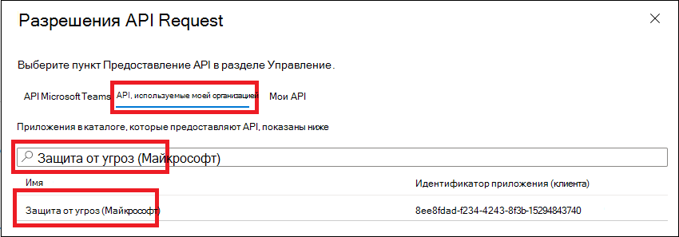
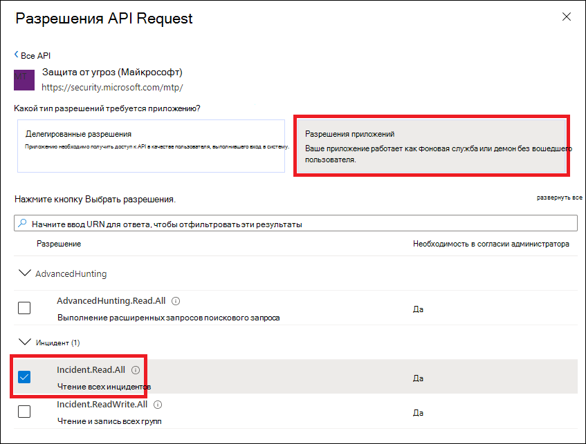
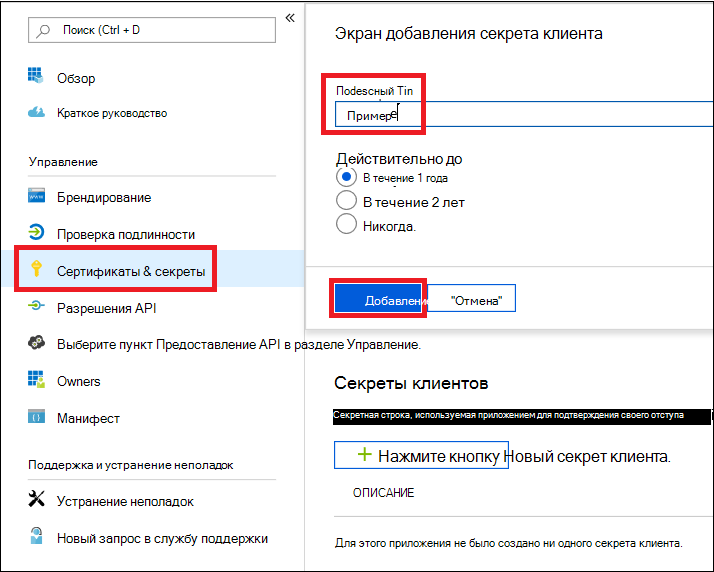
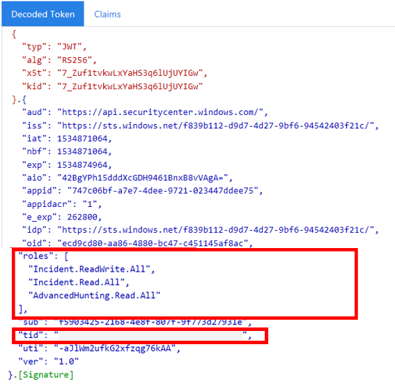

# <a name="partner-access-through-microsoft-threat-protection-apis"></a><span data-ttu-id="99b4c-104">Доступ к партнерам через API защиты от угроз Майкрософт</span><span class="sxs-lookup"><span data-stu-id="99b4c-104">Partner access through Microsoft Threat Protection APIs</span></span>

[!INCLUDE [Microsoft 365 Defender rebranding](../includes/microsoft-defender.md)]


<span data-ttu-id="99b4c-105">**Область применения:**</span><span class="sxs-lookup"><span data-stu-id="99b4c-105">**Applies to:**</span></span>
- <span data-ttu-id="99b4c-106">Защита от угроз (Майкрософт)</span><span class="sxs-lookup"><span data-stu-id="99b4c-106">Microsoft Threat Protection</span></span>

>[!IMPORTANT] 
><span data-ttu-id="99b4c-107">Некоторые сведения относятся к предварительно выпущенным продуктам, которые могут быть значительно изменены до выпуска.</span><span class="sxs-lookup"><span data-stu-id="99b4c-107">Some information relates to prereleased product which may be substantially modified before it's commercially released.</span></span> <span data-ttu-id="99b4c-108">Microsoft makes no warranties, express or implied, with respect to the information provided here.</span><span class="sxs-lookup"><span data-stu-id="99b4c-108">Microsoft makes no warranties, express or implied, with respect to the information provided here.</span></span>


<span data-ttu-id="99b4c-109">На этой странице описано, как создать приложение AAD для получения программного доступа к защите от угроз Майкрософт от имени ваших клиентов.</span><span class="sxs-lookup"><span data-stu-id="99b4c-109">This page describes how to create an AAD application to get programmatic access to Microsoft Threat Protection on behalf of your customers.</span></span>

<span data-ttu-id="99b4c-110">Защита от угроз Майкрософт предоставляет множество своих данных и действий через набор программных интерфейсов API.</span><span class="sxs-lookup"><span data-stu-id="99b4c-110">Microsoft Threat Protection exposes much of its data and actions through a set of programmatic APIs.</span></span> <span data-ttu-id="99b4c-111">Эти API помогут вам автоматизировать рабочие процессы и внедрять их на основе возможностей защиты от угроз Майкрософт.</span><span class="sxs-lookup"><span data-stu-id="99b4c-111">Those APIs will help you automate work flows and innovate based on Microsoft Threat Protection capabilities.</span></span> <span data-ttu-id="99b4c-112">Для доступа к API требуется проверка подлинности OAuth 2.0.</span><span class="sxs-lookup"><span data-stu-id="99b4c-112">The API access requires OAuth2.0 authentication.</span></span> <span data-ttu-id="99b4c-113">Для получения дополнительных сведений см [код авторизации OAuth 2,0](https://docs.microsoft.com/azure/active-directory/develop/active-directory-v2-protocols-oauth-code).</span><span class="sxs-lookup"><span data-stu-id="99b4c-113">For more information, see [OAuth 2.0 Authorization Code Flow](https://docs.microsoft.com/azure/active-directory/develop/active-directory-v2-protocols-oauth-code).</span></span>

<span data-ttu-id="99b4c-114">В общем случае необходимо выполнить следующие действия, чтобы использовать API:</span><span class="sxs-lookup"><span data-stu-id="99b4c-114">In general, you’ll need to take the following steps to use the APIs:</span></span>
- <span data-ttu-id="99b4c-115">Создайте приложение AAD с **несколькими клиентами** .</span><span class="sxs-lookup"><span data-stu-id="99b4c-115">Create a **multi-tenant** AAD application.</span></span>
- <span data-ttu-id="99b4c-116">Получите авторизованного (согласия) у администратора клиентов, чтобы ваше приложение получило доступ к ресурсам защиты от угроз Майкрософт.</span><span class="sxs-lookup"><span data-stu-id="99b4c-116">Get authorized (consent) by your customer administrator for your application to access Microsoft Threat Protection resources it needs.</span></span>
- <span data-ttu-id="99b4c-117">Получение маркера доступа с помощью этого приложения.</span><span class="sxs-lookup"><span data-stu-id="99b4c-117">Get an access token using this application.</span></span>
- <span data-ttu-id="99b4c-118">Используйте маркер для доступа к API защиты от угроз Майкрософт.</span><span class="sxs-lookup"><span data-stu-id="99b4c-118">Use the token to access Microsoft Threat Protection API.</span></span>

<span data-ttu-id="99b4c-119">Ниже приведены инструкции по созданию приложения AAD, получению маркера доступа к защите от угроз Майкрософт и проверке маркера.</span><span class="sxs-lookup"><span data-stu-id="99b4c-119">The following steps with guide you how to create an AAD application, get an access token to Microsoft Threat Protection and validate the token.</span></span>

## <a name="create-the-multi-tenant-app"></a><span data-ttu-id="99b4c-120">Создание приложения с несколькими клиентами</span><span class="sxs-lookup"><span data-stu-id="99b4c-120">Create the multi-tenant app</span></span>

1. <span data-ttu-id="99b4c-121">Войдите в [клиент Azure](https://portal.azure.com) с помощью учетной записи пользователя с ролью **глобального администратора** .</span><span class="sxs-lookup"><span data-stu-id="99b4c-121">Log on to your [Azure tenant](https://portal.azure.com) with user that has **Global Administrator** role.</span></span>

2. <span data-ttu-id="99b4c-122">Перейдите к разделу Регистрация приложений **Azure Active Directory**с  >  **App registrations**  >  **новой регистрацией**.</span><span class="sxs-lookup"><span data-stu-id="99b4c-122">Navigate to **Azure Active Directory** > **App registrations** > **New registration**.</span></span> 

   

3. <span data-ttu-id="99b4c-124">В форме регистрации:</span><span class="sxs-lookup"><span data-stu-id="99b4c-124">In the registration form:</span></span>

    - <span data-ttu-id="99b4c-125">Выберите имя для своего приложения.</span><span class="sxs-lookup"><span data-stu-id="99b4c-125">Choose a name for your application.</span></span>

    - <span data-ttu-id="99b4c-126">Поддерживаемые типы учетных записей — учетные записи в любом организационном каталоге.</span><span class="sxs-lookup"><span data-stu-id="99b4c-126">Supported account types - accounts in any organizational directory.</span></span>

    - <span data-ttu-id="99b4c-127">URI перенаправления — тип: Web, URI: https://portal.azure.com</span><span class="sxs-lookup"><span data-stu-id="99b4c-127">Redirect URI - type: Web, URI: https://portal.azure.com</span></span>

    


4. <span data-ttu-id="99b4c-129">Разрешите приложению получить доступ к защите от угроз Майкрософт и назначьте ему минимальный набор разрешений, необходимых для выполнения интеграции.</span><span class="sxs-lookup"><span data-stu-id="99b4c-129">Allow your Application to access Microsoft Threat Protection and assign it with the minimal set of permissions required to complete the integration.</span></span>

   - <span data-ttu-id="99b4c-130">На странице приложения щелкните **разрешения API**  >  **Добавление разрешений**  >  **интерфейсы API для моей организации используется** > введите **Microsoft Threat protection** и щелкните элемент **Защита от угроз Майкрософт**.</span><span class="sxs-lookup"><span data-stu-id="99b4c-130">On your application page, click **API Permissions** > **Add permission** > **APIs my organization uses** > type **Microsoft Threat Protection** and click on **Microsoft Threat Protection**.</span></span>

   >[!NOTE]
   ><span data-ttu-id="99b4c-131">Защита от угроз Майкрософт не отображается в исходном списке.</span><span class="sxs-lookup"><span data-stu-id="99b4c-131">Microsoft Threat Protection does not appear in the original list.</span></span> <span data-ttu-id="99b4c-132">Чтобы отобразить его имя, необходимо сначала начать его ввод в текстовое поле.</span><span class="sxs-lookup"><span data-stu-id="99b4c-132">You need to start writing its name in the text box to see it appear.</span></span>

   
   
   ### <a name="request-api-permissions"></a><span data-ttu-id="99b4c-134">Разрешения API Request</span><span class="sxs-lookup"><span data-stu-id="99b4c-134">Request API permissions</span></span>

   <span data-ttu-id="99b4c-135">Чтобы определить, какое разрешение необходимо, просмотрите раздел **разрешения** в API, который вы хотите вызвать.</span><span class="sxs-lookup"><span data-stu-id="99b4c-135">To determine which permission you need, please look at the **Permissions** section in the API you are interested to call.</span></span> 

   <span data-ttu-id="99b4c-136">В следующем примере мы будем использовать разрешение **"чтение всех происшествий"** :</span><span class="sxs-lookup"><span data-stu-id="99b4c-136">In the following example we will use **'Read all incidents'** permission:</span></span>

   <span data-ttu-id="99b4c-137">Выберите **разрешения для приложений**  >  **происшествий. Read. ALL** > нажмите кнопку **Добавить разрешения**</span><span class="sxs-lookup"><span data-stu-id="99b4c-137">Choose **Application permissions** > **Incidents.Read.All** > Click on **Add permissions**</span></span>

   


5. <span data-ttu-id="99b4c-139">Щелкните **разрешение GRANT**</span><span class="sxs-lookup"><span data-stu-id="99b4c-139">Click **Grant consent**</span></span>

    >[!NOTE]
    ><span data-ttu-id="99b4c-140">Каждый раз при добавлении разрешения необходимо щелкнуть разрешение **Grant** , чтобы новое разрешение вступило в силу.</span><span class="sxs-lookup"><span data-stu-id="99b4c-140">Every time you add permission you must click on **Grant consent** for the new permission to take effect.</span></span>

    

6. <span data-ttu-id="99b4c-142">Добавьте секрет в приложение.</span><span class="sxs-lookup"><span data-stu-id="99b4c-142">Add a secret to the application.</span></span>

    - <span data-ttu-id="99b4c-143">Щелкните **сертификаты & секреты**, добавьте описание для секрета и нажмите кнопку **Добавить**.</span><span class="sxs-lookup"><span data-stu-id="99b4c-143">Click **Certificates & secrets**, add description to the secret and click **Add**.</span></span>

    >[!IMPORTANT]
    > <span data-ttu-id="99b4c-144">После нажатия кнопки **Добавить** **скопируйте созданное значение секрета**.</span><span class="sxs-lookup"><span data-stu-id="99b4c-144">After selecting **Add**, **copy the generated secret value**.</span></span> <span data-ttu-id="99b4c-145">Вы не сможете получить его после выхода из!</span><span class="sxs-lookup"><span data-stu-id="99b4c-145">You won't be able to retrieve after you leave!</span></span>

    

7. <span data-ttu-id="99b4c-147">Запишите идентификатор приложения:</span><span class="sxs-lookup"><span data-stu-id="99b4c-147">Write down your application ID:</span></span>

   - <span data-ttu-id="99b4c-148">На странице приложения перейдите в раздел **Overview (обзор** ) и скопируйте следующее:</span><span class="sxs-lookup"><span data-stu-id="99b4c-148">On your application page, go to **Overview** and copy the following:</span></span>

   

8. <span data-ttu-id="99b4c-150">Добавьте приложение в клиент клиента.</span><span class="sxs-lookup"><span data-stu-id="99b4c-150">Add the application to your customer's tenant.</span></span>

    <span data-ttu-id="99b4c-151">Приложение должно быть утверждено в каждом клиенте, где вы планируете его использовать.</span><span class="sxs-lookup"><span data-stu-id="99b4c-151">You need your application to be approved in each customer tenant where you intend to use it.</span></span> <span data-ttu-id="99b4c-152">Это связано с тем, что ваше приложение взаимодействует с приложением защиты от угроз Майкрософт от имени вашего клиента.</span><span class="sxs-lookup"><span data-stu-id="99b4c-152">This is because your application interacts with Microsoft Threat Protection application on behalf of your customer.</span></span>

    <span data-ttu-id="99b4c-153">Пользователь с **глобальным администратором** от клиента клиента должен щелкнуть ссылку "согласие" и одобрить ваше приложение.</span><span class="sxs-lookup"><span data-stu-id="99b4c-153">A user with **Global Administrator** from your customer's tenant need to click the consent link and approve your application.</span></span>

    <span data-ttu-id="99b4c-154">Ссылка на согласие имеет следующий вид:</span><span class="sxs-lookup"><span data-stu-id="99b4c-154">Consent link is of the form:</span></span>

    ```
    https://login.microsoftonline.com/common/oauth2/authorize?prompt=consent&client_id=00000000-0000-0000-0000-000000000000&response_type=code&sso_reload=true
    ```

    <span data-ttu-id="99b4c-155">Где 00000000-0000-0000-0000-000000000000 следует заменять ИДЕНТИФИКАТОРом приложения</span><span class="sxs-lookup"><span data-stu-id="99b4c-155">Where 00000000-0000-0000-0000-000000000000 should be replaced with your Application ID</span></span>

    <span data-ttu-id="99b4c-156">После нажатия ссылки "согласие" Войдите в систему с глобальным администратором клиента клиента и додаст ему согласие приложения.</span><span class="sxs-lookup"><span data-stu-id="99b4c-156">After clicking on the consent link, login with the Global Administrator of the customer's tenant and consent the application.</span></span>

    

    <span data-ttu-id="99b4c-158">Кроме того, вам потребуется запросить у клиента идентификатор клиента и сохранить его для последующего использования при получении маркера.</span><span class="sxs-lookup"><span data-stu-id="99b4c-158">In addition, you will need to ask your customer for their tenant ID and save it for future use when acquiring the token.</span></span>

- <span data-ttu-id="99b4c-159">**Договорились!**</span><span class="sxs-lookup"><span data-stu-id="99b4c-159">**Done!**</span></span> <span data-ttu-id="99b4c-160">Вы успешно зарегистрировали приложение!</span><span class="sxs-lookup"><span data-stu-id="99b4c-160">You have successfully registered an application!</span></span> 
- <span data-ttu-id="99b4c-161">В примерах ниже показано, как для получения и проверки маркера.</span><span class="sxs-lookup"><span data-stu-id="99b4c-161">See examples below for token acquisition and validation.</span></span>

## <a name="get-an-access-token-examples"></a><span data-ttu-id="99b4c-162">Получение примеров маркеров доступа:</span><span class="sxs-lookup"><span data-stu-id="99b4c-162">Get an access token examples:</span></span>

>[!NOTE]
> <span data-ttu-id="99b4c-163">Чтобы получить маркер доступа от имени клиента, используйте идентификатор клиента клиента при получении следующего маркера.</span><span class="sxs-lookup"><span data-stu-id="99b4c-163">To get access token on behalf of your customer, use the customer's tenant ID on the following token acquisitions.</span></span>

<br><span data-ttu-id="99b4c-164">Дополнительные сведения о маркере AAD можно найти в [руководстве по AAD](https://docs.microsoft.com/azure/active-directory/develop/active-directory-v2-protocols-oauth-client-creds)</span><span class="sxs-lookup"><span data-stu-id="99b4c-164">For more details on AAD token, refer to [AAD tutorial](https://docs.microsoft.com/azure/active-directory/develop/active-directory-v2-protocols-oauth-client-creds)</span></span>

### <a name="using-powershell"></a><span data-ttu-id="99b4c-165">Использование PowerShell</span><span class="sxs-lookup"><span data-stu-id="99b4c-165">Using PowerShell</span></span>

```
# That code gets the App Context Token and save it to a file named "Latest-token.txt" under the current directory
# Paste below your Tenant ID, App ID and App Secret (App key).

$tenantId = '' ### Paste your tenant ID here
$appId = '' ### Paste your Application ID here
$appSecret = '' ### Paste your Application key here

$resourceAppIdUri = 'https://api.security.microsoft.com'
$oAuthUri = "https://login.windows.net/$TenantId/oauth2/token"
$authBody = [Ordered] @{
    resource = "$resourceAppIdUri"
    client_id = "$appId"
    client_secret = "$appSecret"
    grant_type = 'client_credentials'
}
$authResponse = Invoke-RestMethod -Method Post -Uri $oAuthUri -Body $authBody -ErrorAction Stop
$token = $authResponse.access_token
Out-File -FilePath "./Latest-token.txt" -InputObject $token
return $token
```

### <a name="using-c"></a><span data-ttu-id="99b4c-166">С помощью C#:</span><span class="sxs-lookup"><span data-stu-id="99b4c-166">Using C#:</span></span>

><span data-ttu-id="99b4c-167">Приведенный ниже код был протестирован с NuGet Microsoft. IdentityModel. Clients. ActiveDirectory.</span><span class="sxs-lookup"><span data-stu-id="99b4c-167">The below code was tested with Nuget Microsoft.IdentityModel.Clients.ActiveDirectory</span></span>

- <span data-ttu-id="99b4c-168">Создание консольного приложения</span><span class="sxs-lookup"><span data-stu-id="99b4c-168">Create a new Console Application</span></span>
- <span data-ttu-id="99b4c-169">Установка NuGet [Microsoft. IdentityModel. Clients. ActiveDirectory](https://www.nuget.org/packages/Microsoft.IdentityModel.Clients.ActiveDirectory/)</span><span class="sxs-lookup"><span data-stu-id="99b4c-169">Install Nuget [Microsoft.IdentityModel.Clients.ActiveDirectory](https://www.nuget.org/packages/Microsoft.IdentityModel.Clients.ActiveDirectory/)</span></span>
- <span data-ttu-id="99b4c-170">Добавьте приведенные ниже функции с помощью</span><span class="sxs-lookup"><span data-stu-id="99b4c-170">Add the below using</span></span>

    ```
    using Microsoft.IdentityModel.Clients.ActiveDirectory;
    ```

- <span data-ttu-id="99b4c-171">Скопируйте или вставьте приведенный ниже код в приложение (не забудьте обновить 3 переменные: ```tenantId, appId, appSecret``` )</span><span class="sxs-lookup"><span data-stu-id="99b4c-171">Copy/Paste the below code in your application (do not forget to update the 3 variables: ```tenantId, appId, appSecret```)</span></span>

    ```
    string tenantId = "00000000-0000-0000-0000-000000000000"; // Paste your own tenant ID here
    string appId = "11111111-1111-1111-1111-111111111111"; // Paste your own app ID here
    string appSecret = "22222222-2222-2222-2222-222222222222"; // Paste your own app secret here for a test, and then store it in a safe place! 

    const string authority = "https://login.windows.net";
    const string mtpResourceId = "https://api.security.microsoft.com";

    AuthenticationContext auth = new AuthenticationContext($"{authority}/{tenantId}/");
    ClientCredential clientCredential = new ClientCredential(appId, appSecret);
    AuthenticationResult authenticationResult = auth.AcquireTokenAsync(mtpResourceId, clientCredential).GetAwaiter().GetResult();
    string token = authenticationResult.AccessToken;
    ```


### <a name="using-curl"></a><span data-ttu-id="99b4c-172">Использование функции "перелистывание"</span><span class="sxs-lookup"><span data-stu-id="99b4c-172">Using Curl</span></span>

> [!NOTE]
> <span data-ttu-id="99b4c-173">Приведенная ниже процедура предполагает, что на компьютере уже установлена функция "фигурное" для Windows "</span><span class="sxs-lookup"><span data-stu-id="99b4c-173">The below procedure supposed Curl for Windows is already installed on your computer</span></span>

- <span data-ttu-id="99b4c-174">Открытие командного окна</span><span class="sxs-lookup"><span data-stu-id="99b4c-174">Open a command window</span></span>
- <span data-ttu-id="99b4c-175">Задание CLIENT_ID ИДЕНТИФИКАТОРу приложения Azure</span><span class="sxs-lookup"><span data-stu-id="99b4c-175">Set CLIENT_ID to your Azure application ID</span></span>
- <span data-ttu-id="99b4c-176">Установка CLIENT_SECRET для секрета приложения Azure</span><span class="sxs-lookup"><span data-stu-id="99b4c-176">Set CLIENT_SECRET to your Azure application secret</span></span>
- <span data-ttu-id="99b4c-177">Присвойте TENANT_ID ИДЕНТИФИКАТОРу клиента Azure, который хочет использовать ваше приложение для доступа к приложению защиты от угроз Майкрософт</span><span class="sxs-lookup"><span data-stu-id="99b4c-177">Set TENANT_ID to the Azure tenant ID of the customer that wants to use your application to access Microsoft Threat Protection application</span></span>
- <span data-ttu-id="99b4c-178">Выполните приведенную ниже команду.</span><span class="sxs-lookup"><span data-stu-id="99b4c-178">Run the below command:</span></span>

```
curl -i -X POST -H "Content-Type:application/x-www-form-urlencoded" -d "grant_type=client_credentials" -d "client_id=%CLIENT_ID%" -d "scope=https://api.security.microsoft.com.default" -d "client_secret=%CLIENT_SECRET%" "https://login.microsoftonline.com/%TENANT_ID%/oauth2/v2.0/token" -k
```

<span data-ttu-id="99b4c-179">Вы получите ответ на форму:</span><span class="sxs-lookup"><span data-stu-id="99b4c-179">You will get an answer of the form:</span></span>

```
{"token_type":"Bearer","expires_in":3599,"ext_expires_in":0,"access_token":"eyJ0eXAiOiJKV1QiLCJhbGciOiJSUzI1NiIsIn <truncated> aWReH7P0s0tjTBX8wGWqJUdDA"}
```

## <a name="validate-the-token"></a><span data-ttu-id="99b4c-180">Проверка маркера</span><span class="sxs-lookup"><span data-stu-id="99b4c-180">Validate the token</span></span>

<span data-ttu-id="99b4c-181">Санити убедитесь, что вы получили правильный маркер:</span><span class="sxs-lookup"><span data-stu-id="99b4c-181">Sanity check to make sure you got a correct token:</span></span>

- <span data-ttu-id="99b4c-182">Копирование и вставка в [JWT](https://jwt.ms) маркер, полученный на предыдущем шаге, чтобы декодировать его</span><span class="sxs-lookup"><span data-stu-id="99b4c-182">Copy/paste into [JWT](https://jwt.ms) the token you get in the previous step in order to decode it</span></span>
- <span data-ttu-id="99b4c-183">Проверка того, что вы получили утверждение "roles" с нужными разрешениями</span><span class="sxs-lookup"><span data-stu-id="99b4c-183">Validate you get a 'roles' claim with the desired permissions</span></span>
- <span data-ttu-id="99b4c-184">На снимке экрана ниже показан Раскодированный маркер, полученный из приложения с несколькими разрешениями для защиты от угроз Майкрософт.</span><span class="sxs-lookup"><span data-stu-id="99b4c-184">In the screenshot below, you can see a decoded token acquired from an Application with multiple permissions to Microsoft Threat Protection:</span></span>
- <span data-ttu-id="99b4c-185">"TID" — это идентификатор клиента, которому принадлежит маркер.</span><span class="sxs-lookup"><span data-stu-id="99b4c-185">The "tid" claim is the tenant ID the token belongs to.</span></span>



## <a name="use-the-token-to-access-microsoft-threat-protection-api"></a><span data-ttu-id="99b4c-187">Использование маркера для доступа к API защиты от угроз Майкрософт</span><span class="sxs-lookup"><span data-stu-id="99b4c-187">Use the token to access Microsoft Threat Protection API</span></span>

- <span data-ttu-id="99b4c-188">Выберите API, который хотите использовать, для получения дополнительных сведений см. [Поддерживаемые API Microsoft Threat protection](api-supported.md)</span><span class="sxs-lookup"><span data-stu-id="99b4c-188">Choose the API you want to use, for more information, see [Supported Microsoft Threat Protection APIs](api-supported.md)</span></span>
- <span data-ttu-id="99b4c-189">Задайте заголовок Authorization в HTTP-запросе, отправляемом пользователю "Bearer {token}" (Bearer — схема авторизации).</span><span class="sxs-lookup"><span data-stu-id="99b4c-189">Set the Authorization header in the Http request you send to "Bearer {token}" (Bearer is the Authorization scheme)</span></span>
- <span data-ttu-id="99b4c-190">Срок действия маркера составляет 1 час (можно отправить больше одного запроса с тем же маркером)</span><span class="sxs-lookup"><span data-stu-id="99b4c-190">The Expiration time of the token is 1 hour (you can send more then one request with the same token)</span></span>

- <span data-ttu-id="99b4c-191">Пример отправки запроса на получение списка инцидентов **с помощью C#**</span><span class="sxs-lookup"><span data-stu-id="99b4c-191">Example of sending a request to get a list of incidents **using C#**</span></span> 
    ```
    var httpClient = new HttpClient();

    var request = new HttpRequestMessage(HttpMethod.Get, "https://api.security.microsoft.com/api/incidents");

    request.Headers.Authorization = new AuthenticationHeaderValue("Bearer", token);

    var response = httpClient.SendAsync(request).GetAwaiter().GetResult();

    // Do something useful with the response
    ```

## <a name="related-topics"></a><span data-ttu-id="99b4c-192">Связанные статьи</span><span class="sxs-lookup"><span data-stu-id="99b4c-192">Related topics</span></span> 

- [<span data-ttu-id="99b4c-193">Доступ к API защиты от угроз Майкрософт</span><span class="sxs-lookup"><span data-stu-id="99b4c-193">Access the Microsoft Threat Protection APIs</span></span>](api-access.md)
- [<span data-ttu-id="99b4c-194">Доступ к защите от угроз Майкрософт с помощью контекста приложения</span><span class="sxs-lookup"><span data-stu-id="99b4c-194">Access  Microsoft Threat Protection with application context</span></span>](api-create-app-web.md)
- [<span data-ttu-id="99b4c-195">Доступ к защите от угроз Майкрософт с помощью контекста пользователя</span><span class="sxs-lookup"><span data-stu-id="99b4c-195">Access  Microsoft Threat Protection with user context</span></span>](api-create-app-user-context.md)
