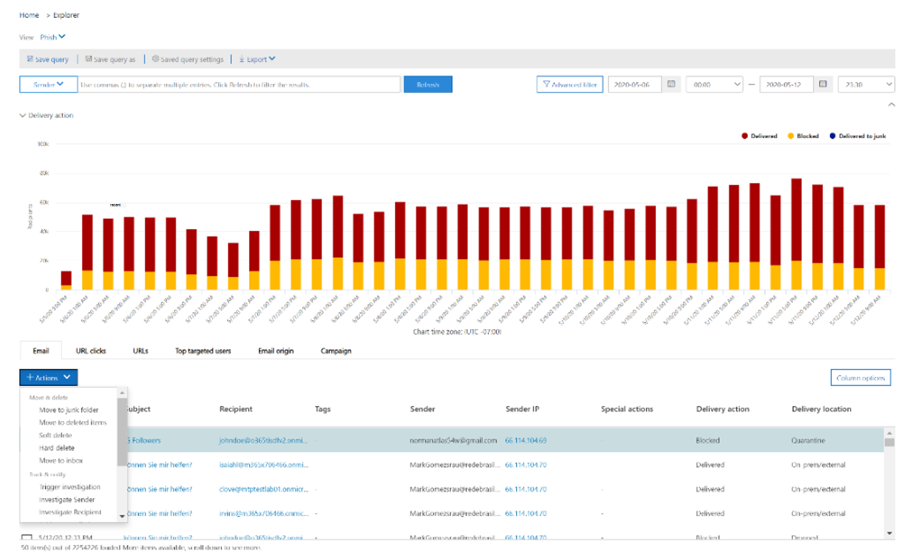

# Исправление вредоносного сообщения электронной почты, которое было доставлено в Office 365Remediate malicious email that was delivered in Office 365

Устранение неполадок означает выполнение действия проскрибед по отношению к угрозе.Remediation means taking a proscribed action against a threat. Вредоносные сообщения, отправленные в организацию, могут быть очищены системой с помощью ZAP (Автоочистка с нулевым временем) или группами безопасности путем действий по исправлению, таких как перемещение в папку "Входящие", перемещение в папку "Удаленные", "обратимое удаление" или "жесткое удаление".Malicious mails sent into your organization may be cleaned up either by the system, through ZAP (Zero-hour Auto-Purge), or by the security teams through remediation actions like move to inbox, move to junk, move to deleted items folder, soft delete, or hard delete. Office Advanced Threat protection (Office ATP) P2/водофункции предоставляет возможности по обеспечению безопасности Teams для устранения угроз по электронной почте и совместной работе с помощью функции автоматического исследования.Office Advanced Threat Protection (Office ATP) P2 / E5 offers security operations teams the ability to mediate threats in emails and collaboration issues through manual hunting and automated investigations.

> [!NOTE]
> Чтобы отделы безопасности могли исправлять сообщения электронной почты, им необходимо назначить роли поиска и очистки.For security teams to remediate emails, they need to have search and purge role assigned to them. Назначение ролей выполняется с помощью разрешений в центре безопасности и соответствия требованиям.Role assignment is done through permissions in security and compliance center. 

## Что нужно знать перед началом работыWhat you need to know before you begin

Для выполнения определенных действий, таких как просмотр заголовков сообщений или загрузка содержимого сообщения электронной почты, необходимо создать новую роль с *предварительным просмотром* , добавленную в другую подходящую группу ролей.To perform certain actions, such as viewing message headers or downloading email message content, you must have a new role called *Preview* added to another appropriate role group. В следующей таблице даны пояснения к обязательным ролям и разрешениям.The following table clarifies required roles and permissions.

|ДействиеActivity  |Группа ролейRole group |Нужна роль предварительного просмотра?Preview role needed?  |
|---------|---------|---------|
|Использование обозревателя угроз (и обнаружения в реальном времени) для анализа угрозUse Threat Explorer (and real-time detections) to analyze threats     |Глобальный администраторGlobal Administrator   Администратор безопасностиSecurity Administrator   Читатель сведений о безопасностиSecurity Reader     | НетNo   |
|Использование обозревателя угроз (и обнаружения в режиме реального времени) для просмотра заголовков сообщений электронной почты, а также предварительного просмотра и скачивания почтовых сообщений, помещенных в карантинUse Threat Explorer (and real-time detections) to view headers for email messages as well as preview and download quarantined email messages    |Глобальный администраторGlobal Administrator   Администратор безопасностиSecurity Administrator  Читатель сведений о безопасностиSecurity Reader   |       НетNo  |
|Использование обозревателя угроз для просмотра заголовков и загрузки сообщений электронной почты, доставляемых в почтовые ящикиUse Threat Explorer to view headers and download email messages delivered to mailboxes     |Глобальный администраторGlobal Administrator  Администратор безопасностиSecurity Administrator   Читатель сведений о безопасностиSecurity Reader   PreviewPreview   |   ДаYes      |

> [!NOTE]
> *Предварительная версия* — это роль, а не группа ролей; роль предварительного просмотра необходимо добавить в существующую группу ролей для Office 365.*Preview* is a role and not a role group; the Preview role must be added to an existing role group for Office 365. Роли глобального администратора назначается центр администрирования Microsoft 365 ( [https://admin.microsoft.com](https://admin.microsoft.com) ), а роли администратора безопасности и средства чтения безопасности назначаются в центре безопасности & соответствия требованиям ( [https://protection.office.com](https://protection.office.com) ).The Global Administrator role is assigned the Microsoft 365 admin center ([https://admin.microsoft.com](https://admin.microsoft.com)), and the Security Administrator and Security Reader roles are assigned in the Security & Compliance Center ([https://protection.office.com](https://protection.office.com)). Дополнительные сведения о ролях и разрешениях приведены [в разделе разрешения в центре безопасности & соответствия требованиям.](https://docs.microsoft.com/microsoft-365/security/office-365-security/permissions-in-the-security-and-compliance-center?view=o365-worldwide)To learn more about roles and permissions, see [Permissions in the Security & Compliance Center.](https://docs.microsoft.com/microsoft-365/security/office-365-security/permissions-in-the-security-and-compliance-center?view=o365-worldwide)

> [!NOTE]
> Администраторы могут выполнять необходимые действия с сообщениями электронной почты, но чтобы получать их, они должны иметь роль "Поиск и очистка", назначенную им с помощью центра безопасности и соответствия требованиям > разрешений.Admins can take required actions on emails but to get their action approved, they must have the "Search and Purge" role assigned to them via Security and Compliance Center > Permissions.

## Ручное и автоматическое исправлениеManual and automated remediation

Поиск угроз вручную осуществляется в том случае, если специалисты по безопасности выявляют **угрозы вручную,** используя возможности поиска и фильтрации в обозревателе угроз.**Manual hunting** takes place when security teams identify threats manually, using the search and filtering capabilities in Threat Explorer. Ручное исправление сообщений электронной почты может быть запущено через любое представление электронной почты (вредоносные программы, фишинг или всю электронную почту) после обнаружения набора электронных сообщений, которые необходимо исправить.Manual remediation on emails can be triggered through any email view (Malware, Phish, or All email) after finding a set of emails which need to be remediated.

Выбор электронной почты можно выполнить несколькими способами с помощью обозревателя угроз:The selection of emails can be done in multiple ways through Threat Explorer:

1. Выбор электронных сообщений вручную: это означает, что Teams могут использовать фильтры в соответствующих представлениях и выбирать несколько сообщений в обозревателе угроз, которые необходимо исправить.Choosing emails by hand: This means security operations teams can use filters in respective views and select a few emails from Threat Explorer that need to be remediated. Верхний предел выбора электронных сообщений — 100 (100).The upper limit to selecting emails is one hundred (100). Операции безопасности Teams не может выбрать более сотни сообщений электронной почты вручную.Security operations teams cannot pick more than hundred emails, manually.

2. Выбор запроса: операции с безопасностью Teams могут выбрать весь запрос с помощью кнопки Top "выделить все".Query selection: Security operations teams can select an entire query by using the top “select all” button. Один и тот же запрос отображается в разделе сведения об отправке почты в центре уведомлений.The same query is shown in action center mail submission details as well.

3. Выбор запроса с исключением: возможны случаи, когда Teams решает исправить сообщения электронной почты, выбирая весь запрос и исключая из него несколько сообщений, вручную.Query selection with exclusion: There may be times when security operations teams decide to remediate emails by both selecting an entire query and excluding a few emails from the query, manually. Для этого администратор может воспользоваться флажком "выделить все" и прокрутить вниз, чтобы исключить несколько сообщений электронной почты вручную.To do so, an admin can use “Select All” check box and scroll down to exclude a few emails, manually. В этом случае максимальное число сообщений электронной почты, которое может храниться в запросе, составляет 1000 (1 000), а максимальное число исключений — 100 (100).The maximum number of emails the query can hold is one thousand (1,000), and the maximum number of exclusions is one hundred (100), in this case.

После выбора в обозревателе угроз электронной почты, создание исправления может начаться с непосредственных действий или с помощью постановки в очередь сообщений электронной почты для действия.Once emails are selected from Threat Explorer, remediation creation can begin by taking direct action, or by queuing up emails for an action:

1. Прямое утверждение: при выполнении таких действий, как "переместить в папку" Входящие "," переместить в папку "Нежелательная почта", "переход к удаленным элементам", "обратимое удаление", "обратимое удаление", для сотрудников безопасности с соответствующими разрешениями и дальнейшие действия, выполняемые после создания исправления, процесс исправления начинает выполнение выбранного действия.Direct approval: When actions like ‘Move to inbox’, ‘Move to junk’, ‘Move to deleted items’, ‘Soft delete’, ‘Hard delete’ are selected by security personnel with appropriate permissions, and next steps are followed till remediation creation, the remediation process begins to execute a selected action. Во временном всплывающем окне отображается выполняемое исправление.A temporary flyout shows remediation in progress.

2. Два шага утверждения: действие "добавить в исправление" может быть выполнено администратором, у которого нет соответствующих разрешений или которым требуется больше ждать выполнения действия.Two step approval: ‘Add to remediation’ action can be taken by an admin who does not have appropriate permissions or who needs to wait longer to execute the action. В этом случае действие по исправлению не выполняется напрямую.In this case, the remediation action is not executed directly. Вместо этого сообщения добавляются в контейнер исправлений, который необходимо утвердить для выполнения.Instead, emails are added to a remediation container that must be approved to execute. Сообщение электронной почты не будет исправлено до тех пор, пока исправление не будет утверждено.Until the remediation is approved, the email will not be remediated. После утверждения исправления будут предприняты действия с электронной почтой.Once the remediation is approved, actions will be taken on the email.

Действия **автоматического исследования и реагирования (AIR)** инициируются оповещениями или группами безопасности в обозревателе угроз.**Automated investigation and response (AIR)** actions are triggered by alerts or by security operations teams from inside Threat Explorer. Они могут включать некоторые рекомендуемые исправления, которые должны быть утверждены группами безопасности Teams.They may include some recommended mediation that must be approved by security operations teams. Эти действия по исправлению содержатся на вкладке действия в автоматическом расследовании.These remediation actions are included on the Action tab within the automated investigation.  

:::image type="content" source="../../../media/tp-RemediationArticle3.png" alt-text="Почта с вредоносной программой — это страница Заппед, на которой показано время выполнения ZAP.":::

Все утверждения (прямые утверждения или два этапа утверждения), созданные с помощью обозревателя угроз, и действия, выполняемые при автоматическом расследовании, отображаются в центре уведомлений, доступ к которому можно получить с помощью левой панели навигации в разделе *Обзор* >  **центра уведомлений**.All mediation (either direct approval or two-step approval) created through Threat Explorer, and approved actions coming from automated investigations, show up in the Action Center, which can be accessed via the left navigation under *Review*> **Action Center**.

:::image type="content" source="../../../media/tp-RemediationArticle4.png" alt-text="Центр уведомлений со списком угроз по дате и степени серьезности.":::

В центре уведомлений отображаются все действия по исправлению за прошедшие 30 дней.Action Center shows all remediation actions for the past 30 days. Действия, выполняемые с помощью Explorer, отображаются с тем же именем, что и в Teams Operations в ходе создания исправления.Actions taken through Explorer show up with the same name provided by the security operations teams when the remediation was created. Действия, выполняемые при автоматическом расследовании, отображаются с заголовками, которые начинаются с соответствующего оповещения, например "ZAP-Cluster Cluster...".Actions taken through automated investigations are surfaced with titles that begin with the related alert that triggered the investigation – for e.g. “Zap email cluster…”.

Каждый элемент исправления можно открыть для просмотра сведений о нем.Each remediation item can be opened to view details about it. При открытии элемента исправления отображаются основные сведения об исправлении, имя исправления, Дата создания, описание, серьезность угрозы и состояние.When a remediation item is opened, it shows basic remediation details, the remediation name, creation date, description, threat severity, and status. Кроме того, показаны две вкладки.It also shows two tabs. 

1. **Вкладка "Отправка почты"**: это количество сообщений электронной почты, отправленных через обозреватель угроз или автоматических расследований, которые необходимо исправить.**Mail submission tab**: These are the number of emails submitted through Threat Explorer or automated investigations to be remediated. К этим сообщениям могут относиться следующие сообщения:These emails can be:

**Действие**: сообщения электронной почты из следующих расположений в облачных почтовых ящиках могут быть обработаны и перемещены, т. е. любые сообщения в категории ремедиабле можно перемещать из одного расположения в другое.**Actionable**: Emails in the following cloud mailbox locations can be acted upon and moved i.e. any email within the remediable category can be moved from one location to another:
  - Inbox;Inbox 
  - НежелательноеJunk  
  - Удалена папкаDeleted folder
  - Обратимо удаленная папкаSoft deleted folder

>[!NOTE]
> В настоящее время только конечный пользователь, имеющий доступ к почтовому ящику, может восстановить элементы из папки с обратимым удалением.Currently, only an end user with access to the mailbox can recover items from a soft delete folder.

Не поддаются **действиям**: сообщения электронной почты из следующих расположений не могут обрабатываться или перемещаться как часть действий электронной почты, т. е. сообщения в категории, не относящиеся к ремедиабле, не могут быть перемещены в категорию, отличной от ремедиабле, и в ремедиабле.**Not actionable**: Emails in the following locations cannot be acted upon or moved as a part of the email actions i.e. emails in non-remediable category cannot be moved either in the non-remediable category, nor in remediable. Расположения, отличные от ремедиабле:Non-remediable locations are:

  - КарантинQuarantine
  - Окончательная удаленная папкаHard deleted folder
  - Локальная/внешняяOn-prem / external
  - Сбой или удаленFailed / dropped
  
Отправленные подозрительные сообщения классифицируются как ремедиабле или не ремедиабле.Suspicious messages submitted are categorized as either remediable or non-remediable. В большинстве случаев сообщения ремедиабле и не ремедиабле должны добавляться к общему количеству отправленных сообщений.In most cases, remediable and non-remediable messages should add up to the total messages submitted. Однако могут возникнуть редкие случаи, в которых отправляемые сообщения могут не доставляться до суммы элементов ремедиабле и не ремедиабле, а также могут быть выше или ниже, чем общее количество отправленных сообщений.However, there can be rare cases where messages submitted may not add up to the sum of remediable and non-remediable items, and could be either higher or lower than the total submitted message count. Это может произойти из-за задержки системы, таймаутов или просроченных сообщений.This can happen due to system delays, time-outs, or expired messages. Срок хранения сообщений зависит от срока хранения в Организации.Messages expire based on Explorer’s retention period for your organization.

Если вы не устранение старые сообщения после срока хранения в проводнике вашей организации, если вы видите несоответствия в числах, рекомендуется перезапустить устранение элементы.Unless you are remediating old messages after your organization’s Explorer retention period, if you see inconsistencies in numbers, it is advisable to re-try remediating items. В случае задержки системы обновления исправлений обычно обновляются в течение нескольких часов.For system delays, remediation updates are typically refreshed within a few hours.

Если срок хранения в Организации для электронной почты в Explorer составляет 30 дней, а устранение отправляются через 29-30 дней назад, счетчики отправки почты могут не всегда добавляться, так как сообщения могут начаться за период хранения.If your organization’s retention period for email in Explorer is 30 days, and you are remediating emails going 29-30 days back, mail submission counts may not always add up as the emails might have started moving out of retention period already.

Если в течение какого-то времени во время состояния "в ходе работы" в течение длительного времени в течение какого-либо времени находится сообщение, это может быть вызвано задержкаIf mediation is stuck in an “In progress” state for a while, it’s likely due to system delays. Исправление может занять несколько часов.It could take up to a few hours to remediate. Возможна ситуация, когда количество отправленных сообщений не является частью запроса при запуске исправления из-за задержки системы.There can be a variation observed in mail submission counts as some of the emails were not a part of the query while starting remediation, due to system delays. В таких случаях рекомендуется повторить попытку устранение.It is a good idea to re-try remediating in such cases.  

Для достижения лучших результатов исправление должно выполняться в небольших пакетах вокруг 50k или меньшего числа сообщений электронной почты.For best results, remediation should be done in smaller batches of around 50k or lesser emails.  

Все сообщения электронной почты, отправляемые по электронной почте, ремедиабле только те, которые будут обрабатываться при исправлении.Of all emails in mail submission, remediable emails are the only ones that will be acted upon during remediation. Сообщения электронной почты, не относящиеся к ремедиабле, не могут быть исправлены системой электронной почты Office 365, так как они не хранятся в облачных почтовых ящиках.Non-remediable emails cannot be remediated by the Office 365 email system, as they are not stored in cloud mailboxes.

Для сообщений, обнаруженных в карантине, администраторы могут переходить в карантин, чтобы выполнять действия с этими сообщениями, если это необходимо, но сообщения электронной почты истечет из карантина, если они не были очищены вручную.For emails found in quarantine, admins can go to quarantine to take actions on those emails if required, but the emails will expire out of quarantine if not manually purged. Почтовые сообщения, помещенные в карантин с помощью вредоносного контента, недоступны для конечных пользователей, поэтому персоналу безопасности не нужно предпринимать какие-либо действия, чтобы избавиться от угроз в карантине.Emails quarantined due to malicious content are not accessible by end-users, so security personnel need not take any specific action to get rid of the threat in quarantine. Если сообщения хранятся на локальном или внешнем уровне, можно связаться с конечным пользователем, чтобы устранить подозрительные сообщения электронной почты или использовать отдельные средства сервера или средства безопасности для удаления.If the emails are on-prem or external, the end-user can be contacted to address the suspicious email or use separate email server/security tools for removal. Эти сообщения можно определить путем применения места доставки = локальный/внешний фильтр в обозревателе угроз.These emails can be identified by applying delivery location = on-prem / external filter in Threat Explorer. Для неудачных или пропущенных сообщений электронной почты или сообщений, недоступных конечному пользователю, не должно быть электронной почты для устранения, так как они не достигают почтового ящика.For failed or dropped email, or email not accessible by the end-user, there shouldn’t be email to mitigate, since they don’t reach the mailbox.

Так как отправка отображается в центре уведомлений.This is how a submission shows up in Action Center. Исправление может содержать несколько отправок.A remediation can contain multiple submissions. Если несколько действий утверждены за одно автоматическое исследование, каждое действие электронной почты или кластера электронной почты будет отображаться в том же исправлении, что и в другой отправке.If multiple actions get approved through one automated investigation, each email or email cluster action shows up in the same remediation as a different submission.

:::image type="content" source="../../../media/tp-RemediationArticle6.png" alt-text="Выпадающее сообщение о выходе из кластера электронной почты ZAP.":::

При нажатии элемента отправки почты отображаются сведения об этих исправлениях, таких как запрос (при условии, что оно запускается с помощью автоматизированного расследования или проводника по угрозам, выбирая запрос), время начала и время окончания исправления.Clicking on a mail submission item will show details of that remediation such as the query (when remediation is triggered through automated investigations or Threat Explorer through selecting a query), start time, and end time, of remediation. Кроме того, отображается список сообщений, отправленных для исправления.It also displays a list of messages that were submitted for remediation. По мере того как сообщения выходят за срок хранения в проводнике, сообщения исчезнут из этого списка.As messages move out of the Explorer retention period, the messages will disappear from this list. В этом списке также показаны отдельные сообщения из списка ремедиабле.This list also shows individual messages from the list which are remediable.

2. **Вкладка журналы действий**: на этой вкладке показан результат исправления сообщений, в том числе сведения об утвержденных датах, утверждающем (администраторе, который утвердил действие), действии, состоянии и счетчиках.**Action logs tab**: This tab shows the result of messages remediated, including details like approved date, approver (admin who approved the action), action, status, and counts.  

Status — общее состояние исправления.Status is the overall status of the remediation. Состояние может принимать следующие значения:Status can be:

  - **Начато**: при срабатывании исправления.**Started**: When a remediation gets triggered.
  - **Помещен в очередь**: при исправлении сообщений в очереди.**Queued**: When the remediation is queued up for mitigation of emails.
  - **В ходе выполнения**: при снижении риска.**In progress**: When the mitigation is in progress.
  - **Завершено**: при успешном снижении по всем ремедиабле сообщениям электронной почты или при наличии некоторых сбоев.**Completed**: When the mitigation on all remediable emails is done either successfully or with some failures. 
  - **Сбой**: при отсутствии исправлений.**Failed**: When no remediations are successful.

Как только сообщения ремедиабле могут быть обработаны, очистка каждой почты считается успешной или неудачной.As only remediable emails can be acted upon, each email’s cleanup is looked at as successful or failed. Из общей ремедиабле электронной почты мы предоставляем успешные и неудачные меры.From the total remediable emails, we expose the successful and failed mitigations.

  - **Успех**: при выполнении желаемого действия с электронной почтой ремедиабле и совпадение с намерением администрирования. Например: администратор хочет удалить сообщения электронной почты из почтовых ящиков, чтобы они могли удалить электронную почту с возможностью их обратимого удаления.**Success**: When the desired action on remediable emails is accomplished and matches the intention of admin. For example: An admin wants to remove emails from mailboxes, so they take the action of soft deleting emails. Если после выполнения действия сообщение электронной почты ремедиабле не найдено в исходной папке, состояние будет отображаться как успешное.If a remediable email is not found in the original folder after the action is taken, the Status will show as successful.  

  - **Сбой**: при неудачном выполнении желаемого действия с ремедиабле электронной почтой.**Failure**: When the desired action on remediable emails fails. Например: администратор хочет удалить сообщения электронной почты из почтовых ящиков, поэтому он выполняет действие обратимого удаления сообщений электронной почты.For example: An admin wants to remove emails from mailboxes, so he takes the action of soft deleting emails. Если электронная почта ремедиабле по-прежнему находится в почтовом ящике, в поле Состояние отображается значение ошибка.If a remediable email is still found in the mailbox, Status will show as failed.

При выборе любого элемента в журнале действий отображается подробная информация об исправлении.Clicking on any item in action log, displays details of remediation. В случае успешного выполнения элементов, если сведения говорят, успешно или не найдены в почтовом ящике, это означает, что элемент уже удален из почтового ящика.For successful items, if the details say, successful, or not found in mailbox, it means that item was already removed from the mailbox. Иногда возникают ошибки, возникающие из-за системной ошибки во время исправления, и в таких случаях рекомендуется повторно попытаться выполнить исправление.Sometimes there are failures that happen due to a systemic error during remediation, and in those cases, it is a good idea to re-try remediation.  

Исправление это мощный инструмент для устранения угроз и устранения подозрительных сообщений, сообщений электронной почты.Remediation is a powerful tool to mitigate threats, and address suspicious, emails. Это помогает обеспечить надежную и безопасную организацию.It helps keep an organization safe and secure.  

## Дополнительные сведенияMore info

См. <https://docs.microsoft.com/microsoft-365/security/office-365-security/investigate-malicious-email-that-was-delivered?view=o365-worldwide>See <https://docs.microsoft.com/microsoft-365/security/office-365-security/investigate-malicious-email-that-was-delivered?view=o365-worldwide>