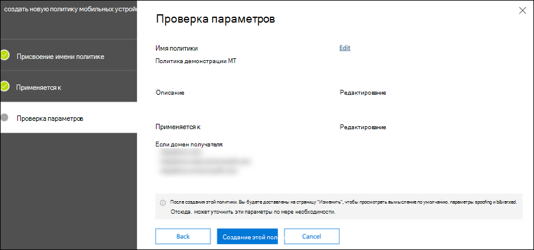

# Настройка принципов защиты от угроз Майкрософт для испытательной лабораторной средыConfigure Microsoft Threat Protection pillars for your trial lab environment

**Область применения:****Applies to:**
- Защита от угроз (Майкрософт)Microsoft Threat Protection

Создание пробной лабораторной среды Майкрософт для защиты от угроз и развертывание выполняется в три этапа:Creating a Microsoft Threat Protection trial lab environment and deploying it is a three-phase process:

 
<table border="0" width="100%" align="center">
  <tr style="text-align:center;">
    <td align="center" style="width:25%; border:0;" >
      <a href= "https://docs.microsoft.com/microsoft-365/security/mtp/prepare-mtpeval?view=o365-worldwide"> 
        
       Этап 1: подготовка</a>Phase 1: Prepare </a> 
    </td>
     <td align="center">
      <a href="https://docs.microsoft.com/microsoft-365/security/mtp/setup-mtpeval?view=o365-worldwide">
        
       Этап 2: Настройка</a>Phase 2: Setup </a> 
    </td>
    <td align="center" bgcolor="#d5f5e3">
      <a href="https://docs.microsoft.com/microsoft-365/security/mtp/config-mtpeval?view=o365-worldwide">
        
       Этап 3: Настройка встроенного &</a>Phase 3: Configure & Onboard </a> 
</td>

  </tr>
</table>

В настоящее время вы намерены на этапе настройки.You are currently in the configuration phase.

Подготовка — это ключ к любому успешному развертыванию.Preparation is key to any successful deployment. В этой статье вы узнаете о точках, которые необходимо учесть при подготовке к развертыванию пакета ATP для защитника Microsoft.In this article, you'll be guided on the points you'll need to consider as you prepare to deploy Microsoft Defender ATP.

## Основы защиты от угроз МайкрософтMicrosoft Threat Protection pillars
Защита от угроз Майкрософт состоит из четырех базовых принципов.Microsoft Threat Protection consists of four pillars. Несмотря на то, что один из них уже может обеспечить безопасность вашей сетевой организации, при использовании четырех базовых принципов защиты от угроз Майкрософт вы узнаете, что ваша организация является наибольшим значением.Although one pillar can already provide value to your network organization's security, enabling the four Microsoft Threat Protection pillars will give your organization the most value.

  

В этом разделе приведутся инструкции по настройке:This section will guide you to configure:
-   Office 365 Advanced Threat ProtectionOffice 365 Advanced Threat Protection
-   Расширенная защита от угроз AzureAzure Advanced Threat Protection 
-   Microsoft Cloud App SecurityMicrosoft Cloud App Security
-   Advanced Threat Protection в Microsoft DefenderMicrosoft Defender Advanced Threat Protection

## Настройка Office 365 Advanced Threat protectionConfigure Office 365 Advanced Threat Protection
>[!NOTE]
>Пропустите этот шаг, если вы уже включили расширенную защиту от угроз для Office 365.Skip this step if you have already enabled Office 365 Advanced Threat Protection. 

Существует модуль PowerShell, который называется *рекомендуемой конфигурацией Office 365 Advanced Threat protection Analyzer (Orca)* , который помогает определить некоторые из этих параметров.There is a PowerShell Module called the *Office 365 Advanced Threat Protection Recommended Configuration Analyzer (ORCA)* that helps determine some of these settings. При запуске с правами администратора в клиенте командлет Get-Оркарепорт поможет создать оценку параметров защиты от нежелательной почты, защиты от фишинга и других сообщений санацией.When run as an administrator in your tenant, get-ORCAReport will help generate an assessment of the anti-spam, anti-phish, and other message hygiene settings. Вы можете скачать этот модуль из https://www.powershellgallery.com/packages/ORCA/.You can download this module from https://www.powershellgallery.com/packages/ORCA/. 

1. Перейдите к разделу**Threat management** > **Policy** [Безопасность & безопасности центра](https://protection.office.com/homepage) > соответствия требованиям Office 365.Navigate to [Office 365 Security & Compliance Center](https://protection.office.com/homepage) > **Threat management** > **Policy**.
  
 
2. Выберите пункт **Защита от фишинга ATP**, выберите **создать** и введите имя и описание политики.Click **ATP anti-phishing**, select **Create** and fill in the policy name and description. Нажмите кнопку **Далее**.Click **Next**.
  

>[!NOTE]
>Измените политику защиты от фишинга ATP.Edit your Advanced ATP anti-phishing policy. Изменение **расширенного порога фишинга** на **2 агрессивно**.Change **Advanced Phishing Threshold** to **2 - Aggressive**.
 

3. Щелкните раскрывающееся меню **Добавить условие** и выберите домен (ы) в качестве домена получателя.Click the **Add a condition** drop-down menu and select your domain(s) as recipient domain. Нажмите кнопку **Далее**.Click **Next**.
  
 
4. Проверьте параметры.Review your settings. Щелкните **создать эту политику** для подтверждения.Click **Create this policy** to confirm. 
  
 
5. Выберите пункт **безопасные вложения ATP** и установите флажок **включить ATP для SharePoint, OneDrive и Microsoft Teams** .Select **ATP Safe attachments** and select the **Turn on ATP for SharePoint, OneDrive, and Microsoft Teams** option.  
  

6. Нажмите значок +, чтобы создать новую политику безопасных вложений, примените ее к доменам получателя.Click the + icon to create a new safe attachment policy, apply it as recipient domain to your domains. Нажмите кнопку **Сохранить**.Click **Save**.
  
 
7. Затем выберите политику **безопасных ссылок ATP** , а затем щелкните значок карандаша, чтобы изменить политику по умолчанию.Next, select the **ATP Safe Links** policy, then click the pencil icon to edit the default policy.

8. Убедитесь, что флажок не **отслеживать, когда пользователи щелкать ссылку "безопасные ссылки** " не установлен, а остальные параметры выбраны.Make sure that the **Do not track when users click safe links** option is not selected, while the rest of the options are selected. Дополнительные сведения приведены в разделе [Параметры безопасных ссылок](https://docs.microsoft.com/microsoft-365/security/office-365-security/recommended-settings-for-eop-and-office365-atp?view=o365-worldwide) .See [Safe Links settings](https://docs.microsoft.com/microsoft-365/security/office-365-security/recommended-settings-for-eop-and-office365-atp?view=o365-worldwide) for details. Нажмите кнопку **Сохранить**.Click **Save**. 
  

9. Затем выберите политику **защиты от вредоносных программ** , выберите значение по умолчанию и нажмите значок карандаша.Next select the **Anti-malware** policy, select the default, and choose the pencil icon.

10. Нажмите кнопку **Параметры** и выберите Да, чтобы включить **ответ на обнаружение вредоносных программ**, **используя текст уведомления по умолчанию** .Click **Settings** and select **Yes and use the default notification text** to enable **Malware Detection Response**. Включите **Фильтр общих типов вложений** .Turn the **Common Attachment Types Filter** on. Нажмите кнопку **Сохранить**.Click **Save**.
   
  
11. Перейдите к разделу >  [& безопасности Office 365](https://protection.office.com/homepage)**Поиск в журнале аудита** **поиска** > и включите аудит для.Navigate to [Office 365 Security & Compliance Center](https://protection.office.com/homepage) > **Search** > **Audit log search** and turn Auditing on.  
  

12. Интеграция Office 365 с пакетом ATP с помощью защитника Майкрософт.Integrate Office 365 ATP with Microsoft Defender ATP. Перейдите в раздел >  [& безопасности Office 365 Security](https://protection.office.com/homepage)**Management** > **Explorer** и выберите **Параметры вдатп** в правом верхнем углу экрана.Navigate to [Office 365 Security & Compliance Center](https://protection.office.com/homepage) > **Threat management** > **Explorer** and select **WDATP Settings** on the upper right corner of the screen. В диалоговом окне Подключение к Защитнику (Майкрософт) ATP включите параметр **подключиться к Windows ATP**.In the Microsoft Defender ATP connection dialog box, turn on **Connect to Windows ATP**.
  

## Настройка Advanced Threat Protection в AzureConfigure Azure Advanced Threat Protection
>[!NOTE]
>Пропустите этот шаг, если вы уже включили службу Advanced Threat Protection в AzureSkip this step if you have already enabled Azure Advanced Threat Protection

1. Перейдите в [Центр безопасности Microsoft 365](https://security.microsoft.com/info) > выберите **Дополнительные ресурсы** > **Azure Advanced Threat protection**.Navigate to [Microsoft 365 Security Center](https://security.microsoft.com/info) > select **More Resources** > **Azure Advanced Threat Protection**.
  

2. Нажмите кнопку **создать** , чтобы запустить мастер Advanced Threat protection.Click **Create** to start the Azure Advanced Threat Protection wizard. 
   

3. Выберите **указать имя пользователя и пароль для подключения к лесу Active Directory**.Choose **Provide a username and password to connect to your Active Directory forest**.  
  

4. Введите локальные учетные данные Active Directory.Enter your Active Directory on-premises credentials. Это может быть любая учетная запись пользователя, имеющая доступ на чтение к Active Directory.This can be any user account that has read access to Active Directory.
  

5. Затем выберите пункт **скачать файл установки и передачи датчиков** на контроллер домена.Next, choose **Download Sensor Setup** and transfer file to your domain controller. 
  

6. Выполните настройку датчика Azure ATP и начните выполнение мастера.Execute the Azure ATP Sensor Setup and begin following the wizard.
   
 
7. Нажмите кнопку **Далее** в разделе Тип развертывания Sensor (датчик).Click **Next** at the sensor deployment type.
   
 
8. Скопируйте ключ доступа, так как он понадобится для его последующего ввода в мастере.Copy the access key as you will need to enter it next in the Wizard.
  
 
9. Скопируйте в мастер ключ доступа и нажмите кнопку **установить**.Copy the access key into the Wizard and click **Install**. 
   

10. Поздравляем, вы успешно настроили службу Advanced Threat Protection в Azure на контроллере домена.Congratulations, you have successfully configured Azure Advanced Threat Protection on your domain controller.
  
 
11. В разделе Параметры [Azure Azure ATP](https://go.microsoft.com/fwlink/?linkid=2040449) выберите пункт **Защитник Windows ATP**, а затем включите переключатель.Under the [Azure Azure ATP](https://go.microsoft.com/fwlink/?linkid=2040449) settings section, select **Windows Defender ATP**, then turn the toggle on. Нажмите кнопку **Сохранить**.Click **Save**. 
  

>[!NOTE]
>Пакет ATP для защитника Windows изменен в качестве пакета ATP для защитника Майкрософт.Windows Defender ATP has been rebranded as Microsoft Defender ATP. Изменение фирменного стиля на всех наших порталах разбивается на согласованность.Rebranding changes across all of our portals are being rolled out the for consistency.

## Настройка Microsoft Cloud App SecurityConfigure Microsoft Cloud App Security
>[!NOTE]
>Пропустите этот шаг, если вы уже включили Microsoft Cloud App Security.Skip this step if you have already enabled Microsoft Cloud App Security. 

1. Перейдите в раздел [Microsoft 365 Security Center](https://security.microsoft.com/info) > **More Resources** > **Security Microsoft Cloud App Security**.Navigate to [Microsoft 365 Security Center](https://security.microsoft.com/info) > **More Resources** > **Microsoft Cloud App Security**.
  

2. В информационном запросе для интеграции Azure ATP выберите **включить интеграцию данных Azure ATP**.At the information prompt to integrate Azure ATP, select **Enable Azure ATP data integration**. 
   

>[!NOTE]
>Если вы не видите этот запрос, это может означать, что интеграция Azure ATP данных уже включена.If you don’t see this prompt, it might mean that your Azure ATP data integration has already been enabled. Тем не менее, если вы не уверены, обратитесь к ИТ ИТ администратора, чтобы подтвердить.However, if you are not sure, contact your IT Administrator to confirm. 

3. Перейдите к разделу **Параметры**, перейдите в раздел **Интеграция Azure ATP** вкл., а затем нажмите кнопку **сохранить**.Go to **Settings**, turn the **Azure ATP integration** toggle on, then click **Save**. 
  
>[!NOTE]
>Для новых экземпляров Azure ATP этот переключатель интеграции автоматически включается.For new Azure ATP instances, this integration toggle is automatically turned on. Прежде чем переходить к следующему шагу, убедитесь, что интеграция Azure ATP включена.Confirm that your Azure ATP integration has been enabled before you proceed to the next step.
 
4. В разделе Параметры облачного обнаружения выберите **Интеграция с защитником Майкрософт**, а затем включите интеграцию.Under the Cloud discovery settings, select **Microsoft Defender ATP integration**, then enable the integration. Нажмите кнопку **Сохранить**.Click **Save**.
  

5. В разделе Параметры облачного обнаружения выберите **обогащение пользователей**, а затем включите интеграцию с Azure Active Directory.Under Cloud discovery settings, select **User enrichment**, then enable the integration with Azure Active Directory.
  

## Настройка Advanced Threat Protection в защитнике МайкрософтConfigure Microsoft Defender Advanced Threat Protection
>[!NOTE]
>Пропустите этот шаг, если вы уже включили Advanced Threat Protection в защитнике Microsoft.Skip this step if you have already enabled Microsoft Defender Advanced Threat Protection.

1. Перейдите в раздел [Microsoft 365 Security Center](https://security.microsoft.com/info) > **More Resources** > **Center securitys Microsoft Защитник**.Navigate to [Microsoft 365 Security Center](https://security.microsoft.com/info) > **More Resources** > **Microsoft Defender Security Center**. Нажмите кнопку **Open** (Открыть).Click **Open**.
   
 
2. Следуйте инструкциям мастера Advanced Threat Protection в защитнике Майкрософт.Follow the Microsoft Defender Advanced Threat Protection wizard. Нажмите кнопку **Далее**.Click **Next**. 
   

3. Выберите в зависимости от предпочтительного расположения хранилища данных, политики хранения данных, размера организации и согласия пользователя по предварительным функциям.Choose based on your preferred data storage location, data retention policy, organization size, and opt-in for preview features. 
   
>[!NOTE]
>После этого невозможно изменить некоторые параметры, такие как расположение хранилища данных.You cannot change some of the settings, like data storage location, afterwards. 
 

Нажмите кнопку **Далее**.Click **Next**. 

4. Нажмите **продолжить** , чтобы подготовиться к работе клиента, который является ПАКЕТом ATP для защитника Майкрософт.Click **Continue** and it will provision your Microsoft Defender ATP tenant.
   

5. Применяйте конечные точки с помощью групповых политик, диспетчера конечных точек Майкрософт или запуска локального сценария для пакета ATP в защитнике Майкрософт.Onboard your endpoints through Group Policies, Microsoft Endpoint Manager or by running a local script to Microsoft Defender ATP. Для простоты в этом руководстве используется локальный скрипт.For simplicity, this guide uses the local script.

6. Щелкните **скачать пакет** и скопируйте сценарий входящей миграции в конечные точки (s).Click **Download package** and copy the onboarding script to your endpoint(s).  
   

7. В конечной точке запустите сценарий входящей миграции от имени администратора и нажмите Y.On your endpoint, run the onboarding script as Administrator and choose Y.
   

8. Поздравляем, вы выполнили переплату для первой конечной точки.Congratulations, you have onboarded your first endpoint.  
   

9. Скопируйте тест с определением в мастере Microsoft Defender ATP.Copy-paste the detection test from the Microsoft Defender ATP wizard.
   

10. Скопируйте скрипт PowerShell в командную строку с повышенными привилегиями и запустите его.Copy the PowerShell script to an elevated command prompt and run it. 
   

11. В мастере нажмите кнопку **начать с помощью ATP "защитник Майкрософт"** .Select **Start using Microsoft Defender ATP** from the Wizard.
   
 
12. Посетите [Центр безопасности защитника Microsoft](https://securitycenter.windows.com/).Visit the [Microsoft Defender Security Center](https://securitycenter.windows.com/). Перейдите в раздел **Параметры** и выберите **Дополнительные функции**.Go to **Settings** and then select **Advanced features**. 
   

13. Включите интеграцию с **Advanced Threat Protection в Azure**.Turn on the integration with **Azure Advanced Threat Protection**.  
   

14. Включите интеграцию с **Microsoft Office 365 Threat Intelligence**.Turn on the integration with **Office 365 Threat Intelligence**.
   

15. Включите интеграцию с **Microsoft Cloud App Security**.Turn on integration with **Microsoft Cloud App Security**.
   

16. Прокрутите список вниз и нажмите кнопку **сохранить настройки** , чтобы подтвердить новые интеграции.Scroll down and click **Save preferences** to confirm the new integrations.
   

## Дальнейшие действияNext steps
[Включите защиту от угроз Майкрософт](https://docs.microsoft.com/microsoft-365/security/mtp/mtp-enable?view=o365-worldwide#start-using-the-service) и [Создайте тестовое оповещение](generate-test-alert.md).[Turn on Microsoft Threat Protection](https://docs.microsoft.com/microsoft-365/security/mtp/mtp-enable?view=o365-worldwide#start-using-the-service) and then [generate a test alert](generate-test-alert.md).
