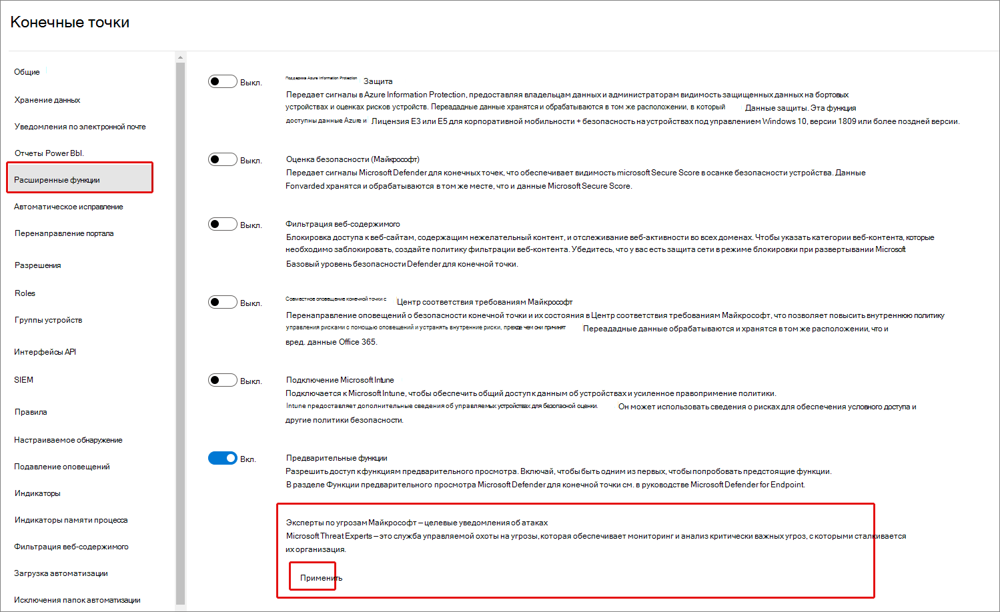
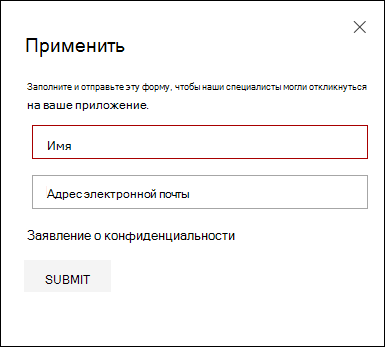
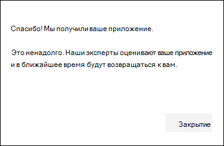
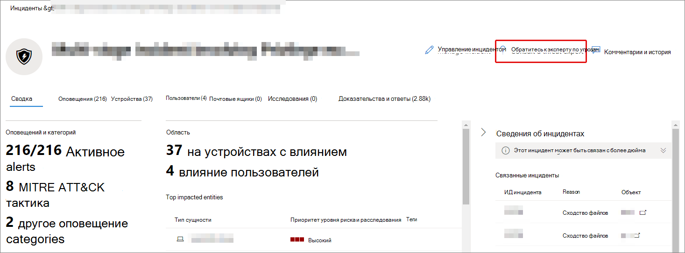
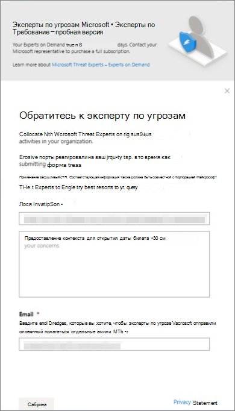

# Настройка и управление возможностями экспертов microsoft Threat Experts с помощью Microsoft 365 Defender

[!INCLUDE [Microsoft 365 Defender rebranding](../includes/microsoft-defender.md)]

**Область применения:**

- [Microsoft 365 Defender](https://go.microsoft.com/fwlink/?linkid=2118804)
- [Microsoft Defender для конечной точки](https://go.microsoft.com/fwlink/p/?linkid=2146631)

[!INCLUDE [Prerelease](../includes/prerelease.md)]

## Прежде чем начать

> [!IMPORTANT]
> Перед подачей заявки обязательно обсудите требования к требованиям для экспертов microsoft Threat Experts — служба управляемых уведомлений об атаках с поставщиком технической службы Майкрософт и командой учетных записей.

Для получения целевых уведомлений об атаке необходимо развернуть Microsoft 365 Defender с зарегистрированными устройствами. Затем отправьте приложение на портале M365 для экспертов microsoft Threat Experts - Targeted Attack Notifications.

Свяжитесь с командой учетных записей или представителем Майкрософт, чтобы подписаться на экспертов Microsoft Threat Experts - Experts on Demand. Эксперты по запросу позволяют проконсультироваться с нашими экспертами по угрозам о том, как защитить организацию от соответствующих обнаружений и противников.

## Apply for Microsoft Threat Experts - Targeted Attack Notifications service

Если у вас уже есть Microsoft Defender для конечной точки и Microsoft 365 Defender, вы можете обратиться за помощью к экспертам microsoft Threat Experts — Targeted Attack Notifications через портал Microsoft 365 Defender.  Целевые уведомления об атаках помогут определить наиболее важные угрозы для вашей организации, чтобы вы могли быстро реагировать на них.

1. Из области навигации перейдите в параметры > конечные точки > общие > расширенные функции > **Microsoft Threat Experts - Targeted Attack Notifications**.

2. Нажмите **Применить**.

    

3. Введите свое имя и адрес электронной почты, чтобы Корпорация Майкрософт связалась с вами по поводу вашего приложения.

    

4. Прочитайте [заявление о конфиденциальности,](https://privacy.microsoft.com/en-us/privacystatement)а затем **выберите Отправка,** когда вы закончили. Вы получите приветственный адрес электронной почты после утверждения приложения.

    

5. После получения приветствия электронной почты вы автоматически начнете получать целевые уведомления об атаке.

6. Вы можете проверить свой статус, посетив параметры > конечных точек **> общие > расширенные функции**. После утверждения, **microsoft Threat Experts - targeted Attack Notification** toggle will be visible and switched **On.**

## Где вы увидите целевые уведомления об атаке от экспертов Microsoft Threat

Вы можете получать целевое уведомление об атаке от экспертов Microsoft Threat с помощью следующих сред:

- Страница Инциденты портала Microsoft 365 **Defender**
- Панель оповещений портала Microsoft 365 **Defender**
- OData оповещения [API и](https://docs.microsoft.com/windows/security/threat-protection/microsoft-defender-atp/get-alerts) [REST API](https://docs.microsoft.com/windows/security/threat-protection/microsoft-defender-atp/pull-alerts-using-rest-api)
- [Таблица DeviceAlertEvents](https://docs.microsoft.com/windows/security/threat-protection/microsoft-defender-atp/advanced-hunting-devicealertevents-table) в расширенных охотах
- Почтовый ящик, если вы хотите, чтобы целевые уведомления о атаке были отправлены вам по электронной почте. См. [ниже правило "Создание уведомления по электронной почте".](#create-an-email-notification-rule)

### Создание правила уведомления по электронной почте

Вы можете создать правила для отправки уведомлений электронной почты для получателей уведомлений. Дополнительные сведения см. в  [публикации Configure alerts](https://docs.microsoft.com/windows/security/threat-protection/microsoft-defender-atp/configure-email-notifications) to create, edit, delete или troubleshoot email notification.

## Просмотр целевых уведомлений об атаке

Вы начнете получать целевое уведомление об атаке от экспертов Microsoft Threat в электронной почте после настройки системы для получения уведомления электронной почты.

1. Выберите ссылку в электронной почте, чтобы перейти к соответствующему контексту оповещений на панели мониторинга с тегами **экспертов Threat**.

2. На странице **Оповещений** выберите ту же тему оповещения, что и полученную в электронной почте, чтобы просмотреть дополнительные сведения.

## Подписка на Эксперты по угрозам Майкрософт — эксперты по запросу

Если вы уже клиент Microsoft Defender для конечных точек, вы можете обратиться к представителю Майкрософт, чтобы подписаться на экспертов Microsoft Threat — Эксперты по запросу.

## Проконсультируйтесь с экспертом по угрозам Майкрософт о подозрительных действиях в области кибербезопасности в вашей организации.

Вы можете связаться с экспертами microsoft Threat из портала Microsoft 365 Defender. Эксперты помогут вам понять сложные угрозы и целевые уведомления об атаке. Дополнительные сведения о оповещениях и инцидентах, а также рекомендации по обработке компрометации. Получение сведений о контексте сведении об угрозах, описанного панелью мониторинга портала.

> [!NOTE]
>
> - Запросы оповещений, связанные с настраиваемыми данными разведки угроз в организации, в настоящее время не поддерживаются. Подробные сведения проконсультируйтесь с вашей службой безопасности или командой реагирования на инциденты.
> - Чтобы отправить запрос  через форму эксперта по угрозам, необходимо иметь разрешение на управление настройками безопасности в Центре **безопасности** на портале Защитник Microsoft 365.

1. Перейдите на страницу портала, связанную с сведениями, которые необходимо исследовать: например, **Device,** **Alert** или **Incident**. Убедитесь, что страница портала, связанная с запросом, просматривается перед отправкой запроса на расследование.

2. Из верхнего меню **выберите? Обратитесь к эксперту по угрозам.**

    

    Откроется экран вылетов.

    В загонах будет указано, находитесь ли вы на пробной подписке, или полная подписка экспертов Microsoft Threat — экспертов по запросу.

    

    Поле **темы** Исследования уже будет заполнено ссылкой на соответствующую страницу для вашего запроса.

3. В следующей области укайте достаточно сведений, чтобы предоставить экспертам microsoft Threat достаточно контекста для начала расследования.

4. Введите адрес электронной почты, который вы хотите использовать для переписки с экспертами microsoft Threat.

> [!NOTE]
> Если вы хотите отслеживать состояние дел "Эксперты по запросу" с помощью Центра служб Майкрософт, перенаправление к техническому менеджеру учетной записи.

Просмотрите это видео для краткого обзора центра служб Майкрософт.

> [!VIDEO https://www.microsoft.com/videoplayer/embed/RE4pk9f]

## Примеры тем исследования

### Сведения об оповещении

- Мы увидели новый тип оповещений для двоичного двоичного параметра living-off-the-land. Мы можем предоставить iD оповещений. Можете ли вы рассказать нам больше об этом оповещении и о том, как мы можем исследовать его далее?
- Мы наблюдали две аналогичные атаки, которые пытаются выполнять вредоносные скрипты PowerShell, но создают различные оповещения. Одна из них — "Подозрительная командная строка PowerShell", а другая — "Вредоносный файл был обнаружен на основе показаний, предоставленных O365". В чем разница?
- Сегодня мы получили нечетное оповещение о ненормальном количестве неудались логинов с устройства пользователя высокого профиля. Мы не можем найти дополнительных доказательств этих попыток. Как Microsoft 365 Defender может видеть эти попытки? За каким типом логинов ведется мониторинг?
- Можете ли вы дать дополнительные сведения о оповещении о предупреждении", "Подозрительное поведение системной утилиты было замечено"?
- Я заметил предупреждение под названием "Создание правила переадресации/перенаправления". Я считаю, что эта деятельность является доброкачественной. Можете ли вы рассказать мне, почему я получил предупреждение?

### Возможный компьютерный компромисс

- Можете ли вы помочь объяснить, почему на многих устройствах в нашей организации мы видим сообщение или оповещение о "Неизвестном процессе"? Мы ценим любые входные данные для уточнения того, связано ли это сообщение или оповещение с вредоносными действиями.
- Можете ли вы проверить возможный компромисс в следующей системе, начиная с прошлой недели? Он ведет себя так же, как и предыдущее обнаружение вредоносных программ в той же системе шесть месяцев назад.

### Сведения о разведке угроз

- Обнаружена фишинговая электронная почта, которая передала пользователю вредоносный документ Word. Документ вызвал серию подозрительных событий, которые вызвали несколько оповещений для определенного семейства вредоносных программ. Есть ли у вас сведения об этой вредоносной программе? Если да, можете ли вы отправить нам ссылку?
- Недавно мы увидели сообщение в блоге об угрозе, которая направлена на нашу отрасль. Можете ли вы помочь нам понять, какую защиту Microsoft 365 Defender обеспечивает от этого субъекта угроз?
- Недавно мы наблюдали фишинговую кампанию, проведенную против нашей организации. Можете ли вы сообщить нам, была ли эта цель направлена конкретно на нашу компанию или вертикаль?

### Оповещение экспертов по угрозам Майкрософт

- Может ли ваша группа реагирования на инциденты помочь нам в решении целевого уведомления об атаке, которое мы получили?
- Мы получили это целевое уведомление об атаке от экспертов Microsoft Threat. У нас нет собственной группы реагирования на инциденты. Что мы можем сделать сейчас и как сдержать инцидент?
- Мы получили целевое уведомление об атаке от экспертов Microsoft Threat. Какие данные вы можете предоставить нам, чтобы мы могли передать нашей группе реагирования на инциденты?

> [!NOTE]
> Microsoft Threat Experts — это служба управляемой охоты на угрозы, а не служба реагирования на инциденты. Тем не менее, эксперты могут без проблем перенаупрестить расследование в службы группы обнаружения и реагирования Microsoft Cybersecurity Solutions Group (CSG) при необходимости. Вы также можете взаимодействовать со своей командой реагирования на инциденты для устранения проблем, которые требуют реагирования на инциденты.

## Сценарий

### Получение отчета о ходе выполнения управляемого запроса на охоту

Ответы экспертов microsoft Threat будут отличаться в зависимости от вашего запроса. Обычно вы получите один из следующих ответов:

- Дополнительные сведения необходимы для продолжения расследования
- Для определения технического контекста необходим файл или несколько примеров файлов.
- Для расследования требуется больше времени
- Начальной информации было достаточно, чтобы завершить расследование

Если эксперт запрашивает дополнительные сведения или примеры файлов, важно быстро реагировать, чтобы сохранить ход расследования.

## См. также

- [Обзор экспертов по угрозам Майкрософт](microsoft-threat-experts.md)
