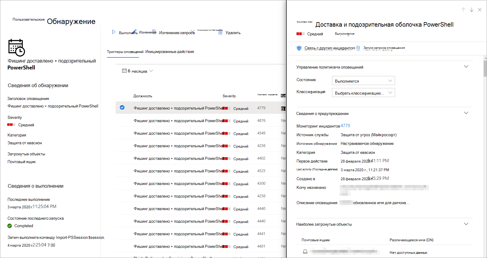

# <a name="create-and-manage-custom-detections-rules"></a><span data-ttu-id="1a42a-104">Создание настраиваемых правил обнаружения и управление ими</span><span class="sxs-lookup"><span data-stu-id="1a42a-104">Create and manage custom detections rules</span></span>

<span data-ttu-id="1a42a-105">**Область применения:**</span><span class="sxs-lookup"><span data-stu-id="1a42a-105">**Applies to:**</span></span>
- <span data-ttu-id="1a42a-106">Защита от угроз (Майкрософт)</span><span class="sxs-lookup"><span data-stu-id="1a42a-106">Microsoft Threat Protection</span></span>

<span data-ttu-id="1a42a-107">Настраиваемые правила обнаружения, основанные на [расширенных](advanced-hunting-overview.md) запросах поиска, позволяют отслеживать различные события и состояния системы, включая невероятные действия и неправильно настроенные конечные точки.</span><span class="sxs-lookup"><span data-stu-id="1a42a-107">Custom detection rules built from [Advanced hunting](advanced-hunting-overview.md) queries let you proactively monitor various events and system states, including suspected breach activity and misconfigured endpoints.</span></span> <span data-ttu-id="1a42a-108">Вы можете настроить их для запуска через определенные интервалы, создавая оповещения и отменяя действия ответа при обнаружении совпадений.</span><span class="sxs-lookup"><span data-stu-id="1a42a-108">You can set them to run at regular intervals, generating alerts and taking response actions whenever there are matches.</span></span>

## <a name="required-permissions-for-managing-custom-detections"></a><span data-ttu-id="1a42a-109">Необходимые разрешения для управления пользовательскими обнаружениями</span><span class="sxs-lookup"><span data-stu-id="1a42a-109">Required permissions for managing custom detections</span></span>

<span data-ttu-id="1a42a-110">Для управления пользовательскими обнаружениями необходимо назначить одну из этих ролей:</span><span class="sxs-lookup"><span data-stu-id="1a42a-110">To manage custom detections, you need to be assigned one of these roles:</span></span>

- <span data-ttu-id="1a42a-111">**Администратор безопасности** — роль администратора безопасности или администратора безопасности — это [роль Azure Active Directory](https://docs.microsoft.com/azure/active-directory/users-groups-roles/directory-assign-admin-roles#security-administrator) для управления различными параметрами безопасности в центре безопасности Microsoft 365 и различными порталами и службами.</span><span class="sxs-lookup"><span data-stu-id="1a42a-111">**Security administrator** — the security administrator or security admin role is an [Azure Active Directory role](https://docs.microsoft.com/azure/active-directory/users-groups-roles/directory-assign-admin-roles#security-administrator) for managing various security settings in Microsoft 365 security center and various portals and services.</span></span>

- <span data-ttu-id="1a42a-112">**Оператор безопасности** — роль оператора безопасности — это [роль Azure Active Directory](https://docs.microsoft.com/azure/active-directory/users-groups-roles/directory-assign-admin-roles#security-administrator) для управления оповещениями и имеющая доступ только для чтения к функциям, связанным с безопасностью, включая всю информацию в центре безопасности Microsoft 365.</span><span class="sxs-lookup"><span data-stu-id="1a42a-112">**Security operator** —  the security operator role is an [Azure Active Directory role](https://docs.microsoft.com/azure/active-directory/users-groups-roles/directory-assign-admin-roles#security-administrator) for managing alerts and has global read-only access on security-related features, including all information in Microsoft 365 security center.</span></span> <span data-ttu-id="1a42a-113">Эта роль достаточно для управления пользовательскими обнаружениями только в том случае, если управление доступом на основе ролей (RBAC) отключено в Microsoft Defender ATP.</span><span class="sxs-lookup"><span data-stu-id="1a42a-113">This role is sufficient for managing custom detections only if role-based access control (RBAC) is turned off in Microsoft Defender ATP.</span></span> <span data-ttu-id="1a42a-114">Если вы настроили RBAC, вам также потребуется разрешение на **Управление параметрами безопасности** для пакета ATP для защитника Microsoft.</span><span class="sxs-lookup"><span data-stu-id="1a42a-114">If you have RBAC configured, you also need the **manage security settings** permission for Microsoft Defender ATP.</span></span>

<span data-ttu-id="1a42a-115">Для управления необходимыми разрешениями **глобальный администратор** может выполнить следующие действия:</span><span class="sxs-lookup"><span data-stu-id="1a42a-115">To manage required permissions, a **global administrator** can do the following:</span></span>

- <span data-ttu-id="1a42a-116">Назначьте роль **администратора безопасности** или **оператора безопасности** в [центре администрирования Microsoft 365](https://admin.microsoft.com/) в разделе **Roles**  >  **администратор безопасности**ролей.</span><span class="sxs-lookup"><span data-stu-id="1a42a-116">Assign the **security administrator** or **security operator** role in [Microsoft 365 admin center](https://admin.microsoft.com/) under **Roles** > **Security admin**.</span></span>
- <span data-ttu-id="1a42a-117">Проверьте параметры RBAC для защитника Майкрософт в [центре безопасности защитника Microsoft](https://securitycenter.windows.com/) в разделе **Параметры**  >  **разрешений**  >  **Roles**.</span><span class="sxs-lookup"><span data-stu-id="1a42a-117">Check RBAC settings for Microsoft Defender ATP in [Microsoft Defender Security Center](https://securitycenter.windows.com/) under **Settings** > **Permissions** > **Roles**.</span></span> <span data-ttu-id="1a42a-118">Выберите соответствующую роль, чтобы назначить разрешение " **Управление параметрами безопасности** ".</span><span class="sxs-lookup"><span data-stu-id="1a42a-118">Select the corresponding role to assign the **manage security settings** permission.</span></span>

> [!NOTE]
> <span data-ttu-id="1a42a-119">Чтобы управлять пользовательскими обнаружениями, для **операторов безопасности** потребуется разрешение на **Управление параметрами безопасности** в защитнике Майкрософт, если параметр RBAC включен.</span><span class="sxs-lookup"><span data-stu-id="1a42a-119">To manage custom detections, **security operators** will need the **manage security settings** permission in Microsoft Defender ATP if RBAC is turned on.</span></span>

## <a name="create-a-custom-detection-rule"></a><span data-ttu-id="1a42a-120">Создание настраиваемого правила обнаружения</span><span class="sxs-lookup"><span data-stu-id="1a42a-120">Create a custom detection rule</span></span>
### <a name="1-prepare-the-query"></a><span data-ttu-id="1a42a-121">1. Подготовьте запрос.</span><span class="sxs-lookup"><span data-stu-id="1a42a-121">1. Prepare the query.</span></span>

<span data-ttu-id="1a42a-122">В центре безопасности Microsoft 365 перейдите в раздел **Расширенный** Поиск и выберите существующий или создайте новый запрос.</span><span class="sxs-lookup"><span data-stu-id="1a42a-122">In Microsoft 365 security center, go to **Advanced hunting** and select an existing query or create a new query.</span></span> <span data-ttu-id="1a42a-123">При использовании нового запроса выполните запрос, чтобы выявить ошибки и понять возможные результаты.</span><span class="sxs-lookup"><span data-stu-id="1a42a-123">When using a new query, run the query to identify errors and understand possible results.</span></span>

#### <a name="required-columns-in-the-query-results"></a><span data-ttu-id="1a42a-124">Обязательные столбцы в результатах запроса</span><span class="sxs-lookup"><span data-stu-id="1a42a-124">Required columns in the query results</span></span>
<span data-ttu-id="1a42a-125">Чтобы создать настраиваемое правило обнаружения, запрос должен возвратить следующие столбцы:</span><span class="sxs-lookup"><span data-stu-id="1a42a-125">To create a custom detection rule, the query must return the following columns:</span></span>

- `Timestamp`
- <span data-ttu-id="1a42a-126">Одно из следующих столбцов устройства, пользователя или почтового ящика:</span><span class="sxs-lookup"><span data-stu-id="1a42a-126">One of the following device, user, or mailbox columns:</span></span>
    - `DeviceId`
    - `DeviceName`
    - `RemoteDeviceName`
    - `RecipientEmailAddress`
    - <span data-ttu-id="1a42a-127">`SenderFromAddress`(отправитель или обратный путь к конверту)</span><span class="sxs-lookup"><span data-stu-id="1a42a-127">`SenderFromAddress` (envelope sender or Return-Path address)</span></span>
    - <span data-ttu-id="1a42a-128">`SenderMailFromAddress`(адрес отправителя, отображаемый клиентом электронной почты)</span><span class="sxs-lookup"><span data-stu-id="1a42a-128">`SenderMailFromAddress` (sender address displayed by email client)</span></span>
    - `RecipientObjectId`
    - `AccountObjectId`
    - `AccountSid`
    - `AccountUpn`
    - `InitiatingProcessAccountSid`
    - `InitiatingProcessAccountUpn`
    - `InitiatingProcessAccountObjectId`
>[!NOTE]
><span data-ttu-id="1a42a-129">Поддержка дополнительных сущностей будет добавлена при добавлении новых таблиц в [расширенную схему](advanced-hunting-schema-tables.md)подпоисков.</span><span class="sxs-lookup"><span data-stu-id="1a42a-129">Support for additional entities will be added as new tables are added to the [advanced hunting schema](advanced-hunting-schema-tables.md).</span></span>

<span data-ttu-id="1a42a-130">Простые запросы, например те, которые не используют `project` оператор OR `summarize` для настройки или агрегирования результатов, обычно возвращают эти общие столбцы.</span><span class="sxs-lookup"><span data-stu-id="1a42a-130">Simple queries, such as those that don't use the `project` or `summarize` operator to customize or aggregate results, typically return these common columns.</span></span>

<span data-ttu-id="1a42a-131">Существует несколько способов, позволяющих обеспечить более сложные запросы возвращать эти столбцы.</span><span class="sxs-lookup"><span data-stu-id="1a42a-131">There are various ways to ensure more complex queries return these columns.</span></span> <span data-ttu-id="1a42a-132">Например, если вы предпочитаете объединить и подсчитать подсчета сущностями в столбце `DeviceId` , например, вы по-прежнему можете возвратить `Timestamp` его из самого последнего события, использующего каждое уникальное значение `DeviceId` .</span><span class="sxs-lookup"><span data-stu-id="1a42a-132">For example, if you prefer to aggregate and count by entity under a column such as `DeviceId`, you can still return `Timestamp` by getting it from the most recent event involving each unique `DeviceId`.</span></span>

<span data-ttu-id="1a42a-133">Ниже приведен пример запроса, который подсчитывает количество уникальных устройств ( `DeviceId` ) с обнаружением вирусов и использует этот счетчик для поиска устройств с более чем пятью обнаружениями.</span><span class="sxs-lookup"><span data-stu-id="1a42a-133">The sample query below counts the number of unique devices (`DeviceId`) with antivirus detections and uses this count to find only the devices with more than five detections.</span></span> <span data-ttu-id="1a42a-134">Чтобы получить последнюю версию `Timestamp` , он использует `summarize` оператор с `arg_max` функцией.</span><span class="sxs-lookup"><span data-stu-id="1a42a-134">To return the latest `Timestamp`, it uses the `summarize` operator with the `arg_max` function.</span></span>

```kusto
DeviceEvents
| where ActionType == "AntivirusDetection"
| summarize Timestamp = max(Timestamp), count() by DeviceId, SHA1, InitiatingProcessAccountObjectId 
| where count_ > 5
```
### <a name="2-create-new-rule-and-provide-alert-details"></a><span data-ttu-id="1a42a-135">2. Создайте новое правило и предоставьте сведения об оповещении.</span><span class="sxs-lookup"><span data-stu-id="1a42a-135">2. Create new rule and provide alert details.</span></span>

<span data-ttu-id="1a42a-136">С помощью запроса в редакторе запросов выберите **создать правило обнаружения** и укажите следующие сведения об оповещении:</span><span class="sxs-lookup"><span data-stu-id="1a42a-136">With the query in the query editor, select **Create detection rule** and specify the following alert details:</span></span>

- <span data-ttu-id="1a42a-137">**Имя для обнаружения** — имя правила обнаружения</span><span class="sxs-lookup"><span data-stu-id="1a42a-137">**Detection name** — name of the detection rule</span></span>
- <span data-ttu-id="1a42a-138">**Частота** — интервал для выполнения запроса и выполнения действия.</span><span class="sxs-lookup"><span data-stu-id="1a42a-138">**Frequency** — interval for running the query and taking action.</span></span> [<span data-ttu-id="1a42a-139">Дополнительные рекомендации приведены ниже</span><span class="sxs-lookup"><span data-stu-id="1a42a-139">See additional guidance below</span></span>](#rule-frequency)
- <span data-ttu-id="1a42a-140">**Заголовок оповещения** — заголовок, отображаемый с оповещениями, инициированными правилом</span><span class="sxs-lookup"><span data-stu-id="1a42a-140">**Alert title** — title displayed with alerts triggered by the rule</span></span>
- <span data-ttu-id="1a42a-141">**Severity** — потенциальный риск для компонента или действия, идентифицируемого правилом</span><span class="sxs-lookup"><span data-stu-id="1a42a-141">**Severity** — potential risk of the component or activity identified by the rule</span></span>
- <span data-ttu-id="1a42a-142">**Category (категория** ) — компонент угрозы или действия, определяемые правилом</span><span class="sxs-lookup"><span data-stu-id="1a42a-142">**Category** — threat component or activity identified by the rule</span></span>
- <span data-ttu-id="1a42a-143">**МИТРЕ ATT&а методы** — одна или несколько способов атаки, определяемых правилом, описанных в разделе [МИТРЕ ATT&а Framework](https://attack.mitre.org/).</span><span class="sxs-lookup"><span data-stu-id="1a42a-143">**MITRE ATT&CK techniques** — one or more attack techniques identified by the rule as documented in the [MITRE ATT&CK framework](https://attack.mitre.org/).</span></span> <span data-ttu-id="1a42a-144">Этот раздел не применяется и скрыт для определенных категорий оповещений, в том числе вредоносных программ, программой-шантажистом, подозрительными действиями и нежелательным программным обеспечением.</span><span class="sxs-lookup"><span data-stu-id="1a42a-144">This section does not apply and is hidden for certain alert categories, including malware, ransomware, suspicious activity, and unwanted software</span></span>
- <span data-ttu-id="1a42a-145">**Description (описание** ) — Дополнительные сведения о компоненте или действии, определяемом правилом</span><span class="sxs-lookup"><span data-stu-id="1a42a-145">**Description** — more information about the component or activity identified by the rule</span></span> 
- <span data-ttu-id="1a42a-146">**Рекомендуемые действия** — дополнительные действия, которые могут принимать ответчики в ответ на оповещение</span><span class="sxs-lookup"><span data-stu-id="1a42a-146">**Recommended actions** — additional actions that responders might take in response to an alert</span></span>

#### <a name="rule-frequency"></a><span data-ttu-id="1a42a-147">Частота правил</span><span class="sxs-lookup"><span data-stu-id="1a42a-147">Rule frequency</span></span>
<span data-ttu-id="1a42a-148">При сохранении нового или измененного правила обнаружения сразу же выполняется и проверяется соответствие за прошедшие 30 дней данных.</span><span class="sxs-lookup"><span data-stu-id="1a42a-148">When saved, a new or edited custom detection rule immediately runs and checks for matches from  the past 30 days of data.</span></span> <span data-ttu-id="1a42a-149">Затем правило выполняется повторно с фиксированными интервалами и лукбакк продолжительностью в зависимости от того, какая частота выбрана:</span><span class="sxs-lookup"><span data-stu-id="1a42a-149">The rule then runs again at fixed intervals and lookback durations based on the frequency you choose:</span></span>

- <span data-ttu-id="1a42a-150">**Каждые 24 часа** — выполняется каждые 24 часа, проверяя данные за прошедшие 30 дней.</span><span class="sxs-lookup"><span data-stu-id="1a42a-150">**Every 24 hours** — runs every 24 hours, checking data from the past 30 days</span></span>
- <span data-ttu-id="1a42a-151">**Каждые 12 часов** — выполняется каждые 12 часов, выполняется проверка данных за прошедшие 24 часа</span><span class="sxs-lookup"><span data-stu-id="1a42a-151">**Every 12 hours** — runs every 12 hours, checking data from the past 24 hours</span></span>
- <span data-ttu-id="1a42a-152">**Каждые 3 часа** — выполняется каждые 3 часа, проверка данных за прошедшие 6 часов</span><span class="sxs-lookup"><span data-stu-id="1a42a-152">**Every 3 hours** — runs every 3 hours, checking data from the past 6 hours</span></span>
- <span data-ttu-id="1a42a-153">**Каждый час** — выполняется Почасовая проверка данных за прошлые 2 часа</span><span class="sxs-lookup"><span data-stu-id="1a42a-153">**Every hour** — runs hourly, checking data from the past 2 hours</span></span>

<span data-ttu-id="1a42a-154">Выберите частоту, совпадающую с тем, насколько близко вы хотите отслеживать обнаружение, и продумайте, что емкость Организации отвечает на оповещения.</span><span class="sxs-lookup"><span data-stu-id="1a42a-154">Select the frequency that matches how closely you want to monitor detections, and consider your organization's capacity to respond to the alerts.</span></span>

### <a name="3-choose-the-impacted-entities"></a><span data-ttu-id="1a42a-155">3. Выберите затронутые объекты.</span><span class="sxs-lookup"><span data-stu-id="1a42a-155">3. Choose the impacted entities.</span></span>
<span data-ttu-id="1a42a-156">Определите столбцы в результатах запроса, где ожидается Поиск основной затронутой или затронутой сущности.</span><span class="sxs-lookup"><span data-stu-id="1a42a-156">Identify the columns in your query results where you expect to find the main affected or impacted entity.</span></span> <span data-ttu-id="1a42a-157">Например, запрос может возвращать адреса отправителя ( `SenderFromAddress` или `SenderMailFromAddress` ) и получателей ( `RecipientEmailAddress` ).</span><span class="sxs-lookup"><span data-stu-id="1a42a-157">For example, a query might return sender (`SenderFromAddress` or `SenderMailFromAddress`) and recipient (`RecipientEmailAddress`) addresses.</span></span> <span data-ttu-id="1a42a-158">Определение того, какие из этих столбцов представляют основную затронутую сущность, помогает службе собирать соответствующие оповещения, сопоставлять инциденты и целевые действия отклика.</span><span class="sxs-lookup"><span data-stu-id="1a42a-158">Identifying which of these columns represent the main impacted entity helps the service aggregate relevant alerts, correlate incidents, and target response actions.</span></span>

<span data-ttu-id="1a42a-159">Можно выбрать только один столбец для каждого типа сущности (почтовый ящик, пользователь или устройство).</span><span class="sxs-lookup"><span data-stu-id="1a42a-159">You can select only one column for each entity type (mailbox, user, or device).</span></span> <span data-ttu-id="1a42a-160">Столбцы, которые не возвращаются запросом, не могут быть выбраны.</span><span class="sxs-lookup"><span data-stu-id="1a42a-160">Columns that are not returned by your query can't be selected.</span></span>

### <a name="4-specify-actions"></a><span data-ttu-id="1a42a-161">4. Укажите действия.</span><span class="sxs-lookup"><span data-stu-id="1a42a-161">4. Specify actions.</span></span>
<span data-ttu-id="1a42a-162">Настраиваемое правило обнаружения может автоматически выполнять действия на устройствах, файлах или пользователях, возвращенных запросом.</span><span class="sxs-lookup"><span data-stu-id="1a42a-162">Your custom detection rule can automatically take actions on devices, files, or users that are returned by the query.</span></span>

#### <a name="actions-on-devices"></a><span data-ttu-id="1a42a-163">Действия на устройствах</span><span class="sxs-lookup"><span data-stu-id="1a42a-163">Actions on devices</span></span>
<span data-ttu-id="1a42a-164">Эти действия применяются к устройствам в `DeviceId` столбце результатов запроса:</span><span class="sxs-lookup"><span data-stu-id="1a42a-164">These actions are applied to devices in the `DeviceId` column of the query results:</span></span>
- <span data-ttu-id="1a42a-165">**Изолировать устройство** — использует Microsoft Defender ATP для применения полной изоляции сети, что не позволяет устройству подключаться к любому приложению или службе.</span><span class="sxs-lookup"><span data-stu-id="1a42a-165">**Isolate device** — uses Microsoft Defender ATP to apply full network isolation, preventing the device from connecting to any application or service.</span></span> [<span data-ttu-id="1a42a-166">Дополнительные сведения о изоляции компьютеров ATP для защитника Майкрософт</span><span class="sxs-lookup"><span data-stu-id="1a42a-166">Learn more about Microsoft Defender ATP machine isolation</span></span>](https://docs.microsoft.com/windows/security/threat-protection/microsoft-defender-atp/respond-machine-alerts#isolate-machines-from-the-network)
- <span data-ttu-id="1a42a-167">**Собрать пакет для расследования** — собирает сведения об устройствах в ZIP-файле.</span><span class="sxs-lookup"><span data-stu-id="1a42a-167">**Collect investigation package** — collects device information in a ZIP file.</span></span> [<span data-ttu-id="1a42a-168">Дополнительные сведения о пакете исследования Microsoft Defender ATP</span><span class="sxs-lookup"><span data-stu-id="1a42a-168">Learn more about the Microsoft Defender ATP investigation package</span></span>](https://docs.microsoft.com/windows/security/threat-protection/microsoft-defender-atp/respond-machine-alerts#collect-investigation-package-from-machines)
- <span data-ttu-id="1a42a-169">**Запустить антивирусное сканирование** — выполняет полную проверку на устройстве антивирусной программы "Защитник Windows"</span><span class="sxs-lookup"><span data-stu-id="1a42a-169">**Run antivirus scan** — performs a full Windows Defender Antivirus scan on the device</span></span>
- <span data-ttu-id="1a42a-170">**Initiate расследования** — инициирует [Автоматическое исследование](mtp-autoir.md) на устройстве</span><span class="sxs-lookup"><span data-stu-id="1a42a-170">**Initiate investigation** — initiates an [automated investigation](mtp-autoir.md) on the device</span></span>
- <span data-ttu-id="1a42a-171">**Ограничить выполнение приложения** — устанавливает ограничения на устройство, чтобы разрешить запуск только тех файлов, которые подписаны на сертификат, выданный корпорацией Майкрософт.</span><span class="sxs-lookup"><span data-stu-id="1a42a-171">**Restrict app execution** — sets restrictions on device to allow only files that are signed with a Microsoft-issued certificate to run.</span></span> [<span data-ttu-id="1a42a-172">Дополнительные сведения об ограничениях приложений с помощью защитника Майкрософт для ATP</span><span class="sxs-lookup"><span data-stu-id="1a42a-172">Learn more about app restrictions with Microsoft Defender ATP</span></span>](https://docs.microsoft.com/windows/security/threat-protection/microsoft-defender-atp/respond-machine-alerts#restrict-app-execution)

#### <a name="actions-on-files"></a><span data-ttu-id="1a42a-173">Действия с файлами</span><span class="sxs-lookup"><span data-stu-id="1a42a-173">Actions on files</span></span>
<span data-ttu-id="1a42a-174">Если выбран этот параметр, вы можете применить действие к **файлу в карантине** к файлам в `SHA1` результатах запроса,, или в `InitiatingProcessSHA1` `SHA256` `InitiatingProcessSHA256` столбце.</span><span class="sxs-lookup"><span data-stu-id="1a42a-174">When selected, you can choose to apply the **Quarantine file** action on files in the `SHA1`, `InitiatingProcessSHA1`, `SHA256`, or `InitiatingProcessSHA256` column of the query results.</span></span> <span data-ttu-id="1a42a-175">Это действие удаляет файл из текущего расположения и помещает копию в карантин.</span><span class="sxs-lookup"><span data-stu-id="1a42a-175">This action deletes the file from its current location and places a copy in quarantine.</span></span>

#### <a name="actions-on-users"></a><span data-ttu-id="1a42a-176">Действия для пользователей</span><span class="sxs-lookup"><span data-stu-id="1a42a-176">Actions on users</span></span>
<span data-ttu-id="1a42a-177">Если выбран этот параметр, **пользователь пометить как Скомпрометированное** действие будет выполняться для пользователей `AccountObjectId` в `InitiatingProcessAccountObjectId` столбце, или в `RecipientObjectId` столбце результатов запроса.</span><span class="sxs-lookup"><span data-stu-id="1a42a-177">When selected, the **Mark user as compromised** action is taken on users in the `AccountObjectId`, `InitiatingProcessAccountObjectId`, or `RecipientObjectId` column of the query results.</span></span> <span data-ttu-id="1a42a-178">Это действие устанавливает для уровня риска "высокий" в Azure Active Directory, активируя соответствующие [политики защиты удостоверений](https://docs.microsoft.com/azure/active-directory/identity-protection/overview-identity-protection).</span><span class="sxs-lookup"><span data-stu-id="1a42a-178">This action sets the users risk level to "high" in Azure Active Directory, triggering corresponding [identity protection policies](https://docs.microsoft.com/azure/active-directory/identity-protection/overview-identity-protection).</span></span>

> [!NOTE]
> <span data-ttu-id="1a42a-179">Действие разрешить или блокировать для правил настраиваемого обнаружения в настоящее время не поддерживается в защите от угроз Майкрософт.</span><span class="sxs-lookup"><span data-stu-id="1a42a-179">The allow or block action for custom detection rules is currently not supported on Microsoft Threat Protection.</span></span>

### <a name="5-set-the-rule-scope"></a><span data-ttu-id="1a42a-180">5. Задайте область применения правила.</span><span class="sxs-lookup"><span data-stu-id="1a42a-180">5. Set the rule scope.</span></span>
<span data-ttu-id="1a42a-181">Задайте область, чтобы указать, какие устройства попадают под действие правила.</span><span class="sxs-lookup"><span data-stu-id="1a42a-181">Set the scope to specify which devices are covered by the rule.</span></span> <span data-ttu-id="1a42a-182">Правила влияния на области, которые проверяют устройства и не влияют на правила, которые проверяют только почтовые ящики, учетные записи пользователей и удостоверения.</span><span class="sxs-lookup"><span data-stu-id="1a42a-182">The scope influences rules that check devices and doesn't affect rules that check only mailboxes and user accounts or identities.</span></span>

<span data-ttu-id="1a42a-183">При задании области можно выбрать:</span><span class="sxs-lookup"><span data-stu-id="1a42a-183">When setting the scope, you can select:</span></span>

- <span data-ttu-id="1a42a-184">Все устройства</span><span class="sxs-lookup"><span data-stu-id="1a42a-184">All devices</span></span>
- <span data-ttu-id="1a42a-185">Конкретные группы устройств</span><span class="sxs-lookup"><span data-stu-id="1a42a-185">Specific device groups</span></span>

<span data-ttu-id="1a42a-186">Будут запрашиваться только данные из устройств в области.</span><span class="sxs-lookup"><span data-stu-id="1a42a-186">Only data from devices in scope will be queried.</span></span> <span data-ttu-id="1a42a-187">Кроме того, действия будут выполняться только для этих устройств.</span><span class="sxs-lookup"><span data-stu-id="1a42a-187">Also, actions will be taken only on those devices.</span></span>

### <a name="6-review-and-turn-on-the-rule"></a><span data-ttu-id="1a42a-188">6. Проверьте и включите правило.</span><span class="sxs-lookup"><span data-stu-id="1a42a-188">6. Review and turn on the rule.</span></span>
<span data-ttu-id="1a42a-189">После просмотра правила нажмите кнопку **создать** , чтобы сохранить его.</span><span class="sxs-lookup"><span data-stu-id="1a42a-189">After reviewing the rule, click **Create** to save it.</span></span> <span data-ttu-id="1a42a-190">Пользовательское правило обнаружения сразу же запустится.</span><span class="sxs-lookup"><span data-stu-id="1a42a-190">The custom detection rule immediately runs.</span></span> <span data-ttu-id="1a42a-191">Он выполняется повторно в зависимости от настроенной частоты для проверки совпадений, создания оповещений и выполнения действий ответа.</span><span class="sxs-lookup"><span data-stu-id="1a42a-191">It runs again based on configured frequency to check for matches, generate alerts, and take response actions.</span></span>

## <a name="manage-existing-custom-detection-rules"></a><span data-ttu-id="1a42a-192">Управление существующими пользовательскими правилами обнаружения</span><span class="sxs-lookup"><span data-stu-id="1a42a-192">Manage existing custom detection rules</span></span>
<span data-ttu-id="1a42a-193">Вы можете просмотреть список существующих настраиваемых правил обнаружения, проверить их предыдущие запуски и просмотреть оповещения, которые они инициировали.</span><span class="sxs-lookup"><span data-stu-id="1a42a-193">You can view the list of existing custom detection rules, check their previous runs, and review the alerts they have triggered.</span></span> <span data-ttu-id="1a42a-194">Вы также можете выполнить правило по требованию и изменить его.</span><span class="sxs-lookup"><span data-stu-id="1a42a-194">You can also run a rule on demand and modify it.</span></span>

### <a name="view-existing-rules"></a><span data-ttu-id="1a42a-195">Просмотр существующих правил</span><span class="sxs-lookup"><span data-stu-id="1a42a-195">View existing rules</span></span>

<span data-ttu-id="1a42a-196">**Чтобы просмотреть**все существующие настраиваемые правила обнаружения, перейдите к разделу  >  **Поиск с пользовательским обнаружением**.</span><span class="sxs-lookup"><span data-stu-id="1a42a-196">To view all existing custom detection rules, navigate to **Hunting** > **Custom detections**.</span></span> <span data-ttu-id="1a42a-197">На странице перечислены все правила со следующими сведениями о запуске:</span><span class="sxs-lookup"><span data-stu-id="1a42a-197">The page lists all the rules with the following run information:</span></span>

- <span data-ttu-id="1a42a-198">**Последнее выполнение** — при последнем запуске правила для проверки совпадений запросов и создания оповещений</span><span class="sxs-lookup"><span data-stu-id="1a42a-198">**Last run** — when a rule was last run to check for query matches and generate alerts</span></span>
- <span data-ttu-id="1a42a-199">**Состояние последнего запуска** — успешно ли выполнено правило</span><span class="sxs-lookup"><span data-stu-id="1a42a-199">**Last run status** — whether a rule ran successfully</span></span>
- <span data-ttu-id="1a42a-200">**Следующий запуск** — следующее запланированное выполнение</span><span class="sxs-lookup"><span data-stu-id="1a42a-200">**Next run** — the next scheduled run</span></span>
- <span data-ttu-id="1a42a-201">**Status (состояние** ) — включено ли правило</span><span class="sxs-lookup"><span data-stu-id="1a42a-201">**Status** — whether a rule has been turned on or off</span></span>

### <a name="view-rule-details-modify-rule-and-run-rule"></a><span data-ttu-id="1a42a-202">Просмотр сведений о правиле, правила изменения и запуска</span><span class="sxs-lookup"><span data-stu-id="1a42a-202">View rule details, modify rule, and run rule</span></span>

<span data-ttu-id="1a42a-203">Чтобы просмотреть подробные сведения **о настраиваемом**правиле обнаружения, выберите имя правила из списка правила  >  **поиска**.</span><span class="sxs-lookup"><span data-stu-id="1a42a-203">To view comprehensive information about a custom detection rule, select the name of rule from the list of rules in **Hunting** > **Custom detections**.</span></span> <span data-ttu-id="1a42a-204">Откроется страница со сведениями о настраиваемом правиле обнаружения с общими сведениями о правиле, в том числе сведениями об оповещении, состоянии выполнения и области.</span><span class="sxs-lookup"><span data-stu-id="1a42a-204">This opens a page about the custom detection rule with general information about the rule, including the details of the alert, run status, and scope.</span></span> <span data-ttu-id="1a42a-205">Он также предоставляет список инициированных оповещений и инициированных действий.</span><span class="sxs-lookup"><span data-stu-id="1a42a-205">It also provides the list of triggered alerts and triggered actions.</span></span>

<span data-ttu-id="1a42a-206"></span><span class="sxs-lookup"><span data-stu-id="1a42a-206"></span></span><br>
<span data-ttu-id="1a42a-207">*Сведения о настраиваемом правиле обнаружения*</span><span class="sxs-lookup"><span data-stu-id="1a42a-207">*Custom detection rule details*</span></span>

<span data-ttu-id="1a42a-208">На этой странице можно также выполнить следующие действия для правила:</span><span class="sxs-lookup"><span data-stu-id="1a42a-208">You can also take the following actions on the rule from this page:</span></span>

- <span data-ttu-id="1a42a-209">**Run** — немедленное выполнение правила.</span><span class="sxs-lookup"><span data-stu-id="1a42a-209">**Run** — run the rule immediately.</span></span> <span data-ttu-id="1a42a-210">При этом также сбрасывается интервал следующего запуска.</span><span class="sxs-lookup"><span data-stu-id="1a42a-210">This also resets the interval for the next run.</span></span>
- <span data-ttu-id="1a42a-211">**Изменить** — изменить правило, не изменяя запрос</span><span class="sxs-lookup"><span data-stu-id="1a42a-211">**Edit** — modify the rule without changing the query</span></span>
- <span data-ttu-id="1a42a-212">**Изменение запроса** — изменение запроса в расширенном поиске</span><span class="sxs-lookup"><span data-stu-id="1a42a-212">**Modify query** — edit the query in advanced hunting</span></span>
- <span data-ttu-id="1a42a-213">**Включение**  /  **Отключить** — включить или остановить выполнение правила</span><span class="sxs-lookup"><span data-stu-id="1a42a-213">**Turn on** / **Turn off** — enable the rule or stop it from running</span></span>
- <span data-ttu-id="1a42a-214">**Удалить** — отключить правило и удалить его</span><span class="sxs-lookup"><span data-stu-id="1a42a-214">**Delete** — turn off the rule and remove it</span></span>

### <a name="view-and-manage-triggered-alerts"></a><span data-ttu-id="1a42a-215">Просмотр и управление инициированными оповещениями</span><span class="sxs-lookup"><span data-stu-id="1a42a-215">View and manage triggered alerts</span></span>

<span data-ttu-id="1a42a-216">На экране сведения о правиле **(**  >  **Поиск пользовательских обнаружений**  >  **[имя правила]**) перейдите к **триггерным оповещениям** , чтобы просмотреть список оповещений, созданных по совпадениям с правилом.</span><span class="sxs-lookup"><span data-stu-id="1a42a-216">In the rule details screen (**Hunting** > **Custom detections** > **[Rule name]**), go to **Triggered alerts** to view the list of alerts generated by matches to the rule.</span></span> <span data-ttu-id="1a42a-217">Выберите оповещение, чтобы просмотреть подробные сведения об этом оповещении, и выполните следующие действия для этого оповещения:</span><span class="sxs-lookup"><span data-stu-id="1a42a-217">Select an alert to view detailed information about that alert and take the following actions on that alert:</span></span>

- <span data-ttu-id="1a42a-218">Управление предупреждением с помощью задания его состояния и классификации (true или false Alert)</span><span class="sxs-lookup"><span data-stu-id="1a42a-218">Manage the alert by setting its status and classification (true or false alert)</span></span>
- <span data-ttu-id="1a42a-219">Связывание предупреждения с инцидентом</span><span class="sxs-lookup"><span data-stu-id="1a42a-219">Link the alert to an incident</span></span>
- <span data-ttu-id="1a42a-220">Запуск запроса, запускающего оповещение при расширенном поиске</span><span class="sxs-lookup"><span data-stu-id="1a42a-220">Run the query that triggered the alert on advanced hunting</span></span>

### <a name="review-actions"></a><span data-ttu-id="1a42a-221">Проверка действий</span><span class="sxs-lookup"><span data-stu-id="1a42a-221">Review actions</span></span>
<span data-ttu-id="1a42a-222">На экране сведения о правиле **(**  >  **Поиск пользовательских обнаружений**  >  **[имя правила]**) перейдите к **триггерным действиям** , чтобы просмотреть список действий, выполняемых на основании совпадений с правилом.</span><span class="sxs-lookup"><span data-stu-id="1a42a-222">In the rule details screen (**Hunting** > **Custom detections** > **[Rule name]**), go to **Triggered actions** to view the list of actions taken based on matches to the rule.</span></span>

>[!TIP]
><span data-ttu-id="1a42a-223">Чтобы быстро просмотреть сведения и выполнить действия над элементом таблицы, используйте столбец Selection [&#10003;] слева от таблицы.</span><span class="sxs-lookup"><span data-stu-id="1a42a-223">To quickly view information and take action on an item in a table, use the selection column [&#10003;] at the left of the table.</span></span>

## <a name="related-topic"></a><span data-ttu-id="1a42a-224">Связанная тема</span><span class="sxs-lookup"><span data-stu-id="1a42a-224">Related topic</span></span>
- [<span data-ttu-id="1a42a-225">Обзор настраиваемых обнаружений</span><span class="sxs-lookup"><span data-stu-id="1a42a-225">Custom detections overview</span></span>](custom-detections-overview.md)
- [<span data-ttu-id="1a42a-226">Обзор расширенной охоты на угрозы</span><span class="sxs-lookup"><span data-stu-id="1a42a-226">Advanced hunting overview</span></span>](advanced-hunting-overview.md)
- [<span data-ttu-id="1a42a-227">Познакомьтесь с языком запросов расширенной охоты</span><span class="sxs-lookup"><span data-stu-id="1a42a-227">Learn the advanced hunting query language</span></span>](advanced-hunting-query-language.md)