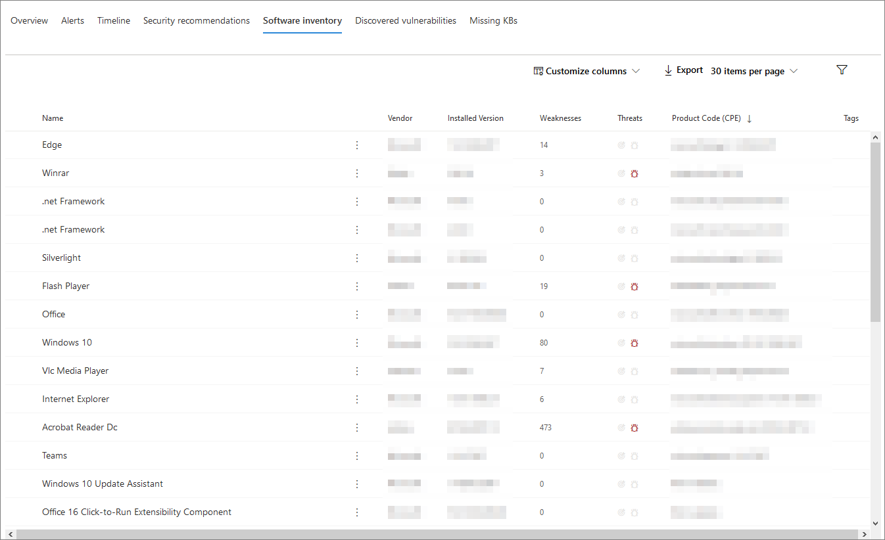

# Страница профиля устройстваDevice profile page

[!INCLUDE [Microsoft 365 Defender rebranding](../includes/microsoft-defender.md)]

Портал безопасности Microsoft 365 предоставляет страницы профилей устройств, что позволяет быстро оценить состояние и состояние устройств в сети.The Microsoft 365 security portal provides you with device profile pages, so you can quickly assess the health and status of devices on your network.

> [!IMPORTANT]
> Страница профиля устройства может немного отличаться в зависимости от того, зарегистрировать ли устройство в Microsoft Defender для конечной точки, Microsoft Defender для удостоверений или и то, и другое.The device profile page may appear slightly different, depending on whether the device is enrolled in Microsoft Defender for Endpoint, Microsoft Defender for Identity, or both.

Если устройство зарегистрировать в Microsoft Defender для конечной точки, вы также можете использовать страницу профиля устройства для выполнения некоторых распространенных задач безопасности.If the device is enrolled in Microsoft Defender for Endpoint, you can also use the device profile page to perform some common security tasks.

## Навигация по странице профиля устройстваNavigating the device profile page

Страница профиля разбита на несколько общих разделов.The profile page is broken up into several broad sections.

На боковой панели (1) перечислены основные сведения об устройстве.The sidebar (1) lists basic details about the device.

Основная область содержимого (2) содержит вкладки, через которые можно перегонать для просмотра различных типов сведений об устройстве.The main content area (2) contains tabs that you can toggle through to view different kinds of information about the device.

Если устройство зарегистрировать в Microsoft Defender для конечной точки, вы также увидите список ответных действий (3).If the device is enrolled in Microsoft Defender for Endpoint, you will also see a list of response actions (3). Действия реагирования позволяют выполнять распространенные задачи, связанные с безопасностью.Response actions allow you to perform common security-related tasks.

## Боковая панельSidebar

Рядом с основной областью содержимого страницы профиля устройства находится боковая панель.Beside the main content area of the device profile page is the sidebar.

На боковой панели перечислены полное имя устройства и уровень экспозиции.The sidebar lists the device's full name and exposure level. Кроме того, он предоставляет некоторые важные базовые сведения в небольших подмесяхах, которые можно переглушить открытыми или закрытыми, например:It also provides some important basic information in small subsections which can be toggled open or closed, such as:

* **Теги** — любой Microsoft Defender для конечной точки, Microsoft Defender для удостоверений или настраиваемые теги, связанные с устройством.**Tags** - Any Microsoft Defender for Endpoint, Microsoft Defender for Identity, or custom tags associated with the device. Теги из Microsoft Defender для удостоверений невозможно редактировать.Tags from Microsoft Defender for Identity are not editable.
* **Сведения о безопасности** — открытые инциденты и активные оповещения.**Security info** - Open incidents and active alerts. Устройства, зарегистрированные в Microsoft Defender для конечной точки, также будут отображать уровень экспозиции и уровень риска.Devices enrolled in Microsoft Defender for Endpoint will also display exposure level and risk level.

> [!TIP]
> Уровень экспозиции зависит от того, насколько устройство соответствует рекомендациям по безопасности, а уровень риска рассчитывается на основе ряда факторов, включая типы и серьезность активных оповещений.Exposure level relates to how much the device is complying with security recommendations, while risk level is calculated based on a number of factors, including the types and severity of active alerts.

* **Сведения об** устройстве: домен, ОС, временная пометь о том, когда устройство было впервые видно, IP-адреса, ресурсы.**Device details** - Domain, OS, timestamp for when the device was first seen, IP addresses, resources. Устройства, зарегистрированные в Microsoft Defender для конечной точки, также отображают состояние состояния здоровья.Devices enrolled in Microsoft Defender for Endpoint also display health state. На устройствах, зарегистрированных в Microsoft Defender для удостоверений, будет отображаться имя SAM и временная идентификация времени создания устройства.Devices enrolled in Microsoft Defender for Identity will display SAM name and a timestamp for when the device was first created.
* **Сетевое действие** — метки времени в первый раз и в последний раз, когда устройство было видно в сети.**Network activity** - Timestamps for the first time and last time the device was seen on the network.
* **Данные каталога** (только для устройств, зарегистрированных в *Microsoft Defender для удостоверений)*— флаги [UAC,](https://docs.microsoft.com/windows/security/identity-protection/user-account-control/user-account-control-overview) [SPNs](https://docs.microsoft.com/windows/win32/ad/service-principal-names)и членство в группах.**Directory data** (*only for devices enrolled in Microsoft Defender for Identity*) - [UAC](https://docs.microsoft.com/windows/security/identity-protection/user-account-control/user-account-control-overview) flags, [SPNs](https://docs.microsoft.com/windows/win32/ad/service-principal-names), and group memberships.

## Действия реагированияResponse actions

Ответные действия предоставляют быстрый способ защиты от угроз и их анализа.Response actions offer a quick way to defend against and analyze threats.

> [!IMPORTANT]
> * [Ответные](https://docs.microsoft.com/windows/security/threat-protection/microsoft-defender-atp/respond-machine-alerts) действия доступны, только если устройство зарегистрировать в Microsoft Defender для конечной точки.[Response actions](https://docs.microsoft.com/windows/security/threat-protection/microsoft-defender-atp/respond-machine-alerts) are only available if the device is enrolled in Microsoft Defender for Endpoint.
> * На устройствах, зарегистрированных в Microsoft Defender для конечной точки, может отображаться разное количество ответных действий в зависимости от ОС и номера версии устройства.Devices that are enrolled in Microsoft Defender for Endpoint may display different numbers of response actions, based on the device's OS and version number.

На странице профиля устройства доступны следующие действия:Actions available on the device profile page include:

* **Управление тегами** — обновляет пользовательские теги, примененные к этому устройству.**Manage tags** - Updates custom tags you have applied to this device.
* **Изолировать устройство** — изолирует устройство от сети организации, сохраняя подключение к Microsoft Defender для конечной точки.**Isolate device** - Isolates the device from your organization's network while keeping it connected to Microsoft Defender for Endpoint. Вы можете разрешить запуск Outlook, Teams и Skype для бизнеса в изолированном устройстве в целях связи.You can choose to allow Outlook, Teams, and Skype for Business to run while the device is isolated, for communication purposes.
* **Центр действий** — просмотр состояния отправленных действий.**Action center** - View the status of submitted actions. Доступно только в том случае, если уже выбрано другое действие.Only available if another action has already been selected.
* **Ограничение выполнения приложения** — предотвращает запуск приложений, не подписанных корпорацией Майкрософт.**Restrict app execution** - Prevents applications that are not signed by Microsoft from running.
* **Запуск антивирусной проверки** — обновление Защитник Windows определений антивирусной программы и немедленное запуск антивирусной проверки.**Run antivirus scan** - Updates Windows Defender Antivirus definitions and immediately runs an antivirus scan. Выберите "Быстрая проверка" или "Полная проверка".Choose between Quick scan or Full scan.
* **Сбор пакета исследования** — собирает сведения об устройстве.**Collect investigation package** - Gathers information about the device. После завершения исследования вы можете скачать его.When the investigation is completed, you can download it.
* **Инициировать сеанс** live Response Session — загружает удаленную оболочку на устройство для углубленного изучения [безопасности.](https://docs.microsoft.com/windows/security/threat-protection/microsoft-defender-atp/live-response)**Initiate Live Response Session** - Loads a remote shell on the device for [in-depth security investigations](https://docs.microsoft.com/windows/security/threat-protection/microsoft-defender-atp/live-response).
* **Инициировать автоматическое** исследование — автоматически изучает и устраняет [угрозы.](https://docs.microsoft.com/microsoft-365/security/office-365-security/office-365-air)**Initiate automated investigation** - Automatically [investigates and remediates threats](https://docs.microsoft.com/microsoft-365/security/office-365-security/office-365-air). Хотя на этой странице можно запустить автоматические исследования [вручную,](https://docs.microsoft.com/microsoft-365/compliance/alert-policies?view=o365-worldwide#default-alert-policies) некоторые политики оповещений запускают автоматические расследования самостоятельно.Although you can manually trigger automated investigations to run from this page, [certain alert policies](https://docs.microsoft.com/microsoft-365/compliance/alert-policies?view=o365-worldwide#default-alert-policies) trigger automatic investigations on their own.
* **Центр действий** — отображает сведения о любых действиях ответа, которые в настоящее время запущены.**Action center** - Displays information about any response actions that are currently running.

## Раздел "Вкладки"Tabs section

Вкладки профиля устройства позволяют перевести обзор сведений о безопасности устройства и таблиц, содержащих список оповещений.The device profile tabs allow you to toggle through an overview of security details about the device, and tables containing a list of alerts.

Устройства, зарегистрированные в Microsoft Defender для конечной точки, также будут отображать вкладки с временной шкалой, списком рекомендаций по безопасности, инвентаризацией программного обеспечения, списком обнаруженных уязвимостей и отсутствующих КБ (обновления для системы безопасности).Devices enrolled in Microsoft Defender for Endpoint will also display tabs that feature a timeline, a list of security recommendations, a software inventory, a list of discovered vulnerabilities, and missing KBs (security updates).

### Вкладка "Обзор"Overview tab

Вкладка по умолчанию — **"Обзор".**The default tab is **Overview**. Он позволяет быстро и быстро и быстро получить самые важные данные о безопасности устройства.It provides a quick look at the most important security fact about the device.

Здесь вы можете быстро и быстро посмотреть активные оповещения устройства и всех пользователей, во время входа в систему.Here, you can get a quick look at the device's active alerts, and any currently logged on users.

Если устройство зарегистрировать в Microsoft Defender для конечной точки, вы также увидите уровень риска устройства и все доступные данные об оценках безопасности.If the device is enrolled in Microsoft Defender for Endpoint, you will also see the device's risk level and any available data on security assessments. Оценки безопасности описывают степень уязвимости устройства, предоставляют рекомендации по безопасности, а также перечисляют затронутное программное обеспечение и обнаруженные уязвимости.The security assessments describe the device's exposure level, provide security recommendations, and list affected software and discovered vulnerabilities.

### Вкладка "Оповещения"Alerts tab

Вкладка **"Оповещения"** содержит список оповещений, которые были выпущены на устройстве как из Microsoft Defender для удостоверений, так и из Microsoft Defender для конечной точки.The **Alerts** tab contains a list of alerts that have been raised on the device, from both Microsoft Defender for Identity and Microsoft Defender for Endpoint.

Можно настроить количество отображаемых элементов, а также столбцы, отображаемые для каждого элемента.You can customize the number of items displayed, as well as which columns are displayed for each item. По умолчанию в списке 30 элементов на страницу.The default behavior is to list thirty items per page.

Столбцы на этой вкладке содержат сведения о степени серьезности угрозы, которая вызвала оповещение, а также о состоянии, состоянии исследования и о том, кому назначено оповещение.The columns in this tab include information on the severity of the threat that triggered the alert, as well as status, investigation state, and who the alert has been assigned to.

Столбец *затронутых сущностей* относится к устройству (объекту), профиль которого вы просматриваете в данный момент, а также к другим устройствам в вашей сети, которые затронуты.The *impacted entities* column refers to the device (entity) whose profile you are currently viewing, plus any other devices in your network that are affected.

При выборе элемента из этого списка откроется элемент, содержащий дополнительные сведения об выбранном оповещении.Selecting an item from this list will open a flyout containing even more information about the selected alert.

Этот список можно отфильтровать по степени серьезности, состоянии или по назначенной оповещению.This list can be filtered by severity, status, or who the alert has been assigned to.

### Вкладка "Временная шкала"Timeline tab

Вкладка **"Временная** шкала" содержит интерактивную хронологическую диаграмму всех событий, которые вызываются на устройстве.The **Timeline** tab includes an interactive, chronological chart of all events raised on the device. Перемещая выделенную область диаграммы влево или вправо, вы можете просматривать события в разные периоды времени.By moving the highlighted area of the chart left or right, you can view events over different periods of time. Вы также можете выбрать пользовательский диапазон дат из меню в выпадающим меню между интерактивной диаграммой и списком событий.You can also choose a custom range of dates from the dropdown menu in between the interactive chart and the list of events.

Под диаграммой находится список событий для выбранного диапазона дат.Below the chart is a list of events for the selected range of dates.

Количество отображаемых элементов и столбцов в списке можно настроить.The number of items displayed and the columns on the list can both be customized. В столбцах по умолчанию перечисляется время события, активный пользователь, тип действия, сущности (процессы) и дополнительные сведения о событии.The default columns list the event time, active user, action type, entities (processes), and additional information about the event.

При выборе элемента из этого списка откроется элемент, отображающий граф сущностями события, в котором показаны родительские и потомковые процессы, участвующие в событии.Selecting an item from this list will open a flyout displaying an Event entities graph, showing the parent and child processes involved in the event.

Список может быть отфильтрован по определенному типу события; например, события реестра или события smart Screen.The list can be filtered by the specific kind of event; for example, Registry events or Smart Screen Events.

Список также можно экспортировать в CSV-файл для скачивания.The list can also be exported to a CSV file, for download. Несмотря на то что файл не ограничен числом событий, максимальный диапазон времени, который можно экспортировать, составляет семь дней.Although the file is not limited by number of events, the maximum time range you can choose to export is seven days.

### Вкладка "Рекомендации по безопасности"Security recommendations tab

На **вкладке "Рекомендации по безопасности"** перечислены действия, которые можно принять для защиты устройства.The **Security recommendations** tab lists actions you can take to protect the device. При выборе элемента в этом списке откроется элемент, в котором можно получить инструкции по ее применении.Selecting an item on this list will open a flyout where you can get instructions on how to apply the recommendation.

Как и в предыдущих вкладок, можно настроить количество элементов, отображаемых на странице, а также отображаемые столбцы.As with the previous tabs, the number of items displayed per page, as well as which columns are visible, can be customized.

Представление по умолчанию содержит столбцы, в которых подробно рассматриваются недостатки безопасности, связанная угроза, связанный компонент или программное обеспечение, затронутые угрозой, и другие.The default view includes columns that detail the security weaknesses addressed, the associated threat, the related component or software affected by the threat, and more. Элементы могут фильтроваться по статусу рекомендации.Items can be filtered by the recommendation's status.

### Перечень программного обеспеченияSoftware inventory

На **вкладке "Инвентаризация** программного обеспечения" перечислены программы, установленные на устройстве.The **Software inventory** tab lists software installed on the device.

В представлении по умолчанию отображается поставщик программного обеспечения, установленный номер версии, количество известных недостатков программного обеспечения, анализ угроз, код продукта и теги.The default view displays the software vendor, installed version number, number of known software weaknesses, threat insights, product code, and tags. Количество отображаемых элементов и отображаемых столбцов можно настроить.The number of items displayed and which columns are displayed can both be customized.

При выборе элемента из этого списка откроется элемент, содержащий более подробные сведения о выбранном программном обеспечении, а также путь и временную запамяти в последний раз, когда программное обеспечение было найдено.Selecting an item from this list opens a flyout containing more details about the selected software, as well as the path and timestamp for the last time the software was found.

Этот список можно отфильтровать по коду продукта.This list can be filtered by product code.

### Вкладка "Обнаруженные уязвимости"Discovered vulnerabilities tab

На **вкладке "Обнаруженные уязвимости"** перечислены все распространенные уязвимости и эксплойты, которые могут повлиять на устройство.The **Discovered vulnerabilities** tab lists any Common Vulnerabilities and Exploits (CVEs) that may affect the device.

В представлении по умолчанию перечислены степень серьезности CVE, общий показатель уязвимости (CVS), программное обеспечение, связанное с CVE, при публикации CVE, время последнего обновления CVE и угрозы, связанные с CVE.The default view lists the severity of the CVE, the Common Vulnerability Score (CVS), the software related to the CVE, when the CVE was published, when the CVE was last updated, and threats associated with the CVE.

Как и в предыдущих вкладок, можно настроить количество отображаемых элементов и отображаемых столбцов.As with the previous tabs, the number of items displayed and which columns are visible can be customized.

При выборе элемента из этого списка откроется элемент, описывающий CVE.Selecting an item from this list will open a flyout that describes the CVE.

### Отсутствующие КБMissing KBs

На **вкладке "Отсутствующие КБ"** перечислены все обновления Майкрософт, которые еще не были применены к устройству.The **Missing KBs** tab lists any Microsoft Updates that have yet to be applied to the device. "Базы знаний" — [это](https://support.microsoft.com/help/242450/how-to-query-the-microsoft-knowledge-base-by-using-keywords-and-query) статьи базы знаний, в которых описываются эти обновления; например, [KB4551762](https://support.microsoft.com/help/4551762/windows-10-update-kb4551762).The "KBs" in question are [Knowledge Base articles](https://support.microsoft.com/help/242450/how-to-query-the-microsoft-knowledge-base-by-using-keywords-and-query) which describe these updates; for example, [KB4551762](https://support.microsoft.com/help/4551762/windows-10-update-kb4551762).

В представлении по умолчанию содержится бюллетень, содержащий обновления, версию ОС, затронутые продукты, адресованные CVEs, номер КБ и теги.The default view lists the bulletin containing the updates, OS version, products affected, CVEs addressed, the KB number, and tags.

Количество элементов, отображаемых на странице, и отображаемых столбцов, можно настроить.The number of items displayed per page and which columns are displayed can be customized.

При выборе элемента откроется элемент, ссылающийся на обновление.Selecting an item will open a flyout that links to the update.

## Связанные статьиRelated topics

* [Обзор Защитника Microsoft 365Microsoft 365 Defender overview](microsoft-threat-protection.md)
* [Включить Microsoft 365 DefenderTurn on Microsoft 365 Defender](mtp-enable.md)
* [Исследование сущностями на устройствах с помощью прямого ответаInvestigate entities on devices, using live response](https://docs.microsoft.com/windows/security/threat-protection/microsoft-defender-atp/live-response)
* [Автоматизированное исследование и реагирование на них (AIR) в Office 365Automated investigation and response (AIR) in Office 365](https://docs.microsoft.com/microsoft-365/security/office-365-security/office-365-air)
