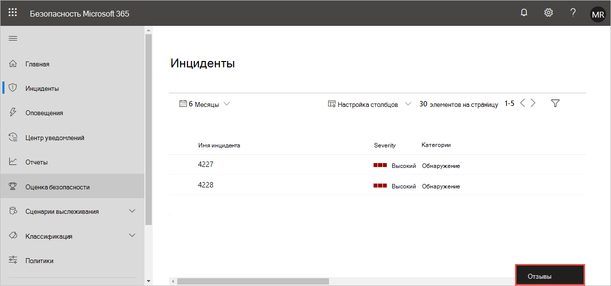

# Предоставление отзывов о защите от угроз Майкрософт

**Область применения:**
- Защита от угроз (Майкрософт)

Ваши отзывы помогут нам лучше защищать среду от расширенных атак. Поделитесь своими впечатлениями, впечатлениями и запросами, предоставив отзыв.

1. В любой части портала выберите **предоставить отзыв**. 

    

2. Оцените свои возможности и предоставьте подробные сведения о том, что вам понравилось или какое улучшение можно улучшить. Вы также можете связаться с отзывами. 

3. Нажмите кнопку **послать**.