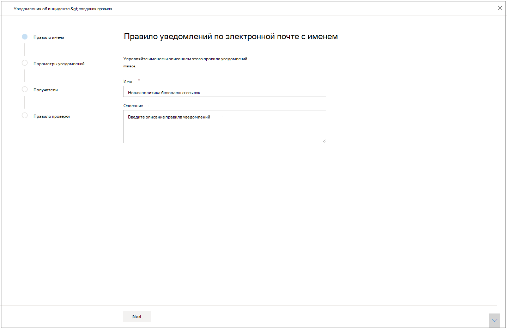
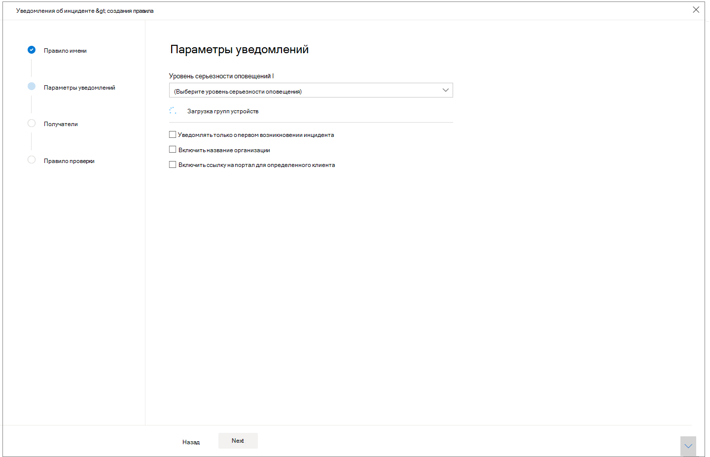
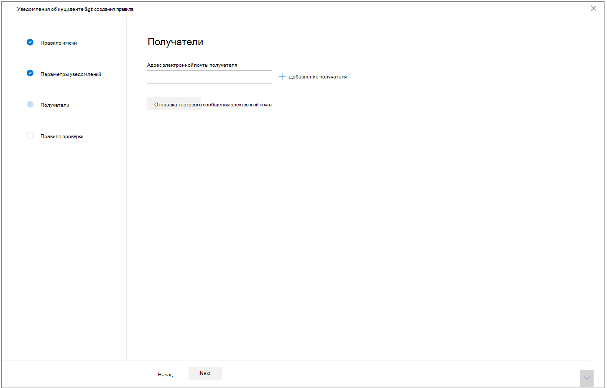

# Получать уведомления об инциденте по электронной почте

[!INCLUDE [Microsoft 365 Defender rebranding](../includes/microsoft-defender.md)]

>[!IMPORTANT]
> Уведомления по электронной почте об инцидентах в настоящее время находятся в режиме предварительной версии. Некоторые сведения об этой функции могут измениться до коммерческой доступности. Microsoft makes no warranties, express or implied, with respect to the information provided here.

**Область применения:**
- Microsoft 365 Defender

Вы можете настроить Microsoft 365 Defender так, чтобы он уведомлял вас по электронной почте каждый раз, когда имеются новые инциденты или новые обновления существующих инцидентов. 

Вы можете получать уведомления по степени серьезности инцидента или по группе устройств. Вы также можете получать уведомление только при первом обновлении для каждого инцидента.

Вы можете добавлять или удалять получателей в уведомлениях по электронной почте. Добавленные получатели получают уведомления об инцидентах после их добавления. 

Уведомление по электронной почте содержит важные сведения об инциденте, например имя, серьезность и категории инцидента. Вы также можете напрямую перейти к инцидентам, чтобы сразу начать исследование. Дополнительные узнать об исследованиях инцидентов см. в этой [теме.](https://docs.microsoft.com/microsoft-365/security/mtp/investigate-incidents)

>[!NOTE]
>Для настройки параметров уведомлений по электронной почте необходимы разрешения "Управление настройками безопасности". Если вы решили использовать базовое управление разрешениями, пользователи с ролями администратора безопасности или глобального администратора могут настраивать уведомления по электронной почте.    
Аналогично, если в организации используется управление доступом на основе ролей (RBAC), можно создавать, редактировать, удалять и получать уведомления только на основе групп устройств, которые разрешено управлять.

## Создание правил для уведомлений об инциденте

Чтобы настроить первое уведомление по электронной почте об инцидентах, создайте новое правило и настройте параметры уведомлений по электронной почте.

1. В области навигации выберите **"Параметры"** уведомления по электронной почте об  >  **инциденте.**
2. Выберите **"Добавить элемент"**.
3. Придать правилу имя в **имени** и в качестве **описания.**

     
4. Выберите **"Далее",** чтобы **перейти к параметрам уведомлений.** Здесь можно указать:
    - **Серьезность оповещения:** выберите степень серьезности оповещения, которая вызывает уведомление об инциденте. Например, если вы хотите получить только информацию об инцидентах с высокой степенью серьезности, выберите "Высокий".
    - **Область группы устройств** — в этом выпадающее поле отображаются все группы устройств, к которые пользователь может получить доступ. Выберите группы устройств, для которых вы создаете правила уведомлений об инциденте.
    - **Уведомлять только о первом** возникновении инцидента . При выборе этого параметра уведомление по электронной почте отправляется только при первом оповещении, которое соответствует другим выбранным вариантам. Последующие обновления или оповещения, связанные с инцидентом, не инициирует уведомление.
    - **Включайте название** организации — указывает, отображается ли имя клиента в уведомлении по электронной почте.
    - **Включит ссылку на портал** для определенного клиента. Добавляет ссылку с ИД клиента, чтобы разрешить доступ к определенному арендатору.
    
    
5. Выберите **"Далее",** чтобы перейти **к разделу "Получатели".** Здесь можно указать адреса электронной почты, которые будут получать уведомления по электронной почте об инциденте. Выберите **"Добавить получателя" после** ввода каждого адреса электронной почты.

     

6. Наконец, выберите **"Далее",** чтобы перейти **к** правилу проверки, чтобы просмотреть все параметры, связанные с новым правилом. Получатели начнут получать уведомления об инциденте по электронной почте в зависимости от параметров.

## См. также
- [Обзор инцидентов в Защитнике Microsoft 365](https://docs.microsoft.com/microsoft-365/security/mtp/incidents-overview)
- [Расставить приоритеты инцидентов в Microsoft 365 Defender](https://docs.microsoft.com/microsoft-365/security/mtp/incident-queue)
- [Исследование инцидентов в Защитнике Microsoft 365](https://docs.microsoft.com/microsoft-365/security/mtp/investigate-incidents)

