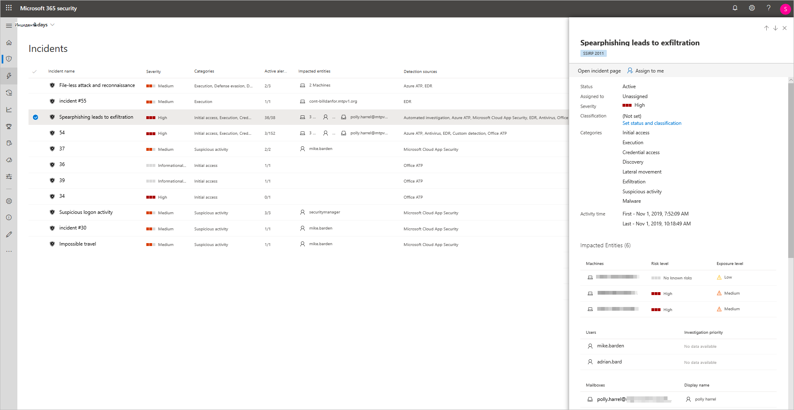
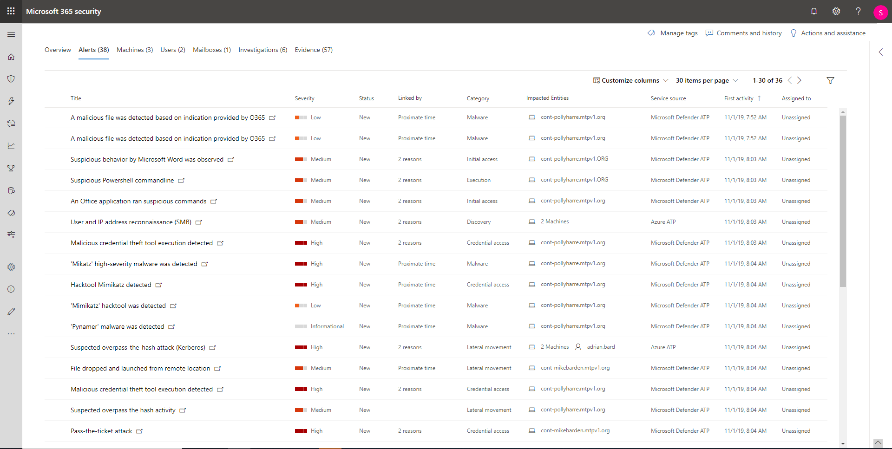
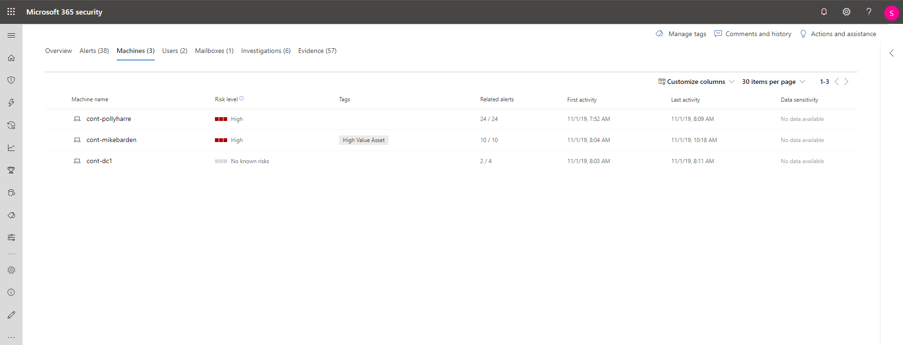
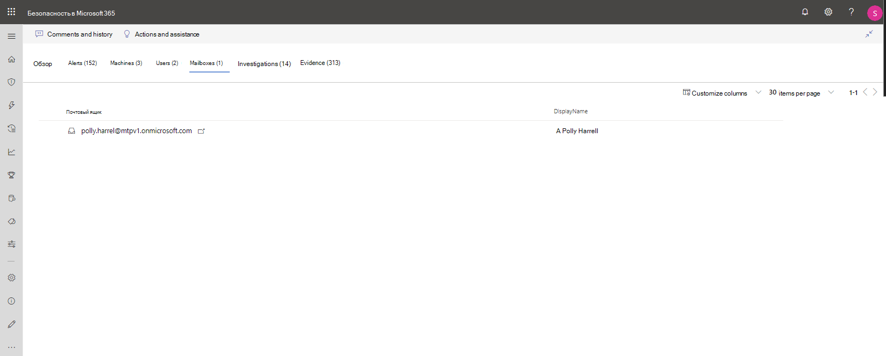
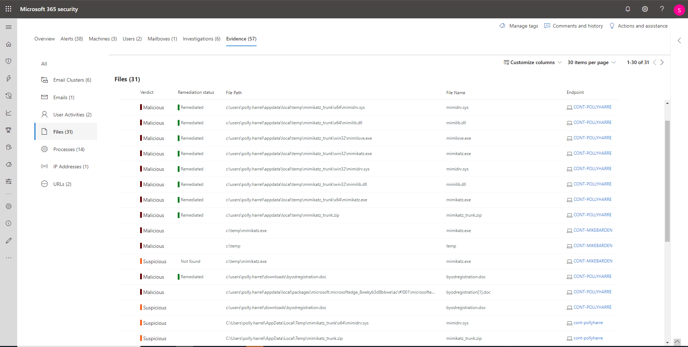

# Исследование инцидентов в Microsoft Threat ProtectionInvestigate incidents in Microsoft Threat Protection

**Область применения:****Applies to:**

- Microsoft Threat ProtectionMicrosoft Threat Protection

Microsoft Threat Protection объединяет все связанные оповещения, ресурсы, расследования и свидетельства для ваших устройств, пользователей и почтовых ящиков, чтобы предоставить полную картину атаки.Microsoft Threat Protection aggregates all related alerts, assets, investigations and evidence from across your devices, users, and mailboxes to give you a comprehensive look into the entire breadth of an attack.

Расследование оповещений, затрагивающих вашу сеть, понимание их значения, сбор свидетельств, связанных с происшествиями для создания эффективного плана исправления.Investigate the alerts that affect your network, understand what they mean, and collate evidence associated with the incidents so that you can devise an effective remediation plan.

## Исследование инцидентаInvestigate an incident

1. Выберите инцидент в очереди инцидентов.Select an incident from the incident queue.   Откроется боковая панель, на которой будет показана важная информация: состояние, важность, категории и затронутые объекты.This opens a side panel and gives a preview of important information such as status, severity, categories, and the impacted entities.

    

2. Выберите **Открыть страницу инцидента**.Select **Open incident page**.   Будет открыта страница инцидента, содержащая дополнительные сведения об инциденте, комментарии, действия и вкладки ("Обзор", "Оповещения", "Устройства", "Пользователи", "Исследования" и "Свидетельство").This opens the incident page where you'll find more information incident details, comments and actions, tabs (overview, alerts, devices, users, investigations, evidence).

3. Ознакомьтесь с информаций об оповещениях, устройствах, пользователях и других объектах, связанных с инцидентом.Review the alerts, devices, users, other entities involved in the incident.

## Обзор инцидентаIncident overview

На странице обзора содержится краткий набор основных сведений об инциденте.The overview page gives you a snapshot glance into the top things to notice about the incident.

С помощю категорий атаки можно получить наглядное и цифровое представление о том, как развивалась атака в отношении каждого компонента.The attack categories give you visual and numeric view of how advanced the attack has progressed against the kill chain. Как и другие продукты безопасности корпорации Майкрософт, решение Microsoft Threat Protection взаимодействует с платформой [MITRE ATT&CK&trade;](https://attack.mitre.org/).As with other Microsoft security products, Microsoft Threat Protection is aligned to the [MITRE ATT&CK&trade;](https://attack.mitre.org/) framework.

В разделе "Область" находится список основных ресурсов, затронутых этим инцидентом.The scope section gives you a list of top impacted assets that are part of this incident. Если есть какая-либо конкретная информация о ресурсе, например уровень риска, приоритет исследования или любые отметки ресурсов, вся эта информация также будет отображаться в этом разделе.If there is specific information regarding this asset, such as risk level, investigation priority as well as any tagging on the assets this will also surface in this section.

На временной шкале оповещений можно увидеть хронологический порядок оповещений, а также причины связи этих оповещений с этим инцидентом.The alerts timeline provides a sneak peek into the chronological order in which the alerts occurred, as well as the reasons that these alerts linked to this incident.

Наконец, в разделе свидетельства приводится сводная информация о том, сколько различных артефактов входят в инцидент, и об их состоянии исправления. Благодаря этому вы сможете сразу понять, нужны ли какие-либо действия с вашей стороны.And last - the evidence section provides a summary of how many different artifacts were included in the incident and their remediation status, so you can immediately identify if any action is needed on your end.

Этот обзор поможет провести первоначальное рассмотрение инцидента и определить его основные характеристики, требующие внимания.This overview can assist in the initial triage of the incident by providing insight to the top characteristics of the incident that you should be aware of.

## ОповещенияAlerts

Вы можете просмотреть все оповещения, связанные с инцидентом, и прочую информацию об оповещениях, включая их важность, источник (Azure ATP, расширенная защита от угроз в Microsoft Defender, Office 365 ATP) и причину их объединения.You can view all the alerts related to the incident and other information about them such as severity, entities that were involved in the alert, the source of the alerts (Azure ATP, Microsoft Defender ATP , Office  365 ATP) and the reason they were linked together.

По умолчанию оповещения перечислены в хронологическом порядке, чтобы можно было сразу определить, как атака развивалась со временем.By default, the alerts are ordered chronologically, to allow you to first view how the attack played out over time. Если щелкнуть каждое оповещение, откроется страница соответствующего оповещения с подробной информацией.Clicking on each alert will lead you to the relevant alert page where you can conduct an in depth investigation of that alert.

## УстройстваDevices

На вкладке устройств перечислены все устройства, на которых отображаются оповещения, связанные с инцидентом.The devices tab lists all the devices where alerts related to the incident are seen.

Если щелкнуть название компьютера, на котором была произведена атака, откроется страница компьютера, где можно увидеть все сработавшие оповещения и связанные с ними события для удобства исследования.Clicking the name of the machine where the attack was conducted navigates you to its Machine page where you can see alerts that were triggered on it and related events provided to ease investigation.

Если выбрать вкладку "Временная шкала", можно прокрутить временную шкалу компьютера и просмотреть все события и поведение на компьютере в хронологическом порядке вместе с оповещениями.Selecting the Timeline tab enables you to scroll through the machine timeline and view all events and behaviors observed on the machine in chronological order, interspersed with the alerts raised.

## ПользователиUsers

Отображение пользователей, связанных с данным инцидентом.See users that have been identified to be part of, or related to a given incident.

Если щелкнуть имя пользователя, откроется страница этого пользователя в Cloud App Security, где можно провести дальнейшее исследование.Clicking the username navigates you to the user's Cloud App Security page where further investigation can be conducted.

## Почтовые ящикиMailboxes

Здесь отображаются почтовые ящики, связанные с инцидентом.Investigate mailboxes that's been identified to be part of, or related to an incident. Если нужно провести углубленное исследование, выберите оповещение, связанное с почтой: откроется решение Office 365 Advanced Threat Protection, где можно выполнить действия по исправлению.To do further investigative work, selecting the mail related alert will open Office 365 Advanced Threat Protection where you can take remediation actions.

## ИсследованияInvestigations

Выберите **расследования** , чтобы увидеть все автоматические расследования, инициированные оповещениями в этом инциденте.Select **Investigations** to see all the automated investigations triggered by alerts in this incident. В зависимости от настройки автоматических исследований в Microsoft Defender ATP и Office 365 Advanced Threat Protection исследования выполнят действия исправления или будут ожидать утверждения этих действий аналитиком.The investigations will perform remediation actions or wait for analyst approval of actions, depending on how you configured your automated investigations to run in Microsoft Defender ATP and Office 365 Advanced Threat Protection.

Выберите исследование, чтобы перейти на страницу сведений об исследовании для получения подробной информации об исследовании и о состоянии исправления.Select an investigation to navigate to the Investigation details page to get full information on the investigation and remediation status. Если в ходе исследования есть какие-либо действия, ожидающие утверждения, они будут отображаться на вкладке "Ожидающие выполнения действия". Можно выполнить действие в составе исправления инцидента.If there are any actions pending for approval as part of the investigation they will appear in the Pending actions tab. Take action as part of incident remediation.

## СвидетельствоEvidence

Microsoft Threat Protection автоматически исследует все поддерживаемые события и подозрительные объекты в оповещениях, предоставляет автоматические ответы и информацию о важных файлах, процессах, службах, сообщениях электронной почты и т. д.Microsoft Threat Protection automatically investigates all the incidents' supported events and suspicious entities in the alerts, providing you with auto-response and information about the important files, processes, services, emails, and more. Это помогает быстро обнаруживать и блокировать потенциальные угрозы в составе инцидента.This helps quickly detect and block potential threats in the incident.

Для каждого проанализированного объекта принимается решение ("Вредоносный", "Подозрительный", "Чистый") и устанавливается состояние исправление.Each of the analyzed entities will be marked with a verdict (Malicious, Suspicious, Clean) as well as a remediation status. Это поможет понять состояние исправления всего инцидента и последующие действия, необходимые для дальнейшего исправления.This assists you in understanding the remediation status of the entire incident and what are the next steps that can be taken to further remediate.

## См. такжеRelated topics

- [Обзор инцидентовIncidents overview](incidents-overview.md)
- [Управление приоритетом инцидентовPrioritize incidents](incident-queue.md)
- [Управление инцидентамиManage incidents](manage-incidents.md)

