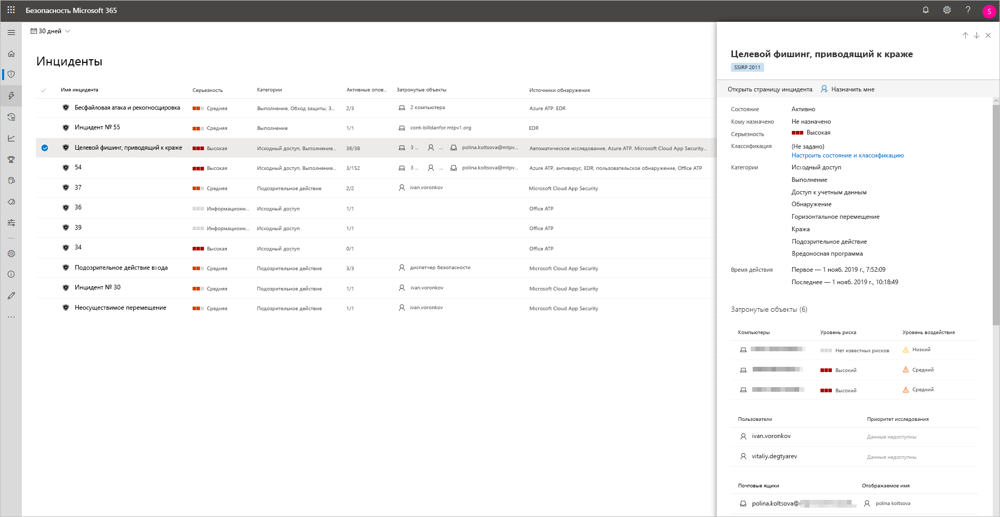
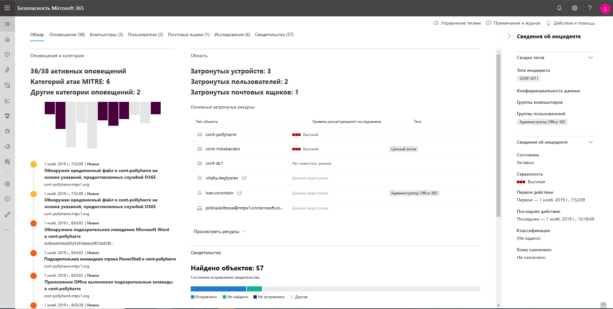
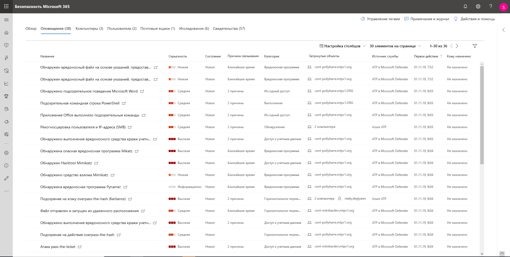
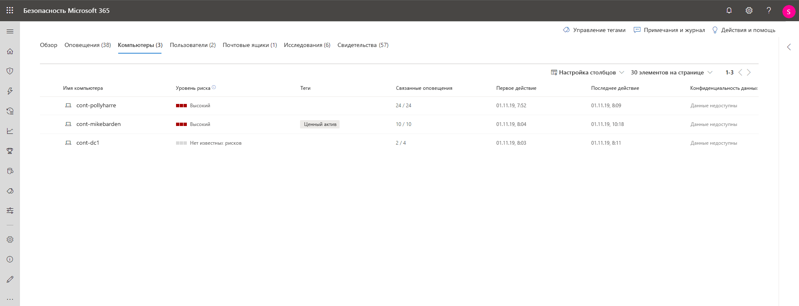
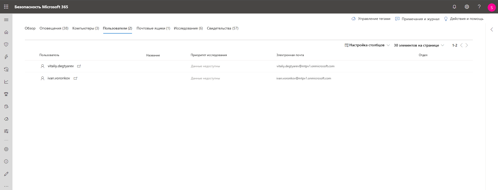
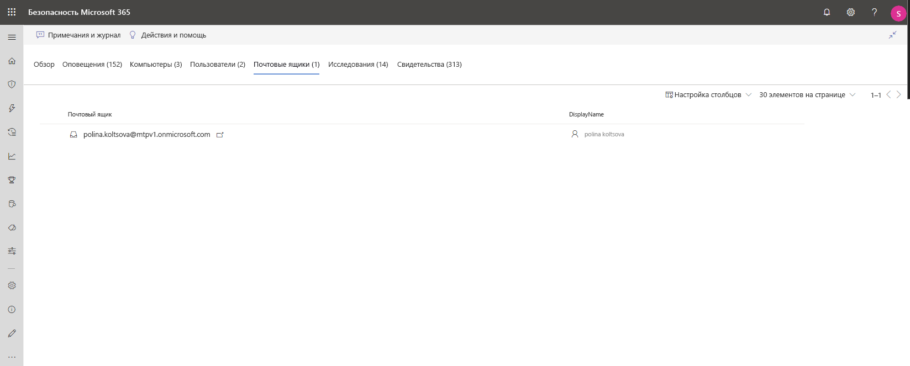
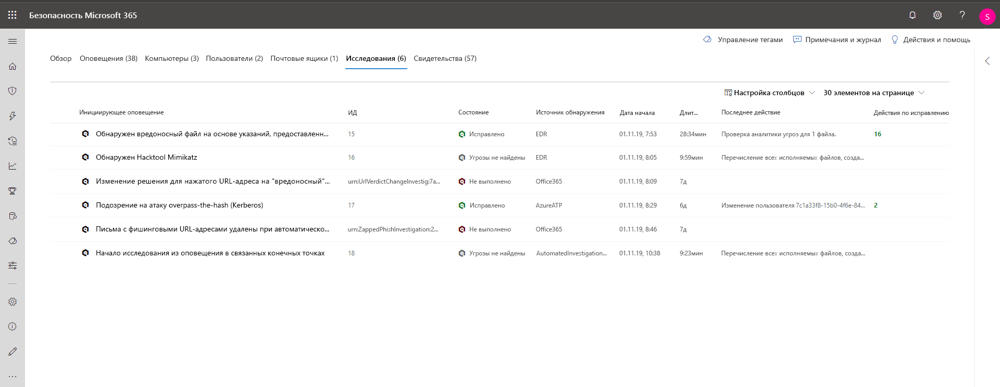
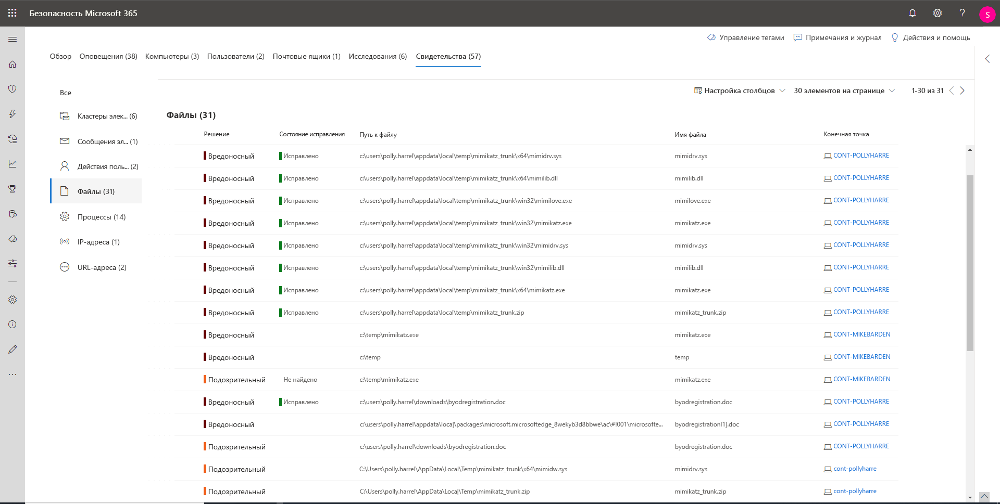

# Исследование инцидентов в Microsoft Threat Protection

**Область применения:**
- Microsoft Threat Protection

[!INCLUDE [Prerelease information](../includes/prerelease.md)]

Microsoft Threat Protection объединяет все связанные оповещения, ресурсы, расследования и свидетельства для ваших устройств, пользователей и почтовых ящиков, чтобы предоставить полную картину атаки. 

Расследование оповещений, затрагивающих вашу сеть, понимание их значения, сбор свидетельств, связанных с происшествиями для создания эффективного плана исправления. 

## Исследование инцидента

1. Выберите инцидент в очереди инцидентов.   Откроется боковая панель, на которой будет показана важная информация: состояние, важность, категории и затронутые объекты.

    

2. Выберите **Открыть страницу инцидента**.   Будет открыта страница инцидента, содержащая дополнительные сведения об инциденте, комментарии, действия и вкладки ("Обзор", "Оповещения", "Устройства", "Пользователи", "Исследования" и "Свидетельство").

3. Ознакомьтесь с информаций об оповещениях, устройствах, пользователях и других объектах, связанных с инцидентом.

## Обзор инцидента 
На странице обзора содержится краткий набор основных сведений об инциденте.

С помощю категорий атаки можно получить наглядное и цифровое представление о том, как развивалась атака в отношении каждого компонента. Как и другие продукты безопасности корпорации Майкрософт, решение Microsoft Threat Protection взаимодействует с платформой [MITRE ATT&CK&trade;](https://attack.mitre.org/). 

В разделе "Область" находится список основных ресурсов, затронутых этим инцидентом. Если есть какая-либо конкретная информация о ресурсе, например уровень риска, приоритет исследования или любые отметки ресурсов, вся эта информация также будет отображаться в этом разделе.

На временной шкале оповещений можно увидеть хронологический порядок оповещений, а также причины связи этих оповещений с этим инцидентом.

Наконец, в разделе свидетельства приводится сводная информация о том, сколько различных артефактов входят в инцидент, и об их состоянии исправления. Благодаря этому вы сможете сразу понять, нужны ли какие-либо действия с вашей стороны. 

Этот обзор поможет провести первоначальное рассмотрение инцидента и определить его основные характеристики, требующие внимания. 

## Оповещения 
Вы можете просмотреть все оповещения, связанные с инцидентом, и прочую информацию об оповещениях, включая их важность, источник (Azure ATP, расширенная защита от угроз в Microsoft Defender, Office 365 ATP) и причину их объединения. 

По умолчанию оповещения перечислены в хронологическом порядке, чтобы можно было сразу определить, как атака развивалась со временем. Если щелкнуть каждое оповещение, откроется страница соответствующего оповещения с подробной информацией. 

## Устройства 
На вкладке устройств перечислены все устройства, на которых отображаются оповещения, связанные с инцидентом. 

Если щелкнуть название компьютера, на котором была произведена атака, откроется страница компьютера, где можно увидеть все сработавшие оповещения и связанные с ними события для удобства исследования. 

Если выбрать вкладку "Временная шкала", можно прокрутить временную шкалу компьютера и просмотреть все события и поведение на компьютере в хронологическом порядке вместе с оповещениями. 

## Пользователи 
Отображение пользователей, связанных с данным инцидентом. 

Если щелкнуть имя пользователя, откроется страница этого пользователя в Cloud App Security, где можно провести дальнейшее исследование.

## Почтовые ящики
Здесь отображаются почтовые ящики, связанные с инцидентом. Если нужно провести углубленное исследование, выберите оповещение, связанное с почтой: откроется решение Office 365 Advanced Threat Protection, где можно выполнить действия по исправлению.

## Исследования
Выберите **Исследования**, чтобы увидеть все автоматические исследования, запущенные оповещениями для этого инцидента. В зависимости от настройки автоматических исследований в Microsoft Defender ATP и Office 365 Advanced Threat Protection исследования выполнят действия исправления или будут ожидать утверждения этих действий аналитиком.

Выберите исследование, чтобы перейти на страницу сведений об исследовании для получения подробной информации об исследовании и о состоянии исправления. Если в ходе исследования есть какие-либо действия, ожидающие утверждения, они будут отображаться на вкладке "Ожидающие выполнения действия". Можно выполнить действие в составе исправления инцидента.

## Свидетельство
Microsoft Threat Protection автоматически исследует все поддерживаемые события и подозрительные объекты в оповещениях, предоставляет автоматические ответы и информацию о важных файлах, процессах, службах, сообщениях электронной почты и т. д. Это помогает быстро обнаруживать и блокировать потенциальные угрозы в составе инцидента. 

Для каждого проанализированного объекта принимается решение ("Вредоносный", "Подозрительный", "Чистый") и устанавливается состояние исправление. Это поможет понять состояние исправления всего инцидента и последующие действия, необходимые для дальнейшего исправления.

## См. также
- [Обзор инцидентов](incidents-overview.md)
- [Управление приоритетом инцидентов](incident-queue.md)
- [Управление инцидентами](manage-incidents.md)